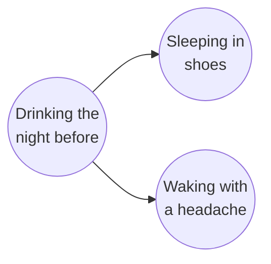

# Lesson 01: Introduction to Causal Inference

## What Causal Inference Is

Most of statistics and machine learning answers questions of the form *what tends to go with what?* People who carry lighters get lung cancer more often. Customers who buy nappies also buy beer. Causal inference asks a different question: *what would happen if something were changed?* Would taking lighters away from people reduce lung cancer? (No: smoking causes both.) Would a new drug help patients recover? Would raising the minimum wage reduce employment?

The Primer gives a working definition. A variable $X$ is a **cause** of a variable $Y$ if $Y$ in any way relies on $X$ for its value. Pearl's image: $Y$ "listens" to $X$ and decides its value in response to what it hears. Later lessons make this precise.

## Why It Matters

Neal lists the kinds of questions that need causal answers, not just associations:

- **Science.** Choosing between treatments means choosing the one that *causes* the most cures without too many side effects.
- **Decisions and policy.** With money for only one climate policy, the right choice is the policy that *causes* the largest cut in emissions, not the one most often seen alongside low emissions.
- **Machine learning.** A reinforcement-learning agent should take the actions that *cause* high reward.

In each case the question is about the result of *doing* something. Data record what happened without anyone doing it, and that is where the difficulty lies.

## Association Is Not Causation

**A spurious correlation.** Neal's first example: from 1999 to 2009, the yearly number of films Nicolas Cage appeared in rose and fell closely with the yearly number of people who drowned by falling into swimming pools (data from Tyler Vigen's *Spurious Correlations*). Nobody believes that his films cause drownings, or that drownings cause him to make films. The two series just happen to move together.

**A correlation with a hidden common cause.** Neal's second example is more instructive. People who go to sleep with their shoes on usually wake up with a headache. It is tempting to conclude that sleeping in shoes causes headaches. But both are caused by a third thing: drinking the night before.

*Neal's shoes example. Drinking is a common cause, or **confounder**, of the other two.*

A few terms used throughout the course:

- **Association** means any statistical dependence between two variables. ("Correlation", strictly, measures only *linear* dependence, so this course says association.)
- **Confounding association** is association that flows through a common cause, like drinking here.
- **Causal association** is association that flows because one variable actually affects the other.

**Causation is not all or nothing.** The association observed in data can be a mix of the two kinds. Perhaps sleeping in shoes does cause a little discomfort. Then some of the shoe–headache association is causal and the rest is confounding. "Association is not causation" means the *amount* of association and the *amount* of causation can differ. Zero causation with plenty of association is only one special case.

Two variables can be associated for four reasons:

1. $X$ causes $Y$.
2. $Y$ causes $X$.
3. Something else causes both (confounding, as with drinking).
4. The data were selected in a way that depends on both. Lesson 03 explains this last case, **selection bias**.

Causal inference provides tools to tell these apart. The most important tools turn out to be statements about *how the data were generated*, not properties of the numbers alone.

## Four Themes of the Course

Neal names four contrasts that run through everything that follows.

1. **Statistical versus causal.** More data removes statistical uncertainty. It does not remove the gap between association and causation. Even with infinite data, some causal questions cannot be answered.
2. **Identification versus estimation.** *Identification* asks whether a causal quantity can be computed from the data-generating distribution at all, given our assumptions. *Estimation* asks how to compute it well from a finite sample. Identification is the part unique to causal inference; Parts 2–4 are mostly about it, and Part 5 is about estimation.
3. **Interventional versus observational data.** If we can run an experiment and set the treatment ourselves, finding causal effects is comparatively easy. With observational data, where people chose their own treatments, confounding is almost always present.
4. **Assumptions.** Every causal conclusion rests on assumptions. The course states each one explicitly, so that it is clear what a critic would have to dispute.

A first taste of why assumptions are unavoidable is **Simpson's paradox**. In it, the same table of numbers says a drug helps men, helps women, and yet seems to hurt people overall. Lesson 03 works through it and shows that no statistical rule can say which reading is right. Only knowledge of how the data came about can.

## Probability Tools Used in This Course

The Primer's Chapter 1 includes a short review of probability and statistics, because later lessons use these tools constantly. This section repeats the essentials with the Primer's examples.

### Variables, Events and Conditional Probability

A **variable** is a property that can take different values, such as age, gender, or whether a patient recovers. $P(X = x)$, often shortened to $P(x)$, is the probability that $X$ takes the value $x$. An **event** is any statement about values, such as "$X = 1$" or "$X = 1$ and $Y = 3$".

The **conditional probability** $P(A \mid B)$ is the probability of $A$ given that $B$ is known to have happened. With a table of data, conditioning is **filtering**: keep only the rows where $B$ holds, and compute the share of those rows where $A$ holds. Formally,

$$P(A \mid B) = \frac{P(A, B)}{P(B)}.$$

The division by $P(B)$ rescales the kept rows so that they again sum to 1.

### Independence

$A$ and $B$ are **independent** if learning $B$ does not change the probability of $A$: $P(A \mid B) = P(A)$. Equivalently, $P(A, B) = P(A)\,P(B)$. Independence is symmetric: if $B$ tells us nothing about $A$, then $A$ tells us nothing about $B$.

$A$ and $B$ are **conditionally independent given $C$** if $P(A \mid B, C) = P(A \mid C)$. The Primer's example: whether a smoke detector is sounding depends on whether there is a fire nearby. But given that there is smoke, the fire tells us nothing more, because the detector responds only to smoke. Two variables are independent if every pair of their values is independent in this sense.

### The Law of Total Probability and the Product Rule

If $B_1, \ldots, B_n$ are mutually exclusive and one of them must happen (a **partition**), then

$$P(A) = \sum_{i} P(A, B_i) = \sum_i P(A \mid B_i)\, P(B_i).$$

The second form combines the law with the **product rule** $P(A, B) = P(A \mid B)\, P(B)$. It lets a hard probability be computed by splitting it into easier cases.

**Example 1: defective gadgets.** 30% of gadgets come from factory A, where 1 in 5,000 is defective, and 70% from factory B, where 1 in 10,000 is defective. The probability that a random gadget is defective is

$$0.3 \times \tfrac{1}{5000} + 0.7 \times \tfrac{1}{10000} = 0.00006 + 0.00007 = 0.00013.$$

**Example 2: two dice.** What is the probability that a second die roll is higher than the first? Split by the first roll. If it is 1, five values of the second roll are higher; if 2, four; and so on down to 0 if it is 6. Each first roll has probability $\tfrac{1}{6}$, and each count of higher values has probability (count)/6:

$$P(\text{roll}_2 > \text{roll}_1) = \tfrac{1}{6}\left(\tfrac{5}{6} + \tfrac{4}{6} + \tfrac{3}{6} + \tfrac{2}{6} + \tfrac{1}{6} + \tfrac{0}{6}\right) = \tfrac{15}{36} = \tfrac{5}{12}.$$

Summing over the values of a variable in this way is called **marginalizing** over it. The adjustment formula of Lesson 12 and Lesson 19 has exactly this form.

### Bayes' Rule

Writing the product rule both ways, $P(A \mid B)\,P(B) = P(B \mid A)\,P(A)$, and dividing gives **Bayes' rule**:

$$P(A \mid B) = \frac{P(B \mid A)\, P(A)}{P(B)}.$$

It turns an easy probability, $P(B \mid A)$ ("how likely is this evidence if the hypothesis is true?"), into the one we want, $P(A \mid B)$ ("how likely is the hypothesis given the evidence?").

**Example: the casino.** A dealer shouts "11!". The casino has equal numbers of craps and roulette tables, so $P(\text{craps}) = P(\text{roulette}) = \tfrac{1}{2}$.

- In craps, two dice are summed. Two of the 36 outcomes give 11 (5+6 and 6+5), so $P(11 \mid \text{craps}) = \tfrac{2}{36} = \tfrac{1}{18}$.
- A roulette wheel has 38 equally likely numbers, so $P(11 \mid \text{roulette}) = \tfrac{1}{38}$.

By the law of total probability, $P(11) = \tfrac{1}{18} \cdot \tfrac{1}{2} + \tfrac{1}{38} \cdot \tfrac{1}{2}$. Then

$$P(\text{craps} \mid 11) = \frac{\tfrac{1}{18} \cdot \tfrac{1}{2}}{\tfrac{1}{18} \cdot \tfrac{1}{2} + \tfrac{1}{38} \cdot \tfrac{1}{2}} = \frac{1/18}{1/18 + 1/38} = \frac{38}{38 + 18} = \frac{38}{56} \approx 0.679.$$

**Example: the Monty Hall problem.** A car is behind one of three doors, A, B and C, each equally likely. You pick door A. The host, Monty, knows where the car is. He must open a door you did not pick, and he never reveals the car. He opens door C, showing a goat. Should you switch to B?

Monty's behaviour depends on where the car is:

- If the car is behind A, he can open B or C; say each with probability $\tfrac{1}{2}$. So $P(\text{opens C} \mid \text{car A}) = \tfrac{1}{2}$.
- If the car is behind B, he is forced to open C: $P(\text{opens C} \mid \text{car B}) = 1$.
- If the car is behind C, he cannot open C: $P(\text{opens C} \mid \text{car C}) = 0$.

By the law of total probability,

$$P(\text{opens C}) = \tfrac{1}{2} \cdot \tfrac{1}{3} + 1 \cdot \tfrac{1}{3} + 0 \cdot \tfrac{1}{3} = \tfrac{1}{2}.$$

By Bayes' rule,

$$P(\text{car B} \mid \text{opens C}) = \frac{1 \cdot \tfrac{1}{3}}{\tfrac{1}{2}} = \tfrac{2}{3}, \qquad P(\text{car A} \mid \text{opens C}) = \frac{\tfrac{1}{2} \cdot \tfrac{1}{3}}{\tfrac{1}{2}} = \tfrac{1}{3}.$$

Switching wins twice as often. The Primer's explanation: Monty *could* have opened B but did not, while he could never have opened A. Door B survived a test it might have failed, so it became more likely; door A faced no such test. The answer depends on *the process that produced the data*, not only on what was observed, which is the central idea of this whole course. Lesson 03 returns to Monty Hall as an example of a collider.

### Expectation, Variance and Covariance

The **expected value**, or mean, of a numerical variable is its probability-weighted average: $\mathbb{E}[X] = \sum_x x\, P(x)$. For a fair die, $\mathbb{E}[X] = (1 + 2 + 3 + 4 + 5 + 6)/6 = 3.5$.

The **conditional expectation** $\mathbb{E}[Y \mid X = x]$ is the mean of $Y$ among units with $X = x$. It is the best guess of $Y$ given $X = x$, in the sense that it makes the average squared error smallest.

The **variance** measures spread around the mean: $\mathrm{Var}(X) = \mathbb{E}\big[(X - \mathbb{E}[X])^2\big]$. For the die:

$$\mathrm{Var}(X) = \mathbb{E}[X^2] - (\mathbb{E}[X])^2 = \frac{1 + 4 + 9 + 16 + 25 + 36}{6} - 3.5^2 = \frac{91}{6} - 12.25 = \frac{35}{12} \approx 2.92.$$

The **standard deviation** is the square root of the variance.

The **covariance** measures how two variables move together:

$$\mathrm{Cov}(X, Y) = \mathbb{E}\big[(X - \mathbb{E}[X])(Y - \mathbb{E}[Y])\big].$$

It is positive when high values of $X$ go with high values of $Y$, and negative when they go with low values. Dividing by both standard deviations gives the **correlation coefficient**, $\rho_{XY} = \mathrm{Cov}(X, Y) / (\sigma_X \sigma_Y)$, which lies between $-1$ and $1$. Independent variables have zero covariance. The reverse is not true: covariance measures only *linear* co-movement, so strongly dependent variables can have zero covariance. (For example, if $X$ is symmetric around 0 and $Y = X^2$, then $\mathrm{Cov}(X, Y) = 0$.)

Three rules for covariance are used repeatedly in later lessons (22, 25, 37, 38):

1. $\mathrm{Cov}(X, X) = \mathrm{Var}(X)$.
2. Covariance is linear in each argument: $\mathrm{Cov}(aX + bZ,\ Y) = a\,\mathrm{Cov}(X, Y) + b\,\mathrm{Cov}(Z, Y)$.
3. If $X$ and $Y$ are independent, $\mathrm{Cov}(X, Y) = 0$.

### Regression

**Simple regression** fits the straight line $y = a + b x$ that makes the average squared vertical distance from the data points as small as possible. Its slope is

$$b = r_{YX} = \frac{\mathrm{Cov}(X, Y)}{\mathrm{Var}(X)}.$$

**Example: two dice.** Let $X$ be the first die, $Z$ the second, and $Y = X + Z$ their sum.

- *Regressing $Y$ on $X$.* Since $Z$ is independent of $X$, $\mathbb{E}[Y \mid X = x] = x + \mathbb{E}[Z] = x + 3.5$. The slope is 1. By the covariance rules, $\mathrm{Cov}(X, Y) = \mathrm{Cov}(X, X) + \mathrm{Cov}(X, Z) = \mathrm{Var}(X) + 0$, so $r_{YX} = \mathrm{Var}(X)/\mathrm{Var}(X) = 1$.
- *Regressing $X$ on $Y$.* The slope is not 1. By symmetry, when the sum is $y$, each die contributes half of it on average: $\mathbb{E}[X \mid Y = y] = y/2$. Check with covariances: $\mathrm{Var}(Y) = \mathrm{Var}(X) + \mathrm{Var}(Z) = 2\,\mathrm{Var}(X)$, so $r_{XY} = \mathrm{Cov}(X, Y) / \mathrm{Var}(Y) = \mathrm{Var}(X) / (2\,\mathrm{Var}(X)) = 0.5$.

So regression slopes are not symmetric, and neither direction by itself says which variable causes which. Lesson 25 builds on this: a regression coefficient describes the data, while a structural coefficient describes a cause.

**Multiple regression** fits $y = a + b_1 x_1 + b_2 x_2 + \cdots$. Each coefficient $b_i$ is the change in the predicted $y$ when $x_i$ rises by one unit *while the other regressors are held fixed*. For the dice, regressing $Y$ on both $X$ and $Z$ gives $y = x + z$ exactly: both coefficients are 1. A coefficient's value depends on which other variables are in the regression, and choosing those variables well is a causal question (Lessons 20 and 25).

## Summary and Key Takeaways

1. Causal inference asks what would happen if something were changed, not just what goes with what.
2. Association can be causal, confounding, or produced by selection, and usually mixes these. "Association is not causation" means the amounts can differ.
3. The course's four themes: statistical versus causal questions, identification versus estimation, interventional versus observational data, and explicit assumptions.
4. Conditional probability is filtering. Independence means one event carries no information about another. The law of total probability splits a probability into cases; Bayes' rule reverses a conditional probability.
5. The Monty Hall problem shows that the right answer depends on the process that generated the data, not just on the data.
6. Covariance measures linear co-movement. A regression slope is $\mathrm{Cov}(X, Y)/\mathrm{Var}(X)$, it is not symmetric, and in multiple regression each coefficient holds the other regressors fixed.

**Next step:** Lesson 02 introduces causal graphs, the tool this course uses to write down how data were generated.

### Check Your Understanding

1. Give an example of your own of two associated variables where neither causes the other. Name the common cause.
2. With twice as many roulette tables as craps tables, what is $P(\text{craps} \mid 11)$?
3. In the Monty Hall problem, suppose Monty opened a door *at random* among the two you did not pick, and it happened to show a goat. Is switching still better? Recompute with Bayes' rule.
4. For a fair die $X$, give a variable $Y$ that depends completely on $X$ but has zero covariance with it.

---

## Further Reading

*Ref*: *Causal Inference in Statistics: A Primer (2016)*, Chapter 1, Sections 1.1–1.3 (the casino, dice and Monty Hall examples); Brady Neal, *Introduction to Causal Inference* (Dec 2020 draft), Chapter 1 (Motivation: applications, Nicolas Cage and pool drownings, the shoes example, main themes).
