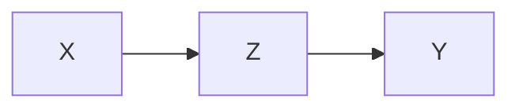
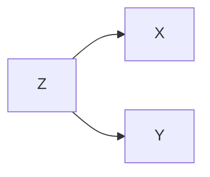
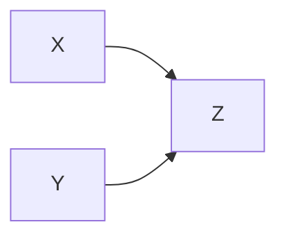
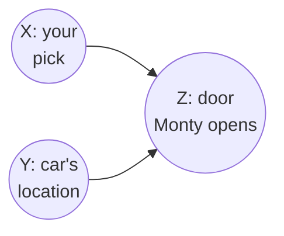
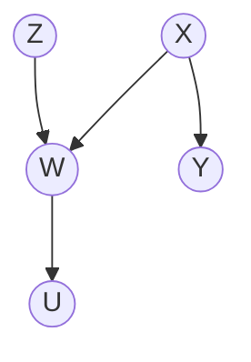
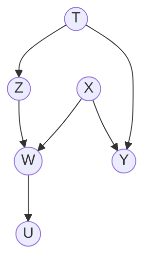
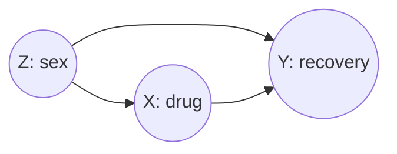
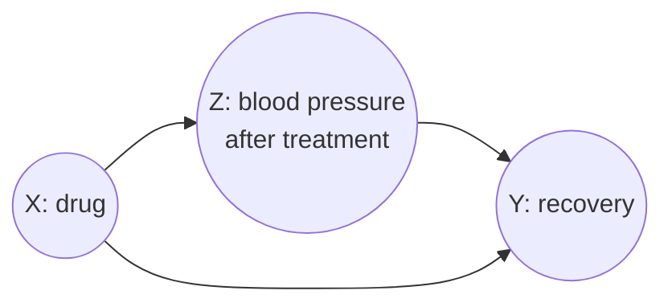

# Lesson 03: Building Blocks of Causal Graphs — Chains, Forks, and Colliders

In a causal graph, any complex path between a **Treatment ($X$)** and an **Outcome ($Y$)** decomposes into three "three-node" building blocks: the **Chain**, the **Fork**, and the **Collider**. This lesson examines each in turn, then combines them into one general rule, d-separation, and uses them to resolve Simpson's paradox.

> [!NOTE]
> **Key Concepts for this lesson:**
>
> - **$X$ and $Y$**: The "subjects" of our research question (Do $X$ and $Y$ have a causal relationship?).
> - **$Z$**: The "variable of interest" that defines the relationship pattern.
> - **Patterns**: The rules of how information flows through $Z$ between $X$ and $Y$.

## Vocabulary: Paths, Open Paths, and Spurious Association

Before examining the three structures, we must fix three terms that are frequently conflated.

**Path.** A *path* between $X$ and $Y$ is any sequence of edges connecting them, **ignoring arrow direction**. Paths are a fixed, structural property of the graph. Conditioning never creates or destroys a path—it only **opens** or **blocks** one.

**Causal vs. non-causal path.** A path is *causal* if every arrow along it points away from $X$ and toward $Y$ ($X \to \dots \to Y$). Every other path is *non-causal*. Both the Fork path ($X \leftarrow Z \to Y$) and the Collider path ($X \to Z \leftarrow Y$) are non-causal.

**Spurious association.** Association between $X$ and $Y$ that is **not produced by $X$ causing $Y$**. It is real, reproducible correlation in the data—it simply does not originate from the arrow $X \to Y$. Formally, all observed association decomposes as:

$$\text{Observed association} = \underbrace{\text{flow through causal paths}}_{\text{the effect we want}} + \underbrace{\text{flow through open non-causal paths}}_{\text{spurious association}}$$

> [!IMPORTANT]
> **"Spurious path" is shorthand, not a separate object.** It means *a non-causal path that is currently open*—a channel leaking unwanted association into the estimate. No structure "creates" a path; structures differ only in whether their non-causal path is open by **default** or opened by **your conditioning**.

### Intuition: The Interventional Test

To classify any observed correlation, ask: *"If I reached in and physically set $X$, would $Y$ change?"*

- **No, yet they still correlate** → that correlation is spurious.
- **Yes** → that portion is causal.

Spurious association is precisely the gap between what we *observe*, $E[Y \mid X]$, and what we would *cause*, $E[Y \mid do(X)]$.

### Intuition: Ice Cream and Drowning

Consider the graph $\text{IceCream} \leftarrow \text{Summer} \to \text{Drowning}$. Ice cream sales and drownings may correlate at $r \approx 0.8$. That number is entirely real and reproducible—but ice cream does not cause drowning. The association arrives through the non-causal path via $\text{Summer}$, which pushes both upward together. Forcing ice cream sales to zero would not change drownings. That $0.8$ is spurious association.

## 1. The Chain ($X \to Z \to Y$)

In a chain, $X$ (Treatment) causes $Z$, and $Z$ causes $Y$ (Outcome).

- **Context**: This describes a **Mediation** path. $X$ is the starting influence, $Z$ is the mechanism, and $Y$ is the end result.
- **Inference**: $X$ affects $Y$ through the mediator $Z$.

> - **Property**: Information flows from $X$ to $Y$ through $Z$.
> - **Key Insight**: If we know the value of $Z$ (we "condition" on $Z$), the path between $X$ and $Y$ is "blocked." The correlation between $X$ and $Y$ due to the chain is explained away by $Z$.

### Intuition: The "Pipe" Analogy

Think of the path as a pipe. Without conditioning, information (influence) flows freely from $X$ (Treatment) through $Z$ to $Y$ (Outcome). Conditioning on $Z$ acts as a "shut-off valve," fixing the value of $Z$ and preventing any further information from passing from $X$ to $Y$.

### Example: Exercise, Blood Pressure, and Heart Attack

Consider $\text{Exercise} \to \text{Blood Pressure} \to \text{Heart Attack}$. Exercise reduces heart-attack risk *entirely by way of* lowering blood pressure. If we restrict our analysis to patients who all share the same blood pressure, the association between exercise and heart attack vanishes—not because exercise is ineffective, but because we blocked the very channel through which it operates.

### Over-Adjustment (Over-Control Bias)

**Over-adjustment** is the error of conditioning on a variable that lies *on* the causal path being estimated. Because $Z$ is the mechanism transmitting the effect of $X$ to $Y$, conditioning on $Z$ blocks that mechanism, collapsing the observed $X$–$Y$ association toward zero and understating the total effect.

In the example above, comparing exercisers and non-exercisers *at the same blood pressure* makes exercise appear useless. The adjustment did not remove bias—it removed the answer.

> [!WARNING]
> **Do not condition on a mediator when estimating a total effect.** Blocking a chain removes the causal signal you are trying to measure. Conditioning on $Z$ here is a modeling error, not a correction.

## 2. The Fork ($X \leftarrow Z \to Y$)

In a fork, $Z$ is a common cause of $X$ (Treatment) and $Y$ (Outcome).

- **Context**: This describes **Confounding**. $X$ is the treatment and $Y$ is the outcome, but their apparent relationship is spurious because it is entirely accounted for by the confounder $Z$.
- **Inference**: $X$ and $Y$ are correlated only because they share a common cause $Z$.

> - **Property**: $X$ and $Y$ appear correlated even without a causal relationship between them, simply because both are influenced by $Z$.
> - **Key Insight**: Conditioning on $Z$ blocks the path, and the spurious association between $X$ and $Y$ disappears.

### Intuition: Shutting Off a Common Source

When $X$ and $Y$ share a common cause $Z$, they inherit correlation from that source. Conditioning on $Z$ fixes the source's value, removing the variance that linked them—like closing the feed from a shared reservoir. This blocks the spurious association and isolates the true (possibly zero) connection between $X$ and $Y$.

## 3. The Collider ($X \to Z \leftarrow Y$)

In a collider, $X$ and $Y$ both cause $Z$.

- **Context**: This is the structural mechanism behind **Selection Bias**. The bias arises when the sampling criterion depends on both $X$ and $Y$, making the selection variable a collider.
- **Inference**: $X$ and $Y$ are independent until the population is restricted by their shared consequence $Z$.

> - **Property**: Unlike chains and forks, the path is *naturally blocked*. $X$ and $Y$ are independent.
> - **Crucial Insight**: Conditioning on $Z$ (the collider, or any of its descendants) *opens* the path, producing spurious association between $X$ and $Y$. This is **collider bias**.
<!-- -->
> [!IMPORTANT]
> **Why conditioning opens the path.** Conditioning on $Z$ fixes its value. Because $Z$ is a joint consequence of $X$ and $Y$, holding $Z$ constant forces any variation in $X$ to be offset by inverse variation in $Y$. This compensatory relationship is a statistical association that did not exist in the unselected population.

| Role in Collider Graph | Application to Analysis |
| :--- | :--- |
| **$X$** (Cause) | Treatment — the variable measured for effect |
| **$Y$** (Cause) | Outcome — the variable checked for response |
| **$Z$** (Collider) | **Selection variable** — the criterion used to filter the sample |

### Case Study: University Admissions

Admission to a selective university ($Z$) has two independent causes:

- **$X$**: High academic ability
- **$Y$**: Athletic talent

In the general population, $X$ and $Y$ are independent: knowing someone is a great athlete tells us nothing about their academic ability. Now suppose an analyst asks *"Does academic ability influence athletic talent?"* and, seeking a convenient sample, studies **only admitted students** ($Z=1$). That sampling decision is a conditioning operation, and it converts $Z$ from an ordinary common consequence into an active collider.

Among admitted students, a **negative** correlation between academic and athletic ability appears:

- An admitted athlete who is not academically gifted must have qualified on athletics.
- An admitted scholar who is not athletic must have qualified on academics.
- Therefore, learning that an admitted student has low academic ability ($X=0$) implies high athletic talent ($Y=1$).

Restricting the sample to those who "made it" forces a dependency between $X$ and $Y$ that did not exist beforehand. Formally: unconditioned, the path is blocked and $X \perp\!\!\!\perp Y$; conditioned on $Z$, the path opens and the compensatory relationship described above manifests as **collider bias**.

> [!NOTE]
> **Why is admission labelled $Z$ and not $Y$?** Admission *is* causally an outcome of ability and talent. But labels in a causal analysis are assigned relative to the **research question**, not to the underlying causal chronology. Since the question is "Does academic ability influence athletic talent?", the treatment is $X = $ academic ability and the outcome is $Y = $ athletic talent. Admission is not part of the hypothesis at all—it enters only as the sampling filter, and that is precisely what makes it a collider.

### Intuition: The "Conservation" Constraint

Treat $Z$ as a fixed budget that $X$ and $Y$ must jointly satisfy. Once the total is pinned ($Z=1$), knowing $X$ tells us something about $Y$: if $X$ is high, $Y$ need not be. That informational leakage *is* the association.

<strong>Aside: Berkson's Paradox — negative, or any, correlation?</strong>

Berkson's Paradox classically denotes the appearance of a **negative** correlation between two independent traits induced by conditioning on a "success" threshold ($Z=1$).

- **Logic**: If $Z$ is a threshold variable (admitted / not admitted), then satisfying the threshold means that a high value on $X$ relieves the requirement on $Y$, producing an inverse relationship within the selected sample.
- **Broader framing**: In general causal graph theory, conditioning on *any* collider induces *some* association. Berkson's is the best-known negative instance; the general phenomenon is simply **collider-induced association**.

### Example: Monty Hall as a Collider

Lesson 01 solved the Monty Hall problem with Bayes' rule. The graph shows why the answer is surprising. The door you pick ($X$) and the door hiding the car ($Y$) are independent: your pick cannot move the car. But both determine which door Monty opens ($Z$), because he may open neither your door nor the car's door:

Monty's door is a collider. Once you see which door he opened, you are conditioning on it, and your pick and the car's location become dependent. That new dependence is exactly the information that makes switching worthwhile.

<strong>Aside: Selection bias versus collider bias</strong>

The two terms are closely related but operate at different levels of description.

- **Collider bias** is a **structural property** of a causal graph: conditioning on a collider opens a non-causal path.
- **Selection bias** is a **sampling phenomenon**: the observed sample is unrepresentative of the target population.

Collider bias is typically the *mechanism* producing selection bias. Sampling implicitly conditions on inclusion in the sample. If inclusion probability depends on both the treatment $X$ and the outcome $Y$, that inclusion indicator is a collider—so the structural collider bias is the causal explanation for the observed selection bias.

## 4. Putting the Blocks Together: d-separation

Real graphs rarely have a single three-node path between two variables. Usually there are several paths, and each passes through a mixture of chains, forks and colliders. The Primer's §2.4 gives one rule that handles any graph. It is called **d-separation** ("d" for *directional*).

The idea: treat each path as a pipe that association can flow through. A pipe needs to be blocked at only one point to stop the flow. Two variables are cut off from each other only if *every* pipe between them is blocked.

> **Definition (d-separation; Primer Definition 2.4.1).** A path $p$ is **blocked** by a set of nodes $\mathbf{Z}$ if and only if
>
> 1. $p$ contains a chain $A \to B \to C$ or a fork $A \leftarrow B \to C$ whose middle node $B$ is in $\mathbf{Z}$, or
> 2. $p$ contains a collider $A \to B \leftarrow C$ such that $B$ is **not** in $\mathbf{Z}$ and **no descendant** of $B$ is in $\mathbf{Z}$.
>
> If $\mathbf{Z}$ blocks every path between $X$ and $Y$, then $X$ and $Y$ are **d-separated** by $\mathbf{Z}$. Otherwise they are **d-connected**.

Each clause is one of the building blocks above:

- Conditioning on the middle of a chain or fork blocks it (Sections 1 and 2).
- A collider blocks a path by default, but conditioning on it, *or on any of its descendants*, opens it (Section 3). A descendant counts because it carries information about the collider: if $U$ is caused by the collider $W$, then learning $U$ partly reveals $W$.

With an empty conditioning set, only clause 2 can apply, so **only colliders block**.

What d-separation tells us about data: if $X$ and $Y$ are d-separated by $\mathbf{Z}$ in the true causal graph, then $X$ and $Y$ are independent given $\mathbf{Z}$ in any data the graph generates, whatever the functions and distributions involved. If they are d-connected, they are almost always dependent. (The exceptions are cases where effects along different paths happen to cancel exactly; Lesson 22 discusses them under the name *faithfulness*.)

### Worked Example: Primer Figures 2.7 and 2.8

In Primer Figure 2.7, $X$ causes $Y$; $X$ and $Z$ both cause $W$; and $W$ causes $U$:

*Primer Figure 2.7, without its error terms.*

The only path between $Z$ and $Y$ is $Z \to W \leftarrow X \to Y$. It contains a collider at $W$ and a fork at $X$. Check different conditioning sets:

| Conditioning set | Collider $W$ | Fork $X$ | Path | $Z$ and $Y$ |
| --- | --- | --- | --- | --- |
| none | blocks (not conditioned) | open | blocked | d-separated: independent |
| $\{W\}$ | open (conditioned) | open | open | d-connected |
| $\{U\}$ | open (its descendant $U$ is conditioned) | open | open | d-connected |
| $\{W, X\}$ | open | blocks (conditioned) | blocked | d-separated |

The last row shows that one blocked node is enough: conditioning on $W$ opened the collider, but conditioning on $X$ blocked the path again elsewhere.

Primer Figure 2.8 adds a second path through a new variable $T$, a common cause of $Z$ and $Y$:

*Primer Figure 2.8: Figure 2.7 plus the fork $Z \leftarrow T \to Y$.*

Now there are two paths between $Z$ and $Y$: the old one, $Z \to W \leftarrow X \to Y$, and the new fork $Z \leftarrow T \to Y$. Both must be blocked:

| Conditioning set | Old path | Fork through $T$ | $Z$ and $Y$ |
| --- | --- | --- | --- |
| none | blocked at $W$ | open | d-connected |
| $\{T\}$ | blocked at $W$ | blocked | d-separated |
| $\{T, W\}$ | open ($W$ conditioned, $X$ not) | blocked | d-connected |
| $\{T, W, X\}$ | blocked at $X$ | blocked | d-separated |

Every set that separates $Z$ from $Y$ must contain $T$, because the fork through $T$ has no collider and nothing else on it can be conditioned on.

Lessons 20–24 use d-separation constantly. Lesson 22 states precisely when it implies independence in data (the Markov property), and Lesson 20 uses it to choose which variables to adjust for.

## 5. Simpson's Paradox: When the Graph Decides

The building blocks explain a famous puzzle. **Simpson's paradox** is a pattern in data where an association that holds in every subgroup reverses in the whole population (Primer §1.2).

### The Drug Study

The Primer's Example 1.2.1: 700 patients were offered a new drug; 350 chose to take it and 350 did not.

| | Drug | No drug |
| --- | --- | --- |
| Men | 81 of 87 recovered (93%) | 234 of 270 recovered (87%) |
| Women | 192 of 263 recovered (73%) | 55 of 80 recovered (69%) |
| Combined | 273 of 350 recovered (78%) | 289 of 350 recovered (83%) |

*Primer Table 1.1.*

Men who took the drug recovered more often than men who did not (93% against 87%). The same holds for women (73% against 69%). Yet overall, drug takers recovered *less* often (78% against 83%). Taken literally, the table says to give the drug to a man, to give it to a woman, and to withhold it from a patient whose sex is unknown. That cannot be right.

**How the reversal happens.** Look at who took the drug. Of the 350 drug takers, 263 (75%) were women. Of the 350 non-takers, only 80 (23%) were women. And women recover less often than men whether or not they take the drug (the Primer's story: estrogen slows recovery). So the drug group is dominated by patients who recover less often anyway. The combined comparison mixes the drug's effect with the difference between men and women.

**The graph settles it.** Sex affects both who takes the drug and who recovers:

Sex is a fork, a confounder, on the path $X \leftarrow Z \to Y$. By Section 2, conditioning on it blocks that path. So the right comparison is within each sex: **the drug helps**. Lesson 19 turns this into a single number, the adjustment formula, and finds that the drug raises recovery by about 5 percentage points.

### Same Numbers, Different Story

Now keep the numbers exactly and change the story (Primer Table 1.2). Instead of sex, the rows record each patient's **blood pressure at the end of the study**. The drug works by lowering blood pressure, but it also has a toxic side effect. The column labels are swapped, so the combined row now shows the drug group recovering *more* often:

| | No drug | Drug |
| --- | --- | --- |
| Low blood pressure | 81 of 87 recovered (93%) | 234 of 270 recovered (87%) |
| High blood pressure | 192 of 263 recovered (73%) | 55 of 80 recovered (69%) |
| Combined | 273 of 350 recovered (78%) | 289 of 350 recovered (83%) |

*Primer Table 1.2: numerically identical to Table 1.1, with the column labels swapped.*

Here the drug causes the blood pressure, not the other way round:

Blood pressure is now the middle of a chain, $X \to Z \to Y$, the route by which the drug helps. By Section 1, conditioning on it blocks part of the drug's effect: within each blood-pressure group, only the toxic side effect is visible. So the right comparison is the **combined** row: **the drug helps**, 83% against 78%.

The numbers are identical. In the first story the correct answer is in the subgroups; in the second, it is in the total. Nothing in the table says which story is true. The deciding facts are that treatment cannot change sex, and that blood pressure was measured after treatment. Both are facts about how the data were generated. As the Primer puts it, there is no statistical method that can determine the causal story from the data alone.

### Neal's Version: Two COVID-19 Treatments

Neal opens his book with the same puzzle. Two treatments, A and B, for a hypothetical future disease; patients' condition is either mild or severe; the outcome is death (lower is better).

| | Mild | Severe | Total |
| --- | --- | --- | --- |
| Treatment A | 15% (210/1400) | 30% (30/100) | 16% (240/1500) |
| Treatment B | 10% (5/50) | 20% (100/500) | 19% (105/550) |

*Neal's opening example (Chapter 1; counts from his week-1 lecture slides).*

B has lower mortality in both groups, but A has lower mortality overall. The reason is the mix: 1,400 of the 1,500 patients on A (93%) were mild, while 500 of the 550 on B (91%) were severe. Neal gives two stories:

1. **Condition causes treatment** ($C \to T$). Doctors save the scarce treatment B for severe cases. Condition is a fork, so compare within each condition: **B is better**.
2. **Treatment causes condition** ($T \to C$). Treatment B is so scarce that patients prescribed it wait a long time, and their condition worsens while they wait. Here $T$ is the *prescription*, and condition lies on a chain from it to death. Compare the totals: **A is better**.

Neal's conclusion: "Without causality, Simpson's paradox cannot be resolved. With causality, it is not a paradox at all."

## Summary

Both the Fork and the Collider transmit **spurious association** when their non-causal path is open. They differ in *when* the path is open, and therefore in who is responsible for the resulting bias.

| | **Chain** (Mediator) | **Fork** (Confounder) | **Collider** |
| :--- | :--- | :--- | :--- |
| Structure | $X \to Z \to Y$ | $X \leftarrow Z \to Y$ | $X \to Z \leftarrow Y$ |
| Path type | Causal | Non-causal | Non-causal |
| Default state | **Open** | **Open** | **Blocked** |
| Effect of conditioning on $Z$ | Blocks path | Blocks path | **Opens** path |
| Spurious association in raw data? | — | Yes | No |
| Spurious association after conditioning? | — | No | **Yes** |
| Source of the problem | **Your analysis choice** | The world | **Your analysis choice** |
| Correct action | **Do not condition** | **Condition** on $Z$ | **Do not condition** |
| Bias if mishandled | Over-control bias | Confounding bias | Collider bias |

> [!CAUTION]
> Colliders are not special in *producing* spurious association—forks do so as well. Colliders are special because the analyst introduces the bias by conditioning. Confounding bias is the default problem; collider bias is self-inflicted.

### Intuition: Three Ways to Get the Answer Wrong

Each structure fails differently, and the direction of the error is diagnostic.

| Structure | Analyst's mistake | What it does to the estimate | Bias name |
| :--- | :--- | :--- | :--- |
| **Fork** | Failing to condition on $Z$ | Adds association from an open back-door path → effect **overstated** | Confounding bias |
| **Chain** | Conditioning on $Z$ | Removes the causal signal → effect **understated** | Over-control bias |
| **Collider** | Conditioning on $Z$ | Manufactures association where none existed → **spurious** effect | Collider bias |

Confounding bias is imposed by the world and corrected by conditioning. Over-control bias and collider bias are both self-inflicted by conditioning—but they differ in kind: over-control **destroys real signal**, whereas collider bias **manufactures fake signal**.

### Beyond Single Paths

- **d-separation** combines the three rules for any graph: a path is blocked by conditioning on the middle of a chain or fork, or by a collider that is not conditioned on and has no conditioned descendant. Two variables are d-separated when every path between them is blocked.
- **Simpson's paradox** is the same data table read under different causal stories. When the splitting variable is a confounder (a fork), the subgroup comparison is right. When it lies on the causal path (a chain), the combined comparison is right. The table alone cannot say which.

### Check Your Understanding

1. In Primer Figure 2.8, list every conditioning set drawn from $\{T, W, X\}$ that d-separates $Z$ and $Y$.
2. In Figure 2.7, why does conditioning on $U$ open the path between $Z$ and $Y$, even though $U$ is not on that path?
3. A study of kidney-stone treatments finds that treatment A has a higher success rate than B for small stones and for large stones, but a lower rate overall. Doctors give A mostly to large, harder stones. Should a patient who does not know their stone size use the subgroup rates or the overall rates? Draw the graph.
4. In the blood-pressure version of the drug study, suppose blood pressure had been measured *before* treatment and influenced who took the drug. Which rows of the table would then give the right answer, and why?

---

## Further Reading

*Ref*: *Causal Inference in Statistics: A Primer (2016)*, Chapter 1, Section 1.2 (Simpson's paradox, Tables 1.1–1.2) and Chapter 2, Sections 2.2–2.4 (chains, forks, colliders, d-separation, Figures 2.7–2.8); Brady Neal, *Introduction to Causal Inference* (Dec 2020 draft), Chapter 1 (Simpson's paradox and the COVID-19 example) and Chapter 3 (chains, forks, colliders, d-separation).
