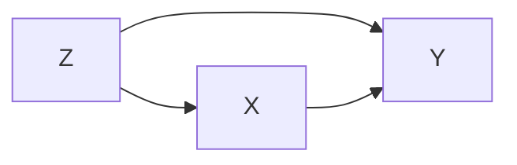
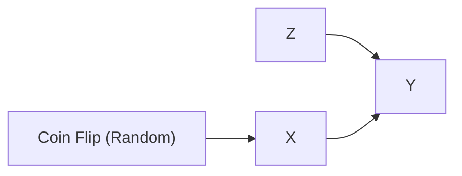

# Lesson 04: Randomization vs. Observation

## The Observational Problem: Confounding

In an observational study, the researcher passively observes treatment $X$ and outcome $Y$ as they naturally occur. Because units often self-select into treatment based on background attributes ($Z$), both $X$ and $Y$ become functions of common causes.

*Caption: Observational scenario. The confounder $Z$ influences both Treatment ($X$) and Outcome ($Y$), leaving the back-door path $X \leftarrow Z \to Y$ open and transmitting spurious association.*

### Example: Medical Self-Selection

Suppose $X$ is taking a new drug, $Y$ is recovery, and $Z$ is disease severity. Sicker patients ($Z$) are more eager to try the drug ($X$) and also less likely to recover ($Y$). Comparing observed recovery rates between drug-takers and non-takers will reflect both the drug's effect and the patients' baseline sickness. The crude comparison is confounded.

---

## The Gold Standard: Randomized Controlled Trials (RCTs)

A **Randomized Controlled Trial (RCT)** resolves confounding by taking control of treatment assignment away from units and nature. By assigning treatment $X$ via a pure random process (such as a coin flip), the researcher forcibly severs the link $Z \to X$.

*Caption: Randomized scenario. Forcing $X$ to depend only on the randomizer cuts the incoming edge $Z \to X$, blocking the back-door path.*

> [!IMPORTANT]
> **De-confounding by Design:** Randomization modifies the graph structure itself, eliminating the $Z \to X$ edge. Because no back-door path enters $X$, any observed association between $X$ and $Y$ must originate solely from the causal arrow $X \to Y$.
<!-- -->
> [!NOTE]
> **Paths are structural; only their state changes.** Randomization and adjustment never create or delete paths in the underlying system—they toggle whether a path is open or blocked. See [Lesson 03](lesson-03-paths-chains-forks.md) for the full vocabulary of open versus blocked paths.

---

## RCTs vs. Observational Studies

| Feature | Observational Studies | Randomized Controlled Trials (RCTs) |
| :--- | :--- | :--- |
| **Treatment Assignment ($X$)** | Determined by nature/self-selection | Forced by randomizer ($X \leftarrow \text{Coin Flip}$) |
| **Graph Structure** | Includes $Z \to X$ edge | $Z \to X$ edge is **severed** |
| **Back-Door Path ($X \leftarrow Z \to Y$)** | **Open** by default | **Blocked** by design |
| **Confounding Risk** | High (requires statistical adjustment) | Eliminated by design |
| **Causal Identification** | Conditional ($X \perp\!\!\!\perp Y(x) \mid Z$) | Unconditional ($X \perp\!\!\!\perp Y(x)$) |

> [!WARNING]
> In observational studies, adjusting for a confounder ($Z$) **blocks** an already-open back-door path. In contrast, conditioning on a collider ($X \to Z \leftarrow Y$) does the opposite: it **opens** a path that was blocked, introducing collider bias. Always check your DAG before adjusting.

### Intuition: The Interventional Test

Randomization works because it guarantees that any remaining association between $X$ and $Y$ answers the question *"if I set $X$, does $Y$ change?"* In an observational study, the observed association contains both causal flow and flow from open back-door paths. Spurious association is precisely the gap between what we observe, $E[Y \mid X]$, and what we would cause, $E[Y \mid do(X)]$—the bias term formalized in [Lesson 11](../Part-2/lesson-10-why-association-is-not-causation.md).

<strong>Aside: When Randomization Is Unavailable or Insufficient</strong>

While RCTs are the Gold Standard for internal validity, they face practical and theoretical limits:

- **Ethics:** We cannot randomly assign harmful exposures (e.g., smoking, toxic chemical exposure, poverty).
- **Feasibility & Cost:** Long-term trials (e.g., decade-long dietary impacts) are often prohibitively expensive or unmanageable.
- **Non-compliance:** Patients assigned to treatment may fail to take it, re-introducing self-selection.
- **External Validity:** Trial subjects often differ systematically from the broader real-world population (over-monitored, fewer comorbidities).

When RCTs are unethical or unfeasible, we must rely on observational data and use structural methods (such as the Back-Door Criterion taught in [Lesson 05](lesson-05-adjusting-for-confounders.md)) to identify causal effects.

---

## Further Reading

*Ref*: *Causal Inference in Statistics: A Primer (2016)*, Chapter 2.
