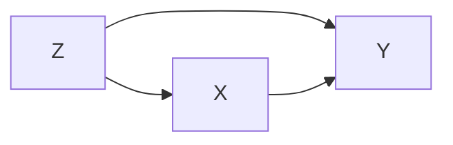
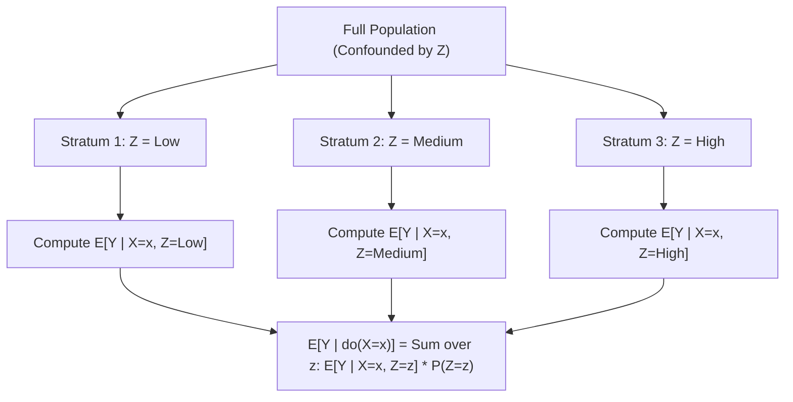

# Lesson 05: Adjusting for Confounders

## Motivation: Closing Back-Door Paths

In observational studies, treatment ($X$) is not randomized, leaving back-door paths open. Confounders ($Z$) influence both treatment $X$ and outcome $Y$, transmitting spurious association. To isolate the true causal effect of $X$ on $Y$, we must **block** every open back-door path by controlling for $Z$.

*Caption: The confounding graph. To compute the causal effect of $X$ on $Y$, we must adjust for $Z$ to block the back-door path $X \leftarrow Z \to Y$.*

---

## What is Adjustment? (Stratification)

Adjustment is the mathematical mechanism for holding a confounder $Z$ constant. It works by:

1. **Stratifying** the population into subgroups (strata) where $Z$ is homogeneous.
2. **Computing** the association between $X$ and $Y$ *within* each stratum (where $Z$ cannot vary and therefore cannot confound).
3. **Averaging** those stratum-specific effects, weighted by the prevalence of each stratum in the population.

### Intuition: The "Shut-Off Valve"

Think of adjustment as a shut-off valve on the back-door path $X \leftarrow Z \to Y$. Within any single stratum (e.g., $Z = z_1$), $Z$ is fixed. Because $Z$ cannot fluctuate within that stratum, it cannot push $X$ and $Y$ up or down together, effectively shutting off the flow of spurious association.

---

## The Adjustment Formula

Mathematically, the interventional distribution $P(Y \mid do(X=x))$ is obtained via the **Adjustment Formula**:

$$P(Y \mid do(X=x)) = \sum_{z} P(Y \mid X=x, Z=z) P(Z=z)$$

- $P(Y \mid do(X=x))$: The **interventional distribution** — the outcome distribution we would observe if we forced $X=x$ for the entire population.
- $P(Y \mid X=x, Z=z)$: The **stratum-specific outcome probability** — observed within the subgroup $Z=z$.
- $P(Z=z)$: The **stratum weight** — the proportion of the population belonging to stratum $z$.

---

## The Back-Door Criterion: What to Adjust For?

Not every variable should be adjusted for! Graph theory dictates action based on the structural role of variable $Z$:

| Variable Type | Structure | Action | Reason |
| :--- | :--- | :--- | :--- |
| **Confounder** | Fork: $X \leftarrow Z \to Y$ | **Adjust** | Blocks open back-door path; removes confounding bias. |
| **Mediator** | Chain: $X \to Z \to Y$ | **Do NOT adjust** | Lies on causal path; adjusting causes over-control bias. |
| **Collider** | Collider: $X \to Z \leftarrow Y$ | **Do NOT adjust** | Path is blocked by default; adjusting opens it and causes collider bias. |

> [!CAUTION]
> Only adjust for variables that satisfy the Back-Door Criterion—specifically, variables that block back-door paths into $X$ without opening new non-causal paths or blocking causal ones.

<strong>Formal Definition: Back-Door Criterion</strong>

A set of variables $\mathbf{Z}$ satisfies the back-door criterion relative to an ordered pair of variables $(X, Y)$ in a DAG if:

1. No node in $\mathbf{Z}$ is a descendant of $X$.
2. $\mathbf{Z}$ blocks every path between $X$ and $Y$ that contains an arrow into $X$ (back-door paths).

<strong>Aside: Why Every Simple Fork Satisfies the Back-Door Criterion</strong>

In graph theory, a **path** is any sequence of edges connecting two nodes, **ignoring arrow direction**.

In a fork $X \leftarrow Z \to Y$:

- Is $X \leftarrow Z \to Y$ a path? **Yes.**
- Is it a *causal* path? **No** (causal paths must follow arrow directions $X \to \dots \to Y$).
- Is it a *back-door* path? **Yes**, because it begins with an arrow pointing into $X$ ($X \leftarrow$).

Conditioning on $\mathbf{Z} = \{Z\}$ blocks this back-door path, satisfying the criterion and identifying the causal effect.

---

## Practical Example: Stratifying by Confounders

Suppose we want to estimate the causal effect of Reading Habit ($X=x$) on Test Scores ($Y$), confounded by Study Time ($Z$):

1. **Stratify:** Split the dataset into subgroups based on Study Time ($Z = \text{"Low"}$, $\text{"Medium"}$, $\text{"High"}$).
2. **Compute:** Calculate the expected Test Score for a given Reading Habit $x$ *separately* within each Study Time subgroup: $E[Y \mid X=x, Z=z]$.
3. **Weight:** Aggregate those subgroup-specific expected scores using the population fraction of each Study Time subgroup as weights ($P(Z=z)$).

*Caption: By holding $Z$ constant within each stratum, stratification blocks the back-door path $X \leftarrow Z \to Y$. Weighting the stratum-specific outcome expectations by population proportions yields the interventional expectation $E[Y \mid do(X=x)]$.*

---

## Further Reading

*Ref*: *Causal Inference in Statistics: A Primer (2016)*, Chapter 3.
