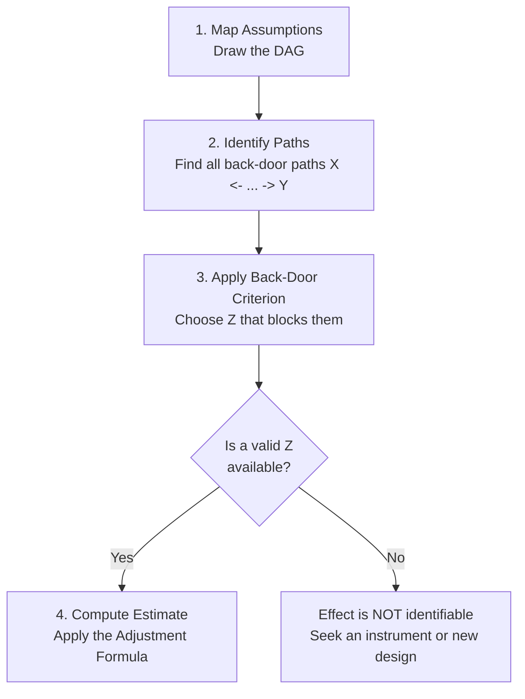

# Lesson 06: Foundations Synthesis — Graphical Models & Identification

## Scope: What Part 1 Covered

This lesson is a checkpoint. It consolidates **Part 1 (Lessons 01–05)**, which established the *structural* approach to causal inference: representing assumptions as graphs and using graph rules to decide what to control for.

| Lesson | Contribution |
| :--- | :--- |
| [01: Introduction](lesson-01-introduction.md) | Why correlation is insufficient; the goal of causal inference. |
| [02: Causal Graphs](lesson-02-causal-graphs.md) | DAGs as explicit, testable statements of assumption. |
| [03: Chains, Forks, Colliders](lesson-03-paths-chains-forks.md) | The three building blocks; open vs. blocked paths; spurious association. |
| [04: Randomization vs. Observation](lesson-04-randomization-vs-observation.md) | How randomization severs $Z \to X$ and de-confounds by design. |
| [05: Adjusting for Confounders](lesson-05-adjusting-for-confounders.md) | The Back-Door Criterion and the Adjustment Formula. |

---

## Key Concepts Summary

| Concept | Core Logic |
| :--- | :--- |
| **Causal Graphs (DAGs)** | Visualizing assumptions; nodes and directed edges indicate causal flow. |
| **Path Analysis** | Chains ($X \to Z \to Y$), Forks ($X \leftarrow Z \to Y$), and Colliders ($X \to Z \leftarrow Y$) determine how association travels. |
| **Open vs. Blocked** | Paths are structural and permanent; conditioning only toggles their state. |
| **Spurious Association** | Association between $X$ and $Y$ not produced by $X$ causing $Y$; the gap between $E[Y \mid X]$ and $E[Y \mid do(X)]$. |
| **Randomization** | Severs the $Z \to X$ edge by design, blocking every back-door path at once. |
| **Adjustment** | Blocks back-door paths by stratifying on $Z$: $E[Y \mid do(X{=}x)] = \sum_z E[Y \mid X{=}x, Z{=}z]\,P(Z{=}z)$. |

---

## The "Big Picture" Workflow

Causal inference from observational data proceeds structurally, not statistically. The graph is drawn *before* any estimation.

*Caption: Identification precedes estimation. If Step 3 fails, no amount of statistical sophistication in Step 4 will recover the causal effect.*

> [!IMPORTANT]
> **Identification is a modeling question, not a data question.** Whether an effect *can* be estimated is settled entirely by the graph. The data determines only *how precisely*.

---

## Bias Taxonomy: The Three Failure Modes

Lessons 03–05 each diagnosed a distinct way an analysis goes wrong. All three reduce to mishandling a single variable $Z$.

| Bias | Structure of $Z$ | Analyst's error | Effect on estimate | Correct action |
| :--- | :--- | :--- | :--- | :--- |
| **Confounding bias** | Fork: $X \leftarrow Z \to Y$ | Failing to condition | **Overstated** (spurious flow added) | **Condition** on $Z$ |
| **Over-control bias** | Chain: $X \to Z \to Y$ | Conditioning | **Understated** (causal signal destroyed) | **Do not condition** |
| **Collider bias** | Collider: $X \to Z \leftarrow Y$ | Conditioning | **Fabricated** (association where none existed) | **Do not condition** |

> [!CAUTION]
> Two of the three failure modes are caused *by* adjusting. "Control for everything you measured" is not a safe default—it is a reliable way to introduce over-control and collider bias.

---

## Looking Ahead: The Fundamental Problem and Potential Outcomes

Part 1 asked *"which variables must I control for?"* Part 2 asks *"once I have, what exactly am I computing?"*

The **Potential Outcomes framework** (Neyman–Rubin) supplies that algebra, and with it the **Fundamental Problem of Causal Inference**: for any individual unit $u$, only one of $Y_u(1)$ or $Y_u(0)$ is ever observed. The other is counterfactual and permanently unavailable.

> [!NOTE]
> **RCTs do not solve the Fundamental Problem for individuals.** Randomization does not reveal any individual's counterfactual. It guarantees population-level **exchangeability**, which licenses estimation of the Average Treatment Effect ($ATE$) across groups—never the individual effect ($ICE$).

### Comparison: DAGs vs. Potential Outcomes

| Domain | Structural Graphs (DAGs) | Potential Outcomes (Neyman–Rubin) |
| :--- | :--- | :--- |
| **Primary Task** | Visualizing relationships & identifying back-door paths | Mathematically defining counterfactual contrasts ($ATE$, $ICE$) |
| **Main Assumption** | Causal DAG structure is correctly specified | Conditional Exchangeability: $(Y(1), Y(0)) \perp\!\!\!\perp X \mid Z$ |
| **Core Strength** | Prevents conditioning on colliders or mediators | Enables precise algebraic estimation & quasi-experiments |
| **Answers** | *Which* $Z$ to adjust for | *How* to compute the effect given $Z$ |

> [!IMPORTANT]
> **Complementary, not competing.** Neither framework extracts causal conclusions from raw data without untestable assumptions. Modern practice uses **DAGs to select $Z$** (avoiding over-control and collider bias) and **Potential Outcomes to write the estimation algebra**.

<strong>Aside: Does the Potential Outcomes framework help when the DAG is unknown?</strong>

**Not by itself.** Both frameworks require untestable causal assumptions; they differ only in how those assumptions are *stated*.

- **DAG statement:** "Here is the graph of how these variables cause one another."
- **Potential Outcomes statement:** $(Y(1), Y(0)) \perp\!\!\!\perp X \mid Z$ — "within levels of $Z$, treatment is as-if randomized."

**Where Potential Outcomes genuinely helps.** It lets the analyst focus narrowly on the *treatment assignment mechanism* rather than mapping an entire system, and it extends naturally to quasi-experimental designs (Instrumental Variables, Difference-in-Differences, Regression Discontinuity) where identification comes from a design feature rather than from an exhaustive confounder list.

**Pearl's critique.** Asserting conditional exchangeability *without* a DAG is hazardous, because humans reason poorly about conditional independence unaided. Without a graph it is easy to place a mediator into $Z$ (over-control bias) or a collider into $Z$ (collider bias). The DAG is the visual safeguard for the assumption the algebra requires.

---

## Self-Check

Before proceeding to Part 2, verify you can answer each of the following.

1. A path exists between $X$ and $Y$ through $Z$, but no arrow points from $X$ toward $Y$. Is this a path? Is it causal? Is it a back-door path?
2. You observe a strong correlation ($r = 0.8$) between ice cream sales ($X$) and drowning rates ($Y$) and confirm the relationship is entirely confounded by temperature ($Z$). Is the correlation real? What happens to drowning rates if you ban ice cream?
3. Why does conditioning on a collider *create* association, whereas conditioning on a confounder *removes* it?
4. Randomization blocks back-door paths. Why does it not require you to know what the confounders are?
5. You control for every variable in your dataset. Name two biases you may have introduced.

<strong>Answers</strong>

1. **Yes / No / Yes.** Paths ignore arrow direction, so $X \leftarrow Z \to Y$ is a path. It is not *causal* (causal paths follow arrows from $X$ to $Y$). It *is* a back-door path, because it begins with an arrow pointing into $X$.
2. **Yes, the statistical correlation is 100% real and reproducible, but the causal effect is zero.** Banning ice cream leaves drowning rates completely unchanged. "Spurious" means non-causal (transmitted via an open back-door path $X \leftarrow Z \to Y$), not mathematically fake or a measurement error.
3. A confounder's path is **open by default**, so conditioning closes it. A collider's path is **blocked by default**; fixing $Z$ forces variation in $X$ to be offset by variation in $Y$, opening it. See [Lesson 03](lesson-03-paths-chains-forks.md).
4. Randomization removes the $Z \to X$ edge for *every* $Z$ simultaneously, including unmeasured and unknown ones. Adjustment can only block paths through confounders you have both identified and measured.
5. **Over-control bias** (if any controlled variable is a mediator) and **collider bias** (if any is a common consequence of $X$ and $Y$).

---

## Further Reading

*Ref*: *Causal Inference in Statistics: A Primer (2016)*, Chapters 1–3.
