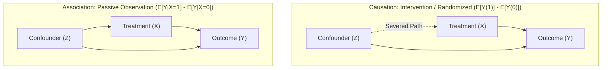

# Lesson 10: Why Association Is Not Causation

## Bridging Part 1 and Part 2: From Graphical Paths to Counterfactual Math

In **Part 1 (Lessons 01–06)**, we established the graphical framework of **Directed Acyclic Graphs (DAGs)**. We learned that association flows along all open paths between treatment ($X$) and outcome ($Y$), whereas causation flows exclusively along direct, directed paths ($X \to Y$). When a back-door path ($X \leftarrow Z \to Y$) remains open, observational data becomes contaminated with **spurious confounding bias**.

In **Lesson 09**, we crossed into **Part 2 (Potential Outcomes)** and defined the true **Average Treatment Effect (ATE)**:

$$\text{ATE} = E[Y(1) - Y(0)] = E[Y(1)] - E[Y(0)]$$

Now, we address the fundamental question of observational analysis: **Why can't we simply subtract the average outcome of the untreated group from the average outcome of the treated group in raw observational data?**

This lesson proves why the observational difference $E[Y \mid X=1] - E[Y \mid X=0]$ fails to equal the causal difference $E[Y(1)] - E[Y(0)]$, and demonstrates how graphical back-door paths manifest mathematically as confounding bias.

---

## The Core Mathematical Equality Failure

The central dilemma of observational data analysis is captured by a single fundamental inequality:

$$E[Y \mid X=1] - E[Y \mid X=0] \neq E[Y(1)] - E[Y(0)]$$

To understand why this inequality holds in almost all observational studies, we must distinguish between what we **observe** and what we **intervene on**:

| Dimension | Observational Difference (Association) | Interventional Difference (Causation / ATE) |
| :--- | :--- | :--- |
| **Mathematical Query** | $E[Y \mid X=1] - E[Y \mid X=0]$ | $E[Y(1)] - E[Y(0)]$ |
| **Operational Definition** | Difference in average outcomes between two *sub-populations* (those who happened to receive $X=1$ vs $X=0$). | Difference in average outcomes if the *entire population* were assigned to $X=1$ vs assigned to $X=0$. |
| **Graphical Counterpart** | Information flowing across **all open paths** (direct causal path + back-door paths). | Information flowing **only through directed causal paths** after severing back-door paths ($do(X)$). |
| **Data Requirement** | Passive observational data. | Controlled experiment OR observational data with all back-door paths blocked. |

---

## Visualizing the Flow: Association vs. Causation

The graph below illustrates why passive observation collects both genuine causal signals and spurious back-door noise:



*Caption: (a) Association flows through both direct causal paths ($X \to Y$) and open back-door paths ($X \leftarrow Z \to Y$). (b) Causation requires severing or adjusting for back-door paths so that only the direct intervention signal reaches $Y$.*

---

## Decomposing Observational Data: The Bias Equation

$$\text{Observational Difference} = \text{Causal Effect (ATE)} + \text{Confounding Bias } (B)$$

$$E[Y \mid X=1] - E[Y \mid X=0] = \underbrace{E[Y(1) - Y(0)]}_{\text{True ATE}} + \underbrace{\Big( E[Y(0) \mid X=1] - E[Y(0) \mid X=0] \Big)}_{\text{Confounding / Selection Bias } B}$$


### Step-by-Step Derivation:

To understand why the observational difference $E[Y \mid X=1] - E[Y \mid X=0]$ fails to equal the true causal effect, let's walk through the mathematical derivation step by step.

**Step 1: Translating Observational Averages to Potential Outcomes**

When we inspect passive sample data:

* For the **treated group** ($X=1$), we observe outcome $Y = Y(1)$. Therefore, $E[Y \mid X=1] = E[Y(1) \mid X=1]$.
* For the **control group** ($X=0$), we observe outcome $Y = Y(0)$. Therefore, $E[Y \mid X=0] = E[Y(0) \mid X=0]$.

Substituting these into our raw observational difference gives:

$$\text{Observational Difference} = E[Y \mid X=1] - E[Y \mid X=0] = E[Y(1) \mid X=1] - E[Y(0) \mid X=0]$$

> [!WARNING]
> **Comparing Two Different Groups:**
> Notice that $E[Y(1) \mid X=1]$ and $E[Y(0) \mid X=0]$ compare **two completely different sets of people**: those who self-selected into treatment versus those who self-selected into control.

---

**Step 2: The Add-and-Subtract Trick (Introducing the Counterfactual Baseline)**

To isolate the effect of treatment from pre-existing group differences, we introduce a key counterfactual quantity:

$$E[Y(0) \mid X=1]$$

*What would have happened to the **treated group** if they had **never** received treatment?*

By adding and subtracting $E[Y(0) \mid X=1]$ to the observational difference, we get:

$$E[Y \mid X=1] - E[Y \mid X=0] = E[Y(1) \mid X=1] - E[Y(0) \mid X=0]$$

$$= \underbrace{\Big( E[Y(1) \mid X=1] - E[Y(0) \mid X=1] \Big)}_{\text{Average Treatment Effect on the Treated (ATT)}} + \underbrace{\Big( E[Y(0) \mid X=1] - E[Y(0) \mid X=0] \Big)}_{\text{Baseline Selection / Confounding Bias } (B)}$$

---

**Step 3: Interpreting the Two Terms**

This mathematical decomposition cleanly splits the raw observation into two distinct forces:

1. **Term 1 — The Causal Effect on the Treated ($\text{ATT}$):**
   $$E[Y(1) \mid X=1] - E[Y(0) \mid X=1]$$
   This compares the **same group of people** ($X=1$) across two parallel states: with treatment vs. without treatment. This is a pure causal comparison. (When causal effects are uniform across the population, $\text{ATT} = \text{ATE} = E[Y(1) - Y(0)]$).

2. **Term 2 — The Baseline Confounding Bias ($B$):**
   $$B = E[Y(0) \mid X=1] - E[Y(0) \mid X=0]$$
   This compares the baseline outcomes ($Y(0)$) of the treated group versus the control group when **neither** receives treatment.
   * If $B = 0$: Both groups had identical starting baselines (as in a randomized trial).
   * If $B \neq 0$: The treated group would have had different outcomes anyway, even without treatment!

---

**Step 4: The Final Bias Equation**

Putting this together (assuming $\text{ATT} \approx \text{ATE}$), we obtain the fundamental equation of observational bias:

$$\text{Observational Difference} = \text{Causal Effect (ATE)} + \text{Confounding Bias } (B)$$

$$E[Y \mid X=1] - E[Y \mid X=0] = \underbrace{E[Y(1) - Y(0)]}_{\text{True ATE}} + \underbrace{\Big( E[Y(0) \mid X=1] - E[Y(0) \mid X=0] \Big)}_{\text{Confounding / Selection Bias } B}$$

> [!IMPORTANT]
> **The Origin of Confounding Bias:**
> Confounding bias ($B$) exists whenever the baseline counterfactual outcome $Y(0)$ is correlated with treatment choice $X$. In DAG terms, this baseline imbalance is caused by common confounders $Z$ that influence both $X$ and $Y$.

---

## Two Concrete Case Studies

### Case Study 1: Shoe Size ($X$) vs. Reading Ability ($Y$) (Pure Spurious Bias)

Consider an observational study measuring children's shoe size ($X$) and their reading comprehension scores ($Y$).

* **Observed Data ($E[Y \mid X=1] - E[Y \mid X=0] > 0$):** Children with larger shoe sizes ($X=1$) score dramatically higher in reading than children with smaller shoe sizes ($X=0$).
* **True Causal Effect ($E[Y(1)] - E[Y(0)] = 0$):** If we forcibly stretch or enlarge a child's feet, their reading comprehension will not change.
* **The Confounder ($Z = \text{Age}$):** Older children have both larger feet ($Z \to X$) and superior reading ability ($Z \to Y$).
* **The Result:** The entire observed association is composed of Bias ($B$). The true ATE is $0$, but $B > 0$.

```text
       [ Z: Age ]
        /      \
       v        v
[ X: Shoe Size ]  [ Y: Reading Score ]
```

### Case Study 2: Job Training Program ($X$) vs. Income ($Y$) (Selection Bias)

Consider evaluating a voluntary job training program ($X=1$ for enrolled, $X=0$ for non-enrolled) on future income ($Y$).

* **Observed Data ($E[Y \mid X=1] - E[Y \mid X=0]$):** Enrolled participants earn \$15,000 more per year than non-participants.
* **The Confounder ($Z = \text{Motivation / Baseline Ability}$):** Highly motivated individuals are more likely to sign up for training ($Z \to X$) AND more likely to earn higher incomes regardless of training ($Z \to Y$).
* **Decomposition:**
  * **True ATE ($E[Y(1) - Y(0)]$):** \$5,000 (the actual skill uplift from the training program).
  * **Selection Bias ($B$):** \$10,000 (the higher baseline earnings potential of motivated individuals: $E[Y(0) \mid X=1] - E[Y(0) \mid X=0] = \$10,000$).
  * **Observed Association:** $\$5,000 + \$10,000 = \$15,000$.

Without adjusting for motivation ($Z$), attributing the full \$15,000 difference to the training program overstates its true causal effectiveness by 200%.

---

<details>
<summary>Click to expand: Detailed Proof — Why E[Y|X=1] Does Not Equal E[Y(1)]</summary>

By definition of conditional expectation, when we inspect the treated sub-group in observational data, we obtain:

$$E[Y \mid X=1] = E[Y(1) \mid X=1]$$

This is the average outcome under treatment *specifically for the subset of individuals who selected treatment*.

```text
  FULL POPULATION POTENTIAL OUTCOMES             OBSERVED SAMPLE DATA
  ==================================             ====================

  +----------------------------------+          +--------------------+
  |                                  |          |                    |
  |     Y(1): Treatment Outcome      |          |       X = 1        |  <-- Observational data only
  |      Across Entire Population    |  <---->  | Selected Sub-Group |      measures Y(1) inside
  |        Average: E[Y(1)]          |          | E[Y(1) | X = 1]    |      this specific group
  |                                  |          |                    |
  +----------------------------------+          +--------------------+
```

Notice the crucial difference:

* **$E[Y(1)]$**: The average outcome if **everyone** in the population were given treatment.
* **$E[Y(1) \mid X=1]$**: The average outcome if given treatment, among those **who self-selected into treatment**.

Unless treatment assignment $X$ is completely independent of potential outcomes $(Y(1), Y(0))$, the treated sub-group is not representative of the total population. Therefore:

$$E[Y(1) \mid X=1] \neq E[Y(1)]$$

Only when treatment assignment is made independent of potential outcomes (such as through physical randomization) does selection bias vanish, ensuring $E[Y(1) \mid X=1] = E[Y(1)]$.

</details>

---

> [!CAUTION]
> **Observation vs. Intervention Rule:**
> Observational association ($E[Y \mid X=1] - E[Y \mid X=0]$) equals causal effect ($E[Y(1)] - E[Y(0)]$) **if and only if** the bias term $B = 0$. In real-world observational data, $B \neq 0$ whenever unblocked back-door paths exist between $X$ and $Y$.

---

## Summary and Key Takeaways

1. **Association measures seeing; Causation measures doing.**
2. **The Bias Equation:** $\text{Association} = \text{Causation} + \text{Confounding Bias}$.
3. **The Graphical Bridge:** Confounding bias ($B$) in potential outcomes math is caused by open back-door paths ($X \leftarrow Z \to Y$) in DAG structure.
4. **Next Steps:** In Lesson 11, we will explore **Exchangeability**, the fundamental condition under which treatment assignment is independent of potential outcomes, reducing the bias term $B$ to zero.

---

## Further Reading

*Ref*: *Causal Inference in Statistics: A Primer (2016)*, Chapter 4.
