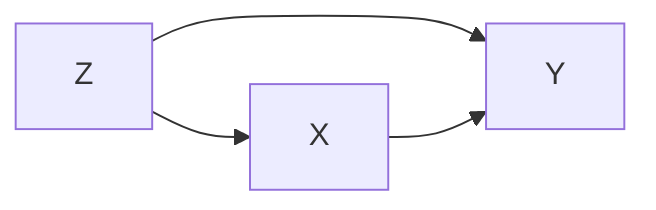
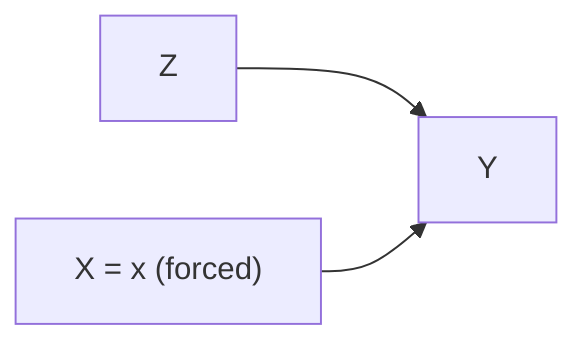

# Lesson 17: Structural Causal Models (SCMs)

## Where We Left Off

[Lesson 16](lesson-16-connecting-dags-and-potential-outcomes.md) compared the two languages of this course, DAGs and potential outcomes, and found that a DAG is silent about some assumptions. A DAG records which arrows exist and nothing more. Positivity was the clearest casualty: two studies can share one graph and differ completely on whether any treated patient and any untreated patient share an age.

That silence is a clue about where to look next. If a graph cannot answer the question, the answer must live in something the graph leaves out. What a graph leaves out is the *content* of each arrow — not which variables feed into a variable, but what is done with those inputs.

This lesson goes beneath the arrows to recover that content. A **Structural Causal Model** specifies the mechanism that generates each variable. The DAG then turns out to be something derived *from* the structural causal model, rather than a separate object standing alongside the equations.

> [!NOTE]
> **Notation used throughout.** This lesson keeps the roles fixed from earlier lessons: $X$ is the **treatment**, $Y$ is the **outcome**, and $Z$ is an observed **covariate or confounder**. Exogenous variables are written $U$ with the matching subscript, so $U_X$ is the exogenous variable feeding the equation for $X$.

---

## What an SCM Is

A **Structural Causal Model (SCM)** specifies the exact mechanism by which each variable in a system is generated. Formally (*Primer*, §1.5), an SCM consists of three parts:

* a set $U$ of **exogenous** variables, determined outside the model — background factors, noise, error terms. Exogenous variables are the ultimate sources of variation.
* a set $V$ of **endogenous** variables, determined inside the model by the other variables of the model;
* a set $F$ of functions, one function $f_i$ per endogenous variable $V_i$, assigning $V_i$ a value from the values of the other variables in $U \cup V$. The variables that $f_i$ actually reads are the **parents** of $V_i$.

Note what the three-part list does **not** contain: a graph. An SCM is the equations. The DAG is derived *from* the SCM, rather than being a separate object standing alongside the equations.

> [!NOTE]
> As we'll discuss later in this lesson, an SCM consisting only of the equations, as defined here, is called a **bare SCM**. But this definition is sufficient for the discussion that follows.

One condition is assumed throughout this course and is worth stating once. The equations must be **recursive**: the endogenous variables can be ordered so that each function reads only variables earlier in the ordering. Recursiveness is what rules out a pair of equations such as $X := f_X(Y, U_X)$ together with $Y := f_Y(X, U_Y)$, in which each variable waits on the other and neither is ever computed. Recursiveness is also what makes the derived graph *acyclic*, and therefore a DAG rather than a general directed graph. Models with feedback loops exist and are studied, and models with feedback loops sit outside the *Primer*'s scope.

---

## The Anatomy of an SCM

Each function in $F$ is written as a **structural equation**:

$$Y := f_Y(X, U_Y)$$

In this equation $Y$ and $X$ are endogenous variables (members of $V$), $U_Y$ is an exogenous variable (a member of $U$), and $f_Y$ is the deterministic rule that generates $Y$. The symbol $:=$ is deliberate.

> [!IMPORTANT]
> **The Equals Sign Carries No Causal Information ($=$ vs. $:=$):**
> In algebra, $Y = X$ says exactly what $X = Y$ says. Equality is symmetric, so an equals sign **cannot** encode a direction, and no arrangement of an ordinary equation will ever express "X causes Y". SCMs therefore borrow the assignment operator from programming. The equation $Y := f_Y(X, U_Y)$ reads "Y is *generated by* X and $U_Y$", and the assignment cannot be flipped. Changing $X$ changes $Y$; changing $Y$ does not change $X$. (Some texts write $Y \leftarrow f_Y(X, U_Y)$ for the same idea. Pearl uses $:=$, and this lesson follows Pearl.)

Every structural equation is **deterministic**. Randomness enters an SCM only through the exogenous variables: fix the values of $U$, and every endogenous variable is then determined. A bare SCM $(U, V, F)$ therefore describes *mechanisms*, and a bare SCM fixes no probabilities at all.

To obtain probabilities, a distribution $P(U)$ over the exogenous variables must also be specified. The equations $(U, V, F)$ together with $P(U)$ — a combination often called a **probabilistic causal model** — induce a distribution over every endogenous variable, and therefore the full observational distribution $P(V)$.

### Three Things That All Get Called "The Model"

The **bare SCM**, the **probabilistic causal model**, and the **data** are easy to run together, so it helps to separate all three on a concrete case. Suppose a doctor prescribes a drug when a patient looks severe enough, tempered by something never recorded — say how worried the patient seemed that morning. Write the prescribing rule as an equation:

$$X := f_X(Z, U_X)$$

**1. Bare SCMs: The equations give the rule, not how often the rule fires.**

The equation states how the prescribing decision gets made: feed in severity and the unrecorded factor, and out comes a prescribe-or-not. The equation does *not* state how often worried patients walk through the door. Until the frequency of worried patients is stated, the fraction of severe patients who end up treated is unknown. If worried patients are common, perhaps 90% of severe patients get the drug. If worried patients are rare, perhaps 50% get the drug. **The equation is identical in both cases.** So no question phrased as a probability, positivity among them, can be answered from the equations alone.

**2. Probabilistic Causal Models: Adding $P(U)$ pins the probabilities down, on paper.**

Now state the missing piece: 30% of patients arrive worried. That statement is $P(U_X)$, the distribution of the one exogenous variable feeding the prescribing rule. With $P(U_X)$ in hand the propensity $P(X=1 \mid Z=z)$ follows by arithmetic — from the equation $f_X$ *and* that distribution together, since a distribution over inputs yields nothing until a rule says what the inputs produce. Note where the propensity came from. The propensity was calculated from an assumption. The propensity was not measured. Nobody looked at a patient.

**3. The Data: The data is the only part that comes from the world.**

Finally there are the 400 actual patients. Even when the true propensity is $0.9$, the 50 severe patients will not split exactly 45/5 — the observed split might be 47/3, or 43/7. The data is evidence *about* the probabilities. The data is not the probabilities.

| | What you have | What it can tell you | Where it came from |
| :--- | :--- | :--- | :--- |
| **Bare SCM** | The equations $(U, V, F)$ | How each variable is computed | You asserted the equations based on domain knowledge |
| **Probabilistic causal model** | The equations plus $P(U)$ | Every probability, including $P(X=1 \mid Z=z)$ | You assert $P(U)$ as well from domain knowledge; it's not measured |
| **Data** | $n$ observed rows | How the counts actually fell out this time | You collected the data from real-world |

The short version, which returns at the end of the lesson: **probabilities are assumed; counts are observed.** A probabilistic causal model yields $P(X=1 \mid Z=z)$ without anyone collecting data. That model still cannot report how many of *your* severe patients were treated. Only counting reports that.

> [!NOTE]
> **A fourth phrase that is not a fourth thing: "fully specified".** The literature calls a model **fully specified**, which invites a search for a third kind of object. A fully specified SCM *is* a probabilistic causal model — one whose $P(U)$ has been given completely enough to determine $P(V)$.
>
> Completeness here is a real requirement rather than a formality. Stating that the exogenous variables are mutually independent with mean $0$ and variance $1$ names two moments and stops there, which leaves $P(V)$ undetermined, because many distributions share those two moments. Adding that each exogenous variable is Gaussian finishes the job. The first version is a probabilistic causal model with $P(U)$ only partly pinned down. The second version is the same object with $P(U)$ pinned down fully. Neither version is a new category.
>
> This lesson therefore keeps to **bare SCM** and **probabilistic causal model** throughout, and uses "fully specified" only as an adjective describing $P(U)$. The worked example later in the lesson writes the equations first as a bare SCM, then adds $P(U)$ to obtain a probabilistic causal model, and names the Gaussian family rather than the moments alone so that $P(V)$ is genuinely determined.

### But Where Does $P(U)$ Come From?

Calling $P(U)$ **posited** means that $P(U)$ is written down as part of the model, exactly as the equations are written down. $P(U)$ is something the analysis starts from, not something the analysis produces.

Positing a distribution can sound like sleight of hand, as though the 30% figure were simply invented, so it is worth stating exactly what is and is not being claimed.

**Data may certainly be used to choose $P(U)$.** Nothing forbids pulling last year's records, finding that 30% of patients arrived worried, and setting $P(U_X)$ to match. Choosing a distribution this way is ordinary statistical estimation, and a careful analyst would do exactly that.

**What data cannot do is serve twice.** Suppose the 30% figure came out of last year's records. A model built on that figure will then agree with those same records no matter what, because the analyst arranged the agreement. Such agreement is a consequence of how the model was built, not evidence that the model is correct. To learn anything, the check must run against observations the model has not already absorbed.

Data therefore plays either of two roles, and the mistake is losing track of which role is in play:

| Role | What you are doing | What the data can tell you |
| :--- | :--- | :--- |
| **Building** | Choosing the parts of the model, $P(U)$ among them | Nothing yet — you are writing the claim, not testing the claim |
| **Checking** | Comparing a finished model's predictions against unseen observations | Whether the claim survives contact with the world |

A third limit sits beneath both roles, and the third limit is the severe one. The building-versus-checking distinction still assumes that a sufficiently honest check would eventually decide the question. Sometimes no check can, at any sample size. The reason is the **Observational Equivalence** property that pairs of models can have:

> [!IMPORTANT]
> **Observational equivalence.** Two SCMs $M_1$ and $M_2$ are **observationally equivalent** when both imply *exactly the same* observational distribution:
> $$P_{M_1}(V) = P_{M_2}(V)$$
> Such a pair agrees on every quantity a sample can report — every mean, every correlation, every conditional probability — and can still disagree about what an intervention would do, so that $P_{M_1}(V \mid do(x)) \neq P_{M_2}(V \mid do(x))$. The agreement is about the observable question and the disagreement is about the causal one, which is why no sample, however large, separates the pair. Where observational equivalence holds, the data is silent by construction, not by shortage.

That silence has limits, and the limits are worth knowing before the idea is over-generalized.

> [!WARNING]
> **Silent about some structure, not about all of it.** Observational equivalence is a property of *particular pairs* of models, not a blanket verdict that data reveals nothing about causal structure. Data does constrain the graph, and the constraint has a sharp boundary. Using the three-node vocabulary of [Lesson 03](../Part-1/lesson-03-paths-chains-forks.md): a chain $X \to Y \to Z$ and a fork $X \leftarrow Y \to Z$ imply the same independence $X \perp Z \mid Y$ and are therefore inseparable, whereas the collider $X \to Y \leftarrow Z$ implies the opposite pattern — $X \perp Z$ unconditionally, $X \not\perp Z \mid Y$ — and no other structure on those three variables produces it. Colliders are visible in data; chains and forks are not. [Lesson 41](../Part-7/lesson-41-causal-discovery-from-observational-data.md) makes the boundary precise: observational data identifies the graph up to its **Markov equivalence class**, never further.

This is the machinery behind a claim made earlier: [Lesson 11](lesson-11-ignorability-exchangeability-and-randomization.md) states that exchangeability can never be verified from data, and can only be justified by how the study was designed. Observational equivalence explains why.

Consider the following two models (each built from rival accounts of one treatment and one outcome):

| | Structure | What it says about the observed association |
| :--- | :--- | :--- |
| **Model 1** | **Confounded** — an unmeasured $U$ feeds both $X$ and $Y$ | Partly spurious: some of the association is the common cause, not the treatment |
| **Model 2** | **Unconfounded** — $X \to Y$ only, with independent noise | Entirely causal: all of the association is the treatment |

The two models contradict each other about the effect of $X$ on $Y$, and both reproduce the observed data exactly. For the pair $(X, Y)$ alone, Model 2 can *always* be built to match Model 1: take the conditional $P(y \mid x)$ that Model 1 implies, then write $X := U_X$ and $Y := f_Y(X, U_Y)$ with independent noise chosen to reproduce that same conditional. The construction never fails. A bivariate association therefore cannot certify whether that association is confounded, and observed covariates constrain the rivals without ever eliminating them — which is why exchangeability is defended by appeal to the design of a study rather than demonstrated from a sample.

The consequence for practice is a change in what the analyst is doing. The analyst is not waiting on better measurements, and no larger sample is coming to help. The analyst is choosing between models that no quantity computed from the data can rank.

An assumption in this position is called **untestable**, the term [Lesson 06](../Part-1/lesson-06-foundations-synthesis.md) used when it observed that neither framework reaches a causal conclusion without assumptions of this kind. No observation can contradict an untestable assumption, because every rival model that the assumption rules out fits the data equally well. Untestable assumptions are settled by argument rather than by evidence — by how the treatment was assigned, and by subject-matter knowledge of the mechanism that assigned it. The term returns in Part 6, where [Lesson 36](../Part-6/lesson-36-bounds-on-causal-effects.md) stops trying to discharge the untestable assumption and instead reports how much the conclusion could move if the assumption were wrong.

<strong>The smallest possible pair of observationally equivalent SCMs</strong>

Take two variables and two rival stories about which one causes the other.

$$
\begin{aligned}
\textbf{Model A:}\quad X &:= U_X, & Y &:= X + U_Y \\
\textbf{Model B:}\quad Y &:= U_Y', & X &:= \tfrac{1}{2}Y + U_X'
\end{aligned}
$$

Let every exogenous variable be Gaussian with mean $0$; set $\operatorname{Var}(U_X) = \operatorname{Var}(U_Y) = 1$ in Model A, and $\operatorname{Var}(U_Y') = 2$, $\operatorname{Var}(U_X') = \tfrac{1}{2}$ in Model B.

Both models produce a mean-zero Gaussian pair with the same three moments. Working each column downward verifies the match:

| Quantity | Model A ($X \to Y$) | Model B ($Y \to X$) |
| :--- | :--- | :--- |
| $\operatorname{Var}(X)$ | $\operatorname{Var}(U_X) = 1$ | $\tfrac{1}{4}\operatorname{Var}(Y) + \operatorname{Var}(U_X') = \tfrac{1}{4}(2) + \tfrac{1}{2} = 1$ |
| $\operatorname{Var}(Y)$ | $\operatorname{Var}(X) + \operatorname{Var}(U_Y) = 1 + 1 = 2$ | $\operatorname{Var}(U_Y') = 2$ |
| $\operatorname{Cov}(X, Y)$ | $\operatorname{Cov}(X,\, X + U_Y) = \operatorname{Var}(X) = 1$ | $\operatorname{Cov}(\tfrac{1}{2}Y + U_X',\, Y) = \tfrac{1}{2}\operatorname{Var}(Y) = 1$ |

A mean-zero joint Gaussian is fully described by its variances and covariance. All three agree, so the two models do not merely produce similar distributions — the distributions are **identical**.

The coefficients were not guessed. Each model uses the least-squares coefficient for the regression that matches its own arrow:

$$
\begin{aligned}
\text{Model A } (X \to Y): && \text{regress } Y \text{ on } X: && \frac{\operatorname{Cov}(X, Y)}{\operatorname{Var}(X)} &= \frac{1}{1} = 1 \\
\text{Model B } (Y \to X): && \text{regress } X \text{ on } Y: && \frac{\operatorname{Cov}(X, Y)}{\operatorname{Var}(Y)} &= \frac{1}{2}
\end{aligned}
$$

Neither regression is the *right* one. Each is simply the best linear fit in the direction its own model assumes, and each model then picks the noise variance needed to account for whatever that fit leaves over. The recipe always succeeds in the linear-Gaussian setting, so this pair is not a contrivance but the typical situation.

Yet the two models disagree completely about what matters. Model A says intervening on $X$ moves $Y$; Model B says intervening on $X$ moves nothing, because in Model B the arrow runs the other way. The causal question has two opposite answers and the data has no opinion. This is the whole reason causal inference needs assumptions that come from outside the data: something other than the sample must pick between $X \to Y$ and $Y \to X$.

**One word in the setup is carrying the result.** The construction above required the exogenous variables to be **Gaussian**, and the requirement is not a convenience. By the Darmois–Skitovich theorem, if two linear combinations of independent variables are themselves independent, the shared components must be Gaussian. Run the contrapositive: with *non-Gaussian* noise, no model in the reversed direction can reproduce the distribution generated by the true one, because the reversed model's residual would have to be independent of its input and Darmois–Skitovich forbids it. Here — unlike in the Gaussian pair above — "true" and "reversed" are meaningful labels, because only one of the two directions can now account for the data. The direction becomes recoverable from observational data alone, and visibly so: fitting the reversed direction leaves residuals that are structurally dependent on the regressor. [Lesson 41](../Part-7/lesson-41-causal-discovery-from-observational-data.md) develops this as **LiNGAM**.

So the lesson of this aside is narrower than "direction is unknowable", and more useful. Linear-Gaussian systems hide their direction. Departures from that setting — non-Gaussian noise, nonlinear mechanisms — can leak it.

The distinction matters, rather than being a technicality. When a researcher reports a causal effect, part of the report is derived from data and part of the report is assumed. Keeping derivation and assumption separate is what lets a reader see which parts must be taken on trust.

---

## Where the DAG Comes From

The causal graphs of Lessons 02–16 are not a separate ingredient. Those graphs are **derived** from the SCM. For each equation, draw an arrow into the variable on the left from every *endogenous* variable on the right:

$$
\begin{aligned}
Z &:= f_Z(U_Z) && \text{no arrows into } Z \\
X &:= f_X(Z, U_X) && Z \to X \\
Y &:= f_Y(X, Z, U_Y) && X \to Y,\; Z \to Y
\end{aligned}
$$

The result is the familiar confounding triangle, which Pearl calls the graph *associated with* the SCM:

*Caption: the graph associated with the three equations above. $Z$ is the confounder, $X$ the treatment, $Y$ the outcome. The three exogenous variables $U_Z$, $U_X$, $U_Y$ are not drawn.*

Exogenous variables are conventionally left off the drawing when the exogenous variables are mutually independent. That convention is why $Z$, whose only input is $U_Z$, appears with no arrows into $Z$ at all.

> [!IMPORTANT]
> **The convention is a claim, not just a tidiness measure.** Omitting $U$ from the drawing asserts that the exogenous variables are mutually independent. A model carrying that assertion is called **Markovian**. When two exogenous variables are *not* independent — say $U_X$ and $U_Y$ share an unmeasured common cause — the dependence is a confounding path that the arrows alone do not show, and erasing the dependence from the drawing would be erasing a real back-door path. Such a model is called **semi-Markovian**, and the dependence is drawn explicitly as a dashed bidirected arc $X \leftrightarrow Y$. So a graph with no $U$ anywhere on it is making an independence claim silently. [Lesson 25](../Part-3/lesson-25-causal-inference-in-linear-systems.md) returns to the dashed double arrow when unmeasured common causes block the usual route and an instrumental variable is needed instead.

### Worked example: a probabilistic causal model in numbers

Every equation so far has been an abstract $f$. Here is the same confounding triangle with the functions filled in, so the machinery can be run end to end. Let $Z$ be disease severity, $X$ treatment, $Y$ recovery score:

$$
\begin{aligned}
Z &:= U_Z \\
X &:= 2Z + U_X \\
Y &:= 5X + 3Z + U_Y
\end{aligned}
$$

Those three equations are the **bare SCM**. Turning the bare SCM into a **probabilistic causal model** means adding $P(U)$:

$$U_Z,\; U_X,\; U_Y \;\; \text{mutually independent}, \qquad U_i \sim \mathcal{N}(0, 1)$$

Two details in that line are doing real work. First, the *family* is named, not just the moments. Mean $0$ and variance $1$ would fix the covariances computed below, and would still leave $P(V)$ undetermined, since many distributions share those two moments. Declaring the exogenous variables Gaussian is what pins down the whole observational distribution. Second, the independence is **mutual**, not merely pairwise — the Markovian condition from the callout above, and what licenses omitting $U_Z$, $U_X$ and $U_Y$ from the drawn graph.

**The bare SCM, the equations alone,** already gives the graph — $Z \to X$, $Z \to Y$, $X \to Y$ — and already tells us that pushing $X$ up by one unit pushes $Y$ up by five, because $f_Y$ has a coefficient of $5$ on $X$. That is the causal effect, and reading the causal effect off required no data.

**The probabilistic causal model, the equations plus $P(U)$,** gives probabilities. The question is what a regression of $Y$ on $X$ would report, and the answer is not $5$. The computation runs in four steps.

**Step 1 — write every endogenous variable in terms of $U$ alone.** Substitute downward through the equations, starting from $Z := U_Z$:

$$
\begin{aligned}
Z &= U_Z \\
X &= 2Z + U_X = 2U_Z + U_X \\
Y &= 5X + 3Z + U_Y = 5(2U_Z + U_X) + 3U_Z + U_Y = 13U_Z + 5U_X + U_Y
\end{aligned}
$$

The coefficient $13$ collects two routes from $U_Z$ to $Y$: the indirect route through $X$ contributing $5 \times 2 = 10$, and the direct route contributing $3$.

**Step 2 — compute $\operatorname{Var}(X)$.** Because $U_Z$ and $U_X$ are independent, the cross term vanishes:

$$
\begin{aligned}
\operatorname{Var}(X) &= \operatorname{Var}(2U_Z + U_X) \\
&= 2^2 \operatorname{Var}(U_Z) + \operatorname{Var}(U_X) + 2 \cdot 2 \cdot \operatorname{Cov}(U_Z, U_X) \\
&= 4(1) + 1 + 0 \\
&= 5
\end{aligned}
$$

**Step 3 — compute $\operatorname{Cov}(X, Y)$.** Expand bilinearly across all six pairs. Every pair of *distinct* exogenous variables has covariance $0$, so only the matching pairs survive:

$$
\begin{aligned}
\operatorname{Cov}(X, Y) &= \operatorname{Cov}(2U_Z + U_X,\;\; 13U_Z + 5U_X + U_Y) \\
&= \underbrace{2 \cdot 13 \operatorname{Var}(U_Z)}_{U_Z \text{ with } U_Z} + \underbrace{2 \cdot 5 \operatorname{Cov}(U_Z, U_X)}_{= \, 0} + \underbrace{2 \operatorname{Cov}(U_Z, U_Y)}_{= \, 0} \\
&\quad + \underbrace{13 \operatorname{Cov}(U_X, U_Z)}_{= \, 0} + \underbrace{5 \operatorname{Var}(U_X)}_{U_X \text{ with } U_X} + \underbrace{\operatorname{Cov}(U_X, U_Y)}_{= \, 0} \\
&= 26(1) + 5(1) \\
&= 31
\end{aligned}
$$

**Step 4 — form the regression slope.**

$$\text{slope} = \frac{\operatorname{Cov}(X, Y)}{\operatorname{Var}(X)} = \frac{31}{5} = 6.2$$

Two numbers are now on the table, and keeping the two straight is the point of the example:

| Number | What it is | Where it came from | Needs data? |
| :--- | :--- | :--- | :--- |
| $5$ | **Causal effect** of $X$ on $Y$ — forcing $X$ up one unit raises $Y$ by five | The coefficient on $X$ in the equation $f_Y$ | No — read off the bare SCM |
| $6.2$ | **Observed association** — what a regression of $Y$ on $X$ reports | $\operatorname{Cov}(X, Y) / \operatorname{Var}(X)$, computed from the equations *and* $P(U)$ | No — but it is the quantity data would estimate |
| $1.2$ | **Confounding bias** — the difference between the two ($6.2 - 5 = 1.2$) | The open back-door path $X \leftarrow Z \to Y$ | — |

Neither number describes an effect of $U_X$. $U_X$ is the noise term inside $X$'s own equation, and $U_X$ has no arrow into $Y$ at all. What $U_X$ controls is the share of $X$'s variation that is *free* of $Z$, which is why changing $\operatorname{Var}(U_X)$ below moves the bias without touching the causal effect.

That $1.2$ is the Confounding Bias [Lesson 10](lesson-10-why-association-is-not-causation.md) named in its equation $\text{Observational Difference} = \text{Causal Effect} + \text{Bias}$, appearing here on the regression-slope scale rather than as a difference of two means, because treatment is continuous in this example. Its size depends on how much variance $U_Z$ contributes relative to $U_X$.

> [!CAUTION]
> The $5$ in that denominator is $\operatorname{Var}(X)$, and is not the causal effect, which is also $5$. The collision is an accident of the numbers chosen. The causal effect $5$ is the coefficient on $X$ inside $f_Y$; the $\operatorname{Var}(X) = 5$ is a consequence of $P(U)$.

To see that dependence, change one number in $P(U)$ and leave every equation untouched. Say, we set $\operatorname{Var}(U_X) = 100$, keeping $\operatorname{Var}(U_Z) = \operatorname{Var}(U_Y) = 1$. Steps 1 and 3's structure are unchanged, since no coefficient moved; only the variance values differ:

$$
\begin{aligned}
\operatorname{Var}(X) &= 4 \operatorname{Var}(U_Z) + \operatorname{Var}(U_X) = 4(1) + 100 = 104 \\
\operatorname{Cov}(X, Y) &= 26 \operatorname{Var}(U_Z) + 5 \operatorname{Var}(U_X) = 26(1) + 5(100) = 526 \\
\text{slope} &= \frac{526}{104} = 5.058\ldots
\end{aligned}
$$

The slope has moved from $6.2$ to roughly $5.06$, close to the true causal effect of $5$ — and not one equation changed, so the derived graph is identical in both cases. The reason is visible in the two lines above: the confounding contribution $26\operatorname{Var}(U_Z)$ stayed fixed while the non-confounded contribution $5\operatorname{Var}(U_X)$ grew a hundredfold, so the confounded share of the association was diluted. This is the lesson's central point in arithmetic form. **The graph fixes which terms appear; $P(U)$ fixes how large each term is.**

The derivation runs in one direction only. A graph records **which** variables each function takes as input, but not **what** each function does with those inputs. Many different SCMs therefore share a single DAG: $Y := 2X + Z + U_Y$ and $Y := X^2 Z + U_Y$ both yield exactly the arrows $X \to Y$ and $Z \to Y$. Given the equations, the graph is determined; given only the graph, the equations are not. An SCM therefore carries strictly more information than the DAG of that SCM.

A DAG was sufficient for every earlier lesson, because the back-door criterion asks only which arrows exist, never what functions lie behind the arrows. The same limit explains why a graph could not settle positivity in [Lesson 16](lesson-16-connecting-dags-and-potential-outcomes.md): positivity is a claim about the propensity $P(X=1 \mid Z=z)$, and fixing the arrows does not fix that propensity. The lesson returns to positivity once interventions are in place.

---

## Interventions in SCMs (Replacing Equations)

The payoff for descending to the level of equations is that intervention becomes a precise operation rather than a metaphor. Setting a variable with the do-operator, for example $do(X=x)$, **replaces** the structural equation for that variable:

* **Observational SCM:**
    $$
    \begin{aligned}
    Z &:= f_Z(U_Z) \\
    X &:= f_X(Z, U_X) \\
    Y &:= f_Y(X, Z, U_Y)
    \end{aligned}
    $$
* **Interventional SCM ($do(X=x)$):**
    $$
    \begin{aligned}
    Z &:= f_Z(U_Z) \\
    X &:= x \\
    Y &:= f_Y(X, Z, U_Y)
    \end{aligned}
    $$

The mechanism that determined $X$, namely the equation $f_X$, is erased and replaced by the constant $x$. Every other equation is left untouched, and that is what makes an intervention *surgical*. Note in particular that $f_Y$ is unchanged: the way $Y$ responds to its inputs is a property of the world, and forcing $X$ does not renegotiate that property. This invariance is exactly what makes interventional predictions possible at all.

Deriving the DAG of the modified model by the rule above, $X$ now has no endogenous inputs, so the arrows into $X$ vanish:

*Caption: before the intervention. $X$ is generated by $f_X$, so $Z \to X$ is present.*

*Caption: after $do(X = x)$. Replacing one equation deletes one arrow. The edge $Z \to X$ is gone because $f_X$ is gone; the edges out of $X$ survive because $f_Y$ survives.*

The result is exactly the edge-severing seen in [Lesson 04](../Part-1/lesson-04-randomization-vs-observation.md), where randomization cut $Z \to X$ by taking the assignment decision away from nature. The difference is in standing. In Lesson 04 the cut was asserted as a rule about what randomization does. Here the cut is *derived*: it falls out of replacing an equation, with no separate graphical postulate required. [Lesson 18](../Part-3/lesson-18-the-do-operator-and-graph-surgery.md) gives this operation its name, the do-operator, and builds the rest of Part 3 on it.

---

## Does an SCM Settle Positivity?

With interventions in place, the lesson can return to the gap left at the end of the DAG section. Positivity is the claim that $0 < P(X=1 \mid Z=z) < 1$ at every $z$ the covariate actually takes, so settling positivity means fixing the propensity. Whether an SCM fixes the propensity depends on how much of the model has been written down.

A **bare SCM** $(U, V, F)$ does not settle positivity in general. The equations state how $X$ is computed from $Z$ and $U_X$, and the equations say nothing about how often each value of $U_X$ occurs. The same mechanism yields a propensity of $0.5$ or a propensity of $0.99$, depending on how $U_X$ is distributed.

A **probabilistic causal model**, $(U, V, F)$ together with $P(U)$, does settle positivity. The equations and $P(U)$ jointly determine the entire observational distribution, and the propensity is one feature of that distribution.

The weight in that second claim rests on $P(U)$ being genuinely given, rather than merely constrained. Naming moments is not naming a distribution, and the difference decides positivity rather than affecting it at the margin.

> [!WARNING]
> **Constraining $P(U)$ is not specifying $P(U)$.** Take a treatment assigned by a threshold rule, and give the noise a mean and a variance but no family:
> $$X := \mathbb{1}[\,Z + U_X > 0\,], \qquad \mathbb{E}[U_X] = 0, \;\; \operatorname{Var}(U_X) = 1$$
> Two candidate families satisfy those moments exactly, and disagree about positivity:
>
> | $P(U_X)$ | $P(X = 1 \mid Z = z)$ | At $z = 2$ | Positivity |
> | :--- | :--- | :--- | :--- |
> | $\mathcal{N}(0, 1)$ | $\Phi(z)$ | $0.977$ | **Holds** — strictly inside $(0,1)$ at every $z$ |
> | Uniform on $[-\sqrt{3}, \sqrt{3}\,]$ | $0$, $\tfrac{z + \sqrt 3}{2\sqrt 3}$, or $1$ | $1$ | **Fails** — saturates once $z > \sqrt{3}$ |
>
> Same equation, same mean, same variance, opposite verdicts. A moments-only description is therefore not a probabilistic causal model at all; it is a *family* of them, and positivity can hold in some members and fail in others. This is the point of the "fully specified" note earlier in the lesson, now with a consequence attached: naming the family is not bookkeeping, because the family is what decides the answer.

In practice a probabilistic causal model buys less than first appears, for three reasons. First, the true model is never handed to the analyst; the true model is precisely what the analyst is assuming, so deriving positivity from an assumed model relocates the assumption rather than discharging the assumption. Second, the propensity can be estimated directly by tabulating the data, which is a far shorter route to the same number. Third, even a true model yields population probabilities, never the counts in the particular sample at hand, so the practical-positivity question of [Lesson 13](lesson-13-positivity-overlap-and-extrapolation.md) stays empirical either way.

One exception is genuinely useful, because the exception runs in the opposite direction and needs only the *bare* SCM. Suppose the equation for treatment carries **no exogenous term**:

$$X := f_X(Z) \qquad \text{(no } U_X \text{)}$$

Then $X$ is a deterministic function of $Z$, so $P(X=1 \mid Z=z)$ equals $0$ or $1$ at every $z$, and positivity fails outright — with no data and no $P(U)$ required.

That is what makes the exception worth having. The verdict holds *whatever* distribution the exogenous variables turn out to have, so no argument about $P(U)$ can rescue the study. The deterministic equation is the over-65 prescription rule of [Lesson 13](lesson-13-positivity-overlap-and-extrapolation.md), written structurally.

Note also what a graph would have missed here. A DAG draws $Z \to X$ in exactly the same way whether or not a noise term sits behind $X$. The presence or absence of $U_X$ decides positivity, and the presence or absence of $U_X$ is precisely what a DAG discards.

Collecting the verdicts:

| What you have | Settles positivity? |
| :--- | :--- |
| A **DAG** | No — arrows are identical with or without $U_X$ |
| A **bare SCM**, treatment equation *with* $U_X$ | No — the propensity depends on $P(U_X)$, which is absent |
| A **bare SCM**, treatment equation *without* $U_X$ | **Yes, negatively** — positivity fails, under any $P(U)$ |
| A **partial $P(U)$** (moments but no family) | No — rival families give opposite verdicts |
| A **probabilistic causal model** with $P(U)$ given | Yes in principle — but $P(U)$ was assumed, not measured |
| **Data** | Yes, for the sample you actually have — by tabulating |

> [!NOTE]
> **Disproof is structural; proof is empirical.** A bare SCM can demonstrate that positivity *fails*, by showing that treatment is assigned deterministically from its parents — a verdict that survives any choice of $P(U)$. A bare SCM cannot demonstrate that positivity *holds*, because holding depends on $P(U)$, and $P(U)$ is assumed rather than known. Checking overlap in the data remains the working procedure.

> [!NOTE]
> [My View:] Proving/Disproving positivity requires a fully specified SCM; unless the treatment equation is deterministic, in which case, positivity can be ruled out.

---

## What the Equations Buy That the Graph Cannot

It is worth naming what has been gained, because the gain is larger than positivity.

A DAG answers questions about *which* variables are connected. An SCM answers questions about *what happens to a number*. That difference opens a level of question that was unavailable before. Consider a patient who took the drug and recovered, and ask: would that same patient have recovered had the drug been withheld? No amount of arrow-reading answers this. The question is about one individual, and what pins an individual down inside an SCM is the individual's values of $U$ — the background factors that make that patient that patient.

An SCM answers the question in three moves: read off the values of $U$ consistent with what was observed, replace the equation for $X$ as an intervention requires, then recompute $Y$ from the *unchanged* remaining equations. The same $U$ carries across both worlds, which is what makes the comparison a comparison of one patient rather than of two groups. Part 4 takes this up, opening with the motivating puzzle in [Lesson 26](../Part-4/lesson-26-counterfactuals-the-freeway-problem.md); the three moves above are named **abduction, action, and prediction** and worked through in [Lesson 27](../Part-4/lesson-27-computing-counterfactuals-from-scms.md).

| Question type | What it asks | Does a DAG suffice? |
| :--- | :--- | :--- |
| **Associational** | $P(Y \mid X)$ — what do I see? | The graph tells you which associations exist, not their size |
| **Interventional** | $P(Y \mid do(X))$ — what if I act? | Yes, for *identification*: the back-door criterion needs only arrows |
| **Counterfactual** | $Y_x$ for a unit with known history — what if I had acted? | **No** — requires the functions and the unit's $U$ |

This is why the index calls an SCM the machine that generates both the graphs and the counterfactuals. The graph is what the SCM looks like from a distance; the counterfactuals are what the SCM can do up close.

---

## Summary and Key Takeaways

1. **An SCM Is the Equations:** $(U, V, F)$ — exogenous variables, endogenous variables, and one deterministic function per endogenous variable. No graph appears in the definition.
2. **The DAG Is Derived, Not Given:** draw an arrow into each left-hand variable from every endogenous variable on the right. A DAG is the qualitative shadow of an SCM.
3. **The Derivation Is One-Way:** a graph records which inputs each function takes, not what each function does with those inputs, so many SCMs share one DAG. Equations determine the graph; a graph never determines the equations.
4. **Randomness Lives Only in $U$:** every structural equation is deterministic. A bare SCM fixes no probabilities; adding $P(U)$ yields the full observational distribution. There are two model objects here and not three — "fully specified" describes how completely $P(U)$ has been written down, and a fully specified SCM is a probabilistic causal model.
5. **$P(U)$ Is Posited:** $P(U)$ is part of the model the analyst writes down, not a result the analysis produces. Data may be used to choose $P(U)$, but that same data cannot then serve as an independent check on the model. Some assumptions about $U$ cannot be checked at all, because observationally equivalent SCMs imply identical data.
6. **$:=$ Is Not $=$:** equality is symmetric and therefore cannot encode causal direction at all. The assignment operator can.
7. **Intervention Is Equation Replacement:** $do(X=x)$ erases $f_X$ and substitutes a constant, leaving every other equation intact. Deriving the graph afterwards reproduces the edge-cutting of [Lesson 04](../Part-1/lesson-04-randomization-vs-observation.md) as a consequence rather than as a postulate.
8. **Structure Disproves Positivity, Data Proves It:** a treatment equation with no exogenous term guarantees a positivity violation whatever $P(U)$ may be. Establishing that positivity *holds* remains an empirical check. A $P(U)$ pinned down only to its moments settles nothing either, since rival families matching those moments can return opposite verdicts.
9. **Omitting $U$ From the Drawing Is an Assumption:** a graph drawn without exogenous variables asserts that those variables are mutually independent (a *Markovian* model). Dependent exogenous variables must be drawn as bidirected arcs, or a real back-door path goes missing.
10. **Counterfactuals Need the Functions:** interventional questions can be identified from arrows alone, but a question about what *would have happened to one unit* needs the equations and that unit's values of $U$. This is the level of question a DAG cannot reach.
11. **Next Step:** [Lesson 18](../Part-3/lesson-18-the-do-operator-and-graph-surgery.md) names the equation-replacement operation the **do-operator**, separates conditioning from intervening, and begins the central project of Part 3 — computing $P(y \mid do(x))$ from observational data.

---

### Further Reading

*Ref*: *Causal Inference in Statistics: A Primer (2016)*, §1.5 (structural causal models and their associated graphs) and Chapter 3 (interventions).
