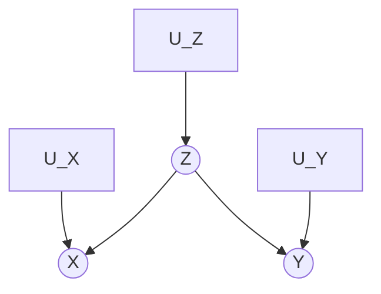
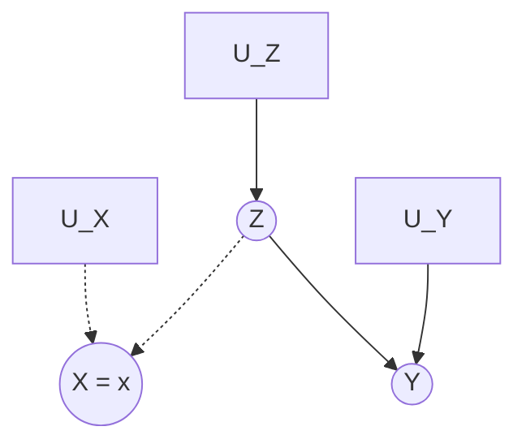
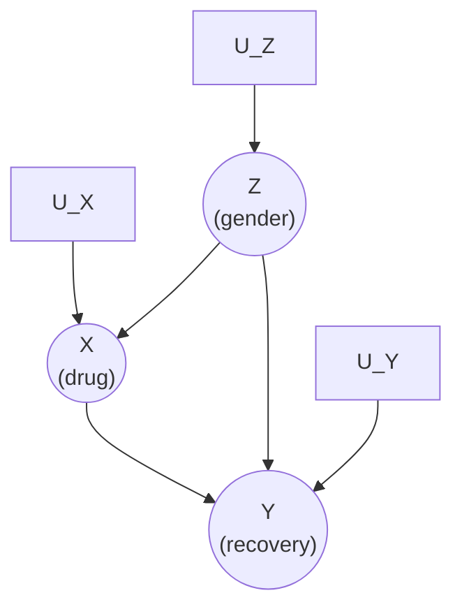
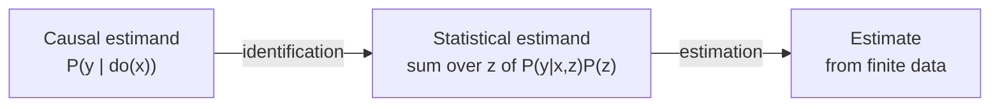

# Lesson 18: The Do-Operator and Graph Surgery

## Where We Left Off

Lesson 17 gave us **structural causal models (SCMs)**: the exact equations $Y := f_Y(X, U_Y)$ that generate each variable. An SCM is a *machine for answering questions*, and the most important questions it can answer are interventional: *what happens if we force $X$ to be $x$?* This lesson introduces the notation for those questions — the **do-operator** — and the graphical operation that answers them. From here through Lesson 24, we build the machinery that lets us compute interventional quantities from purely observational data.

## Observing Versus Doing

Many causal questions resist randomization. Temperature cannot be assigned to cities, and even a drug trial degrades when participants drop out or misreport their usage. When a randomized experiment is impractical, the evidence available is an **observational study**, and the challenge becomes untangling the causal from the merely correlative.

The distinction that makes this possible is simple to state:

> **When we intervene on a variable, we fix its value. We change the system, and the values of other variables often change as a result. When we condition on a variable, we change nothing; we merely narrow our focus to the subset of cases in which the variable takes that value. What changes is our perception of the world, not the world itself.**

Notation distinguishes the two. $P(Y = y \mid X = x)$ is the probability that $Y = y$ conditional on *finding* $X = x$ — a filter applied to data. $P(Y = y \mid do(X = x))$ is the probability that $Y = y$ when we *intervene* to make $X = x$ — a statement about a different world, in which everyone's $X$ is forced to $x$. In Neal's terminology, $P(y \mid do(x))$ is an **interventional distribution**; $P(y \mid x)$ is an observational one. Part 2 wrote the same interventional object in subscript form, $P(Y_x = y)$, and the two notations denote the same quantity: $P(Y_x = y) = P(Y = y \mid do(X = x))$. Lesson 16 established that translation. The equality holds for this quantity — the distribution of $Y_x$ in the population as a whole. It extends to conditional versions as well, since $P(Y_x = y \mid Z = z)$ equals $P(Y = y \mid do(X = x), Z = z)$ for a pre-treatment covariate $Z$. The subscript notation is nonetheless the more expressive of the two, because a do-expression describes a single intervened world, while $Y_x$ is a random variable defined per unit and several such variables can appear in one expression. The quantity $P(Y_x = y \mid X = x', Y = y')$ is an example: the subscript asks about treatment $x$, while the conditioning event records that treatment $x'$ was the one actually received. No single intervention produces both, so no do-expression states it. Part 4 takes up such counterfactual quantities.

| Operation | What changes | Graphical picture | Notation |
|---|---|---|---|
| Conditioning | Only our *focus*: we filter the data | No change to the graph | $P(Y = y \mid X = x)$ |
| Intervening | The *world*: we force a value | All arrows into $X$ are deleted | $P(Y = y \mid do(X = x))$ |

The rest of Part 3 is about one question: *when, and how, can an interventional quantity be computed from observational data?*

## Graph Surgery

Consider the ice cream sales model: $X$ is ice cream sales, $Y$ is crime rates, $Z$ is temperature, with $Z \to X$ and $Z \to Y$ (Primer Figure 3.1; Neal uses the analogous "getting lit" confounder for bar visits and fire deaths). Note what the model does **not** contain: there is no arrow $X \to Y$. Ice cream sales do not cause crime. The Primer calls this an extreme case, in which the correlation between $X$ and $Y$ is entirely spurious, and turns to the realistic case — a causal path *and* confounding — in Figure 3.3 below.

*Figure 3.1 (Primer): temperature ($Z$) confounds ice cream sales ($X$) and crime ($Y$).*

Suppose we intervene to make ice cream sales low — say, by shutting down all ice cream shops. We curtail the natural tendency of $X$ to vary in response to the rest of the system. Graphically, this is **surgery**: we remove all edges directed *into* $X$.

*Figure 3.2 (Primer): the model of Figure 3.1 after $do(X = x)$. The dotted edges $Z \to X$ and $U_X \to X$ are the ones the surgery deletes. $X$ is no longer generated by the model; it is held at the constant $x$.*

In this manipulated graph, the crime rate $Y$ is completely independent of ice cream sales $X$. Two separate facts produce the independence. First, the model contains no arrow $X \to Y$, so no causal path carries influence from ice cream sales to the crime rate. Second, the surgery deleted the arrow $Z \to X$, so ice cream sales no longer carry temperature's influence along the path $X \leftarrow Z \to Y$. Varying the level at which ice cream sales are held therefore transmits nothing to the crime rate: $P(Y = y \mid do(X = x)) = P(Y = y)$ for every value $x$. Contrast this result with conditioning. In the original graph the path $X \leftarrow Z \to Y$ is open, so $X$ and $Y$ are dependent, and *observing* high ice cream sales does raise the expected crime rate. Intervening and conditioning thus produce entirely different patterns of dependence in the same model. Note also where the deleted arrow came from: **the causal graph itself dictates which arrows any given intervention removes**. The surgery is not a modeling choice but a consequence of the causal structure already asserted.

This connects directly to Lesson 17: in the SCM, $do(X = x)$ *replaces the structural equation* $X := f_X(\text{parents}, U_X)$ with the constant $X := x$, leaving every other equation untouched. Graph surgery is the shadow of equation-replacement on the DAG. The resulting graph is called the **manipulated graph**.

## The Two Invariances

Why does surgery let us compute interventional quantities from observational data? Because the surgery leaves most of the system untouched, and whatever it *doesn't* touch keeps its pre-intervention behavior. To see this concretely, consider the **confounded drug model** (Primer Figure 3.3) — the same Simpson's paradox setup Lesson 03 introduced. A new drug $X$ (taken or not) may aid recovery $Y$ (recovered or not), but gender $Z$ confounds the comparison: women, who take the drug more often, also recover less often regardless of the drug (an estrogen effect). The full model with its error terms:

*Primer Figure 3.3: the confounded drug model — $Z$ (gender) affects both drug usage ($X$) and recovery ($Y$), so the backdoor path $X \leftarrow Z \to Y$ is open, on top of the causal path $X \to Y$.*

Imagine intervening to administer the drug uniformly: $do(X = 1)$ versus $do(X = 0)$. The surgery deletes every arrow into $X$ — both the confounding arrow $Z \to X$ and the error arrow $U_X \to X$ — and replaces $X$'s structural equation with the constant $X := 1$ or $X := 0$. A forced treatment carries no noise of its own. Every other mechanism survives untouched: the equation generating gender, $Z := f_Z(U_Z)$, with its error $U_Z$; and the equation generating recovery, $Y := f_Y(X, Z, U_Y)$, with its error $U_Y$. Two quantities therefore survive the surgery:

1. **The marginal distribution $P(Z = z)$ is invariant.** The process determining gender — $Z := f_Z(U_Z)$ — contains no reference to $X$, and neither deleted arrow points into $Z$. The proportions of males and females are the same before and after the intervention.
2. **The conditional $P(Y = y \mid Z = z, X = x)$ is invariant.** In symbols, $P_m(Y = y \mid Z = z, X = x) = P(Y = y \mid Z = z, X = x)$, where $P_m$ denotes the post-surgery distribution (of the modified model). The reason is that conditioning on $X = x$ and $Z = z$ fixes every parent of $Y$, so the only randomness remaining in $Y := f_Y(x, z, U_Y)$ is the error $U_Y$ — and the surgery changed neither the function $f_Y$ nor the distribution of $U_Y$. The recovery rate among patients of gender $z$ who take the drug is therefore the same number whether those patients chose the drug or were made to take it. The intervention changes only the *input* to the mechanism, never the *input–output rule* itself.

The second invariance is the assumption that the intervention has no **side effects**: assigning a drug to a patient does not *itself* alter how recovery responds to drug-and-gender. If it did — if being "assigned" the drug had a different effect than taking it voluntarily — invariance 2 would fail and no adjustment formula could be derived from the graph alone.

Together the two invariances mean that every ingredient of the intervened world is either unchanged or known: $P_m(Z) = P(Z)$ and $P_m(Y \mid Z, X) = P(Y \mid Z, X)$ are both readable from observational data, while $P_m(X)$ is fixed by us.

### Why the Conditioning Set Must Include $Z$

Invariance 2 is a claim about $P(Y \mid Z, X)$, not about the cruder quantity $P(Y \mid X)$. The distinction matters, so it is worth seeing why the cruder quantity fails. Expand it by the law of total probability:

$$P(Y = y \mid X = x) = \sum_z \underbrace{P(Y = y \mid X = x, Z = z)}_{\text{invariant}} \cdot \underbrace{P(Z = z \mid X = x)}_{\text{not invariant}}$$

The same expansion holds in the manipulated world:

$$P_m(Y = y \mid X = x) = \sum_z P(Y = y \mid X = x, Z = z) \cdot P_m(Z = z \mid X = x)$$

The first factor is identical in both expressions — that is exactly what invariance 2 asserts. The two expressions therefore differ only in the **weights** attached to each stratum $z$. And the weights do differ. The surgery deleted the arrow $Z \to X$, so $Z$ and $X$ are d-separated in the manipulated graph:

$$P_m(Z = z \mid X = x) = P_m(Z = z) = P(Z = z) \neq P(Z = z \mid X = x)$$

Read the final inequality carefully, because it is the definition of the problem. Gender and drug-taking are dependent in the observed world; that dependence *is* the confounding. Were $P(Z \mid X)$ equal to $P(Z)$, there would be nothing to adjust for.

One point is worth stating precisely, because two distributions are easily conflated here. The surgery alters nothing about the observed world. The conditional $P(Z = z \mid X = x)$ is a property of the data, and it remains exactly what it was, intervention or no intervention. What the surgery does is define a *second* distribution $P_m$, under which $X$ has no parents at all and therefore nothing links $X$ to $Z$. The comparison is thus between two distributions, not between one distribution before and after a change: the weight $P(Z = z \mid X = x)$ belongs to $P$, the weight $P_m(Z = z \mid X = x) = P(Z = z)$ belongs to $P_m$, and invariance 1 is what allows the marginal $P(Z = z)$ to be written without a subscript, since both worlds share it. Note also that $P_m(Z = z \mid X = x)$ is defined only at the value $x$ actually being set: under $do(X = x)$ the variable $X$ is a constant, so no other value of $X$ occurs in that world.

A concrete reading of the drug model makes the failure visible. Suppose the population is half women, but women take the drug more often, so that women make up 75% of drug-takers. The observational quantity $P(Y = 1 \mid X = 1)$ then weights the female recovery rate by $0.75$, the share of women *among drug-takers*. The interventional quantity $P(Y = 1 \mid do(X = 1))$ weights it by $0.50$, the share of women *in the population*, because under the intervention everyone takes the drug and the drug-takers are simply the population. So $P(Y = 1 \mid X = 1)$ and $P(Y = 1 \mid do(X = 1))$ are two different averages of the very same stratum-specific recovery rates, differing only in their weights — the drug acts identically on every patient in both worlds.

Now recall the estrogen effect from Lesson 03: women recover less often than men regardless of the drug. The observational number therefore over-represents the stratum that recovers poorly, and the drug looks worse than it is. When the distortion is severe enough, the comparison reverses outright — the drug raises the recovery rate for men, raises it for women, and yet appears to lower it for the combined population. That reversal between the stratum-specific comparisons and the aggregate one is **Simpson's paradox**, and the reweighting is its mechanism here.

A caution before leaving the example. Simpson's paradox is a statement about numbers, and confounding is only one of the causal structures that can produce it. The blood-pressure variant of Lesson 03 gives the same reversal with no confounding at all: there the drug *lowers* blood pressure, so $Z$ is an effect of the treatment rather than a common cause, and the graph reads $X \to Z \to Y$. In that model adjusting for $Z$ is the wrong move, because the adjustment blocks part of the very causal path being measured, and the aggregate table is the correct one. The reversal looks identical in both data sets. Only the causal graph distinguishes the case where the stratified table should be trusted from the case where the aggregate should be, which is exactly why identification needs a graph and not merely data.

This failure also shows the shape of the repair: keep the invariant factor and replace the bad weights with the good ones. Substituting $P(Z = z)$ for $P(Z = z \mid X = x)$ in the sum above yields the adjustment formula, derived in Lesson 19.

> [!IMPORTANT]
> **The two invariances are the engine of every identification argument.** An intervention severs arrows into one variable; every mechanism it does not touch remains exactly as it was. Identification is the art of rewriting a do-expression using only the surviving mechanisms. This "modularity" idea — that nature's mechanisms can be changed one at a time — is what Neal singles out as *the main assumption* behind interventions, and what Pearl formalizes as the foundation of the entire do-calculus (Lesson 24).

## Randomization as Nature's Surgery

Note what happens when the variable we intervene on has **no arrows into it** to begin with — the case in the blood-pressure variant of Simpson's paradox, where treatment affects blood pressure rather than the reverse. There, the intervention graph equals the original graph, no surgery is required, and $P(Y = y \mid do(X = x)) = P(Y = y \mid X = x)$: association *is* causation. This is the license we treat as "as if randomized." Neal devotes his whole Chapter 5 to this fact and proves it three ways — covariate balance, exchangeability, and no-backdoor-paths — which is exactly the randomized-trial picture of Lesson 04, now with the do-operator making it precise. We return to it fully in Lesson 21.

## The Identification–Estimation Frame

Neal organizes everything that follows with a flowchart: a **causal estimand** (like $\mathbb{E}[Y \mid do(X=1)] - \mathbb{E}[Y \mid do(X=0)]$) passes through **identification** to become a **statistical estimand** (a function of the observed joint distribution), which passes through **estimation** to become an **estimate** from finite data. Lessons 18–24 are mainly about the first arrow. Their numerical examples take the second arrow in its simplest form, replacing each probability with the matching proportion in a data table. Lesson 33 onward handles the second arrow properly. Pearl's Primer covers the same ground without the flowchart vocabulary, but its adjustment formula, backdoor, and front-door are all identification results in exactly this sense.

## Summary and Key Takeaways

1. $P(Y \mid do(X = x))$ describes a world where $X$ is forced; $P(Y \mid X = x)$ describes a filter on this world. Equality between them is special, not default.
2. **Graph surgery**: $do(X = x)$ deletes all arrows into $X$ (equivalently, replaces $X$'s structural equation with a constant). The graph dictates the surgery.
3. **Two invariances** — the untouched parents' distribution and the untouched outcome mechanism — are what let observational data inform interventional questions.
4. Randomization = nature performing the surgery: no arrows into $X$, hence association is causation.
5. The workflow for the rest of the course: causal estimand → identification → statistical estimand → estimation → estimate.

**Next step:** Lesson 19 puts the surgery to work and derives the **adjustment formula** — the first complete identification result.

### Check Your Understanding

1. In the ice-cream model, intervene on temperature instead: $do(Z = z)$. Which arrows does the surgery delete, and are $X$ and $Y$ dependent in the resulting manipulated graph? Justify the answer from the graph, not from intuition about the weather.
2. A skeptic says: "Graph surgery is just a formalization of 'control for the confounders.'" What does the surgery delete that conditioning never touches, and which variable roles (from Lesson 03) make the difference visible?
3. The two invariances guarantee that $P(Y \mid Z, X)$ is unchanged by $do(X = x)$. Construct (verbally) an intervention that *violates* invariance 2 — a manipulation that changes the input–output rule itself.

---

## Further Reading

*Ref*: *Causal Inference in Statistics: A Primer (2016)*, Chapter 3, Sections 3.1–3.2; Brady Neal, *Introduction to Causal Inference* (Dec 2020 draft), Chapter 4, Sections 4.1–4.4 and Chapter 5 (preview).
