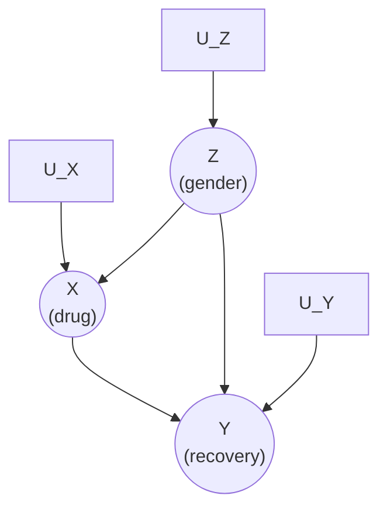
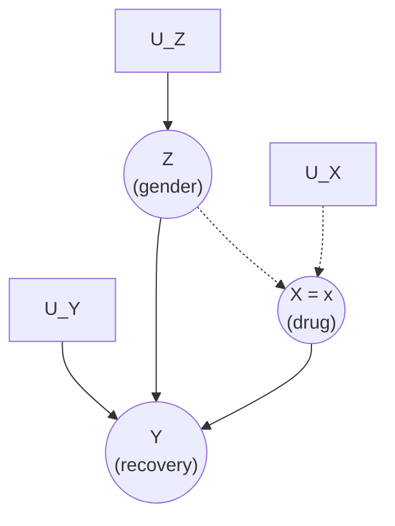

# Lesson 19: The Adjustment Formula and Truncated Factorization

## Where We Left Off

Lesson 18 gave us the do-operator and graph surgery: to answer $P(Y = y \mid do(X = x))$, delete the arrows into $X$ and work in the manipulated world. But a picture is not a number. This lesson derives the first general recipe for *computing* an interventional quantity from purely observational data. It is the single most important derivation in Part 3 — the backdoor criterion (Lesson 20) and the front-door criterion (Lesson 23) are both refinements of it.

## The Setup: A Confounded Drug Study

Recall the Simpson's paradox model of Lesson 03: $X$ is drug usage, $Y$ is recovery, $Z$ is gender, with $Z \to X$, $Z \to Y$, and $X \to Y$ (Primer Figure 3.3). 

*Primer Figure 3.3: the confounded drug model — $Z$ (gender) affects both drug usage ($X$) and recovery ($Y$), so the backdoor path $X \leftarrow Z \to Y$ is open, on top of the causal path $X \to Y$.*

To judge the drug's effectiveness in the population, we imagine administering it uniformly to everyone and comparing the recovery rate to the complementary intervention where nobody takes it:

$$P(Y = 1 \mid do(X = 1)) - P(Y = 1 \mid do(X = 0)) \tag{3.1}$$

This difference is the **causal effect difference**, also called the **average causal effect (ACE)** — Pearl's term for what Neal and the potential-outcomes lessons (09–10) called the ATE. In general we want $P(Y = y \mid do(X = x))$ for arbitrary values.

Simpson's paradox showed that a data table on its own cannot settle even the *sign* of the effect: the same numbers support opposite conclusions depending on which causal story generated them. What is missing is not more data but a model. Supply the graph, and the data become interpretable — the graph alone computes nothing, and the data alone decide nothing, but together they yield a number. The first step is to simulate the intervention by surgery, exactly as in Lesson 18: delete the arrows into $X$, namely $Z \to X$ and $U_X \to X$, and hold $X$ at the assigned value.

*Primer Figure 3.4: the drug model after $do(X = x)$. The dotted edges are the ones the surgery deletes. The causal arrow $X \to Y$ survives — an intervention removes only the arrows **into** the intervened variable — and it is that surviving arrow whose strength the derivation measures.*

Let $P_m$ denote the probability function prevailing in this manipulated model, as in Lesson 18. The derivation below expresses $P_m$ entirely in terms of $P$, the distribution the observed data come from.

## The Derivation

The manipulated distribution $P_m$ shares two properties with the original $P$ — the two invariances of Lesson 18:

$$P_m(Y = y \mid Z = z, X = x) = P(Y = y \mid Z = z, X = x) \qquad \text{and} \qquad P_m(Z = z) = P(Z = z)$$

We also know that in the manipulated graph, $Z$ and $X$ are d-separated, so $P_m(Z = z \mid X = x) = P_m(Z = z)$. Assembling these:

$$
P(Y = y \mid do(X = x))
= P_m(Y = y \mid X = x) \quad \text{(by definition)} \tag{3.2}
$$
$$
= \sum_z P_m(Y = y \mid X = x, Z = z)\, P_m(Z = z \mid X = x) \quad \text{(law of total probability)} \tag{3.3}
$$
$$
= \sum_z P_m(Y = y \mid X = x, Z = z)\, P_m(Z = z) \quad \text{(d-separation in the mutilated graph)} \tag{3.4}
$$
$$
= \sum_z P(Y = y \mid X = x, Z = z)\, P(Z = z) \quad \text{(the two invariances)} \tag{3.5}
$$

> [!IMPORTANT]
> **Equation (3.5) is the adjustment formula.** It computes the association between $X$ and $Y$ *within each stratum* $Z = z$, then averages those stratum-specific associations using the population distribution of $Z$. The procedure is called "adjusting for $Z$" or "controlling for $Z$." Every quantity on the right-hand side is observable — the do-operator has vanished.

Notice what the derivation does *not* require: any assumption about the functional forms $f_X, f_Y$, any linearity, any distributional shape. Only the graph and the invariances. This nonparametric character is the shared backbone of Pearl's and Neal's treatments.

### Connection to the Potential-Outcomes Lessons

You have seen this formula before wearing different clothes. Lesson 12 derived, from conditional exchangeability $(Y(1), Y(0)) \perp X \mid Z$,

$$E[Y(1)] = \sum_z E[Y \mid X=1, Z=z]\, P(Z=z)$$

which for binary $Y$ is exactly (3.5). Lesson 16 connected the two: if $Z$ blocks every backdoor path, conditional exchangeability holds. Pearl's Theorem 4.3.1 (Lesson 28) states this formally. The implication runs in one direction: the graphical condition *implies* the counterfactual one. The adjustment formula is the point where the two halves of this course fuse into one machine.

### No Adjustment Needed in Randomized Experiments

If the data come from a randomized experiment, the model already possesses the structure of the manipulated graph: $X$ has no parents, $P_m = P$ regardless of any factors $Z$ affecting $Y$, and the adjustment formula collapses to $P(y \mid do(x)) = P(y \mid x)$ with the empty adjustment set. Our derivation is therefore a formal proof that randomization delivers $P(y \mid do(x))$ — the fact Neal proves three ways in his Chapter 5. (In practice investigators still adjust in RCTs, to reduce sampling variability — Cox 1958.)

### Worked Example: Resolving Simpson's Paradox

Apply (3.5) to the drug data of Primer Table 1.1 — the same data Lesson 03's Simpson's paradox discussion used. Here $X=1$: took the drug, $Z=1$: male, $Y=1$: recovered. The raw table:

| | Drug: recovered / total (rate) | No drug: recovered / total (rate) |
|---|---|---|
| Men ($Z=1$) | 81 of 87 (93%) | 234 of 270 (87%) |
| Women ($Z=0$) | 192 of 263 (73%) | 55 of 80 (69%) |
| Combined | 273 of 350 (78%) | 289 of 350 (83%) |

*Primer Table 1.1: the drug helps within each gender, yet the aggregated data make it look harmful — the paradox.*

The numbers behind each factor of the formula: 
- $P(Y{=}1 \mid X{=}1, Z{=}1) = 0.93$, 
- $P(Y{=}1 \mid X{=}1, Z{=}0) = 0.73$, 
- $P(Y{=}1 \mid X{=}0, Z{=}1) = 0.87$, 
- $P(Y{=}1 \mid X{=}0, Z{=}0) = 0.69$; 

And the population gender weights: 
- $P(Z{=}1) = (87+270)/700$, 
- $P(Z{=}0) = (263+80)/700$. 

Substituting:

$$P(Y=1 \mid do(X=1)) = 0.93 \cdot \tfrac{87+270}{700} + 0.73 \cdot \tfrac{263+80}{700} = 0.832$$

$$P(Y=1 \mid do(X=0)) = 0.87 \cdot \tfrac{87+270}{700} + 0.69 \cdot \tfrac{263+80}{700} = 0.7818$$

$$ACE = 0.832 - 0.7818 = 0.0502$$

A clear positive advantage for the drug — even though the aggregated table made the drug look harmful. The formula instructs us to condition on gender, compute the drug's benefit separately for each gender, then average using the population's gender proportions — and to *ignore* the aggregated data. This is the algorithmic resolution of the paradox that Lesson 03 could only diagnose.

And the mirror image: in the blood-pressure story (Primer Figure 3.5), the arrow between $X$ and $Z$ is reversed — treatment *causes* blood pressure. Here $X$ has no parents, so no adjustment is warranted; adjusting for blood pressure would implicitly assume a model in which blood pressure causes people to seek treatment, and would give the wrong answer. **Whether to adjust is a graph question, not a taste question.**

## The Causal Effect Rule: Adjusting for Parents

Aside: the adjustment formula's family tree

Equation (3.5) has many names in the literature, and recognizing them prevents confusion when you read widely. Pearl's Primer calls it the adjustment formula; the same expression appears as the **backdoor adjustment** once Lesson 20 certifies which sets may appear in the role of $Z$; in the potential-outcomes literature it is the **g-formula** (Robins) and, for the ATE with conditional exchangeability, the **stratification estimator**; econometricians know a linearized cousin as the Oaxaca–Blinder / regression-adjustment estimator. The truncated product rule is likewise called the **g-formula in its general form** and the **truncated factorization** interchangeably. One identity, many passports — which is itself evidence of how central it is: each field rediscovered it from its own starting point.

Which set $\mathbf{Z}$ can legitimately appear in the adjustment formula? The intervention procedure itself dictates the answer: we neutralize the influence of exactly the parents of $X$. Denoting the parents by $PA(X)$:

> **The Causal Effect Rule** (Primer Rule 1 of §3.2.2; the Primer renumbers its rules in each chapter, so this label is unrelated to the do-calculus Rule 1 of Lesson 24). Given a graph $G$ in which a set $PA$ are designated as the parents of $X$, the causal effect of $X$ on $Y$ is given by
> $$P(Y = y \mid do(X = x)) = \sum_{z} P(Y = y \mid X = x, PA = z)\, P(PA = z) \tag{3.6}$$
> where $z$ ranges over all combinations of values of $PA$.

Equation (3.6) can be rewritten in a form that isolates a single quantity of later importance. Start from the rule itself, writing $z$ for a combination of values of $PA$:

$$P(Y = y \mid do(X = x)) = \sum_z P(Y = y \mid X = x, PA = z)\, P(PA = z)$$

Multiply and divide each summand by $P(X = x \mid PA = z)$. The step is legitimate whenever that factor is nonzero, a condition returned to below:

$$= \sum_z \frac{P(Y = y \mid X = x, PA = z)\, P(X = x \mid PA = z)\, P(PA = z)}{P(X = x \mid PA = z)}$$

The three factors in the numerator are exactly the chain-rule decomposition of the joint distribution, since $PA$ are the parents of $X$ and $X$ precedes $Y$:

$$P(X = x, Y = y, PA = z) = P(PA = z)\, P(X = x \mid PA = z)\, P(Y = y \mid X = x, PA = z)$$

Substituting the joint for the product gives the alternative form:

$$P(y \mid do(x)) = \sum_z \frac{P(X = x, Y = y, PA = z)}{P(X = x \mid PA = z)} \tag{3.7}$$

The denominator $P(X = x \mid PA = z)$ is the **propensity score**: the probability that a unit with parent values $z$ receives treatment level $x$. Written this way, the adjustment formula is a reweighting of the observed joint distribution, each stratum weighted inversely by how likely its units were to receive the treatment they received. That reading is the seed of inverse probability weighting in Lesson 35, and the propensity score grows into a chapter of its own in Lessons 34–35.

### The Hidden Condition: Positivity

Equations (3.6) and (3.7) both rest on a condition that neither one displays. Stated precisely: for every value $x$ whose effect is being computed, and every $z$ with $P(PA = z) > 0$, the conditional $P(X = x \mid PA = z)$ must be strictly positive. This is **positivity**, the assumption of Lesson 13, in its graphical setting.

To see what goes wrong without it, write the stratum conditional of (3.6) as the ratio it is:

$$P(Y = y \mid X = x, PA = z) = \frac{P(Y = y, X = x, PA = z)}{P(X = x, PA = z)}$$

Suppose $P(X = x \mid PA = z) = 0$ for some stratum $z$. Then $P(X = x, PA = z) = P(X = x \mid PA = z)\, P(PA = z) = 0$, so the denominator vanishes. The numerator vanishes with it, since $P(Y = y, X = x, PA = z)$ cannot exceed $P(X = x, PA = z)$. The summand is therefore $0/0$: an indeterminate form with no value, rather than an infinite one.

What makes the failure consequential is the weight beside it. That stratum enters the sum multiplied by $P(PA = z)$, which is strictly positive by assumption, so a term that genuinely belongs to the sum has no value to contribute. Compare the harmless case: when $P(PA = z) = 0$, the conditional is equally undefined, but the term carries zero weight and is dropped by convention. That asymmetry is why the condition is stated on the support of $PA$ rather than for every $z$ whatsoever.

Equation (3.7) breaks in the same arithmetic way, since its numerator $P(X = x, Y = y, PA = z)$ is zero exactly when the denominator is. The difference between the two forms is visibility rather than behavior. Equation (3.7) prints the offending factor in a denominator, where a reader and a numerical routine both meet it directly. Equation (3.6) buries it inside a conditional that looks perfectly ordinary, so the sum still appears computable, and an implementation working from a contingency table will quietly skip the empty cell instead of reporting that the estimand was never identified.

Underneath the arithmetic sits a causal fact. The quantity $P(Y = y \mid do(X = x))$ asks what the outcome rate would be if *every* unit received treatment $x$, including the units in stratum $z$. If no unit in that stratum can receive $x$, the data hold no evidence at all about that sub-population under that treatment. The $0/0$ is the symptom; the absence of evidence is the condition itself.

Violations of positivity come in two kinds, and only one of them is fixable. A **structural** violation means the stratum can never receive that treatment level: no man is assigned a prenatal vitamin, no patient with an absolute contraindication receives the drug. There $P(X = x \mid PA = z)$ is zero as a matter of how the world is built, and the effect in that stratum is not merely unmeasured but undefined. A **practical** violation means the probability is positive but small, so the stratum is thinly populated and the estimate within it is unstable. More data helps the second case and can do nothing for the first.

Neither kind announces itself when a parametric model is fitted. A regression fits a surface across the strata and duly reports a number for a cell holding no observations, extrapolating from the strata that do hold some. The reported estimate is then a product of the assumed functional form rather than of the data, and nothing in the output distinguishes the two. This is the practical argument for keeping the nonparametric derivation above in view: it makes visible the stratum-by-stratum quantities that a fitted model silently interpolates across.

### Why the Parents Are Rarely the Set to Use

The Causal Effect Rule answers the question it was asked: the parents of $X$ always constitute a valid adjustment set. Two obstacles keep that answer from being the useful one.

The first is measurement. In most real graphs the parents of $X$ include **unmeasured** variables — the unrecorded dispositions, habits and circumstances that led each unit to its treatment — and the conditional probabilities in (3.6) then cannot be computed from data at all.

The second is positivity, which the rule strains by construction. Adjusting for every parent multiplies the strata the data must populate, so controlling confounding pushes toward larger adjustment sets while positivity pushes toward smaller ones. The drug model hides the tension, since $PA(X) = \{Z\}$ yields two strata and all four combinations of $(X, Z)$ are populated in Table 1.1. With a dozen parents, most of the strata are empty and the tension becomes the binding constraint.

Both obstacles point the same direction: toward some *other* observed set that can stand in for the parents — measured, smaller, and still sufficient to identify the effect. That search is the backdoor criterion of Lesson 20.

## Multiple Interventions and the Truncated Product Rule

The derivation earlier in this lesson took one route to the adjustment formula: cut the arrows into $X$, then use the two invariances to carry observational quantities across into the manipulated world. A second route reaches the same formula by a different argument, and it generalizes where the first does not — to interventions that fix several variables at once, or one variable repeatedly over time. The starting point is the product decomposition that the DAG imposes on the joint distribution. For the drug model:

$$P(x, y, z) = P(z)\, P(x \mid z)\, P(y \mid x, z) \tag{3.8}$$

Each factor in that product is one mechanism: $P(z)$ generates gender, $P(x \mid z)$ decides who takes the drug, $P(y \mid x, z)$ determines recovery. This is the factorization counterpart of the SCM equations of Lesson 17. Now apply $do(X = x)$. The intervention replaces the mechanism that assigns treatment, and nothing else, so the factor $P(x \mid z)$ is **purged** from the product while every other factor stands:

$$P(z, y \mid do(x)) = P(z)\, P(y \mid x, z) \tag{3.9}$$

This second route must agree with the first, and checking that it does is worth the two lines it takes. Sum equation (3.9) over the values of $z$ to marginalize gender away:

$$P(Y = y \mid do(X = x)) = \sum_z P(z, y \mid do(x)) = \sum_z P(Z = z)\, P(Y = y \mid X = x, Z = z)$$

The right-hand side is equation (3.5) exactly. Graph surgery with invariances, and factor deletion, are two descriptions of one operation. Stated in general:

> **Truncated product formula (g-formula).** For an intervention fixing a set $\mathbf{X}$ at values $\mathbf{x}$, write the product decomposition $P(v) = \prod_i P(v_i \mid pa_i)$ and delete every factor $P(x_i \mid pa_i)$ whose variable $X_i$ belongs to $\mathbf{X}$. Evaluate the surviving factors at the assigned values. The result is $P(v \mid do(\mathbf{X} = \mathbf{x}))$, the joint distribution of the remaining variables under the intervention.

The recipe is purely syntactic: write the factorization, strike the intervened factors, evaluate the survivors at the assigned values. Every factor left standing describes a mechanism the intervention did not touch, which is the modularity idea of Lesson 18 applied one mechanism at a time.

One point deserves emphasis, because the reflex from conditioning misleads here: **no renormalization is required**. The truncated product is already a probability distribution over the variables that remain. For the drug model, summing it over both remaining variables jointly:

$$\sum_{y}\sum_{z} P(z)\, P(y \mid x, z) = \sum_{z} P(z) \underbrace{\sum_{y} P(y \mid x, z)}_{=\,1} = \sum_{z} P(z) = 1$$

The sum runs over $y$ and $z$ together, which is what normalization of a joint distribution means. Any single value, such as $P(Y = y \mid do(X = x)) = \sum_z P(z) P(y \mid x, z)$, is one marginal of that joint at one value of $y$, and those marginals sum to one across the values of $y$ rather than each equalling one — in the worked example above, $0.832$ and $0.168$.

The contrast with conditioning is the instructive part. Conditioning on $X = x$ *does* require division by $P(x)$ to restore normalization, because conditioning discards every unit with $X \neq x$ and the survivors must be rescaled to form a distribution. Truncation discards no units. It removes the mechanism that assigned treatment and leaves the population intact, so the remaining factors are already normalized. The same surface operation — a factor disappears — carries different normalization behaviour depending on whether the reader is observing or doing.

What the truncated product buys beyond the adjustment formula is generality. Equation (3.5) handles a single intervention on a single variable. The truncated product handles any number of simultaneous interventions, and — the case that matters most in practice — sequential ones, where a treatment $X_1$ is assigned, an intermediate outcome is observed, and a second treatment $X_2$ is assigned in response to it. There the adjustment formula has no direct analogue, because the variable to adjust for is itself affected by the earlier treatment. Deleting both treatment factors from the product handles the case without difficulty. This is why the same expression is known as the **g-formula** in the literature on time-varying treatments.

Combining the factorization (3.8) with the truncated product (3.9) yields a compact corollary. Substituting $P(z) = P(x, y, z) / (P(x \mid z)\, P(y \mid x, z))$ into (3.9) and cancelling gives:

$$P(z, y \mid do(x)) = \frac{P(x, y, z)}{P(x \mid z)} \tag{3.10}$$

Equation (3.10) says that the intervened joint distribution is the observed joint reweighted by the propensity $P(x \mid z)$, and by nothing else. The whole difference between the observed world and the intervened one is carried by that single factor. Inverse probability weighting (Lesson 35) is built directly on this identity.

## Why This Derivation Is the Template

Every identification result in this course repeats the anatomy of the derivation above. Start in the manipulated world. Use d-separation there to simplify a post-intervention conditional. Use an invariance to exchange a manipulated probability for an observed one. Finish with the law of total probability. The invariances carry the causal assumptions; the remaining steps are probability algebra. The backdoor adjustment (Lesson 20), the front-door chain (Lesson 23) and counterfactual identification (Lesson 28) each recombine these same four moves, which is the reason this derivation is worth knowing in detail rather than by its result alone.

## Summary and Key Takeaways

1. The **adjustment formula** (3.5) computes $P(y \mid do(x))$ as a stratum-weighted average of observed conditionals — identification achieved.
2. The derivation needs only the two invariances plus d-separation in the mutilated graph. The same formula, with the same justification, emerged from conditional exchangeability in Lesson 12: the graphical and potential-outcomes traditions are one.
3. The **Causal Effect Rule** adjusts for $PA(X)$, so the parents are always a valid adjustment set — but two obstacles make them the wrong practical choice: parents are often unmeasured, and adjusting for all of them strains positivity. Both motivate the search for smaller, measured substitutes.
4. The **truncated product rule** generalizes to multiple simultaneous interventions: write the factorization, delete the intervened factors.
5. Whether to adjust for a variable is decided by the graph — confounders yes, mediators and colliders no (and Lesson 20 makes "no" precise).

**Next step:** Lesson 20 turns the question "which set should I adjust for?" into a purely graphical test: the **backdoor criterion**.

### Check Your Understanding

1. In the derivation, identify precisely where *each* of the three ingredients is used: the law of total probability, d-separation in the mutilated graph, and the two invariances. Which step would fail if the intervention had side effects?
2. Recompute the Simpson's paradox resolution with the *other* population weighting (using $P(Z \mid X{=}1)$ instead of $P(Z)$). What quantity have you computed instead of the ACE, and why is it the wrong target for "the drug's effectiveness in the population"?
3. Write the truncated factorization of the drug model under the joint intervention $do(X = x, Z = z)$. Which formula of this lesson survives unchanged, and which loses its meaning?

---

## Further Reading

*Ref*: *Causal Inference in Statistics: A Primer (2016)*, Chapter 3, Sections 3.2–3.2.2 (Eqs. 3.1–3.10); Brady Neal, *Introduction to Causal Inference* (Dec 2020 draft), Chapter 4, Sections 4.2–4.4.
