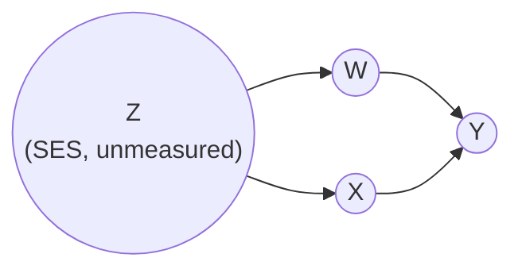
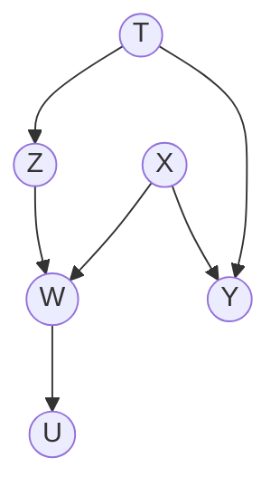
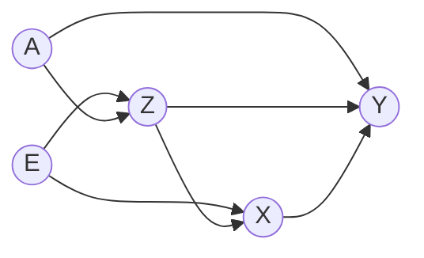
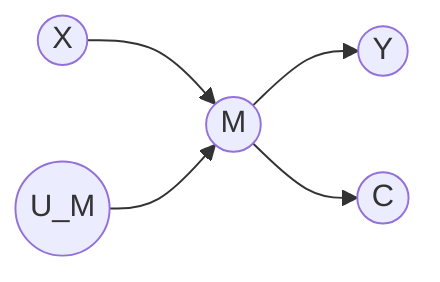
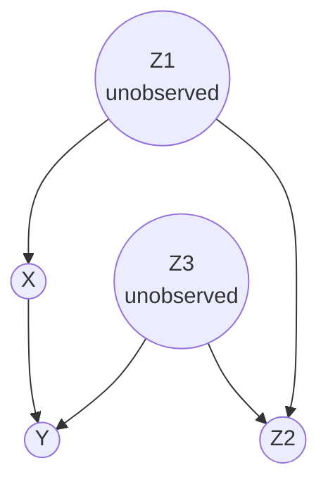

# Lesson 20: The Backdoor Criterion

## Where We Left Off

Lesson 19 ended with the Causal Effect Rule and two reasons not to use it. The rule adjusts for the parents of $X$, but those parents are frequently unmeasured, which leaves the conditionals in (3.6) unestimable; and adjusting for every parent multiplies the strata the data must populate, straining positivity. Both problems would be solved by a *smaller, measured* set that licenses the same adjustment formula. This lesson supplies the test that identifies such sets. The test is graphical: admissibility is settled by inspecting paths in the DAG, with no manipulation of probabilities, and any set that passes may be substituted directly into the adjustment formula (3.5). Pearl states the test as Definition 3.3.1 of the Primer; Neal reaches the same result in his section "The Backdoor Adjustment".

## The Question, Made Graphical

Under what conditions does a causal story permit us to compute the causal effect of $X$ on $Y$ from passive observations alone? Since we represent causal stories with DAGs, this becomes a graph-theoretic question: **when is the structure of the graph sufficient to compute a causal effect from a data set?**

Recall the path vocabulary of Lessons 03–04. A **backdoor path** from $X$ to $Y$ is any path that begins with an arrow *into* $X$. Backdoor paths are non-causal channels: they transmit spurious association into any naive comparison. We want to condition on a set $\mathbf{Z}$ such that:

1. **We block all spurious paths** between $X$ and $Y$.
2. **We leave all directed paths** from $X$ to $Y$ unperturbed.
3. **We create no new spurious paths.**

These three desires become a formal test:

> **Definition 3.3.1 (The Backdoor Criterion).** Given an ordered pair $(X, Y)$ in a DAG $G$, a set of variables $\mathbf{Z}$ satisfies the **backdoor criterion** relative to $(X, Y)$ if:
> 1. **no node in $\mathbf{Z}$ is a descendant of $X$**, and
> 2. **$\mathbf{Z}$ blocks every path between $X$ and $Y$ that contains an arrow into $X$.**

If $\mathbf{Z}$ satisfies the criterion, the causal effect is given by the adjustment formula exactly as in Lesson 19:

$$P(Y = y \mid do(X = x)) = \sum_z P(Y = y \mid X = x, Z = z)\, P(Z = z)$$

(Note that $PA(X)$ always satisfies the criterion — the Causal Effect Rule is the special case.)

For a numeric outcome the same result is usually written with expectations rather than probabilities:

$$\mathbb{E}[Y \mid do(X = x)] = \mathbb{E}_{Z \sim P(Z)}\bigl[\, \mathbb{E}[Y \mid X = x, Z = z] \,\bigr]$$

The inner expectation is the outcome mean within a stratum of $\mathbf{Z}$; the outer expectation averages those means over the population distribution of $\mathbf{Z}$. The two forms say the same thing, and the expectation form is the one estimation procedures target directly — Lessons 33 to 35 estimate exactly this quantity.

The criterion is one condition stated in three languages: graphically, $\mathbf{Z}$ blocks every backdoor path; counterfactually, $\mathbf{Z}$ yields the conditional exchangeability of Lesson 12; distributionally, $\mathbf{Z}$ licenses the adjustment formula. Lesson 19 showed that the graphical and counterfactual routes arrive at the same formula.

## Why Each Condition Earns Its Place

**Blocking backdoor paths** (condition 2) is the point: such paths make $X$ and $Y$ dependent without transmitting causal influence from $X$, and left open they confound the effect.

**Excluding descendants of $X$** (condition 1) serves the other two desires at once. Descendants of $X$ are affected by an intervention on $X$; if any of them also affects $Y$, conditioning on it blocks part of the causal pathway we are trying to measure (over-control, Lesson 03). Worse, a descendant may be a **collider** — including it would *open* a path that was blocked, creating brand-new spurious association (condition 3). The descendant exclusion also protects against conditioning on children of intermediate nodes on the causal path, which distorts the passage of causal association the same way conditioning on the intermediates themselves would.

> [!WARNING]
> **Colliders remain the trap.** "Condition on confounders, never on colliders" is a heuristic; the backdoor criterion is the law — and sometimes the law requires a collider (see the worked example below). When it does, the set must also contain the variables that re-block the path the collider conditioning opens.

## Worked Examples

### Substituting for an Unmeasured Confounder

Primer Figure 3.6: we gauge the effect of a drug ($X$) on recovery ($Y$); weight ($W$) affects recovery; socioeconomic status ($Z$) affects both weight and treatment choice — but the study did not record $Z$.

There is exactly one backdoor path, $X \leftarrow Z \to W \to Y$, and two different sets block it. 
1. The set $\{Z\}$ qualifies on the graph: $Z$ is not a descendant of $X$, and $Z$ is a fork junction on that path, so conditioning on $Z$ closes it. 
2. The set $\{W\}$ qualifies too: $W$ is not a descendant of $X$ either, and $W$ is a chain junction on the same path, so conditioning on $W$ closes it as well. 

Graphically the two are on equal footing. They differ in the data: socioeconomic status was never recorded, so $\{Z\}$ cannot be used however well it qualifies, while weight was recorded and $\{W\}$ can. Admissibility is a property of the graph; usability is a property of the data set, and the two must not be confused.

$$P(Y = y \mid do(X = x)) = \sum_w P(Y = y \mid X = x, W = w)\, P(W = w)$$

is computable from observational data. An unmeasured confounder has been stood in for by a measured variable that blocks the same path — the substitution power the criterion exists to provide. Note what was *not* required: $Z$ need not be observed, estimated, or even named, so long as some measured set closes every backdoor path.

### When the Empty Set Works — and When Adjusting Hurts

Primer Figure 2.8 puts a different arrangement in play. A treatment $X$ affects an outcome $Y$ directly and also affects $W$; $Z$ is a second cause of $W$; and $T$ is a common cause of $Z$ and $Y$. $U$ records a downstream consequence of $W$. The structure that matters is that **$W$ is a collider** on the path from $X$ to $Z$:

*Primer Figure 2.8: $X$ has no parents among the modelled variables, so no backdoor path from $X$ to $Y$ exists. $W$ is a collider, receiving arrows from both $X$ and $Z$. The source figure also draws an exogenous error term on every node ($U_T, U_Z, U_X, U_W, U_Y, U_U$); these are omitted here, as in the other figures of this lesson, since an error term is a parent of one node only and can never lie on a path between two modelled variables.*

Take the effect of $X$ on $Y$. No arrow points into $X$, so there is no backdoor path at all, the empty set satisfies the criterion, and $P(y \mid do(x)) = P(y \mid x)$: no adjustment is needed. Now suppose $W$ is adjusted for anyway, on the reflex that more control is safer. Conditioning on the collider $W$ opens the path $X \to W \leftarrow Z \leftarrow T \to Y$, which carries spurious association from $X$ to $Y$ and biases the estimate. Adjustment that was unnecessary has become harmful. This is the over-control and collider-bias material of Lesson 03, now settled by a formal criterion rather than by intuition.

The same figure answers a subtler question: how do we compute the **$W$-specific effect** $P(y \mid do(x), W = w)$ — say, the effect of a drug among patients who suffered no post-treatment pain? Specifying $W = w$ is conditioning, so the collider path opens; we must additionally block it elsewhere, e.g. by conditioning on $T$:

$$P(Y = y \mid do(X = x), W = w) = \sum_t P(Y = y \mid X = x, W = w, T = t)\, P(T = t \mid W = w) \tag{3.11}$$

Comparing $P(y \mid do(x), W = w)$ against $P(y \mid do(x), W = w')$ is how we study **effect modification (moderation)** — whether the effect differs across strata defined by a pretreatment variable like age or sex. When $W$ itself satisfies the criterion, no summation is needed; when only $\mathbf{T} \cup \{W\}$ does, Eq. (3.11) applies. Neal calls the general version of this the **z-specific adjustment**; note its criterion is *stricter*, because the added conditioning can open collider paths that the plain effect never touched.

### A Case Where the Collider Must Be Conditioned

Primer Figure 3.7 shows the case where a collider *must* be conditioned on. $E$ causes both $X$ and $Z$; $A$ causes both $Z$ and $Y$; and $Z$ itself causes both $X$ and $Y$:

*Primer Figure 3.7: $Z$ is a collider on the path $X \leftarrow E \to Z \leftarrow A \to Y$, yet also a non-collider on three other backdoor paths.*

Arrows point into $X$ from $E$ and from $Z$, and tracing onward to $Y$ gives exactly four backdoor paths, every one of them through $Z$:

1. $X \leftarrow E \to Z \to Y$ — $Z$ is a chain junction here
2. $X \leftarrow E \to Z \leftarrow A \to Y$ — $Z$ is a **collider** here
3. $X \leftarrow Z \to Y$ — $Z$ is a fork junction here
4. $X \leftarrow Z \leftarrow A \to Y$ — $Z$ is a chain junction here

Paths 1, 3 and 4 treat $Z$ as a chain or fork junction, so conditioning on $Z$ blocks all three. Path 2 is the difficulty: $Z$ is a collider on it, so conditioning on $Z$ *opens* what was already blocked. Leaving $Z$ out is not an option either, since paths 1, 3 and 4 would stay open, and no other variable lies on all of them. So $Z$ belongs to every admissible set, and each admissible set must also contain something that re-blocks path 2 — either $E$ or $A$, both of which are non-colliders on it. That yields exactly the three admissible sets $\{E, Z\}$, $\{A, Z\}$ and $\{E, Z, A\}$. **"Never condition on colliders" is a heuristic, not a law; the criterion is the law.**

### Two More Traps from Neal

Neal's Chapter 4 adds two cases that show why the criterion's rules are stricter than "adjust for everything measured before the outcome".

**Trap 1: a child of a mediator.** Suppose $X \to M \to Y$, and $M$ has another child $C$ that is not on any path to $Y$. Conditioning on $C$ looks harmless, since $C$ does not affect $Y$. But draw $M$'s own noise term $U_M$ explicitly:

*Neal's "magnified" graph: the noise term $U_M$ is drawn as a node.*

Now $M$ is a collider between $X$ and $U_M$, and $C$ is a descendant of that collider. Conditioning on $C$ therefore makes $X$ and $U_M$ dependent (Lesson 03). Since $U_M$ affects $Y$ through $M$, that new dependence gets tangled with the causal flow along $M \to Y$, and the estimate is biased. This is why condition 1 excludes *all* descendants of $X$, not just the mediators themselves. In the potential-outcomes literature the same rule appears as "do not adjust for post-treatment variables".

**Trap 2: M-bias, from a variable measured before treatment.** Excluding post-treatment variables is not enough. A variable measured *before* treatment can still be a collider:

*Neal's M-bias graph. Drawn this way, the path $X \leftarrow Z_1 \to Z_2 \leftarrow Z_3 \to Y$ has the shape of an M.*

$Z_2$ is a pre-treatment covariate, and it is associated with both $X$ and $Y$, so it looks like a confounder. But on the only backdoor path it is a collider, so that path is **blocked** as long as $Z_2$ is left alone. The empty set satisfies the backdoor criterion. Adjusting for $Z_2$ *opens* the path and creates bias. The damage could be undone by also adjusting for $Z_1$ or $Z_3$, but here both are unobserved, so the only safe choice is **not** to adjust for $Z_2$. The name **M-bias** comes from the M shape of the path.

The moral: whether a variable should be adjusted for depends on its position in the graph, not on when it was measured or on whether it is associated with treatment and outcome.

## A Practical Recipe for Hunting Adjustment Sets

Aside: minimum, cheapest, and canonical adjustment sets

When several sets satisfy the criterion, the literature distinguishes natural preferences. A **minimum** adjustment set has the fewest variables (fewer strata to estimate — good when data is thin); the **cheapest** minimizes measurement cost or error; the **canonical adjustment set** is the algorithmic default — all ancestors of $X$, $Y$, and their backdoor confounders (excluding descendants of $X$) — which always works when any set does but is rarely minimal. Since all admissible sets return the same answer in infinite data (Pearl's interchangeability argument below), the choice among them is purely statistical: variance, cost, and robustness to measurement error. Textbook exercise: for the graph of Figure 3.7, list all three admissible sets and argue which you would pick with a budget for measuring only two variables well versus three poorly.

1. List every backdoor path from $X$ to $Y$ (paths beginning with an arrow into $X$).
2. For each, find blocking nodes — chains and forks block when conditioned; colliders block when *not* conditioned.
3. Cross out any candidate set containing a descendant of $X$.
4. Check that no surviving set opens a previously blocked path (the collider trap of Fig. 2.8 and Eq. 3.11).
5. If several sets survive, prefer the cheapest to measure — see below for why they are interchangeable.

The whole procedure is graph-marking, no algebra — which is exactly what makes it usable on graphs with dozens of variables where intuition fails.

## Pearl's Perspective: Adjusting Sets Are Interchangeable

$P(Y = y \mid do(X = x))$ is an empirical fact of nature, not a byproduct of our analysis. Therefore **any** admissible adjustment set must return the same answer. Figure 3.6 is a case in point: both $\{W\}$ and $\{Z\}$ satisfy the criterion there, as shown above, so had the study recorded socioeconomic status as well as weight, the two adjustments would have had to agree:

$$\sum_w P(Y = y \mid X = x, W = w)\, P(W = w) = \sum_z P(Y = y \mid X = x, Z = z)\, P(Z = z)$$

This has two consequences. 
1. *Choice*: we may pick the set that is cheaper to measure, less error-prone, or smaller. 
2. *Falsification*: when all adjustment variables are observed, the equality is a **testable constraint** on the data, in the same family as d-separation's implications. A model whose admissible sets disagree with the data can be discarded. The same logic reappears at the estimation stage, where several estimators can target one statistical estimand: agreement is evidence the assumptions hold, and disagreement localises a violated one. The freedom in consequence 1 is a freedom to choose *before* seeing the estimates, not a licence to pick whichever answer is preferred afterwards.

## Policies That Depend on Covariates: Conditional Interventions

So far every intervention has set $X$ to one value for everyone. Real policies are often **conditional**: a doctor gives a drug only to patients whose temperature is above some level; a program admits applicants depending on age. The Primer (§3.5) writes such a policy as $do(X = g(Z))$, where $g$ is a rule that picks a value of $X$ for each value of a covariate $Z$.

**The formula.** The effect of a conditional policy follows from the $z$-specific effect of the previous section, in three steps.

**Step 1: split by $Z$.** By the law of total probability,
$$P(y \mid do(X = g(Z))) = \sum_z P(y \mid do(X = g(Z)), Z = z)\, P(z \mid do(X = g(Z))).$$

**Step 2: $Z$ comes before $X$, so the policy does not change $Z$'s distribution.** $P(z \mid do(X = g(Z))) = P(z)$. (This is Primer Eq. 3.17.)

**Step 3: within the group $Z = z$, the policy simply sets $X$ to the fixed value $g(z)$.** So $P(y \mid do(X = g(Z)), Z = z) = P(y \mid do(X = x), Z = z)$ evaluated at $x = g(z)$.

Substituting:

$$P(y \mid do(X = g(Z))) = \sum_z P(y \mid do(X = x), Z = z)\Big|_{x = g(z)}\, P(z).$$

In words: for each group, look up the effect of the value the policy assigns to that group, and average over groups using their population shares. So a conditional policy is identified whenever the $z$-specific effect is. The Primer's rule for that: find a measured set $\mathbf{S}$ such that $\mathbf{S} \cup \{Z\}$ satisfies the backdoor criterion; then $P(y \mid do(x), z) = \sum_s P(y \mid x, s, z)\, P(s \mid z)$. (If $Z$ alone satisfies the criterion, no extra summation is needed.) The weights are $P(s \mid z)$, the distribution of $\mathbf{S}$ within the group $Z = z$, as in Eq. (3.11) above. The Primer's §3.5 prints $P(s)$, which agrees only when $\mathbf{S}$ and $Z$ are independent.

**Worked example: the drug data.** In the Simpson's paradox data (Lesson 03), sex $Z$ satisfies the backdoor criterion by itself, so $P(\text{recovery} \mid do(x), z) = P(\text{recovery} \mid x, z)$. The recovery rates are 0.931 (men, drug), 0.867 (men, no drug), 0.730 (women, drug) and 0.688 (women, no drug), and $P(\text{man}) = 357/700 = 0.51$. Compare four policies:

| Policy $g$ | Men get | Women get | Recovery rate under the policy |
| --- | --- | --- | --- |
| Treat everyone | drug | drug | $0.51 \times 0.931 + 0.49 \times 0.730 = 0.833$ |
| Treat men only | drug | none | $0.51 \times 0.931 + 0.49 \times 0.688 = 0.812$ |
| Treat women only | none | drug | $0.51 \times 0.867 + 0.49 \times 0.730 = 0.800$ |
| Treat no one | none | none | $0.51 \times 0.867 + 0.49 \times 0.688 = 0.779$ |

Because the drug helps both sexes, treating everyone is best. If it helped one group and harmed the other, the best policy would treat only the group it helps, and this formula is how that would be found.

## Beyond the Backdoor Criterion: Front-Door Criterion, do-calculus, Bounds, Sensitivity Analysis

The backdoor criterion is a powerful tool when one can identify admissible set of known and measured variables which blocks every backdoor path. However, it is not uncommon for confounders to be either unknown or unmeasured. As such, while the backdoor criterion is sufficient, it's not necessary: one can still identify causal effects even when no admissible set exists.

> [!NOTE]
> The Figure 3.6 example above showed that even if a known confounder (Socioeconomic status) is never measured, the criterion still works because the measured $W$ blocks the same backdoor path, despite not being a confounder per se. That's why, the requirement is that some measured set blocks every backdoor path, not that all the confounders be measured.

When no such set exists, and confounders are known but unmeasured, we resort to the following two alternative techniques which may still identify the effect:

- The **front-door criterion** (Lesson 23) handles a graph whose only backdoor path runs through an unmeasured confounder, using a suitable mediator $M$ that carries the whole effect of $X$ on $Y$:

    $$P(y \mid do(x)) = \sum_m P(m \mid x) \sum_{x'} P(y \mid x', m)\, P(x')$$

    Notice that unlike the backdoor adjustment formula ($\sum_z P(y \mid x, z)\, P(z)$), the front-door formula uses no adjustment set. It identifies the effect in two stages through the mediator, summing over $M$ and over a second copy $x'$ of the treatment.

- The **do-calculus** (Lesson 24) is the general method: both the backdoor criterion and the front-door criterion can be derived from its rules. 
  - Also, do-calculus is **complete**: if its rules cannot rewrite $P(y \mid do(x))$ without the $do$-operator, no method can identify the effect from a graph and its observational data. Therefore, a failure of the do-calculus is a proof of non-identifiability.

In the following two situations, it is not possible to compute a trustworthy point estimate of causal effect (i.e., calculating causal effect as a single number):

1. **The do-calculus proves the effect non-identifiable:** 
   - no expression free of the $do$-operator exists, given the graph and the observational data.
   - The simplest example is a known but unmeasured $U$ causing both $X$ and $Y$, with nothing else measured: the data cannot separate the causal part of the $X$–$Y$ association from the confounded part.
2. **A confounder is unknown:** The graph is then wrong, and every graphical method (backdoor, front-door and do-calculus alike) inherits the error. This situation is the more dangerous one, because using the aforementioned analysis techniques still returns a number that appears to be identified.

Two tools serve both situations, and they differ in what they deliver:

- **Bounds** (Lesson 36) replace the point estimate with the range of the causal effect consistent with the data.
  - The no-assumptions bound uses neither the graph nor any claim about confounders, so it stays valid however incomplete the graph is, at the price of always containing zero. 
- **Sensitivity analysis** (Lesson 37) keeps the point estimate and tests it: it asks how strongly an unmodelled confounder would have to affect treatment and outcome to overturn the conclusion.

Finding no admissible set is therefore the failure of one test, not a verdict:

1. Look for another identifying formula, such as the front-door formula.
2. Apply the do-calculus, which either finds an identifying expression or proves that none exists.
3. If none exists, turn to bounds and sensitivity analysis.

Situation 2 (unknown confounder(s)) cannot be detected from inside the graph, so a sensitivity analysis is worth running even when identification succeeds, the backdoor criterion included.

## Summary and Key Takeaways

1. The **backdoor criterion**: $\mathbf{Z}$ contains no descendant of $X$, and blocks every path with an arrow into $X$. Two conditions, both checkable on the graph alone.
2. Condition 1 guards the causal paths *and* prevents collider-opening; the two requirements of Lesson 03's "three desires" map onto it exactly.
3. Substitution is the payoff: observed variables can stand in for unmeasured parents ($W$ for $SES$).
4. Colliders sometimes *must* be adjusted for — with companions that re-block what the conditioning opens.
5. All admissible sets give the same answer: this makes adjustment-set choice practical (cost) and the model testable (falsification).
6. The criterion is sufficient, not necessary — the frontier moves to Lesson 23.
7. Two traps show why the rules are strict: conditioning on a child of a mediator biases the estimate, and a pre-treatment collider creates **M-bias**. Position in the graph, not timing, decides.
8. **Conditional policies** $do(X = g(Z))$ are evaluated by plugging $g(z)$ into the $z$-specific effect and averaging over $P(z)$.

**Next step:** The frontier beyond the backdoor criterion resumes in Lessons 23 and 24. First, Lesson 21 applies the criterion to the randomized experiment. Randomization leaves no arrow into $X$, so the empty set is admissible and $P(y \mid do(x)) = P(y \mid x)$. Lesson 21 explains this result from three perspectives: covariate balance, exchangeability, and the absence of backdoor paths.

### Check Your Understanding

1. For the Figure 3.6 graph, verify that $\{W\}$ satisfies both conditions of Definition 3.3.1 — and then verify that $\{W, X\}$ does *not*, naming which condition fails.
2. In the Figure 3.7 graph, check that $\{E, Z\}$, $\{A, Z\}$, and $\{E, Z, A\}$ all block all four backdoor paths, and explain precisely why $\{Z\}$ alone fails.
3. A colleague adjusts for a descendant of $X$ that is *not* on any causal path to $Y$ and not a collider. Does the backdoor criterion reject the set? Does the estimate actually break? (Think carefully — this probes whether the criterion is sufficient only, or also necessary.)
4. In the M-bias graph, a colleague argues that $Z_2$ was measured before treatment and is associated with both $X$ and $Y$, so it must be adjusted for. Explain what goes wrong, and name the extra measurements that would make adjusting for $Z_2$ safe.
5. Suppose the drug helped men (as in the table) but *lowered* women's recovery from 0.688 to 0.600. Which of the four policies would be best, and what recovery rate would it give?

---

## Further Reading

*Ref*: *Causal Inference in Statistics: A Primer (2016)*, Chapter 3, Section 3.3 (Definition 3.3.1, Figures 3.6–3.7, Eq. 3.11) and Section 3.5 (conditional interventions and covariate-specific effects); Brady Neal, *Introduction to Causal Inference* (Dec 2020 draft), Chapter 4 (the backdoor adjustment; conditioning on descendants of treatment; M-bias).
