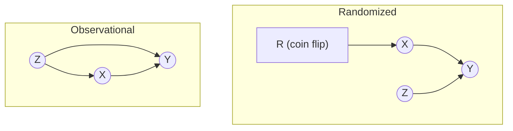
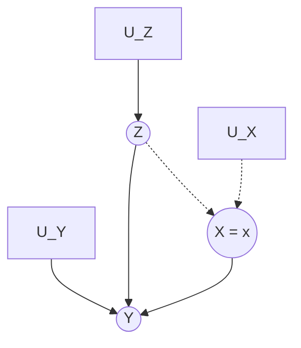

# Lesson 21: Randomized Experiments, Three Ways

## Where We Left Off

Lessons 18–20 built the machinery for identifying causal effects from *observational* data. Lesson 20 closed by pointing to the setting in which that machinery becomes trivial: in a randomized experiment, no variable except the randomizing device points into the treatment, so the empty set satisfies the backdoor criterion. Lesson 19 reached the same conclusion from the adjustment formula. This lesson establishes the result properly, from three perspectives that draw on three different parts of the course:

1. **Covariate balance**, using the adjustment machinery of Lessons 19–20.
2. **Exchangeability**, using the potential outcomes of Part 2.
3. **No backdoor paths**, using the causal graphs of Part 1.

All three arrive at the same equality. Each is needed again later, so all three are worth knowing.

*Notation.* $X$ is the treatment, $Y$ the outcome, $\mathbf{Z}$ a set of covariates, and $Y(1), Y(0)$ the potential outcomes, as in Lessons 18–20. Neal's Chapter 5 writes $T$ for the treatment and $X$ for covariates; this lesson converts his statements to the notation above.

## The Experimental Difference

A randomized experiment differs from an observational study in one essential respect: the experimenter has **complete control over the treatment assignment mechanism**. In the simplest design, a coin toss assigns each unit to treatment or control, so $P(X = 1 \mid \mathbf{Z} = \mathbf{z}) = \tfrac{1}{2}$ for every value $\mathbf{z}$ of every covariate. Assignment does not depend on the covariates at all. In an observational study, treatment usually does depend on covariates. When those covariates also affect the outcome, that dependence is confounding: the fork $X \leftarrow Z \to Y$ of Lesson 03.

> **Theorem (Association is causation under randomization).** In a randomized experiment, treatment assignment is independent of the potential outcomes, $(Y(1), Y(0)) \perp\!\!\!\perp X$. Together with the consistency and no interference assumptions (Lesson 14), this gives
> $$\mathbb{E}[Y(1)] - \mathbb{E}[Y(0)] = \mathbb{E}[Y \mid X=1] - \mathbb{E}[Y \mid X=0].$$
> Both sides are expectations, not averages over a particular sample, but they differ in kind. The left side depends only on the units' potential outcomes and can never be observed directly. The right side depends also on how treatment was assigned, and can be estimated from data. Randomization is what makes the two coincide.

**Identification versus estimation.** The theorem *identifies* the causal effect: it equates the effect with a quantity that can be estimated from data. It does not say what any particular trial will report. A trial observes only the mean outcomes of its own two arms, and the difference between them is an *estimate*.

That estimate is **unbiased** for the average effect among the trial's own units: averaged over all the ways the coin tosses could have fallen, it equals that effect exactly. Any single trial, however, generally carries some chance imbalance between its arms, such as one arm happening to be older or healthier, so its estimate misses the effect by a random error. The typical size of that error shrinks in proportion to $1/\sqrt{n}$ as the number of units $n$ grows, so quadrupling a trial only halves it. At no finite size does the typical error reach zero, which is why trials report confidence intervals.

Whether the estimate also applies beyond the trial is a separate question. It does only if the trial's units are a representative sample of the wider population, which is the external-validity question taken up at the end of this lesson.

> [!IMPORTANT]
> The theorem holds **by design**, not by luck. Randomization makes the assignment mechanism $P(X \mid \mathbf{Z})$ the same for every value of $\mathbf{Z}$, and this holds for unobserved covariates as much as for observed ones. No statistical adjustment can match that, because adjustment can only deconfound what was measured. A well-executed randomized experiment therefore needs no adjustment set. It still needs the assumptions randomization does not touch - consistency and no interference - and it needs to be carried out as designed. Events after randomization, such as non-compliance and attrition, can reintroduce bias; see "What Randomization Cannot Buy" below.

## Perspective 1: Comparability and Covariate Balance

Ideally the treatment and control groups are identical in every respect except the treatment received. Stated for the covariates, that ideal is:

> **Definition (Covariate Balance).** $P(\mathbf{Z} \mid X = 1) \overset{d}{=} P(\mathbf{Z} \mid X = 0)$: the distribution of covariates is the same in both treatment groups.

**Randomization implies covariate balance, for unobserved covariates as well as observed ones.** Because a coin decides $X$, the treatment is independent of every covariate, and so

$$P(\mathbf{Z} \mid X = 1) = P(\mathbf{Z}) = P(\mathbf{Z} \mid X = 0).$$

Like the theorem, this is a statement about the population. In a finite sample the two arms will differ somewhat by chance; randomization guarantees only that such differences average out over repeated randomizations.

**Covariate balance implies that association is causation.** Let $\mathbf{Z}$ be any set satisfying the backdoor criterion. $\mathbf{Z}$ may include unobserved variables, because the argument needs $\mathbf{Z}$ to exist, not to be measured; the parents of $X$ always qualify (Lesson 19). Then:

$$
\begin{aligned}
P(y \mid do(x)) &= \sum_{\mathbf{z}} P(y \mid x, \mathbf{z})\, P(\mathbf{z}) && \text{backdoor adjustment (Lesson 20)} \\
&= \sum_{\mathbf{z}} P(y \mid x, \mathbf{z})\, P(\mathbf{z} \mid x) && \text{balance: } X \perp\!\!\!\perp \mathbf{Z}, \text{ so } P(\mathbf{z}) = P(\mathbf{z} \mid x) \\
&= P(y \mid x) && \text{law of total probability}
\end{aligned}
$$

The second step is the only place balance is used. It replaces the population weights $P(\mathbf{z})$ with the within-arm weights $P(\mathbf{z} \mid x)$, and the two are equal precisely because the arms are balanced. The derivation also needs positivity, $0 < P(X = 1) < 1$, so that $P(y \mid x)$ is defined for both arms; the study/trial design must guarantee it. The intuition matches the algebra: if the groups are alike in everything except the treatment, the treatment is the only remaining explanation for a difference in outcomes.

This is why practitioners report **balance tables** in randomized studies: balance on the observed covariates is evidence that the randomization worked as designed.

> [!WARNING]
> A balance table can show balance only on **observed** covariates. Randomization balances unobserved covariates too, but nothing in the data can certify it. A failed or corrupted randomization, such as a buggy randomization script or staff who steered enrollment, can leave an unobserved imbalance while the balance table looks immaculate.

## Perspective 2: Exchangeability

Lesson 11 introduced exchangeability and the swap test. In its mean form:

$$\mathbb{E}[Y(1) \mid X = 1] = \mathbb{E}[Y(1) \mid X = 0] \qquad \text{and} \qquad \mathbb{E}[Y(0) \mid X = 0] = \mathbb{E}[Y(0) \mid X = 1]$$

In an observational study exchangeability is an assumption, to be argued for. In a randomized experiment it is a consequence of the design. The coin that decides $X$ has no access to either potential outcome, so $(Y(1), Y(0)) \perp\!\!\!\perp X$. In the terms of Lesson 11's swap test, relabelling heads as control and tails as treatment would not change the expected results, because the two groups are interchangeable by construction.

The theorem follows by computing each potential-outcome mean from observable quantities. The computation rests on two facts, established first: **exchangeability in mean form** and **consistency**.

**Fact 1: exchangeability in mean form.** Independence $(Y(1), Y(0)) \perp\!\!\!\perp X$ means the distribution of $Y(1)$ is the same among treated and untreated units. Distributions that are equal have equal means, so
$$\mathbb{E}[Y(1) \mid X=1] = \mathbb{E}[Y(1) \mid X=0], \qquad \text{and likewise} \qquad \mathbb{E}[Y(0) \mid X=1] = \mathbb{E}[Y(0) \mid X=0].$$

**Fact 2: consistency.** A unit's observed outcome is the potential outcome for the treatment it actually received:
$$Y = X\, Y(1) + (1 - X)\, Y(0).$$

- For a unit with $X = 1$ the second term vanishes and $Y = Y(1)$; 
- for a unit with $X = 0$ the first term vanishes and $Y = Y(0)$. 

Conditioning on $X = 1$ restricts attention to the treated units. Among them $X$ equals 1, so $X$ can be replaced by 1 inside the conditional expectation, and the consistency equation reduces to $Y(1)$:

$$\mathbb{E}[Y \mid X=1] = \mathbb{E}[1 \cdot Y(1) + 0 \cdot Y(0) \mid X=1] = \mathbb{E}[Y(1) \mid X=1].$$

In the same way, replacing $X$ by 0 among the untreated units gives

$$\mathbb{E}[Y \mid X=0] = \mathbb{E}[0 \cdot Y(1) + 1 \cdot Y(0) \mid X=0] = \mathbb{E}[Y(0) \mid X=0].$$

These two equalities are what the derivation below uses. Note that they hold only *within* an arm. Across the whole population $Y$ and $Y(1)$ are different variables: for an untreated unit $Y$ equals $Y(0)$, which need not equal $Y(1)$. The two are guaranteed to coincide only on the treated subgroup, which is why the equality is stated for the mean conditional on $X = 1$ and not for $\mathbb{E}[Y]$.

**Step 1: the treated potential outcome.** Positivity, $0 < P(X = 1) < 1$, guarantees that both arms are non-empty, so each conditional mean below is defined.

$$
\begin{aligned}
\mathbb{E}[Y(1)] &= \mathbb{E}[Y(1) \mid X=1]\, P(X=1) + \mathbb{E}[Y(1) \mid X=0]\, P(X=0) && \text{law of total expectation} \\
&= \mathbb{E}[Y(1) \mid X=1]\, P(X=1) + \mathbb{E}[Y(1) \mid X=1]\, P(X=0) && \text{Exchangeability allows us to replace } \mathbb{E}[Y(1) \mid X=0] && \text{with} && \mathbb{E}[Y(1) \mid X=1]\\
&= \mathbb{E}[Y(1) \mid X=1]\, \bigl(P(X=1) + P(X=0)\bigr) && \text{factor out the common mean} \\
&= \mathbb{E}[Y(1) \mid X=1] && \text{the weights sum to one} \\
&= \mathbb{E}[Y \mid X=1] && \text{Consistency allows us to write } Y = Y(1) \text{ when } X = 1
\end{aligned}
$$

**Step 2: the untreated potential outcome.** The same steps, with the roles of the arms exchanged:

$$
\begin{aligned}
\mathbb{E}[Y(0)] &= \mathbb{E}[Y(0) \mid X=1]\, P(X=1) + \mathbb{E}[Y(0) \mid X=0]\, P(X=0) && \text{law of total expectation} \\
&= \mathbb{E}[Y(0) \mid X=0]\, P(X=1) + \mathbb{E}[Y(0) \mid X=0]\, P(X=0) && \text{Exchangeability allows us to replace } \mathbb{E}[Y(0) \mid X=1] && \text{with} && \mathbb{E}[Y(0) \mid X=0\\
&= \mathbb{E}[Y(0) \mid X=0]\, \bigl(P(X=1) + P(X=0)\bigr) && \text{factor out the common mean} \\
&= \mathbb{E}[Y(0) \mid X=0] && \text{the weights sum to one} \\
&= \mathbb{E}[Y \mid X=0] && \text{Consistency allows us to write } Y = Y(0) \text{ when } X = 0
\end{aligned}
$$

**Step 3: subtract.** Subtracting the result of Step 2 from that of Step 1 gives the theorem:

$$\mathbb{E}[Y(1)] - \mathbb{E}[Y(0)] = \mathbb{E}[Y \mid X=1] - \mathbb{E}[Y \mid X=0].$$

The derivation shows exactly where each assumption enters. Positivity makes the first line of each block defined. Randomization, through exchangeability, supplies the second. Consistency supplies the last, and randomization does not provide it. Nor does randomization provide no interference, which the notation already presupposes: writing a unit's potential outcome as $Y(1)$ asserts that it depends only on that unit's own treatment.

## Perspective 3: No Backdoor Paths

The graphical view is the shortest. In observational data, a confounder $Z$ leaves the backdoor path $X \leftarrow Z \to Y$ open, and non-causal association flows along it. Randomization replaces the arrow $Z \to X$ with an arrow from the randomizing device $R$:

*Left: $Z$ confounds $X$ and $Y$ through the open backdoor path $X \leftarrow Z \to Y$. Right: randomization makes $R$ the only parent of $X$. $R$ has no other edges, so every path that begins with the arrow into $X$ stops at $R$ and never reaches $Y$.*

In the randomized graph, $X$ still has a parent, but that parent connects to nothing else. There is therefore no backdoor path from $X$ to $Y$, the empty set satisfies the backdoor criterion, and the adjustment formula of Lesson 20 reduces to

$$\mathbb{E}[Y \mid do(X = x)] = \mathbb{E}[Y \mid X = x].$$

This is the graphical content of Lesson 18's "Randomization as Nature's Surgery". Graph surgery deletes the arrows into $X$ on paper; a randomized experiment deletes them physically.

## Randomization Is an Intervention

Pearl reaches the same conclusion from the adjustment formula of Lesson 19, $P(y \mid do(x)) = \sum_z P(y \mid x, z)\,P(z)$. Immediately after deriving it (Primer §3.2, Eq. 3.5), he remarks that no adjustment is needed in a randomized controlled experiment "since, in such a setting, the data are generated by a model which already possesses the structure of Figure 3.4, hence, $P_m = P$ regardless of any factors $Z$ that affect $Y$." Figure 3.4 is the drug model of Lesson 19 after the surgery $do(X = x)$, with $X$ the drug, $Z$ gender and $Y$ recovery:

*Primer Figure 3.4: the drug model after $do(X = x)$. The dotted edges are the ones the surgery deletes; nothing in the model points into $X$ any longer.*

The structure a randomized experiment shares with this graph is that nothing in the model points into $X$. The surgery removes $Z \to X$ on paper; the coin removes it in the world. Because $Z$ no longer influences $X$, it no longer matters how strongly $Z$ affects $Y$, which is the force of "regardless of any factors $Z$ that affect $Y$" in the quotation.

The shorthand "$P_m = P$" needs care, because taken literally it is false. In the manipulated model every unit has $X = x$; in the experiment $X$ is 1 for roughly half the units and 0 for the rest, so the two distributions of $X$ differ. What the two models share are the mechanisms generating $Z$ and $Y$, and the absence of any arrow into $X$. As a result, every distribution *conditional on* $X = x$ agrees between them: the experiment's $P(y \mid x)$ equals $P_m(y \mid x)$, which is $P(y \mid do(x))$ by definition (Lesson 19, Eq. 3.2). That conditional agreement is all the identification argument needs.

The same observation describes what an experiment does. It does not approximate an intervention; it intervenes on every unit, with the value chosen by the coin. In effect it runs $do(X = 1)$ on a random half of the units and $do(X = 0)$ on the other half, which is how a single experiment delivers both $P(y \mid do(X = 1))$ and $P(y \mid do(X = 0))$. That is why interventional distributions are also called **experimental distributions**.

Seen this way, the three perspectives (Covariate balance, Exchangeability, No backdoor paths) describe one fact from three angles: after randomization, treatment assignment no longer depends on anything that also affects the outcome. 

- Covariate balance states the fact about covariate distributions, 
- Exchangeability states it about potential outcomes, and 
- the missing backdoor paths state it about the graph.

Pearl's remark continues: "In practice, investigators use adjustments in randomized experiments as well, for the purpose of minimizing sampling variations (Cox 1958)." Adjustment in a randomized experiment serves precision, not bias removal. It reduces the chance imbalance that the theorem's closing sentence describes, and it has nothing to remove beyond that.

Aside: stratified and cluster randomization

The simple coin-flip design assigns every unit on its own. Real trials often use one of two variations.

**Stratified randomization.** Suppose a trial includes both young and old patients, and older patients recover more slowly. With a plain coin flip, a small trial could, by bad luck, put most of the old patients in the treatment group. The treatment would then look worse than it really is, only because its group was older.

Stratified randomization prevents this. The patients are first split into groups by age, and each group is called a *stratum*. The coin is then flipped separately inside each group. If every age group is split half-and-half, both arms end up with the same mix of ages, so age can no longer be out of balance by chance. This has the same aim as the covariate adjustment described above, but it is done when the trial is designed rather than when the data are analysed.

Inside each age group the trial is still an ordinary coin-flip experiment, so everything in this lesson holds within each group. How the groups are then combined depends on one detail:

- **The same chance of treatment in every group.** For example, half of the young and half of the old patients are treated. Treatment then has nothing to do with age, and the simple comparison of the two arms' average outcomes still gives the right answer.
- **Different chances of treatment in different groups.** For example, three-quarters of the old patients are treated but only half of the young ones. Now the treated arm contains a larger share of old patients than the control arm. Because age affects recovery, the simple comparison is biased again: the design itself has created confounding by age. The fix is to compare treated and untreated patients *within* each age group first, and then average those comparisons, weighting each age group by its share of all the patients. That is exactly the adjustment formula of Lesson 19.

**Cluster randomization.** Sometimes whole groups are assigned together instead of individuals. Every pupil in a classroom gets the same teaching method, or every household in a village gets the same water filter. A common reason is that people in the same group affect one another. If half of a classroom used a new textbook and the other half did not, the pupils would share the books and talk about them, and the two halves would no longer be a clean comparison. Assigning the whole classroom to one arm keeps these effects inside one arm.

This does not remove every problem. If neighbouring villages trade or share a water source, one village's treatment can still affect another village's outcomes; this is the interference problem of Lesson 14. The analysis must also remember that people in the same group tend to have similar outcomes. A thousand pupils in 20 classrooms carry far less information than a thousand pupils assigned one by one, because pupils in the same classroom are partly repeating each other. Treating them as a thousand independent people makes the results look more certain than they really are.

## What Randomization Cannot Buy

Randomization secures exchangeability and nothing else. Its limits motivate much of the rest of the course.

1. **Individual effects remain unknowable.** Each unit reveals only one of its potential outcomes, the one for the treatment it received; this is the fundamental problem of causal inference (Lesson 09). An experiment identifies population averages, never what would have happened to a particular unit. Part 4 takes up individual-level counterfactuals.
2. **Consistency and no interference are not supplied.** If "the treatment" covers two formulations of a vaccine recorded as one, $Y(1)$ is ambiguous, whatever the assignment mechanism. If vaccinated participants protect unvaccinated ones through herd immunity, the difference in means compares vaccinated and unvaccinated units within a partly vaccinated population, and understates the effect of vaccinating everyone. Both assumptions (Lesson 14) concern the treatment and the population, not the assignment.
3. **Events after randomization can undo it.** Under **non-compliance**, some units do not take the treatment they were assigned. Comparing arms by *assignment* remains valid and identifies the effect of being assigned, but the simple difference in means no longer identifies the effect of *taking* the treatment. Instrumental variables (Lessons 38–39) address this case. Under **attrition**, outcomes go missing for reasons related to treatment and outcome, and the units remaining in each arm are no longer comparable.
4. **Chance imbalance remains in every finite sample.** The theorem equates population quantities. A trial's difference in means is an unbiased estimate with sampling error, which is why trials report confidence intervals, and why adjusting for covariates in a trial can improve precision.
5. **Many treatments cannot be randomized.** Assigning people to smoke, or to a lower level of education, is unethical or infeasible. Observational identification (Lessons 18–24) exists for these cases.
6. **External validity is a separate question.** A trial population can differ from the population a decision concerns. Transportability (Lesson 42) addresses when and how an experimental result carries over.

## Summary and Key Takeaways

1. A randomized experiment gives the experimenter complete control of the assignment mechanism: treatment no longer depends on any covariate, observed or unobserved.
2. **Covariate balance**: $P(\mathbf{Z} \mid X{=}1) \overset{d}{=} P(\mathbf{Z} \mid X{=}0)$. Substituting $P(\mathbf{z} \mid x)$ for $P(\mathbf{z})$ in the backdoor adjustment collapses it to $P(y \mid x)$.
3. **Exchangeability**: $(Y(1), Y(0)) \perp\!\!\!\perp X$ holds by design. Combined with consistency, it gives $\mathbb{E}[Y(x)] = \mathbb{E}[Y \mid X = x]$.
4. **No backdoor paths**: the randomizing device is $X$'s only parent and connects to nothing else, so the empty set satisfies the backdoor criterion.
5. A randomized experiment is a physical implementation of $do(\cdot)$: it generates data from the manipulated model itself.
6. Randomization supplies exchangeability only. Consistency, no interference, compliance, complete follow-up, finite-sample precision and external validity must be secured or analysed separately.

**Next step:** Lesson 22 generalizes the third perspective. This lesson showed that randomization leaves only the causal flow of association between $X$ and $Y$. Lesson 22 decomposes the association in any causal graph into a causal flow and a confounding flow, and shows how an intervention removes the second.

### Check Your Understanding

1. A colleague says: "We adjusted for age in our RCT, so the result is causally identified even though the randomization script had a bug." What is wrong with this reasoning?
2. In the Perspective 1 derivation, where exactly is the independence $X \perp\!\!\!\perp \mathbf{Z}$ used, and why may $\mathbf{Z}$ include unobserved variables without breaking the argument?
3. The swap test justifies exchangeability for *means*. Would it also justify full exchangeability, $(Y(1), Y(0)) \perp\!\!\!\perp X$? What additional fact about coin flips does the full version need?
4. A trial of 20 patients finds that the treated arm is, on average, eight years older than the control arm. Does this contradict the theorem? What does it change about the trial's estimate, and what could the investigators do about it?

---

## Further Reading

*Ref*: Brady Neal, *Introduction to Causal Inference* (Dec 2020 draft), Chapter 5 (Sections 5.1–5.3); *Causal Inference in Statistics: A Primer (2016)*, Chapter 3, Section 3.2 (the randomized-experiment remark after Eq. 3.5).
