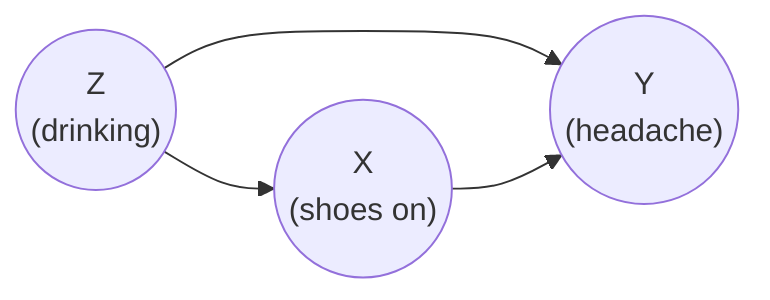
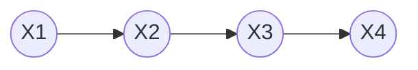
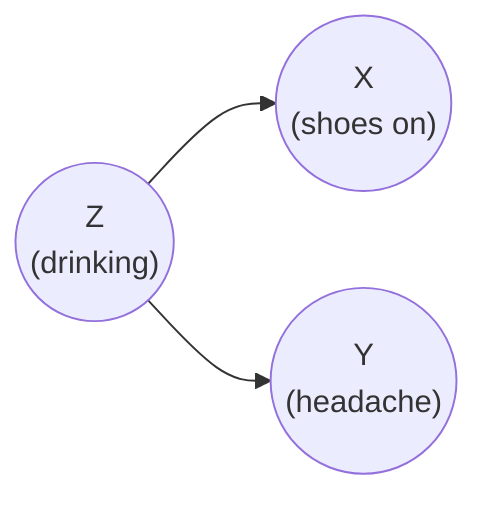
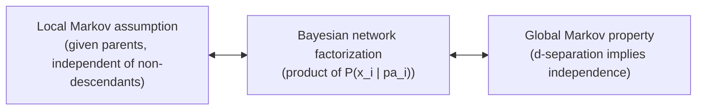
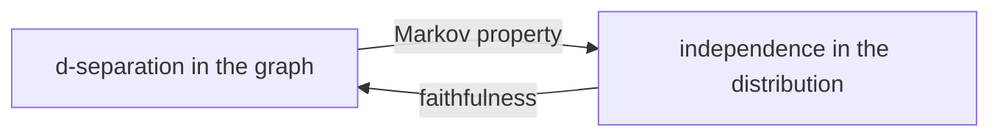
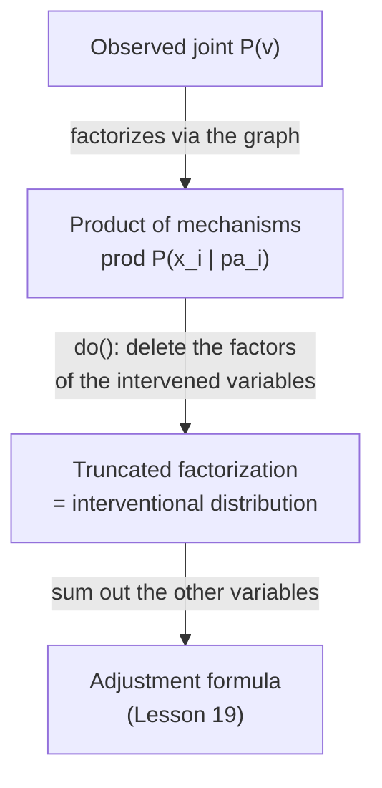

# Lesson 22: Two Flows — Association and Causation in Graphs

## Where We Left Off

Lesson 21 showed that in a randomized experiment, the association between treatment and outcome is entirely causal. Randomization cuts every arrow into the treatment, so nothing else connects the two. This lesson describes the general picture behind that result.

In any causal graph, association between two variables travels along paths. Some paths carry causation. The others carry association that is not causal. Identification, which the rest of Part 3 continues, is the job of separating the first kind from the second.

*Notation.* As in Lessons 18–21, $X$ is the treatment, $Y$ the outcome, and $Z$ another variable.

## Two Kinds of Association

Neal's first chapter uses an everyday example. People who sleep with their shoes on are more likely to wake up with a headache. Sleeping in shoes does not cause much of a headache. Instead, both are caused by something else: drinking the night before. Drinking makes people more likely to fall asleep with their shoes on, and more likely to wake up with a headache. So shoes and headaches go together even though neither causes the other. Association that arises through a common cause like this is called **confounding association**.

Now suppose sleeping in shoes *does* have a small effect on headaches, perhaps through poor sleep. Then the association we observe is a mixture: part of it is the shoes' own effect, and part of it comes through drinking.

*Neal's example. Association between $X$ and $Y$ travels along two paths: the direct path $X \to Y$, and the path $X \leftarrow Z \to Y$ through the common cause.*

Two rules describe where each kind travels:

- **Association** travels along every *unblocked* path between $X$ and $Y$, whichever way the arrows point. (Lesson 03 covered which paths are blocked.)
- **Causation** travels only along *directed* paths from $X$ to $Y$: paths on which every arrow points away from $X$ and toward $Y$.

So the association between $X$ and $Y$ has two parts.

1. **Causal association** is the part carried by directed paths.
2. **Non-causal association** is the part carried by every other unblocked path.

In the shoes example, $X \to Y$ carries the causal part and $X \leftarrow Z \to Y$ carries the non-causal part.

Confounding association, through a common cause, is the most frequent kind of non-causal association, but it is not the only kind. Conditioning on a collider (Lesson 03) also creates association between its parents. That association is non-causal, yet no common cause is involved, so it is not confounding. It is called **collider bias** or selection bias.

### How the Three Building Blocks Treat a Path

Every path is built from three-node pieces. Each piece decides two things: whether association can pass through it, and whether the path containing it could be causal.

| Piece | Association passes if the middle node is *not* conditioned on? | Conditioning on the middle node | Can the path be causal? |
|---|---|---|---|
| Chain $X \to Z \to Y$ | Yes | Blocks it | Yes, if all its arrows point from $X$ toward $Y$ |
| Fork $X \leftarrow Z \to Y$ | Yes | Blocks it | No |
| Collider $X \to Z \leftarrow Y$ | No | **Opens** it | No |

A fork makes a path non-causal, because on one side of the fork an arrow points back toward $X$. A chain does not decide the matter by itself. The path $X \leftarrow Z_1 \leftarrow Z_2 \to Y$ contains the chain $Z_2 \to Z_1 \to X$, yet the path is non-causal, because the chain points toward $X$ rather than away from it.

### A Worked Example: When "Causal Plus Non-causal" Is Literally a Sum

In a linear model the two parts add up exactly, and this example shows why. Take a linear version of the shoes graph, with one equation per variable:

$$
\begin{aligned}
Z &:= U_Z \\
X &:= aZ + U_X \\
Y &:= bX + cZ + U_Y
\end{aligned}
$$

Here $a$ is the effect of $Z$ on $X$, $b$ the effect of $X$ on $Y$, and $c$ the effect of $Z$ on $Y$. The three numbers are the strengths of the three arrows:

- $a$ for $Z \to X$: how much drinking raises shoe-wearing;
- $b$ for $X \to Y$: how much shoe-wearing raises headaches. This is the causal effect we want;
- $c$ for $Z \to Y$: how much drinking raises headaches directly.

The noise terms $U_Z, U_X, U_Y$ stand for everything else that affects each variable. They are independent of one another and average zero. To keep the numbers simple, set $Var(Z) = 1$, and choose $\mathrm{Var}(U_X) = 1 - a^2$, which requires $|a| \le 1$. Then $X$ also has variance 1:

$$\mathrm{Var}(X) = a^2\, \mathrm{Var}(Z) + \mathrm{Var}(U_X) = a^2 + (1 - a^2) = 1.$$

**Measuring the association.** A regression of $Y$ on $X$ reports a slope: how much the average headache rises for each one-unit rise in shoe-wearing, *as seen in the data*. The slope equals $\mathrm{Cov}(X, Y) / \mathrm{Var}(X)$, and since $\mathrm{Var}(X) = 1$ here, it is simply $\mathrm{Cov}(X, Y)$. The calculation uses three facts about covariance:

- a covariance can be split across a sum, and constants can be pulled out of it;
- the covariance of a variable with itself is its variance;
- the covariance of two independent variables is zero.

$$
\begin{aligned}
\mathrm{Cov}(X, Y) &= \mathrm{Cov}(X,\; bX + cZ + U_Y) && \text{substitute the equation for } Y \\
&= b\,\mathrm{Cov}(X, X) + c\,\mathrm{Cov}(X, Z) + \mathrm{Cov}(X, U_Y) && \text{split the sum} \\
&= b\,\mathrm{Var}(X) + c\,\mathrm{Cov}(X, Z) + 0 && X \text{ depends only on } U_Z \text{ and } U_X, \text{ so it is independent of } U_Y \\
&= b + c\,\mathrm{Cov}(aZ + U_X,\; Z) && \mathrm{Var}(X) = 1;\ \text{substitute the equation for } X \\
&= b + c\,\bigl(a\,\mathrm{Cov}(Z, Z) + \mathrm{Cov}(U_X, Z)\bigr) && \text{split the sum} \\
&= b + c\,\bigl(a\,\mathrm{Var}(Z) + 0\bigr) && U_X \text{ is independent of } Z \\
&= b + ac && \mathrm{Var}(Z) = 1
\end{aligned}
$$

**Reading the result.** The observed slope has two parts:

- $b$ is the causal association, carried by the path $X \to Y$;
- $ac$ is the non-causal association, carried by the path $X \leftarrow Z \to Y$. It is the product of the strengths of the two arrows on that path.

Why a product? Think about what happens when drinking goes up by one unit. Shoe-wearing goes up by $a$, and headaches go up by $c$, even though the shoes played no part. So drinking makes shoes and headaches rise together, and the strength of that shared movement is $a \times c$. (It comes out as exactly $a \times c$ because $Z$ and $X$ were both given a variance of 1. With other variances, the same product is scaled by $\mathrm{Var}(Z)/\mathrm{Var}(X)$.)

**With numbers.** Take $a = 0.5$, $b = 2$ and $c = 2$. The regression reports a slope of $2 + 0.5 \times 2 = 3$. The true effect of shoes is 2. The extra 1 is drinking showing up in the comparison.

**After intervening.** Now set shoe-wearing by intervention, $do(X = x)$. The equation for $X$ becomes $X := x$, so drinking no longer influences shoes: the arrow $Z \to X$ is cut. The equations for $Z$ and $Y$ are unchanged. Then:

$$
\begin{aligned}
\mathbb{E}[Y \mid do(X = x)] &= \mathbb{E}[bx + cZ + U_Y] && \text{the equation for } Y, \text{ with } X \text{ set to } x \\
&= bx + c\,\mathbb{E}[Z] + \mathbb{E}[U_Y] && \text{split the average} \\
&= bx + c\,\mathbb{E}[U_Z] + \mathbb{E}[U_Y] && \text{substituting } Z = U_Z \\
&= bx && \text{being noise terms, we assumed } \mathbb{E}[U_Z] = \mathbb{E}[U_Y] = 0 \text{ above.}
\end{aligned}
$$

Each one-unit increase in $x$ now raises the average headache by exactly $b = 2$. The non-causal part $ac$ has disappeared, because the path through drinking no longer reaches $X$. The causal part is untouched. Lesson 25 turns this path-by-path calculation into a general method for linear models.

### Intuition: Why the Zero Averages Do Not Matter

*This subsection records a clarification raised in discussion; the derivation above remains the formal statement.*

The last step of the derivation used $\mathbb{E}[Z] = 0$. Two facts justify it, and a third shows it is only a convenience.

- **Before the intervention.** The equation for drinking is $Z := U_Z$, so drinking is just its noise term, and the noise terms were assumed to average zero. Hence $\mathbb{E}[Z] = \mathbb{E}[U_Z] = 0$.
- **After the intervention.** $do(X = x)$ replaces only the equation for $X$. The equation $Z := U_Z$ is untouched, so drinking still averages zero. This is the modularity of Lesson 18: an intervention changes one mechanism and leaves the others as they were. In the story, forcing people to sleep in their shoes does not change how much they drank the night before.
- **The zero is not essential.** Had drinking averaged some other value $\mu$, the result would have been $\mathbb{E}[Y \mid do(X = x)] = bx + c\mu$. This still rises by exactly $b$ for each one-unit increase in $x$; only the starting level $c\mu$ changes. The zero averages simply remove that constant.

### Outside Linear Models

The clean sum ($b + ac$) in the aforementioned example depends on the model being linear. In a linear model, each arrow adds a fixed amount that does not depend on the values of any other variable, so the contributions of separate paths simply add up. In most real situations this fails. Suppose, for example, that sleeping in shoes worsens headaches only for people who drank. Then the effect of the shoes depends on drinking, the causal and non-causal parts become tangled together, and there is no longer a single number that belongs to each path.

What always holds is the qualitative version. Association between $X$ and $Y$ can only come through unblocked paths. If every unblocked path is directed, all of the association is causal; if some non-directed path is unblocked, part of it is not. How large each part is, and whether the two can be written as a sum at all, depends on the model and on how association is measured.

### An Exact Split You Have Already Met

There is one important exception, and it is a split you have seen before. Make shoe-wearing a yes-or-no variable: $X = 1$ for people who slept in their shoes and $X = 0$ for those who did not. The simplest measure of association is then the difference in average headache between the two groups, $\mathbb{E}[Y \mid X=1] - \mathbb{E}[Y \mid X=0]$. Lesson 10 split this difference into a causal part and a bias, using potential outcomes. The path picture now shows what each part is.

The key question to ask about the shoe-sleepers is: how would they have fared *without* their shoes? Write $\mathbb{E}[Y(0) \mid X=1]$ for their average headache in that hypothetical. It can never be observed, but it lets the observed difference be split into two pieces:

$$
\begin{aligned}
\mathbb{E}[Y \mid X=1] - \mathbb{E}[Y \mid X=0]
&= \mathbb{E}[Y(1) \mid X=1] - \mathbb{E}[Y(0) \mid X=0] && \text{consistency (Lesson 21, Fact 2)} \\
&= \underbrace{\mathbb{E}[Y(1) \mid X=1] - \mathbb{E}[Y(0) \mid X=1]}_{\text{ATT}} + \underbrace{\mathbb{E}[Y(0) \mid X=1] - \mathbb{E}[Y(0) \mid X=0]}_{B} && \text{add and subtract } \mathbb{E}[Y(0) \mid X=1]
\end{aligned}
$$

The first line uses consistency: each group's observed outcome is its potential outcome for the treatment it actually received. The second line adds and subtracts the same quantity, which changes nothing but splits the difference in two. Each piece answers a separate question.

- **The first piece compares the shoe-sleepers with themselves:** with their shoes, and without them. Only the shoes differ between the two terms, so this is the shoes' own effect, averaged over the people who wore them. It is called the **average treatment effect on the treated (ATT)**, and it is the association carried by the directed path $X \to Y$.
- **The second piece compares the two groups on equal terms: both without shoes.** Its first half is the shoe-sleepers' hypothetical no-shoes headache. Its second half is the actual headache of the people who did not sleep in shoes, since they really had no shoes. The shoes play no part in either half, so any difference comes from how the groups differ otherwise: here, the shoe-sleepers drank more. This is the **baseline difference $B$**, the association carried by the path $X \leftarrow Z \to Y$. If shoe-sleepers had drunk no more than anyone else, for instance because shoes were assigned by coin toss as in Lesson 21, $B$ would be zero.

This split holds in every model, linear or not, because it never divides the association path by path. It compares two groups through one hypothetical question.

One detail links it back to Lesson 10, which wrote the first piece as the ATE, the average effect over *everyone*, rather than the ATT.

- The ATE and the ATT are equal when the shoes have the same effect on everyone, a *constant treatment effect*. (This is a separate assumption from consistency, which concerns what the treatment is, not how large its effect is.) 
- They are also equal whenever the shoe-sleepers are a random slice of the population, as under random assignment, because then their average effect is everyone's average effect. 

Otherwise they can differ. Take the case from the previous paragraphs, where shoes worsen headaches only for drinkers. The shoe-sleepers include more drinkers than the population as a whole, so the effect among them is larger than the effect averaged over everyone, and the ATT exceeds the ATE. Lesson 10's version is exact only when the two coincide.

For other measures of association, such as differences in variances or in medians, there is no such clean split. The path picture still tells which paths carry association, but the algebra must be worked out afresh for each measure.

### Isolating Causation

Neal states the goal of identification in these terms. The association between $X$ and $Y$ equals the causal effect when no non-causal association flows between them. There is a graphical test for this. Delete the arrows *out of* $X$. Any path still connecting $X$ and $Y$ must then be non-causal, since every causal path starts with one of the deleted arrows. If $X$ and $Y$ are d-separated in this edited graph, given whatever is being conditioned on, then no non-causal path is open, and the remaining association is causal.

This is the backdoor criterion of Lesson 20 seen from another angle, and the two main tools so far both work this way. Randomization (Lesson 21) removes the non-causal paths by cutting the arrows into $X$. Adjustment (Lessons 19–20) blocks them by conditioning on the right variables. Neither argues that the non-causal part is small; both remove it. Later methods, such as instrumental variables (Lessons 38–39), identify effects in other ways.

## The Bayesian Network Factorization

So far the graph has been used to trace paths. It also says something about the joint distribution of its variables: which variables each one depends on directly. This section builds that link in four steps, following Neal's Chapter 3. It starts with a formula that holds for every distribution, adds one assumption supplied by the graph, and ends with a much simpler formula.

### Step 1: The Chain Rule Holds for Every Distribution

The chain rule of probability writes any joint distribution as a product of conditionals, each variable conditioned on all the variables before it:

$$P(x_1, x_2, \ldots, x_n) = P(x_1) \prod_{i=2}^{n} P(x_i \mid x_{i-1}, \ldots, x_1).$$

No graph and no assumption is involved. For four variables:

$$P(x_1, x_2, x_3, x_4) = P(x_1)\, P(x_2 \mid x_1)\, P(x_3 \mid x_2, x_1)\, P(x_4 \mid x_3, x_2, x_1).$$

The trouble is the size of the later factors. Suppose the variables are binary. The last factor, $P(x_4 \mid x_3, x_2, x_1)$, needs one probability for each of the $2^3 = 8$ combinations of $x_1, x_2, x_3$. Adding up all four factors gives $1 + 2 + 4 + 8 = 15$ numbers, and in general $2^n - 1$. With 30 binary variables that is more than a billion numbers, far more than any data set could pin down.

### Step 2: The Graph Supplies the Local Markov Assumption

A graph says that most of those conditioning variables are irrelevant. The assumption that makes this precise is:

> **Local Markov assumption.** Given its parents in the DAG, a node is independent of all its non-descendants. Writing $\mathrm{PA}(X_i)$ for the parents of $X_i$ and $\mathrm{ND}(X_i)$ for its non-descendants:
> $$X_i \perp\!\!\!\perp \big(\mathrm{ND}(X_i) \setminus \mathrm{PA}(X_i)\big) \mid \mathrm{PA}(X_i).$$

In words: once a variable's direct causes are known, nothing else that is not downstream of it adds any information about it. Variables further upstream, and variables on other branches of the graph, tell you nothing more.

### Step 3: Apply It to the Chain Rule

**A chain.** Take four variables in a line:

Go through the four chain-rule factors one at a time.

- $P(x_1)$ has nothing to condition on. It stays.
- $P(x_2 \mid x_1)$ conditions only on $X_1$, the parent of $X_2$. It stays.
- $P(x_3 \mid x_2, x_1)$: the parent of $X_3$ is $X_2$, and $X_1$ is a non-descendant of $X_3$. The local Markov assumption says $X_1$ adds nothing once $X_2$ is known, so the factor becomes $P(x_3 \mid x_2)$.
- $P(x_4 \mid x_3, x_2, x_1)$: the parent of $X_4$ is $X_3$, and $X_1, X_2$ are non-descendants of $X_4$. The factor becomes $P(x_4 \mid x_3)$.

The result is

$$P(x_1, x_2, x_3, x_4) = P(x_1)\, P(x_2 \mid x_1)\, P(x_3 \mid x_2)\, P(x_4 \mid x_3).$$

For binary variables this needs $1 + 2 + 2 + 2 = 7$ numbers instead of 15, and the saving grows quickly with more variables. This is also the familiar formula for a Markov chain; the next subsection explains why.

**A fork.** Now take Neal's original shoes example, in which shoes have no effect on headaches:

*Shoes and headaches share a cause, drinking, but neither affects the other.*

Order the variables $Z, X, Y$. The chain rule gives $P(z)\, P(x \mid z)\, P(y \mid x, z)$. The parent of $Y$ is $Z$, and $X$ is a non-descendant of $Y$, so the last factor becomes $P(y \mid z)$:

$$P(z, x, y) = P(z)\, P(x \mid z)\, P(y \mid z).$$

Here the variable that is dropped, $X$, is not "further back" in time. It sits on a separate branch. The local Markov assumption removes it all the same, because it is not downstream of $Y$.

**The general rule.** List the variables so that every variable comes after its parents. Everything listed before $X_i$ is then a non-descendant of $X_i$, because a descendant always comes later in such a list. So the local Markov assumption reduces each chain-rule factor $P(x_i \mid \text{everything before } x_i)$ to $P(x_i \mid pa_i)$. That gives:

> **Definition (Bayesian network factorization).** A distribution $P$ factorizes according to a DAG $G$ if
> $$P(x_1, x_2, \ldots, x_n) = \prod_{i} P(x_i \mid pa_i),$$
> where $pa_i$ denotes the values of the parents of $X_i$ in $G$.

The argument also runs backwards: a distribution that factorizes this way (i.e., as a Bayesian Network Factorization) satisfies the local Markov assumption. The two are equivalent, so either can be taken as the starting assumption. Neal refers to Koller and Friedman for the proofs.

When every earlier variable is a parent, nothing is dropped. The shoes graph used earlier in this lesson, with the arrow $X \to Y$ present, is like that: the parents of $Y$ are $X$ and $Z$, and its factorization is simply the chain rule, $P(z)\, P(x \mid z)\, P(y \mid x, z)$. The fewer arrows a graph has, the more the factorization simplifies. Lesson 19 used this factorization to derive the truncated product rule, which a later section of this lesson returns to.

### Intuition: The Markov Property of Stochastic Processes

*This subsection records a connection raised in discussion; the statements above remain the formal definitions.*

The name "Markov" is not a coincidence. The Markov property of stochastic processes says the future depends on the past only through the present:

$$X_{t+1} \perp\!\!\!\perp X_0, \ldots, X_{t-1} \mid X_t.$$

A process $X_0, X_1, X_2, \ldots$ drawn as a causal graph is exactly the chain of Step 3. The only parent of $X_{t+1}$ is $X_t$ (the present) and its non-descendants include $X_0, \ldots, X_{t-1}$ (the past). So on a chain, the local Markov assumption *is* the stochastic-process Markov property, and the chain's factorization is the usual Markov-chain formula. The graphical version generalizes it in three ways:

| Stochastic process | Causal graph |
| --- | --- |
| Variables are ordered by **time** | Variables are ordered by the **arrows** |
| The "present" is a single state, $X_t$ | The "present" is the **set of parents**, which may contain several variables |
| What is screened off is the **past** | What is screened off is every **non-descendant**, including other branches |

### Step 4: Independences for Any Sets — the Global Markov Property

The local Markov assumption speaks only about one variable at a time, given its own parents. Combined with d-separation (Lesson 03), it yields a statement about any sets of variables. First, a check that the factorization really does produce independences. In the fork above, $X$ and $Y$ are d-separated given $Z$, and the factorization turns this into an independence:

$$
\begin{aligned}
P(x, y \mid z) &= \frac{P(z, x, y)}{P(z)} && \text{definition of conditional probability} \\
&= \frac{P(z)\, P(x \mid z)\, P(y \mid z)}{P(z)} && \text{factorization for this graph} \\
&= P(x \mid z)\, P(y \mid z) && \text{cancel } P(z)
\end{aligned}
$$

The last line says that $X$ and $Y$ are independent given $Z$, written $X \perp\!\!\!\perp Y \mid Z$. Among people who drank the same amount, knowing whether someone slept in their shoes tells you nothing more about their headache.

The general statement is:

> **Global Markov property.** Every d-separation in the graph holds as an independence in the distribution. For any disjoint sets of variables $A$, $B$ and $C$:
> $$A \perp_G B \mid C \;\;\Longrightarrow\;\; A \perp\!\!\!\perp_P B \mid C,$$
> where $A \perp_G B \mid C$ means "$A$ and $B$ are d-separated by $C$ in the graph $G$", and $A \perp\!\!\!\perp_P B \mid C$ means "$A$ and $B$ are independent given $C$ in the distribution $P$".

The three statements of this section are equivalent for a DAG. Each one implies the other two:

*Three forms of one assumption. "Markov with respect to $G$" means any of them.*

### Minimality: Every Arrow Matters

The Markov property only says which independences a graph *guarantees*. It does not forbid more. Take the two-node graph $X \to Y$. Its factorization is $P(x)\, P(y \mid x)$. But a distribution in which $X$ and $Y$ are independent also fits that form, since then $P(y \mid x) = P(y)$. So the arrow $X \to Y$ is allowed to be idle.

Neal therefore usually adds a slightly stronger assumption:

> **Minimality assumption.** (1) Given its parents in the DAG, a node is independent of all its non-descendants (the local Markov assumption). (2) Adjacent nodes in the DAG are dependent.

Neal also gives condition (2) in an equivalent, more precise form: no arrow can be removed, because removing any arrow would make the graph claim an independence that the distribution does not have. "Dependent" is meant in this sense. Two adjacent nodes can still happen to be independent when nothing else is held fixed, as the next subsection shows, without an arrow becoming removable.

### The Reverse Direction: Faithfulness

Minimality rules out idle arrows, but it still allows some independences that the graph does not predict. **Faithfulness** is the assumption that there are none at all: the independences in the data are exactly those the graph guarantees.

> **Faithfulness.** Every independence in the distribution comes from a d-separation in the graph:
> $$A \perp\!\!\!\perp_P B \mid C \;\;\Longrightarrow\;\; A \perp_G B \mid C.$$

*The Markov property says the graph's d-separations appear in the data. Faithfulness says the data's independences come only from the graph. With both, the independences in the data are exactly the d-separations in the graph.*

Faithfulness can fail. Return to the linear worked example, where $X$ and $Y$ are connected by two paths, $X \to Y$ and $X \leftarrow Z \to Y$, and so are *not* d-separated. The observed slope was $b + ac$. Keep $a = 0.5$ and $c = 2$, but suppose sleeping in shoes *relieves* headaches, with $b = -1$. Then

$$\mathrm{Cov}(X, Y) = b + ac = -1 + 0.5 \times 2 = 0.$$

The shoes' protective effect exactly cancels the association that drinking creates. If the noise terms are normally distributed, zero covariance means independence, so $X \perp\!\!\!\perp Y$ even though the graph connects them. The distribution is Markov with respect to the graph but not faithful to it. It is still minimal: once drinking is held fixed, $X$ and $Y$ are dependent again, because $b \neq 0$, so the arrow $X \to Y$ cannot be removed. The independence appears only when drinking is left free to vary. That is exactly the kind of extra independence minimality permits and faithfulness forbids.

A cancellation like this requires the arrow strengths to balance perfectly, which is why faithfulness is usually considered a reasonable assumption. It matters in Lesson 41, where the graph is learned from data rather than assumed. A method that reads every independence as a missing connection would, in this example, wrongly conclude that shoes and headaches are unrelated.

### Testing a Graph Against Data

The Markov property has a practical consequence: **a causal graph makes predictions that data can check** (Primer §2.5). Every d-separation in the graph predicts an independence in the data. If the data show a dependence where the graph predicts independence, the graph is wrong.

**An example.** Take the chain from Step 3, $X_1 \to X_2 \to X_3 \to X_4$. By d-separation (Lesson 03), $X_2$ blocks the only path between $X_1$ and $X_3$, so the graph predicts

$$X_1 \perp\!\!\!\perp X_3 \mid X_2.$$

A simple way to check this in linear data is a regression. Fit

$$x_3 = r_2\, x_2 + r_1\, x_1 + \text{error}.$$

If the graph is right, $X_1$ adds nothing once $X_2$ is known, so $r_1$ should be zero. If the fitted $r_1$ is clearly not zero, the data contradict the graph. The test also says *where* the graph is wrong: there must be a connection between $X_1$ and $X_3$ that does not pass through $X_2$, such as a direct arrow $X_1 \to X_3$. (A nonzero coefficient shows a dependence. A zero coefficient shows only the absence of a *linear* dependence, which is why the Primer's examples assume linear models.)

**Why test this way.** The Primer compares d-separation tests with the traditional method, which fits the whole model at once (usually assuming linear equations with normal noise) and asks how likely the data are under it. The d-separation approach has three advantages:

1. **It needs no functional form.** The predicted independences follow from the graph alone, whatever the equations are.
2. **It is local.** Each test checks one part of the graph, so a failed test points to the part that needs repair. A failed global test says only that something, somewhere, is wrong.
3. **It still works when some parameters cannot be estimated.** A global test needs every parameter; a local test needs only the variables it involves.

**What passing the tests means.** If every independence the graph predicts is found in the data, then no further test on observational data can refute the graph (Verma and Pearl, 1990). That does not prove the graph is right. Different graphs can predict exactly the same independences. For example, the chain $X_1 \to X_2 \to X_3$ and the fork $X_1 \leftarrow X_2 \to X_3$ both predict only $X_1 \perp\!\!\!\perp X_3 \mid X_2$. Such graphs form an **equivalence class**: they share the same skeleton (the arrows with directions ignored) and the same colliders whose two parents are not adjacent. Searching the data for the equivalence class that fits is called **causal search**, or causal discovery, and Lesson 41 develops it.

### Conditioning Keeps Every Factor

Conditioning and intervening change the factorization in different ways, and the difference explains collider bias.

To condition on $Z = z$, keep every factor, plug in the value $z$ wherever $Z$ appears, and divide by $P(z)$ so the result sums to one. No factor is removed.

Consider a collider $X \to W \leftarrow Y$, whose factorization is $P(x)\,P(y)\,P(w \mid x, y)$. Before conditioning, $X$ and $Y$ are independent: their joint distribution is just $P(x)\,P(y)$. Condition on $W = w$. The factor $P(w \mid x, y)$ stays in the product with $w$ fixed, and it is now a function of $x$ and $y$ *together*. That factor ties $X$ and $Y$ to each other. This is collider bias, written in algebra.

## Interventions Remove the Non-causal Flow

The do-operator works on the factorization by deleting the intervened variable's factor. This is the surgery of Lesson 18 and the truncated product rule of Lesson 19:

$$P(v_1, \ldots, v_n \mid do(X = x)) = \prod_{j:\, V_j \neq X} P(v_j \mid pa_j), \qquad \text{with } X \text{ set to } x \text{ wherever it appears.}$$

The formula applies to values $v_1, \ldots, v_n$ in which $X$ takes the value $x$; values with any other $X$ have probability zero under the intervention.

For the shoes graph:

$$P(z, y \mid do(x)) = P(z)\, P(y \mid x, z).$$

The factor $P(x \mid z)$ is gone. That factor was the route by which drinking influenced shoe-wearing. Once it is removed, $X$ no longer depends on $Z$, and the path $X \leftarrow Z \to Y$ carries nothing. In the intervened distribution, all remaining association between $X$ and $Y$ is causal. Deleting one factor while leaving the rest unchanged relies on modularity (Lesson 18): each factor is a separate mechanism, and an intervention replaces only one of them.

Conditioning on $X$ alone cannot do this. It keeps $P(x \mid z)$, so heavy drinkers stay over-represented among people who slept in their shoes. Conditioning on $Z$ as well, and then averaging over $P(z)$, is the adjustment formula of Lesson 19: conditioning used correctly to reproduce the intervention.

*The route from graph to identification result that Lessons 18–22 have built.*

## Where This Sits in the Course

Lesson 15 introduced the full pipeline: a causal estimand is turned by **identification** into a statistical estimand, and **estimation** then turns that into an estimate from data. Lesson 18 used the same two stages to organize Part 3. Identification uses only the graph and is done on paper. Estimation computes the resulting formula from a finite data set.

Part 3 is mainly about the first stage (i.e., identification): the Causal Effect Rule, the adjustment formula, the backdoor criterion and randomization, and, still to come, the front-door criterion and the do-calculus. The numerical examples along the way, such as the drug data in Lesson 19, did include a simple estimation step. Each probability in the identified formula was replaced by the matching proportion in the data table, and the formula was evaluated. This **plug-in** approach works when there are only a few strata, each with plenty of units. Part 5 takes up what to do when it breaks down: many or continuous covariates, strata with few or no units, and the need to state how uncertain an estimate is.

## Summary and Key Takeaways

1. Association travels along every unblocked path; causation travels only along directed paths from $X$ to $Y$. The association between $X$ and $Y$ therefore has a **causal** part and a **non-causal** part.
2. Confounding (through a common cause) is the most frequent kind of non-causal association. Collider bias is another kind, and it is not confounding.
3. Chains and forks pass association unless their middle node is conditioned on; colliders block it unless their middle node is conditioned on. A fork or collider on a path makes the path non-causal.
4. In linear models the two parts literally add: the observed slope is the causal coefficient plus the product of coefficients along each non-causal path. For the difference in means, the exact split is ATT plus the baseline difference $B$.
5. The chain rule factorizes any distribution but needs exponentially many numbers. The **local Markov assumption** (given its parents, a variable is independent of its non-descendants) drops every conditioning variable except the parents, giving the **Bayesian network factorization** $P(v) = \prod_i P(x_i \mid pa_i)$. The local assumption, the factorization and the global (d-separation) form are equivalent. On a chain they reduce to the Markov property of stochastic processes. **Minimality** adds that no arrow is idle; **faithfulness** adds that the graph accounts for every independence.
7. **Graphs can be tested.** Each d-separation predicts an independence the data should show, for instance a zero coefficient in a regression. The tests are local and need no functional form. Graphs that pass the same tests form an equivalence class, which Lesson 41 searches for.
6. **Conditioning** keeps every factor, which is why conditioning on a collider creates association. **Intervening** deletes the intervened variable's factor, which removes the non-causal flow into $X$.

**Next step:** Lesson 23 takes up the first graph in which the backdoor criterion fails: an unmeasured confounder with no measured variable that can block its path. It shows how a mediator can still identify the effect: the **front-door criterion**.

### Check Your Understanding

1. In the fork $X \leftarrow Z \to Y$, conditioning on $Z$ blocks the non-causal association, just as $do(X = x)$ does. Using the factorization, explain why conditioning on $Z$ is still a different operation from intervening on $X$.
2. Write the factorization of the shoes graph, then its truncated version under $do(X = x)$. Which factor disappears, and which path stops carrying association as a result?
3. In the linear example, suppose drinking makes shoe-wearing *less* likely, so $a = -0.5$, with $b = c = 2$ as before. What slope would a regression of $Y$ on $X$ report? What does this say about whether the non-causal part can hide a real effect?
4. Can observational data alone tell whether the non-causal association in the shoes example is present? What would you need in addition?
5. List every independence that the chain $X_1 \to X_2 \to X_3 \to X_4$ predicts between two single variables given a third. For one of them, write the regression you would run to test it and say which coefficient should be zero.

---

## Further Reading

*Ref*: Brady Neal, *Introduction to Causal Inference* (Dec 2020 draft), Chapter 1 (the shoes-and-headache example), Chapter 3 ("The Flow of Association and Causation in Graphs", Bayesian networks) and Chapter 4 (the do-operator and truncated factorization); *Causal Inference in Statistics: A Primer (2016)*, Chapter 2, Sections 2.4–2.5 (d-separation; model testing and causal search) and Chapter 3, Section 3.2 (the truncated product formula).
