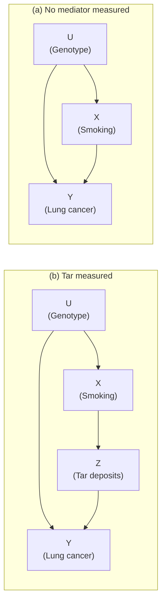

# Lesson 23: The Front-Door Criterion

## Where We Left Off

Lesson 20 showed that the backdoor criterion is sufficient for identification but not necessary: an effect can be identifiable even when no measured set blocks the backdoor paths. This lesson gives the classic example. The confounder is unmeasured, so the backdoor criterion fails outright, yet the effect can still be computed from data. What makes it possible is a **mediator**, a measured variable that carries the whole effect of the treatment to the outcome.

*Notation.* $X$ is the treatment, $Y$ the outcome, and $U$ an unmeasured confounder. In this lesson, following the Primer, $Z$ is the mediator between $X$ and $Y$, not a covariate as in Lessons 18–22.

## The Problem: Smoking and Lung Cancer

Smokers get lung cancer more often than non-smokers. Before 1970, the tobacco industry held off anti-smoking laws by offering another explanation for that association (Primer §3.4). Suppose some people carry a **genotype** that does two things: it makes them more likely to develop lung cancer, and it gives them an inborn craving for nicotine. People with the genotype would then be more likely to smoke *and* more likely to get cancer. Smokers would get cancer more often even if smoking itself did no harm at all.

In the language of Lesson 03, the genotype is a confounder: a fork $X \leftarrow U \to Y$ between smoking and cancer. The industry's claim was that this fork, not smoking, explains the association. Nobody could measure the genotype, so it seemed that no data could settle the argument. The graphs below make that precise.

*Primer Figure 3.10: (a) the model with an unmeasured genotype; (b) the same model with a measured mediator, tar deposits in the lungs.*

In model (a), the backdoor path $X \leftarrow U \to Y$ can only be blocked at $U$, which is unmeasured. The effect of smoking is **not identifiable**: no amount of data can say how much of the smoking–cancer correlation is causal and how much comes through the genotype.

Model (b) adds one measurement, tar deposits $Z$, and makes one assumption about it: smoking affects cancer *only* through tar. The backdoor path $X \leftarrow U \to Y$ is still unblockable (because the confounder $U$ is still unmeasured), so the backdoor criterion still fails. Yet the effect *is* identifiable.

## The Three-Step Argument

The effect of smoking on cancer cannot be found in one go, because the genotype confounds it. The idea is to split it at the mediator into two smaller effects:

- the effect of smoking on tar ($X \to Z$);
- the effect of tar on cancer ($Z \to Y$).

Each of the two can be identified with the backdoor criterion of Lesson 20, even though the whole effect cannot. Step 3 then joins them.

**Step 1: the effect of smoking on tar.** The backdoor criterion asks for the paths from $X$ to $Z$ that begin with an arrow *into* $X$. There is one:

$$X \leftarrow U \to Y \leftarrow Z.$$

Both arrows on either side of $Y$ point into it, so $Y$ is a collider on this path. By Lesson 03, a collider blocks a path as long as it is not conditioned on. So the path is already blocked, and nothing needs to be adjusted for: the empty set satisfies the backdoor criterion. The adjustment formula with nothing to adjust for is simply the conditional probability:

$$P(Z = z \mid do(X = x)) = P(Z = z \mid X = x). \tag{3.12}$$

In words: the genotype affects smoking but not tar directly. So the difference in tar between smokers and non-smokers is caused by smoking, not by the genotype.

**Step 2: the effect of tar on cancer.** Now treat tar $Z$ as the treatment and cancer $Y$ as the outcome. The backdoor paths from $Z$ to $Y$ are the paths that begin with an arrow into $Z$. There is one:

$$Z \leftarrow X \leftarrow U \to Y.$$

This path is open: it has no collider. But smoking $X$ sits in the middle of the chain $Z \leftarrow X \leftarrow U$, and smoking is measured. Conditioning on $X$ blocks the path (Lesson 03). $X$ is also not a descendant of $Z$. So $\{X\}$ satisfies the backdoor criterion for the effect of $Z$ on $Y$, and the adjustment formula of Lesson 19 gives

$$P(Y = y \mid do(Z = z)) = \sum_{x'} P(Y = y \mid Z = z, X = x')\, P(X = x'). \tag{3.13}$$

In words: compare people with and without tar *who smoke the same amount*. Among them, the genotype can no longer reach tar through smoking. Then average these comparisons over the population's smoking distribution. The summation index is written $x'$ to keep it apart from the value $x$ that will be set in Step 3.

**Step 3: join the two effects.** Imagine setting everyone's smoking to $x$. By the law of total probability, split the resulting chance of cancer by tar level:

$$P(Y = y \mid do(X = x)) = \sum_z P(Y = y \mid do(X = x), Z = z)\, P(Z = z \mid do(X = x)).$$

The second factor is Step 1's result. The first factor is the chance of cancer among people who ended up with tar level $z$ after smoking was set to $x$. Two facts about the graph turn it into Step 2's result.

1. **Smoking reaches cancer only through tar.** Once tar is known to be $z$, the value $x$ that smoking was set to adds nothing further about cancer.
2. **After the intervention, tar is no longer confounded.** Setting smoking cuts the arrow $U \to X$, so the genotype can no longer influence tar at all. Tar then has no backdoor path to cancer, and seeing tar at level $z$ tells us the same as setting it to $z$.

Together these give $P(Y = y \mid do(X = x), Z = z) = P(Y = y \mid do(Z = z))$. Substituting:

$$P(Y = y \mid do(X = x)) = \sum_z P(Y = y \mid do(Z = z))\, P(Z = z \mid do(X = x)). \tag{3.14}$$

In words: setting smoking to $x$ produces a mix of tar levels (Step 1), and each tar level carries its own chance of cancer (Step 2). The effect of smoking is the average of those chances, weighted by how often smoking $x$ produces each tar level.

**Removing every $do$.** Substitute (3.12) for the second factor and (3.13) for the first:

$$P(Y = y \mid do(X = x)) = \sum_z \underbrace{P(Z = z \mid X = x)}_{\text{Step 1}} \; \underbrace{\sum_{x'} P(Y = y \mid Z = z, X = x')\, P(X = x')}_{\text{Step 2}}. \tag{3.15}$$

> [!IMPORTANT]
> **Equation (3.15) is the front-door formula.** Every quantity on the right is an ordinary conditional probability that can be computed from observational data. The unmeasured genotype $U$ does not appear anywhere.

The two facts in Step 3 were argued from the graph in words. The section "A Derivation from the Truncated Factorization" below proves the formula with the tools of Lessons 19 and 22. Lesson 24 proves it again with the rules of the do-calculus, where the two facts become its Steps 3 and 4.

## The General Criterion

> **Definition 3.4.1 (Front-Door).** A set $\mathbf{Z}$ satisfies the **front-door criterion** relative to $(X, Y)$ if:
>
> 1. $\mathbf{Z}$ **intercepts all directed paths** from $X$ to $Y$;
> 2. there is **no unblocked backdoor path** from $X$ to $\mathbf{Z}$;
> 3. all **backdoor paths from $\mathbf{Z}$ to $Y$ are blocked by $X$**.

> **Theorem 3.4.1 (Front-Door Adjustment).** If $\mathbf{Z}$ satisfies the front-door criterion relative to $(X, Y)$ and $P(x, z) > 0$, then
> $$P(y \mid do(x)) = \sum_z P(z \mid x) \sum_{x'} P(y \mid x', z)\, P(x'). \tag{3.16}$$

Each condition supports one step of the argument:

| Condition | What it guarantees | Step it supports |
| --- | --- | --- |
| 1. $\mathbf{Z}$ intercepts every directed path | Smoking affects cancer only through the mediator, so nothing is missed by chaining | Step 3 |
| 2. No open backdoor path from $X$ to $\mathbf{Z}$ | The effect of $X$ on $\mathbf{Z}$ needs no adjustment | Step 1 |
| 3. $X$ blocks every backdoor path from $\mathbf{Z}$ to $Y$ | The effect of $\mathbf{Z}$ on $Y$ can be adjusted using $X$ alone | Step 2 |

The positivity condition $P(x, z) > 0$ plays the role it played in Lesson 19: every combination of treatment and mediator must occur in the data, or some conditional in (3.16) is undefined.

## A Worked Example: The Tobacco Industry's Own Table

Pearl constructs a deliberately surprising data set: 800,000 subjects (400,000 smokers and 400,000 nonsmokers), all binary variables, numbers in thousands.

| Group | Tar: no cancer | Tar: cancer (rate) | No tar: no cancer | No tar: cancer (rate) | All: no cancer | All: cancer (rate) |
| :--- | :--- | :--- | :--- | :--- | :--- | :--- |
| **Smokers** ($N=400$) | 323/380 | 57/380 (**15%**) | 18/20 | 2/20 (**10%**) | 341/400 | 59/400 (**14.75%**) |
| **Nonsmokers** ($N=400$) | 1/20 | 19/20 (**95%**) | 38/380 | 342/380 (**90%**) | 39/400 | 361/400 (**90.25%**) |

*Primer Table 3.1, with cancer rates in brackets. Of the smokers, 380 have tar and 20 do not; of the nonsmokers, 20 have tar and 380 do not.*

**Two readings of the same table.**

- **The industry's reading** compares smokers with nonsmokers. Every comparison says smoking protects.
  - Overall, 15% of smokers have cancer against 90.25% of nonsmokers. 
  - Within the tar group it is 15% against 95%, and 
  - within the no-tar group 10% have cancer against 90%.
- **The anti-smoking lobbyists' reading** compares tar with no tar instead, within each smoking group (Primer Table 3.2). 
  - Among smokers, tar raises cancer from 10% to 15%. 
  - Among nonsmokers, it raises cancer from 90% to 95%. 
  - So tar is harmful. And smoking produces tar: 95% of smokers have tar deposits ($380/400$), against 5% of nonsmokers ($20/400$). So smoking should be harmful, through tar.

The data alone cannot settle which comparison is right. The graph can: under Figure 3.10(b), the front-door formula is the correct way to combine the numbers.

**Computing the front-door formula step-by-step.** Let $X$ be smoking ($1 = \text{smoke}, 0 = \text{do not smoke}$), $Z$ be tar ($1 = \text{tar}, 0 = \text{no tar}$), and $Y$ be cancer ($1 = \text{cancer}, 0 = \text{no cancer}$). 

Recall the front-door formula from Equation (3.15):

$$P(Y = y \mid do(X = x)) = \sum_{z \in \{0, 1\}} P(Z = z \mid X = x) \underbrace{\sum_{x' \in \{0, 1\}} P(Y = y \mid Z = z, X = x')\, P(X = x')}_{P(Y = y \mid do(Z = z)) \text{ from Step 2 (Eq. 3.13)}}. \tag{3.15}$$

We want to evaluate this for $y = 1$ (getting cancer) under $do(X = 1)$ and $do(X = 0)$.

---

### Step 1: Read the Ingredients from Table 3.1

From the 800,000 subjects in Table 3.1, extract the three sets of observational probabilities:

1. **Overall smoking proportions $P(X = x')$:**
   $$P(X = 1) = \frac{400}{800} = 0.50, \qquad P(X = 0) = \frac{400}{800} = 0.50$$

2. **Tar distribution conditioned on smoking $P(Z = z \mid X = x)$:**
   - Among smokers ($X = 1$):
     $$P(Z = 1 \mid X = 1) = \frac{380}{400} = 0.95, \qquad P(Z = 0 \mid X = 1) = \frac{20}{400} = 0.05$$
   - Among nonsmokers ($X = 0$):
     $$P(Z = 1 \mid X = 0) = \frac{20}{400} = 0.05, \qquad P(Z = 0 \mid X = 0) = \frac{380}{400} = 0.95$$

3. **Cancer rates conditioned on tar and smoking $P(Y = 1 \mid Z = z, X = x')$:**
   - In the tar stratum ($Z = 1$):
     $$P(Y = 1 \mid Z = 1, X = 1) = \frac{57}{380} = 0.15, \qquad P(Y = 1 \mid Z = 1, X = 0) = \frac{19}{20} = 0.95$$
   - In the no-tar stratum ($Z = 0$):
     $$P(Y = 1 \mid Z = 0, X = 1) = \frac{2}{20} = 0.10, \qquad P(Y = 1 \mid Z = 0, X = 0) = \frac{342}{380} = 0.90$$

---

### Step 2: Evaluate the Inner Sum (Causal Effect of Tar on Cancer)

The inner sum adjusts for $X$ using the backdoor adjustment (Equation 3.13) to find $P(Y = 1 \mid do(Z = z))$:

$$\sum_{x' \in \{0, 1\}} P(Y = 1 \mid Z = z, X = x')\, P(X = x') = P(Y = 1 \mid Z = z, X = 1)\, P(X = 1) + P(Y = 1 \mid Z = z, X = 0)\, P(X = 0)$$

Evaluate this for each tar state $z$:

- **For tar ($z = 1$):**
  $$
  \begin{aligned}
  P(Y = 1 \mid do(Z = 1)) &= P(Y = 1 \mid Z = 1, X = 1)\, P(X = 1) + P(Y = 1 \mid Z = 1, X = 0)\, P(X = 0) \\
  &= (0.15)(0.50) + (0.95)(0.50) \\
  &= 0.075 + 0.475 = \mathbf{0.55} \quad (55\%)
  \end{aligned}
  $$

- **For no tar ($z = 0$):**
  $$
  \begin{aligned}
  P(Y = 1 \mid do(Z = 0)) &= P(Y = 1 \mid Z = 0, X = 1)\, P(X = 1) + P(Y = 1 \mid Z = 0, X = 0)\, P(X = 0) \\
  &= (0.10)(0.50) + (0.90)(0.50) \\
  &= 0.050 + 0.450 = \mathbf{0.50} \quad (50\%)
  \end{aligned}
  $$

*Meaning:* Intervening to force tar into lungs raises cancer risk from $50\%$ to $55\%$ ($+5$ percentage points). Tar is causally harmful.

---

### Step 3: Evaluate the Outer Sum (Causal Effect of Smoking on Cancer)

Now substitute the inner sum values ($0.55$ and $0.50$) back into (3.15) and sum over $z \in \{0, 1\}$:

$$
\begin{aligned}
P(Y = 1 \mid do(X = x)) &= \sum_{z \in \{0, 1\}} P(Z = z \mid X = x)\, P(Y = 1 \mid do(Z = z)) \\
&= P(Z = 1 \mid X = x) \cdot \underbrace{P(Y = 1 \mid do(Z = 1))}_{0.55} + P(Z = 0 \mid X = x) \cdot \underbrace{P(Y = 1 \mid do(Z = 0))}_{0.50}
\end{aligned}
$$

Now compute the outcome under both interventions:

1. **Intervening to make everyone smoke ($do(X = 1)$):**
   $$
   \begin{aligned}
   P(Y = 1 \mid do(X = 1)) &= P(Z = 1 \mid X = 1) \cdot (0.55) + P(Z = 0 \mid X = 1) \cdot (0.50) \\
   &= (0.95)(0.55) + (0.05)(0.50) \\
   &= 0.5225 + 0.0250 = \mathbf{0.5475} \quad (54.75\%)
   \end{aligned}
   $$

2. **Intervening to make everyone abstain ($do(X = 0)$):**
   $$
   \begin{aligned}
   P(Y = 1 \mid do(X = 0)) &= P(Z = 1 \mid X = 0) \cdot (0.55) + P(Z = 0 \mid X = 0) \cdot (0.50) \\
   &= (0.05)(0.55) + (0.95)(0.50) \\
   &= 0.0275 + 0.4750 = \mathbf{0.5025} \quad (50.25\%)
   \end{aligned}
   $$

---

### Step 4: Compare Causal Effect with Observational Association

The **Average Causal Effect (ACE)** of smoking on cancer is:

$$\text{ACE} = P(Y = 1 \mid do(X = 1)) - P(Y = 1 \mid do(X = 0)) = 0.5475 - 0.5025 = \mathbf{+0.045} \quad (+4.5\%)$$

Smoking **raises** the probability of cancer by $4.5$ percentage points.

Compare this with the raw observational risk difference from Table 3.1:

$$P(Y = 1 \mid X = 1) - P(Y = 1 \mid X = 0) = \frac{59}{400} - \frac{361}{400} = 0.1475 - 0.9025 = \mathbf{-0.7550} \quad (-75.5\%)$$

In the observational data, smokers appear to have $75.5$ percentage points *less* cancer because the protective unmeasured genotype $U$ strongly confounds the raw association. The front-door formula successfully isolates the directed path $X \to Z \to Y$ and reveals that smoking is harmful.

Pearl stresses that these numbers are unrealistic by design: real data show smokers with more cancer, not less. The point is methodological: when two ways of reading the same table disagree, the graph decides which one is right, as it did for Simpson's paradox in Lesson 19.

## A Derivation from the Truncated Factorization

The intuitive Step 3 can be replaced by an argument that uses only tools from Lessons 19 and 22: the truncated factorization, d-separation, and the rules of probability. In Figure 3.10(b), the parents are: 
- none for $U$; 
- $U$ for $X$; 
- $X$ for $Z$; and 
- $Z, U$ for $Y$. 

So the Bayesian network factorization is

$$P(u, x, z, y) = P(u)\, P(x \mid u)\, P(z \mid x)\, P(y \mid z, u).$$

**Intervene.** Under $do(X = x)$, delete the factor $P(x \mid u)$ and sum out $U$ and $Z$:

$$P(y \mid do(x)) = \sum_z \sum_u P(u)\, P(z \mid x)\, P(y \mid z, u) = \sum_z P(z \mid x) \underbrace{\sum_u P(u)\, P(y \mid z, u)}_{\text{contains the unmeasured } U}.$$

**Remove $U$.** The bracketed sum still involves $U$. Two d-separation facts in Figure 3.10(b) let $U$ be eliminated:

- $Y \perp\!\!\!\perp X \mid Z, U$: the paths from $X$ to $Y$ are $X \to Z \to Y$, blocked by $Z$, and $X \leftarrow U \to Y$, blocked by $U$.
- $U \perp\!\!\!\perp Z \mid X$: the paths from $U$ to $Z$ are $U \to X \to Z$, blocked by $X$, and $U \to Y \leftarrow Z$, blocked because the collider $Y$ is not conditioned on.

Then, step by step:

$$
\begin{aligned}
\sum_u P(u)\, P(y \mid z, u)
&= \sum_u \sum_{x'} P(u \mid x')\, P(x')\, P(y \mid z, u) && \text{because } P(u) = \textstyle\sum_{x'} P(u \mid x')\, P(x') \\
&= \sum_{x'} P(x') \sum_u P(u \mid x', z)\, P(y \mid z, u) && \text{because } U \perp\!\!\!\perp Z \mid X, \text{ so } P(u \mid x') = P(u \mid x', z) \\
&= \sum_{x'} P(x') \sum_u P(u \mid x', z)\, P(y \mid z, u, x') && \text{because } Y \perp\!\!\!\perp X \mid Z, U, \text{ so } P(y \mid z, u) = P(y \mid z, u, x') \\
&= \sum_{x'} P(x') \sum_u P(y \mid z, u, x')\, P(u \mid x', z) && \text{by rearranging the terms in the second sum} \\
&= \sum_{x'} P(x')\, P(y \mid z, x') && \text{by summing out (marginalizing) over } U \text{ (law of total probability)} \\
&= \sum_{x'} P(y \mid z, x')\, P(x') && \text{by rearranging ther terms }
\end{aligned}
$$

**Combine.** Substituting back gives

$$P(y \mid do(x)) = \sum_z P(z \mid x) \sum_{x'} P(x')\, P(y \mid z, x'),$$

which is the front-door formula (3.16). Nothing beyond the truncated factorization, d-separation and probability rules was used.

## Why It Works

Before this lesson, an unmeasured confounder seemed to end the analysis. The front-door criterion shows why it need not. The confounding is not removed; it is avoided by splitting the problem at the mediator.

- Between smoking and tar there is no confounding at all, because the genotype does not affect tar.
- Between tar and cancer the confounding runs through smoking, which is measured and can be adjusted for.

So the one unblockable backdoor path, $X \leftarrow U \to Y$, never has to be blocked. The price is two strong assumptions: tar must carry *all* of smoking's effect (condition 1), and nothing unmeasured may affect tar (condition 2).

The same idea, finding a variable whose position in the graph turns an unsolvable problem into solvable pieces, recurs later. Instrumental variables (Lessons 38–39) use a variable *upstream* of the treatment instead of between treatment and outcome. The do-calculus (Lesson 24) turns the search for such arguments into a systematic procedure.

## Summary and Key Takeaways

1. The backdoor criterion is not necessary for identification: in the front-door graph, no set blocks the backdoor path, yet the effect is identifiable.
2. The **front-door criterion**: a mediator set $\mathbf{Z}$ that carries every directed path from $X$ to $Y$, has no open backdoor path from $X$, and whose backdoor paths to $Y$ are blocked by $X$.
3. The **three-step argument**: effect of $X$ on $Z$ with no adjustment; effect of $Z$ on $Y$ adjusting for $X$; chain the two by averaging.
4. The **front-door formula** $P(y \mid do(x)) = \sum_z P(z \mid x) \sum_{x'} P(y \mid x', z)\, P(x')$ uses only observational quantities, and needs $P(x, z) > 0$.
5. In Pearl's tobacco data, the formula reverses the naive conclusion: smoking raises cancer risk from 50.25% to 54.75%.
6. The formula also follows from the truncated factorization and two d-separation facts, with no new assumptions.

**Next step:** Lesson 24 introduces the **do-calculus**, the general system that contains the backdoor and front-door criteria as special cases, and answers the question of which causal effects can be identified from a graph at all.

### Check Your Understanding

1. Suppose smoking also affects cancer directly, not only through tar. Draw the amended graph. Which front-door condition fails, and why does the three-step argument then give the wrong answer?
2. In Step 2, the analysis conditions on smoking $X$. Explain why this does not open any collider path between tar and cancer.
3. Why does no set of measured variables satisfy the backdoor criterion for the effect of $X$ on $Y$ in Figure 3.10(b)? Consider $\{Z\}$ and $\{\}$ separately, and say which of Lesson 20's two conditions each one fails.
4. Recompute the front-door effect if the cancer rates in Table 3.1 were unchanged but only 60% of smokers had tar deposits (and 40% of nonsmokers). Does smoking still raise cancer risk?

---

## Further Reading

*Ref*: *Causal Inference in Statistics: A Primer (2016)*, Chapter 3, Section 3.4 (Figure 3.10, Tables 3.1–3.2, Eqs. 3.12–3.16); Brady Neal, *Introduction to Causal Inference* (Dec 2020 draft), Chapter 6 (the front-door adjustment).
