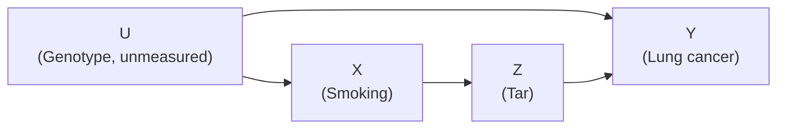
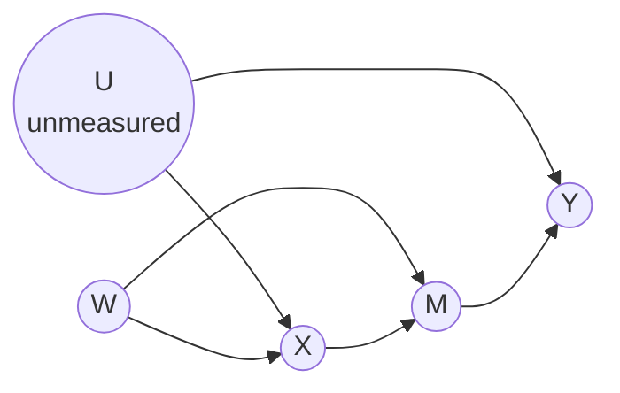

# Lesson 24: Do-Calculus and Complete Identification

## Where We Left Off

Lesson 20's backdoor criterion identifies an effect when some measured set blocks every backdoor path. Lesson 23's front-door criterion identifies an effect in a graph where no such set exists. Both are useful, but each covers only one pattern. Two questions remain:
1. Are there identifiable effects that neither criterion reaches?
2. And is there a general method that finds them?

Pearl's **do-calculus** answers both. It is a set of three rules for rewriting expressions that contain $do(\cdot)$. Each rule may be applied only when a d-separation holds in a suitably modified graph. The goal is always the same: rewrite the causal quantity until no $do$ remains, leaving a formula over the observed distribution. The Primer mentions the do-calculus but leaves it "beyond the scope of this book", pointing to Pearl (2009) and Shpitser and Pearl (2008). This lesson fills that gap, drawing on Neal's Chapter 6.

## Setup: Modified Graphs

The rules check d-separation not in the original graph $G$ but in versions of it with some arrows removed. For sets of variables $X$ and $Z$:

- $G_{\overline{X}}$: the graph with all arrows **into** $X$ deleted. This is the manipulated graph of Lesson 18, the picture after $do(x)$.
- $G_{\underline{Z}}$: the graph with all arrows **out of** $Z$ deleted. Paths that remain between $Z$ and $Y$ are then the ones that do *not* carry $Z$'s causal influence.
- $G_{\overline{X}\,\underline{Z}}$: both deletions applied.

A way to remember the notation: in a drawing, parents sit above their children. A bar *above* the letter cuts the arrows coming in from above; a bar *below* cuts the arrows going out below.

$(Y \perp\!\!\!\perp Z \mid X, W)_{G'}$ means that $Y$ and $Z$ are d-separated by $X$ and $W$ in the modified graph $G'$.

## The Three Rules

Throughout, $X$, $Y$, $Z$ and $W$ are disjoint sets of variables. Each rule is an equality, so it may be used in either direction.

> **Rule 1 (Insertion or deletion of observations).**
> $$P(y \mid do(x), z, w) = P(y \mid do(x), w) \qquad \text{if } (Y \perp\!\!\!\perp Z \mid X, W)_{G_{\overline{X}}}$$

**In words:** in the world where $X$ has been set, observing $Z$ can be dropped if it tells us nothing more about $Y$. This is ordinary d-separation, applied after the intervention. With no $do(x)$ at all, Rule 1 is just the rule from Lesson 22 that d-separation implies independence.

> **Rule 2 (Exchange of action and observation).**
> $$P(y \mid do(x), do(z), w) = P(y \mid do(x), z, w) \qquad \text{if } (Y \perp\!\!\!\perp Z \mid X, W)_{G_{\overline{X}\,\underline{Z}}}$$

**In words:** setting $Z$ and merely observing $Z$ give the same answer if there is no open backdoor path from $Z$ to $Y$. Deleting the arrows out of $Z$ leaves only the non-causal paths between $Z$ and $Y$. If those are all blocked, the association between $Z$ and $Y$ is entirely causal, so seeing $Z$ is as good as setting it. This is the backdoor idea of Lessons 20–22 written as a rule.

> **Rule 3 (Insertion or deletion of actions).**
> $$P(y \mid do(x), do(z), w) = P(y \mid do(x), w) \qquad \text{if } (Y \perp\!\!\!\perp Z \mid X, W)_{G_{\overline{X}\,\overline{Z(W)}}}$$
> where $Z(W)$ is the set of nodes in $Z$ that are **not ancestors of any node in $W$** in $G_{\overline{X}}$.

**In words:** setting $Z$ can be dropped altogether if it has no effect on $Y$. The basic check cuts the arrows into $Z$, as an intervention would, and asks whether $Y$ is then cut off from $Z$. If it is, $Z$ has no directed path to $Y$ that stays open, so forcing $Z$ changes nothing about $Y$.

The refinement $Z(W)$ handles a trap. If some part of $Z$ is an ancestor of the conditioning set $W$, then setting $Z$ changes $W$. Conditioning on that altered $W$ can create a dependence, for instance when $W$ is a collider or a descendant of one. For those parts of $Z$ the arrows into them are kept in the check, so that this route is not overlooked. When $W$ is empty, $Z(W) = Z$, and the condition is simply $(Y \perp\!\!\!\perp Z \mid X)_{G_{\overline{X}\,\overline{Z}}}$.

| Goal | Rule | Check this d-separation | Intuition |
| --- | --- | --- | --- |
| Drop an observed $Z$ | 1 | $Y \perp Z \mid X, W$ in $G_{\overline{X}}$ | $Z$ adds no information about $Y$ once $X$ is set |
| Swap $do(z)$ for observing $z$ | 2 | $Y \perp Z \mid X, W$ in $G_{\overline{X}\,\underline{Z}}$ | No open backdoor path from $Z$ to $Y$ |
| Drop $do(z)$ entirely | 3 | $Y \perp Z \mid X, W$ in $G_{\overline{X}\,\overline{Z(W)}}$ | Setting $Z$ has no effect on $Y$ |

All three rules assume positivity, as every identification formula in Part 3 does: the conditional probabilities they produce must be defined.

## Worked Application 1: The Backdoor Adjustment

Suppose $\mathbf{Z}$ satisfies the backdoor criterion for $(X, Y)$: no member of $\mathbf{Z}$ is a descendant of $X$, and $\mathbf{Z}$ blocks every backdoor path from $X$ to $Y$. The goal is $P(y \mid do(x))$.

**Step 1: bring in $\mathbf{Z}$** by the law of total probability, inside the intervened world:

$$P(y \mid do(x)) = \sum_{\mathbf{z}} P(y \mid do(x), \mathbf{z})\, P(\mathbf{z} \mid do(x)).$$

**Step 2: the first factor, by Rule 2** (with $X$ playing the role of the rule's $Z$). Swapping $do(x)$ for $x$ requires $(Y \perp\!\!\!\perp X \mid \mathbf{Z})_{G_{\underline{X}}}$. Deleting the arrows out of $X$ leaves only paths that start with an arrow *into* $X$, which are exactly the backdoor paths, and $\mathbf{Z}$ blocks them all. So

$$P(y \mid do(x), \mathbf{z}) = P(y \mid x, \mathbf{z}).$$

**Step 3: the second factor, by Rule 3.** Dropping $do(x)$ requires $(\mathbf{Z} \perp\!\!\!\perp X)_{G_{\overline{X}}}$. In $G_{\overline{X}}$, $X$ has no parents, so any path from $X$ starts along one of its outgoing arrows. To reach $\mathbf{Z}$, which contains no descendants of $X$, the path must at some point turn against the arrows, which means passing through a collider. No collider is conditioned on here, so every such path is blocked. Therefore

$$P(\mathbf{z} \mid do(x)) = P(\mathbf{z}).$$

**Step 4: assemble.**

$$P(y \mid do(x)) = \sum_{\mathbf{z}} P(y \mid x, \mathbf{z})\, P(\mathbf{z}),$$

which is the adjustment formula of Lesson 19. The backdoor criterion is thus one Rule-2 step and one Rule-3 step, packaged together.

## Worked Application 2: The Front-Door Formula

Recall the front-door graph of Lesson 23: smoking $X$, tar $Z$, lung cancer $Y$, and an unmeasured genotype $U$.

The derivation has two halves: the effect of smoking on tar, and the effect of tar on cancer.

**Step 1: bring in the mediator.**

$$P(y \mid do(x)) = \sum_z P(y \mid do(x), z)\, P(z \mid do(x)).$$

**Step 2: $P(z \mid do(x)) = P(z \mid x)$, by Rule 2.** Check $(Z \perp\!\!\!\perp X)_{G_{\underline{X}}}$. Deleting $X \to Z$ leaves one path between $X$ and $Z$: $X \leftarrow U \to Y \leftarrow Z$. It passes through $Y$ as a collider, which is not conditioned on, so it is blocked.

**Step 3: $P(y \mid do(x), z) = P(y \mid do(x), do(z))$, by Rule 2 read from right to left.** Check $(Y \perp\!\!\!\perp Z \mid X)_{G_{\overline{X}\,\underline{Z}}}$. Deleting the arrow into $X$ ($U \to X$) and the arrow out of $Z$ ($Z \to Y$) leaves $X \to Z$ as $Z$'s only connection, and $X$ now has no other neighbours. So nothing connects $Z$ to $Y$.

**Step 4: $P(y \mid do(x), do(z)) = P(y \mid do(z))$, by Rule 3.** Check $(Y \perp\!\!\!\perp X \mid Z)_{G_{\overline{X}\,\overline{Z}}}$. Deleting the arrows into $X$ ($U \to X$) and into $Z$ ($X \to Z$) leaves $X$ with no connections at all. This is where front-door condition 1 does its work: because every directed path from $X$ to $Y$ runs through $Z$, once $Z$ is set, setting $X$ as well changes nothing.

**Step 5: the effect of tar on cancer.** Bring in smoking by the law of total probability:

$$P(y \mid do(z)) = \sum_{x'} P(y \mid do(z), x')\, P(x' \mid do(z)).$$

- $P(x' \mid do(z)) = P(x')$ by Rule 3. Check $(X \perp\!\!\!\perp Z)_{G_{\overline{Z}}}$. Deleting $X \to Z$ leaves only $X \leftarrow U \to Y \leftarrow Z$, blocked at the collider $Y$. Setting tar does not change who smokes.
- $P(y \mid do(z), x') = P(y \mid z, x')$ by Rule 2. Check $(Y \perp\!\!\!\perp Z \mid X)_{G_{\underline{Z}}}$. Deleting $Z \to Y$ leaves $Z \leftarrow X \leftarrow U \to Y$, which is blocked by conditioning on $X$.

So $P(y \mid do(z)) = \sum_{x'} P(y \mid z, x')\, P(x')$.

**Step 6: assemble.** Combining Steps 1 to 5:

$$P(y \mid do(x)) = \sum_z P(z \mid x) \sum_{x'} P(y \mid z, x')\, P(x'),$$

which is the front-door formula (3.16) of Lesson 23. Every step was either the law of total probability or one of the three rules with its d-separation checked in the stated graph.

> [!NOTE]
> **Where each front-door condition entered.** Condition 2 (no open backdoor path from $X$ to $Z$) licensed Step 2. Condition 3 ($X$ blocks the backdoor paths from $Z$ to $Y$) licensed the second bullet of Step 5. Condition 1 (the mediator carries every directed path) licensed Step 4. The two graph facts behind Step 3 of Lesson 23 are Steps 3 and 4 here. "After the intervention, tar is unconfounded" is Step 3 (Rule 2). "Smoking reaches cancer only through tar" is Step 4 (Rule 3).

## Reading Identifiability off the Graph

The do-calculus can derive every identifiable effect, but finding the right sequence of rules takes work. The backdoor and front-door criteria were more convenient: one look at the graph settled the question. Neal's Chapter 6 gives a more general criterion of the same kind, due to Tian and Pearl, for the effect of a single treatment variable $X$ on an outcome $Y$.

> **Unconfounded children criterion.** It is satisfied if there is a single set of measured variables that blocks every backdoor path from $X$ to each child of $X$ that is an ancestor of $Y$.
>
> **Theorem (Tian and Pearl).** If the unconfounded children criterion and positivity hold, $P(y \mid do(x))$ is identifiable.

**The intuition.** All of the causal effect of $X$ on $Y$ leaves $X$ through its children: every directed path from $X$ to $Y$ starts with an arrow $X \to C$. If the effect of $X$ on each such child $C$ can be isolated, by blocking every non-causal route between $X$ and $C$, then the causal flow out of $X$ has been captured, and what happens downstream can be worked out from there. The front-door argument of Lesson 23 was a special case of this idea.

**It includes the earlier criteria.**

- *Front door.* In the smoking graph, the only child of $X$ on the way to $Y$ is tar $Z$. The only backdoor path from $X$ to $Z$ is $X \leftarrow U \to Y \leftarrow Z$, already blocked by the collider $Y$. The empty set works, so the criterion holds.
- *Instrument graph* (Lesson 38). There, $Y$ itself is the only relevant child of $X$, and the backdoor path $X \leftarrow U \to Y$ can be blocked only at the unobserved $U$. The criterion fails, which matches the fact that the effect is not identifiable from the graph alone.

**A case neither earlier criterion covers.** Add a measured variable $W$ to the front-door graph, affecting both smoking $X$ and tar $M$:

- The **backdoor criterion** fails for $(X, Y)$: the path $X \leftarrow U \to Y$ can be blocked only at $U$.
- The **front-door criterion** fails for $M$: there is an open backdoor path $X \leftarrow W \to M$ (condition 2).
- The **unconfounded children criterion** holds. The relevant child is $M$. The backdoor paths from $X$ to $M$ are $X \leftarrow W \to M$, blocked by $W$, and $X \leftarrow U \to Y \leftarrow M$, blocked by the collider $Y$. The single set $\{W\}$ blocks both.

So the effect is identifiable. In this graph the formula is easy to see. Within each value of $W$, the graph is the ordinary front-door graph, so apply Lesson 23's formula stratum by stratum and then average over $W$. $W$ is not affected by $X$, so its distribution is unchanged by the intervention, and the average uses $P(w)$:

$$P(y \mid do(x)) = \sum_w P(w) \sum_m P(m \mid x, w) \sum_{x'} P(y \mid x', m, w)\, P(x' \mid w).$$

**A necessary condition.** The criterion is sufficient, not necessary. Neal also states a condition that every identifiable case must meet: *for each backdoor path from $X$ to any child of $X$ that is an ancestor of $Y$, it must be possible to block that path.* The difference is subtle. The sufficient criterion needs one set that blocks all those paths at once; the necessary condition only needs each path to be blockable on its own. Lesson 38 uses the necessary condition to show that instruments alone cannot identify the effect.

## Completeness: The Rules Are Enough

Could an effect be identifiable from a graph and yet unreachable by these three rules? No. Shpitser and Pearl (2006) and Huang and Valtorta (2006) independently proved the do-calculus **complete**: if a causal effect can be identified from a graph at all, some sequence of the three rules derives it.

Completeness alone does not say how to find the sequence. The proofs supply that too: they give an algorithm that, for any graph and any causal effect, either returns an identifying formula or shows that none exists, and it runs in polynomial time. So whether $P(y \mid do(x))$ is identifiable from a given graph is a question that can be settled mechanically.

A scope note. Everything in this lesson is **nonparametric identification**: it uses only the graph, with no assumption about the form of the relationships. Adding assumptions about functional form, such as linearity, can make more effects identifiable. That is **parametric identification**, the subject of Lesson 25 (linear systems) and Lessons 38–39 (instrumental variables).

## Summary and Key Takeaways

1. The do-calculus is three rewrite rules for expressions containing $do(\cdot)$. Each rule applies when a d-separation holds in a modified graph, and each is an equality usable in both directions.
2. **Rule 1** drops an observation, checked in $G_{\overline{X}}$. **Rule 2** swaps an action for an observation, checked in $G_{\overline{X}\,\underline{Z}}$. **Rule 3** drops an action, checked in $G_{\overline{X}\,\overline{Z(W)}}$.
3. The **backdoor adjustment** is one Rule-2 step (swap $do(x)$ for $x$) and one Rule-3 step ($P(\mathbf{z} \mid do(x)) = P(\mathbf{z})$).
4. The **front-door formula** is a chain of Rule-2 and Rule-3 steps, and each front-door condition licenses a specific step.
5. The **unconfounded children criterion** (one set blocking every backdoor path from $X$ to each child of $X$ that leads to $Y$) is a graphical test for identifiability that includes the backdoor and front-door criteria.
6. **Completeness**: every identifiable effect can be derived with the three rules, and an efficient algorithm decides identifiability for any graph.
7. All of this is nonparametric. Assumptions about functional form can identify more, as Lessons 25 and 38–39 show.

**Next step:** Lesson 25 turns to linear models, where regression coefficients can be read as causal effects and the first parametric identification results appear.

### Check Your Understanding

1. In Worked Application 1, write each rule used, the graph in which its condition was checked, and the d-separation that held, one sentence per step.
2. Take the two-node graph $X \to Y$. Show that Rule 3 cannot delete $do(x)$ from $P(y \mid do(x))$, by stating the required d-separation and explaining why it fails.
3. In Step 3 of Worked Application 2, Rule 2 was used from right to left, turning an observation into an action. Why is that allowed?
4. Completeness says the rules can derive every identifiable effect. What additional result is needed to *decide*, for an arbitrary graph, whether an effect is identifiable, and what provides it?
5. In the graph with $W$ added to the front-door graph, suppose there were also an arrow $W \to Y$. Does the unconfounded children criterion still hold? Check each backdoor path from $X$ to $M$.

---

## Further Reading

*Ref*: Brady Neal, *Introduction to Causal Inference* (Dec 2020 draft), Chapter 6 (do-calculus, the front-door proof, and "Determining Identifiability from the Graph": the unconfounded children criterion and the necessary condition); Tian & Pearl (2002), *A general identification condition for causal effects*; *Causal Inference in Statistics: A Primer (2016)*, Chapter 3, Section 3.4 (final paragraphs); Pearl, *Causality* (2009), Chapter 3; Shpitser & Pearl (2006); Huang & Valtorta (2006).
