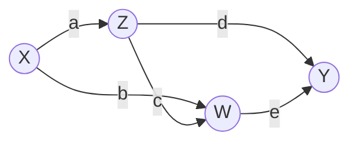
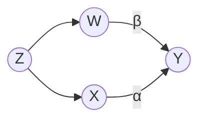
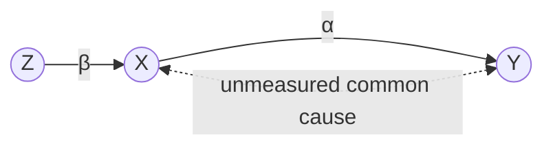
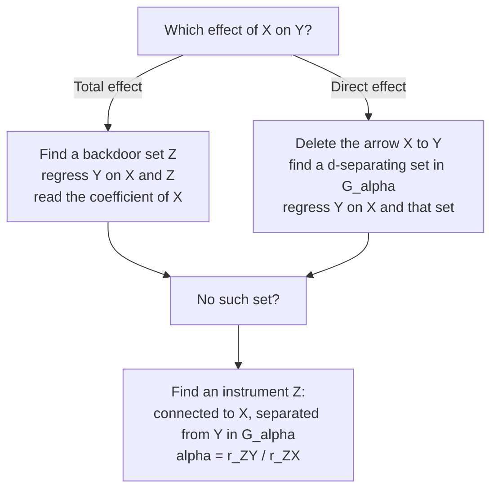

# Lesson 25: Causal Inference in Linear Systems

## Where We Left Off

Everything in Lessons 18–24 was **nonparametric**: it assumed nothing about the form of the relationships between variables. Much of applied statistics, in economics, the social sciences and psychology, works instead with **linear** models. This lesson closes Part 3 by translating the graphical tools into that setting.

Lesson 22 already gave a preview. In its linear shoes example, the regression slope of headache on shoe-wearing came out as $b + ac$: the coefficient on the causal path plus the product of the coefficients on the confounding path. This lesson develops that observation into general rules. The payoff is practical. In a linear model, identifying an effect often comes down to choosing *which variables to put in a regression*, and the graph tells you which.

## The Setting

Assume the structural equations are **linear** and the error terms are **normally distributed**. The Primer lists four properties that normality provides:

1. **Efficient representation.** A joint normal distribution is fully described by its means, variances and covariances.
2. **Expectations can replace probabilities.** Conditional independence becomes an equality of conditional expectations: $Y \perp\!\!\!\perp X \mid Z$ becomes $\mathbb{E}[Y \mid X, Z] = \mathbb{E}[Y \mid Z]$.
3. **Linearity of expectations.** Every conditional expectation $\mathbb{E}[Y \mid x_1, \ldots, x_n]$ is a linear function $r_0 + r_1 x_1 + \cdots + r_n x_n$.
4. **Invariance of regression coefficients.** Each slope $r_i$ depends on *which* variables are in the regression, but not on the values they take.

The second property is the key one. It lets regression, a tool for prediction, deliver causal information. Many of the results below hold more generally, but the normal case keeps the reasoning clean.

## Structural Versus Regression Coefficients

Lesson 01 reviewed the regression tools used here: a slope equals $\mathrm{Cov}(X, Y)/\mathrm{Var}(X)$, regression slopes are not symmetric, and in multiple regression each coefficient holds the other regressors fixed. The central distinction of this lesson:

> **A regression equation is descriptive; it makes no claim about causation.** Writing $y = r_1 x + r_2 z + \epsilon$ says only which values of $r_1, r_2$ give the best linear approximation to $\mathbb{E}[y \mid x, z]$. It does not say that $X$ and $Z$ cause $Y$.

The Primer keeps the two kinds of equation apart with separate notation:

| | Regression equation (statistical) | Structural equation (causal) |
| --- | --- | --- |
| Example | $y = r_1 x + r_2 z + \epsilon$ | $y := \alpha x + \beta z + U_Y$ |
| Coefficients | $r_1, r_2$: slopes of the best linear fit | $\alpha, \beta$: how $Y$ actually responds to $X$ and $Z$ |
| Error term | $\epsilon$: what is left over after fitting; produced by the analyst | $U_Y$: the other causes of $Y$ not in the model; part of the world |

The $U$ terms are the exogenous variables of the structural causal models of Lesson 17. A regression residual is bookkeeping; a structural error is a real influence on $Y$.

In a linear model, a regression coefficient of zero corresponds to a conditional independence: if $r_i = 0$ in $y = r_0 + r_1 x_1 + \cdots + r_n x_n + \epsilon$, then $Y$ is independent of $X_i$ given the other regressors. So the testable implications that nonparametric models express as conditional independences appear in linear models as vanishing regression coefficients.

## Path Coefficients Are Direct Effects

Label each arrow of the graph with the coefficient of that parent in the child's structural equation. This number is the arrow's **path coefficient**. The Primer's first result is that, in a linear system, every path coefficient equals the **direct effect** along that arrow.

Take the model of Primer Figure 3.13:

$$
\begin{aligned}
X &:= U_X \\
Z &:= aX + U_Z \\
W &:= bX + cZ + U_W \\
Y &:= dZ + eW + U_Y
\end{aligned}
$$

*Primer Figure 3.13, without its error terms. Each arrow carries its path coefficient.*

The direct effect of $Z$ on $Y$ is the change in $Y$ when $Z$ rises by one unit while every other parent of $Y$ is held fixed by intervention. $Y$'s only other parent is $W$, so:

$$DE = \mathbb{E}[Y \mid do(Z = z + 1), do(W = w)] - \mathbb{E}[Y \mid do(Z = z), do(W = w)].$$

Setting $Z$ and $W$ replaces their equations with constants, and leaves $Y$'s equation as it is. Then:

$$
\begin{aligned}
\mathbb{E}[Y \mid do(Z = z + 1), do(W = w)] &= d(z + 1) + ew && \text{since } \mathbb{E}[U_Y] = 0 \\
\mathbb{E}[Y \mid do(Z = z), do(W = w)] &= dz + ew \\
DE &= d(z + 1) + ew - (dz + ew) = d
\end{aligned}
$$

The direct effect is exactly the path coefficient $d$. Two points are worth noticing. $X$ and the coefficients $a, b, c$ never entered the calculation, because the interventions cut them off. And nothing was assumed about whether the error terms are correlated. The result would hold even if $U_Y$ were correlated with $U_Z$, although in that case $d$ could no longer be estimated from observational data. **Every structural coefficient is a direct effect, however the errors are distributed.**

## The Sum-of-Products Rule for Total Effects

The **total effect** of $Z$ on $Y$ counts every route by which $Z$ influences $Y$, not only the direct arrow.

> **Sum-of-products rule.** In a linear system, the total effect of $X$ on $Y$ is found by taking every directed path from $X$ to $Y$, multiplying the coefficients along each path, and adding the products.

The Primer states the rule over "nonbackdoor paths", meaning paths that leave $X$ along an outgoing arrow. Among those, only directed paths contribute: a path that contains a collider transmits no effect, so its contribution is zero.

In Figure 3.13, $Z$ reaches $Y$ along two directed paths: $Z \to Y$, contributing $d$, and $Z \to W \to Y$, contributing $c \times e$. So the total effect is $\tau = d + ce$.

The algebra confirms it. Intervene on $Z$, which cuts the arrow $X \to Z$, and substitute $W$'s equation into $Y$'s:

$$
\begin{aligned}
Y &= dZ + eW + U_Y && \text{equation for } Y \\
&= dZ + e(bX + cZ + U_W) + U_Y && \text{substitute the equation for } W \\
&= (d + ce)Z + ebX + eU_W + U_Y && \text{collect the terms in } Z
\end{aligned}
$$

$X$ is a cause of $Z$, not an effect of it, and the error terms are outside the model, so none of $X$, $U_W$, $U_Y$ responds when $Z$ is set to a new value. The terms $ebX + eU_W + U_Y$ therefore stay the same when $Z$ changes. A one-unit increase in $Z$ therefore raises $Y$ by $d + ce$. Like the direct-effect result, this holds whatever the distribution of the error terms.

## Identifying Effects by Regression

The previous two sections assumed the coefficients are known. The practical question is how to estimate them from observational data. The answer: choose the right regression, and the graph says which one.

### Total Effects: Regress on a Backdoor Set

> **Total effect.** Find a set $\mathbf{Z}$ that satisfies the backdoor criterion for $(X, Y)$ (Lesson 20). Regress $Y$ on $X$ and $\mathbf{Z}$. The coefficient of $X$ is the total effect of $X$ on $Y$.

This is the adjustment formula of Lesson 19 in regression form. Including $\mathbf{Z}$ in the regression blocks the backdoor paths, so the coefficient of $X$ cannot absorb the non-causal association they carry.

In the Primer's example (Figure 3.14), $X$ affects $Y$ only through a mediator $W$ ($X \to W \to Y$), and a measured variable $T$ is a common cause of $X$ and $Y$ ($T \to X$, $T \to Y$). The backdoor criterion names $\{T\}$, so the regression $y = r_X x + r_T t + \epsilon$ gives the total effect as $r_X$. The mediator $W$ does not need to be measured at all. The graph shows that it can be left out, and none of the individual path coefficients has to be estimated.

### Direct Effects: The Regression Rule for Identification

For a direct effect, the regression must block not only the backdoor paths but also the *indirect* paths, the ones that run from $X$ to $Y$ through other variables.

> **Regression rule for identification.** Delete the arrow $X \to Y$ from the graph, and call the result $G_\alpha$. If some set of measured variables $\mathbf{Z}$ d-separates $X$ from $Y$ in $G_\alpha$, regress $Y$ on $X$ and $\mathbf{Z}$. The coefficient of $X$ equals the structural coefficient $\alpha$ of the arrow $X \to Y$.

Deleting the arrow leaves every other connection between $X$ and $Y$: the backdoor paths and the indirect paths. A set that blocks all of them in $G_\alpha$ leaves the direct arrow as the only thing the coefficient of $X$ can reflect.

**An example.** Consider the model

$$
\begin{aligned}
Z &:= U_Z \\
X &:= \delta Z + U_X \\
W &:= \gamma Z + U_W \\
Y &:= \alpha X + \beta W + U_Y
\end{aligned}
$$

with independent error terms.

Delete the arrow $X \to Y$. The only remaining path between $X$ and $Y$ is $X \leftarrow Z \to W \to Y$. Either $\{W\}$ or $\{Z\}$ blocks it, so either set works.

- Regressing $Y$ on $X$ and $W$ recovers $\alpha$ directly, since $X$ and $W$ are exactly the parents of $Y$ and that regression is $Y$'s own structural equation.
- Regressing $Y$ on $X$ and $Z$ also recovers $\alpha$, even though $Z$ is not a parent of $Y$. Substituting $W$'s equation into $Y$'s gives $Y = \alpha X + \beta\gamma Z + (\beta U_W + U_Y)$. The leftover term $\beta U_W + U_Y$ is independent of both $X$ and $Z$, so the regression of $Y$ on $X$ and $Z$ has coefficient $\alpha$ on $X$ (and $\beta\gamma$ on $Z$).

The second regression is useful if $W$ is not measured. The graph finds it; the structural equations alone would not suggest it. The Primer notes that this rule "has eluded investigators for almost a century, possibly because it is extremely difficult to articulate in algebraic, nongraphical terms."

When all the error terms are independent and every variable is measured, every structural coefficient can be identified this way: the structural equation itself, with the parents as regressors, is always one identifying regression, and the graph can reveal others. When some variables are unmeasured or some errors are correlated, finding an identifying regression from the equations alone becomes very hard, and the graphical procedure is indispensable.

### When No Set Works: Instrumental Variables

Sometimes no measured set d-separates $X$ from $Y$ in $G_\alpha$. In Primer Figure 3.17, $X$ and $Y$ share an unmeasured common cause, so they stay connected however the regression is chosen. A third variable $Z$ affects $X$ and has no other route to $Y$:

*Primer Figure 3.17. The dashed double arrow stands for an unmeasured common cause of $X$ and $Y$.*

Such a $Z$ is an **instrumental variable**: it is d-connected to $X$ but d-separated from $Y$ in $G_\alpha$. It allows $\alpha$ to be identified in two regressions.

1. Regress $X$ on $Z$: $x = r_2 z + \epsilon$. Nothing confounds $Z$ and $X$, so $r_2 = \beta$.
2. Regress $Y$ on $Z$: $y = r_1 z + \epsilon$. Nothing confounds $Z$ and $Y$ either, so $r_1$ is the total effect of $Z$ on $Y$. By the sum-of-products rule, its only directed path is $Z \to X \to Y$, so $r_1 = \beta\alpha$.
3. Divide: $\alpha = r_1 / r_2$. The summary chart below writes these slopes as $r_{ZY} = r_1$ and $r_{ZX} = r_2$.

The unmeasured common cause never enters: the instrument's effect on $Y$ is $\beta\alpha$, its effect on $X$ is $\beta$, and their ratio is the effect of $X$ on $Y$. The Primer draws a general point from this: no single regression gives $\alpha$ here, but the ratio of two *total* effects does. Direct effects can sometimes be recovered from total effects in this way. Lessons 38–39 develop instruments fully, including what the ratio identifies when the model is not linear.

### Summary of the Procedure

## Mediation in Linear Systems

Linearity also simplifies mediation. In a linear system, effects add, so the **indirect effect** of $X$ on $Y$ (the part that passes through mediators) is simply the total effect minus the direct effect: $IE = \tau - DE$. In Figure 3.13, the indirect effect of $Z$ on $Y$ is $(d + ce) - d = ce$, the product along the path $Z \to W \to Y$. Outside linear models this subtraction is no longer valid, because effects need not add. Lesson 32 takes up that general case.

## Summary and Key Takeaways

1. **Regression coefficients describe; structural coefficients explain.** An $r$ is the slope of a best linear fit; an $\alpha$ says how a variable responds to its causes. A residual $\epsilon$ is produced by fitting; an error $U$ is part of the world.
2. **Every path coefficient is a direct effect**, as the definition of the do-operator shows, whatever the distribution of the errors.
3. **Sum-of-products rule:** the total effect is the sum, over directed paths, of the products of the path coefficients.
4. **Total effect by regression:** regress $Y$ on $X$ and a backdoor set; read the coefficient of $X$.
5. **Direct effect by regression:** delete $X \to Y$, find a d-separating set in $G_\alpha$, regress $Y$ on $X$ and that set. The set need not consist of parents of $Y$.
6. **Instrumental variables:** when no set works, an instrument $Z$ identifies the effect as the ratio $r_{ZY} / r_{ZX}$.
7. In linear systems the indirect effect is the total effect minus the direct effect.

**Next step:** Part 4 turns to **counterfactuals**. Part 3 answered questions about populations under intervention. Part 4 asks what would have happened to a particular individual, given what actually happened to them: the effect of treatment on the treated, probabilities of causation, and the individual "what if".

### Check Your Understanding

1. In Figure 3.13, use the sum-of-products rule to find the total effect of $X$ on $Y$. List each directed path and its product. Then check your answer by substituting the structural equations.
2. Take the graph $Z \to X \to Y$ with an extra arrow $Z \to Y$, and consider the effect of $Z$ on $Y$. Which regression gives its total effect, and which gives its direct effect? Justify each with the rules of this lesson.
3. In the regression-rule example, why can the regression of $Y$ on $X$ alone *not* recover $\alpha$? Write the slope it would report in terms of the model's coefficients and variances.
4. Give one real situation in which the direct effect is the quantity a decision-maker needs, and one in which the total effect is.

---

## Further Reading

*Ref*: *Causal Inference in Statistics: A Primer (2016)*, Chapter 3, Section 3.8 (Figures 3.13–3.17); Brady Neal, *Introduction to Causal Inference* (Dec 2020 draft), the instrumental-variables chapter.
