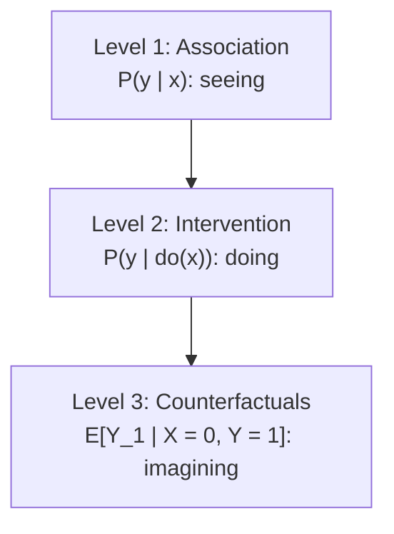

# Lesson 26: Counterfactuals — The Freeway Problem

## Where We Left Off

Part 3 answered **interventional** questions about populations: what would happen, on average, if $X$ were set to $x$ for everyone. Part 4 asks a harder kind of question. It takes something that actually happened, keeps the facts of that case fixed, and asks what would have happened under a different choice. These are **counterfactual** questions.

This part follows Chapter 4 of Pearl's Primer. Neal's Dec 2020 draft has a chapter on counterfactuals and mediation, but it is marked "Coming Soon", so the potential-outcomes material of Lessons 07–15 serves as the link to his treatment.

## Driving Home: The Opening Example

Pearl opens with an everyday regret. Driving home, he reaches a fork: the freeway ($X = 1$) or a surface street, Sepulveda Boulevard ($X = 0$). He takes Sepulveda, the traffic is slow, and he arrives home an hour later. He says to himself: *"I should have taken the freeway."*

What does that sentence mean? Colloquially: *if I had taken the freeway, I would have got home sooner.* More precisely: his estimate of the expected driving time on the freeway, **on that same day, under the same circumstances, and with the same driving habits**, is lower than the hour the drive actually took.

A statement of this kind, an "if" statement whose "if" part did not happen, is a **counterfactual**. The unrealized "if" part is called the **antecedent**. Here the antecedent is "had I taken the freeway".

Two features make this a counterfactual judgment rather than an ordinary prediction.

- **It uses what actually happened.** The one-hour drive is evidence. It suggests the traffic was unusually heavy that day, perhaps because of a brush fire, and that evidence shapes the estimate of what the freeway would have been like. The estimate made *after* the drive differs from the one made *before* it; otherwise he would have taken the freeway in the first place.
- **It compares the same situation under two choices.** The claim is that whatever slowed Sepulveda would not have slowed the freeway as much, on that day. Surrogates are easy to imagine: drive the freeway tomorrow, or watch another driver today. But conditions change from day to day and drivers differ, so a surrogate only approximates the quantity. Surrogates may be useful for *estimating* it; they cannot *define* it.

## Why the Do-Operator Cannot Express This

Try to write the question with the do-operator:

$$\mathbb{E}(\text{driving time} \mid do(\text{freeway}),\ \text{driving time} = 1 \text{ hour}).$$

The expression contradicts itself. "Driving time" appears twice, but it means two different things: the freeway time we want to estimate, and the Sepulveda time that was actually observed. The do-operator cannot tell them apart. It distinguishes two *distributions*, $P(\text{time} \mid do(\text{freeway}))$ and $P(\text{time} \mid do(\text{Sepulveda}))$, but not two *variables*, one for each road.

The fix is to give each road its own variable, with a subscript:

- $Y_{X=1}$, or $Y_1$ for short: the driving time *had the freeway been taken*;
- $Y_{X=0}$, or $Y_0$: the driving time *had Sepulveda been taken*.

Sepulveda was taken, so $Y_0$ is the time actually observed, one hour. The question becomes

$$\mathbb{E}(Y_{X=1} \mid X = 0,\ Y = Y_0 = 1). \tag{4.1}$$

This mixes three things: one hypothetical variable, $Y_1$, and two observed facts, $X = 0$ and $Y = 1$. The hypothetical variable assumes $X = 1$, while the conditioning event says $X = 0$. The two belong to **different worlds**, one in which Sepulveda was taken and one in which the freeway was. That clash is not an error; it is exactly what the question asks.

Compare an ordinary interventional question:

$$\mathbb{E}[Y \mid do(X = x)]. \tag{4.2}$$

In subscript notation this is just $\mathbb{E}[Y_x]$. Everything in it refers to one world, the world in which $X$ is set to $x$. Every quantity in Part 3 was of this single-world kind, which is why the do-operator was enough there.

**What an experiment can and cannot answer.** A randomized experiment on the two routes gives $\mathbb{E}[Y_1] = \mathbb{E}[Y \mid do(\text{freeway})]$ and $\mathbb{E}[Y_0] = \mathbb{E}[Y \mid do(\text{Sepulveda})]$. These are averages over different drivers or different days. No experiment can give $\mathbb{E}[Y_1 \mid X = 0, Y = 1]$, because no one can drive both routes on the same evening. An intervention creates a new world; a counterfactual question edits the one that happened.

## Three Kinds of Question

Pearl describes causal questions as falling on three levels, often called the **ladder of causation**.

*Each level asks questions the one below cannot express.*

- **Level 1** asks what the data show: how often $Y$ occurs among units with $X = x$.
- **Level 2** asks what would happen under an intervention. Experiments answer these directly, and Part 3 showed when observational data can too.
- **Level 3** asks what would have happened to a particular case under a different choice, given what did happen.

In general, level-3 questions cannot be answered from experiments alone. They need a *model* of how the world would have responded to a history that did not occur. Some of them can nevertheless be pinned down, or at least bounded, by combining experimental and observational data; Lessons 30 and 31 show examples.

> [!IMPORTANT]
> **Why subscripts are needed.** $Y_1$ is the driving time Pearl *would* have had, had he taken the freeway at that point in that evening. It concerns a single case and a scenario that never happened. A notation that refers only to events that actually occurred cannot name it. Subscripts are the simplest notation that can refer to the same variable in two different worlds.

The next lessons show that, despite this hypothetical character, the structural causal models of Lesson 17 can compute counterfactuals exactly when the model is fully specified, and can often estimate them from data when it is not.

## What Counterfactuals Make Possible

The Primer lists problems that look intractable at this point and become manageable with counterfactuals:

- **Program evaluation:** how many people who enrolled in a job-training program would have found jobs had they *not* enrolled? (Lesson 30, the effect of treatment on the treated.)
- **Additive interventions:** predict the effect of *adding* 5 mg/l of insulin to patients whose levels vary, using only an experiment that *set* every patient to the same level. (Lesson 30.)
- **Individual attribution:** how likely is it that a particular cancer patient would have had a different outcome under a different treatment? (Lesson 31, probabilities of causation.)
- **Discrimination:** did a company discriminate when it passed over a particular applicant? (Lesson 31.)
- **Mediation:** how much would gender-blind hiring reduce a gender gap in hiring, and how much of the gap runs through qualifications? (Lesson 32, natural direct and indirect effects.)

None of these can be written with the do-operator. Each can be written with subscripts, and each becomes answerable with a structural model.

## Counterfactuals and the Missing-Data View

Lessons 08–09 described causal inference as a missing-data problem. Each unit has two potential outcomes, $Y(1)$ and $Y(0)$, and only one is ever observed. The potential-outcomes framework takes these values as basic quantities that are not defined in terms of anything else. The structural framework of Lesson 17 derives them: once a unit's background factors $U$ are known, the model computes both potential outcomes.

The freeway question shows why the derivation matters. It does not ask only for a missing entry in the table. It asks for a missing entry *given other facts about the same case*: the route actually taken and the time it actually took. Answering it requires knowing how the missing entry relates to the observed ones, and that relationship is what a structural model supplies. Lesson 27 shows how.

## Summary and Key Takeaways

1. A **counterfactual** keeps the facts of what happened and asks what would have happened under a different choice, the antecedent.
2. The **do-operator cannot express** counterfactuals. It distinguishes distributions under different interventions, not the same variable in two different worlds.
3. **Subscript notation** gives each world its own variable: $Y_1$ and $Y_0$. The freeway question is $\mathbb{E}(Y_1 \mid X = 0, Y = 1)$.
4. Experiments answer level-2 questions such as $\mathbb{E}[Y_1]$, but not in general level-3 questions such as $\mathbb{E}[Y_1 \mid X = 0, Y = 1]$, which need a structural model.
5. Counterfactuals make it possible to state and answer questions about program evaluation, additive interventions, individual attribution, discrimination and mediation.

**Next step:** Lesson 27 shows how a structural causal model *computes* counterfactuals: the fundamental law of counterfactuals, the consistency rule, and the three steps of abduction, action and prediction.

### Check Your Understanding

1. Write the freeway question in the form $\mathbb{E}(Y_x \mid X = x', Y = y)$. Identify the observed evidence, the antecedent, and the quantity to be estimated.
2. Pearl's statement is about an *expected* driving time, not a certain one. Where does uncertainty come from in a counterfactual question about a single evening, and how does the observed one-hour drive reduce it?
3. Explain why a randomized experiment on the two routes cannot answer the freeway question, even with unlimited data. On which level of the ladder of causation does the question lie?

---

## Further Reading

*Ref*: *Causal Inference in Statistics: A Primer (2016)*, Chapter 4, Section 4.1 (the freeway example, Eqs. 4.1–4.2); Brady Neal, *Introduction to Causal Inference* (Dec 2020 draft), chapter "Counterfactuals and Mediation" (marked "Coming Soon"); Lessons 07–15 of this series for the potential-outcomes background.
