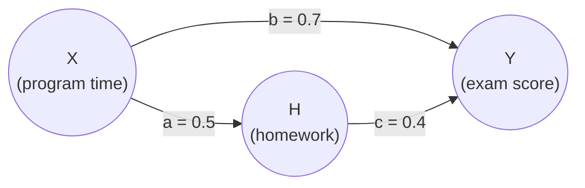

# Lesson 27: Computing Counterfactuals from SCMs

## Where We Left Off

Lesson 26 named counterfactual quantities with subscripts: $Y_1$ is the value $Y$ would have taken had $X$ been 1. It left open where those values come from. The answer is the central idea of Pearl's framework: **from the structural causal model** of Lesson 17. Once the equations are written down, every counterfactual has a definite value, and this lesson shows how to compute it.

## Units and Background Factors

In a structural model, the exogenous variables $U$ stand for all the background factors not included in the model. Pearl reads each value $U = u$ as one **unit** of the population, such as one person, one field, or one situation. The reason is that $u$ fixes the values of every variable in the model, just as a particular individual's characteristics fix their salary, education and so on. So $Y(u)$ means "the value of $Y$ for unit $u$".

## The Fundamental Law of Counterfactuals

How should "$Y$ would be $y$ had $X$ been $x$, for unit $u$" be read? Pearl's answer: make the smallest change to the model that makes the "had $X$ been $x$" part true, and leave everything else alone. The smallest change is to replace the equation for $X$ with the constant $X = x$, which is the surgery of Lesson 18. Write $M_x$ for the modified model. Then:

> **Fundamental Law of Counterfactuals.**
> $$Y_x(u) = Y_{M_x}(u). \tag{4.5}$$
> The counterfactual value $Y_x(u)$ is the value that $Y$ takes in the modified model $M_x$, for the same unit $u$.

In words: take the model, replace $X$'s equation with $X = x$, keep the unit's background factors $u$ exactly as they were, and solve for $Y$. Everything else carries over: the other equations, their coefficients, and above all $u$. This is what separates a counterfactual from an interventional average. An intervention $\mathbb{E}[Y \mid do(x)]$ averages over all units. A counterfactual $Y_x(u)$ follows one particular unit into a world where $X$ was different.

The same law applies to sets of variables: $M_x$ replaces the equation of every variable in the set with a constant. A small model therefore assigns a value to a very large number of counterfactuals, and all of them are consistent with one another because they come from the same equations.

## A First Example: A Table of Counterfactuals

Take the model of Primer Eqs. (4.3)–(4.4):

$$
\begin{aligned}
X &:= aU \\
Y &:= bX + U
\end{aligned}
$$

with $a = b = 1$, and suppose $U$ takes the values 1, 2 or 3.

**Counterfactuals of $Y$.** Replace $X$'s equation with $X = x$ and solve for $Y$: $Y_x(u) = bx + u = x + u$. For example, for $u = 2$ and $x = 2$, $Y_2(2) = 2 + 2 = 4$.

**Counterfactuals of $X$.** Replace $Y$'s equation with $Y = y$ and solve for $X$: $X_{Y=y}(u) = au = u$. Setting $Y$ does not change $X$, because the arrow runs from $X$ to $Y$ and not the other way.

| $u$ | $X(u)$ | $Y(u)$ | $Y_{X=1}(u)$ | $Y_{X=2}(u)$ | $Y_{X=3}(u)$ | $X_{Y=1}(u)$ | $X_{Y=2}(u)$ | $X_{Y=3}(u)$ |
| :---: | :---: | :---: | :---: | :---: | :---: | :---: | :---: | :---: |
| 1 | 1 | 2 | 2 | 3 | 4 | 1 | 1 | 1 |
| 2 | 2 | 4 | 3 | 4 | 5 | 2 | 2 | 2 |
| 3 | 3 | 6 | 4 | 5 | 6 | 3 | 3 | 3 |

*Primer Table 4.1. The actual values $X(u) = u$ and $Y(u) = 2u$ come from the original equations.*

Two features stand out.

- Each entry is a definite number for a definite unit, not a probability or an average. The do-operator, by contrast, is defined only on distributions and always yields population quantities such as $\mathbb{E}[Y \mid do(x)]$. This is the gap between the population level of Part 3 and the individual level of Part 4.
- The counterfactuals of $Y$ change with the antecedent $x$; the counterfactuals of $X$ do not. Causation has a direction, the equations encode it, and the table shows it. A joint distribution alone would not.

## The Consistency Rule

Counterfactuals must agree with what was actually observed. If unit $u$ actually had $X = 1$ and $Y = 0$, then $Y_{X=1}(u)$ must be 0: setting $X$ to the value it already had changes nothing.

> **Consistency rule.** If $X = x$, then $Y_x = Y$. $\tag{4.6}$

For a binary $X$ this can be written as a single equation:

$$Y = X\, Y_1 + (1 - X)\, Y_0.$$

When $X = 1$ the second term vanishes and $Y = Y_1$; when $X = 0$ the first term vanishes and $Y = Y_0$. Every counterfactual computed with the Fundamental Law satisfies this rule automatically.

Consistency is the link between observed data and counterfactual quantities. It says that for units whose actual treatment matches the antecedent, the counterfactual is simply what was observed. The identification arguments of Part 4 use it repeatedly: whenever a subscript quietly disappears from a formula, consistency is the reason. On its own, though, consistency identifies little. For example, $P(Y_1 = y) = P(Y = y \mid X = 1)$ needs exchangeability as well (Lesson 21), because consistency only says $Y_1 = Y$ for the treated units, not that the treated units are representative of everyone.

## The Three-Step Procedure

The table was built by a procedure that works for any model.

### Deterministic Counterfactuals

When everything relevant about a unit is known, a counterfactual is computed in three steps.

> 1. **Abduction.** Use the evidence $E = e$ to find the unit's background factors $U$.
> 2. **Action.** Modify the model: replace the equations of the variables in $X$ with constants $X = x$, giving $M_x$.
> 3. **Prediction.** Use $M_x$ and the values of $U$ from step 1 to compute $Y$.

Step 1 answers "what kind of unit is this, given what we saw?" Step 2 changes history just enough to make the antecedent true. Step 3 works out what follows. The most common mistake is to skip step 1 and use average background factors. That answers a question about people *like* this unit, not about this unit.

### A Worked Example: Joe's Exam Score

The Primer's Model 4.1 describes a randomized after-school program, an "encouragement design". All variables are measured in standard deviations from the mean.

- $X$: time a student spends in the remedial program;
- $H$: amount of homework the student does;
- $Y$: the student's exam score.

*Primer Figure 4.1, without its independent error terms.*

The structural equations are

$$
\begin{aligned}
X &:= U_X \\
H &:= 0.5\, X + U_H \\
Y &:= 0.7\, X + 0.4\, H + U_Y
\end{aligned}
$$

with independent error terms. A student named Joe has $X = 0.5$, $H = 1$ and $Y = 1.5$. **What would Joe's score have been had he doubled his homework, to $H = 2$?**

**Step 1, abduction.** Solve each equation for Joe's error term, using his observed values:

$$
\begin{aligned}
U_X &= X = 0.5 \\
U_H &= H - 0.5\, X = 1 - 0.5 \times 0.5 = 0.75 \\
U_Y &= Y - 0.7\, X - 0.4\, H = 1.5 - 0.35 - 0.4 = 0.75
\end{aligned}
$$

These values describe Joe. They stay fixed under the hypothetical change, because doubling his homework does not change who Joe is.

**Step 2, action.** Replace the equation for homework with the constant $H = 2$. This cuts the arrow $X \to H$ (Primer Figure 4.2).

**Step 3, prediction.** Solve the modified model with Joe's error terms:

$$Y_{H=2} = 0.7 \times 0.5 + 0.4 \times 2 + 0.75 = 0.35 + 0.80 + 0.75 = 1.90.$$

Joe's score would have been **1.9** instead of 1.5. The increase of 0.4 comes entirely through the arrow $H \to Y$: homework rises by $2 - 1 = 1$, and each unit of homework is worth $0.4$. Joe's program time $X$ is unchanged, because $X$ is upstream of $H$, so its contribution $0.7 \times 0.5$ and his personal factor $U_Y$ carry over exactly as before.

### Probabilistic Counterfactuals

Often the unit is not fully known. Suppose we know only Joe's exam score, not his program time or homework. Then abduction cannot pin down his $U$: many units are compatible with the evidence. Uncertainty enters by placing a probability distribution $P(U)$ over the background factors. The three steps become:

> 1. **Abduction.** Update $P(U)$ with the evidence, giving $P(U \mid E = e)$.
> 2. **Action.** Modify the model to $M_x$ as before.
> 3. **Prediction.** Compute the probability, or expected value, of $Y$ in $M_x$, using the updated distribution $P(U \mid E = e)$.

The distribution $P(U)$ determines a distribution over all the variables of the model. From it one can compute the probability of a single counterfactual, $P(Y_x = y)$, and also joint probabilities that mix observed and counterfactual variables, such as $P(Y_x = y, Z_w = z, X = x')$, even when the settings conflict with each other or with what was observed. Lesson 28 works through such cross-world probabilities.

Probabilistic counterfactuals can also restrict *who* is intervened on. The Primer's example is: what would have happened if every student with $Y < 2$ had doubled their homework? A do-expression cannot pick out a subgroup by its outcome in this way; a counterfactual can.

### Neal's Dog Examples: When Abduction Succeeds and When It Does Not

Neal's lecture on counterfactuals uses a small example with binary variables that shows both cases.

- $T$: whether a person gets a dog (1) or not (0).
- $Y$: whether the person is happy (1) or unhappy (0).
- $U$: an unobserved trait of the person.

**Case 1: abduction pins down $U$.** Let $U = 1$ mean "dog person" and $U = 0$ "anti-dog person", with the structural equation

$$Y := U\,T + (1 - U)(1 - T).$$

A dog person ($U = 1$) is happy exactly when they have a dog: $Y = T$. An anti-dog person ($U = 0$) is happy exactly when they do not: $Y = 1 - T$.

We observe someone with $T = 0$ and $Y = 0$: no dog, unhappy. Would a dog have made them happy?

1. **Abduction.** Substitute the observation: $0 = U \cdot 0 + (1 - U)(1 - 0) = 1 - U$, so $U = 1$. This is a dog person.
2. **Action.** Replace the equation for $T$ with $T := 1$.
3. **Prediction.** $Y_{T=1} = 1 \cdot 1 + (1 - 1)(1 - 1) = 1$.

With a dog, this person would have been happy. Their individual effect is $Y_{T=1} - Y_{T=0} = 1 - 0 = 1$.

**Case 2: abduction leaves $U$ uncertain.** Now let $U$ take four values, each a different way of responding to a dog:

| $U$ | Structural equation | Prior probability |
| --- | --- | :---: |
| always happy | $Y := 1$ | 0.3 |
| never happy | $Y := 0$ | 0.2 |
| dog-needer | $Y := T$ | 0.4 |
| dog-hater | $Y := 1 - T$ | 0.1 |

We observe $T = 1$ and $Y = 0$: a dog owner who is unhappy. Would they have been happy without the dog?

1. **Abduction.** Only two types fit the observation. "Never happy" gives $Y = 0$ whatever $T$ is. "Dog-hater" gives $Y = 1 - 1 = 0$. The other two types would give $Y = 1$. Updating the prior by Bayes' rule (Lesson 01), which here means keeping the consistent types and rescaling:
$$P(\text{never happy} \mid T{=}1, Y{=}0) = \frac{0.2}{0.2 + 0.1} = \tfrac{2}{3}, \qquad P(\text{dog-hater} \mid T{=}1, Y{=}0) = \frac{0.1}{0.2 + 0.1} = \tfrac{1}{3}.$$
2. **Action.** Set $T := 0$.
3. **Prediction.** A never-happy person stays unhappy: $Y_{T=0} = 0$. A dog-hater becomes happy: $Y_{T=0} = 1 - 0 = 1$. So
$$P(Y_{T=0} = 1 \mid T{=}1, Y{=}0) = \tfrac{2}{3} \times 0 + \tfrac{1}{3} \times 1 = \tfrac{1}{3}.$$

Here the counterfactual is not a single value but a probability, because the observation is compatible with two kinds of person. This happens whenever the equation for $Y$, with $T$ fixed, cannot be solved uniquely for $U$.

**The key ingredient.** Both cases needed the structural equation for $Y$ and, in the second, a distribution over $U$. Neal stresses that this is a strong assumption. Without a model of the mechanism, the fundamental problem of causal inference (Lesson 09) returns: an individual's unobserved potential outcome cannot be recovered from data. *Population-level* counterfactuals are different. Just as the ATE can be identified from the graph alone, some population counterfactuals can too, such as the effect of treatment on the treated in Lesson 30. Neal points to the **potential outcome calculus** of Malinsky and colleagues (2019), a generalization of the do-calculus of Lesson 24, for deciding in general which counterfactual quantities a graph identifies.

## Derived, Not Primitive

The Primer notes that in the structural framework, counterfactuals are *derived* from the equations, while some frameworks take them as primitives (Holland 1986; Rubin 1974). In the potential-outcomes framework of Lessons 07–15, $Y(1)$ and $Y(0)$ are basic quantities, and assumptions are stated about them directly, as ignorability conditions. In the structural framework they are computed from the equations by the three steps above.

The Primer's bibliographic notes stress that the two frameworks are logically equivalent: a problem solved in one yields the same solution in the other. They differ in how assumptions are expressed. Potential outcomes state them as algebraic independence conditions among counterfactuals, which can be hard to judge by inspection. The structural framework states them as a causal graph and derives those independence conditions mechanically, as Lesson 28 will show.

## Summary and Key Takeaways

1. Each value $U = u$ of the background factors corresponds to one **unit** of the population.
2. **Fundamental Law (4.5):** $Y_x(u) = Y_{M_x}(u)$. A counterfactual is the value of $Y$ in the modified model $M_x$, for the same unit.
3. Counterfactuals are definite values for individual units; the do-operator gives only population distributions.
4. **Consistency (4.6):** if $X = x$ then $Y_x = Y$. It links counterfactuals to observations, but identifies little on its own.
5. **Three steps:** abduction (find $U$ from the evidence), action (replace equations), prediction (solve). In Joe's example they give $Y_{H=2} = 1.9$.
6. With incomplete evidence, abduction updates a distribution $P(U)$, and joint probabilities across conflicting worlds become computable. In Neal's dog example, an unhappy dog owner would have been happy without the dog with probability $\tfrac{1}{3}$.
7. Unit-level counterfactuals need the structural equation itself; population-level counterfactuals can sometimes be identified from the graph alone.
8. Structural and potential-outcome counterfactuals are logically equivalent; they differ in how assumptions are stated.

**Next step:** Lesson 28 computes **probabilities of counterfactuals**, including joint probabilities across conflicting worlds, and shows how counterfactuals can be read off a causal graph.

### Check Your Understanding

1. In the table model ($X := U$, $Y := X + U$), a unit is observed with $Y = 6$. Use the three steps to compute $Y_{X=1}$ for that unit. Which step uses the observation, and how?
2. In Joe's example, compute $Y_{X=1.5}$: Joe's score had he spent 1.5 units of time in the program. Note that changing $X$ now also changes $H$. By how much does the score rise, and through which paths?
3. Consistency gives $Y_1 = Y$ for units with $X = 1$. Explain why this alone does not give $P(Y_1 = y) = P(Y = y \mid X = 1)$, and name the extra assumption needed.
4. In Neal's first dog model, a person is observed with $T = 1$ and $Y = 0$. Find $U$ and the person's individual effect.
5. In the four-type dog model, a person is observed with $T = 1$ and $Y = 1$. Which types fit, what are their updated probabilities, and what is $P(Y_{T=0} = 1 \mid T{=}1, Y{=}1)$?

---

## Further Reading

*Ref*: *Causal Inference in Statistics: A Primer (2016)*, Chapter 4, Sections 4.2.1–4.2.4 (Eqs. 4.3–4.6, Table 4.1, Figures 4.1–4.2, Model 4.1) and the Bibliographical Notes for Chapter 4; Brady Neal, *Introduction to Causal Inference* course, week 14 lecture slides, "Counterfactuals and Mediation" (the dog examples); Malinsky, Shpitser & Richardson (2019), *A potential outcomes calculus for identifying conditional path-specific effects*.
