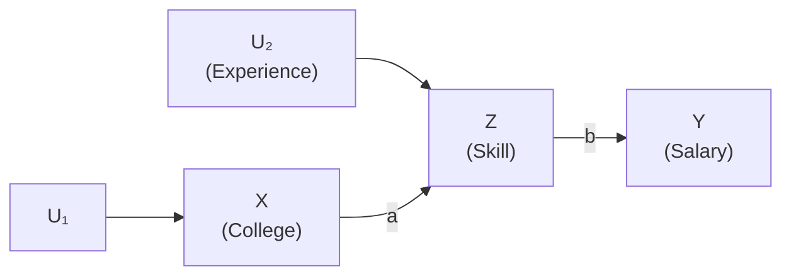
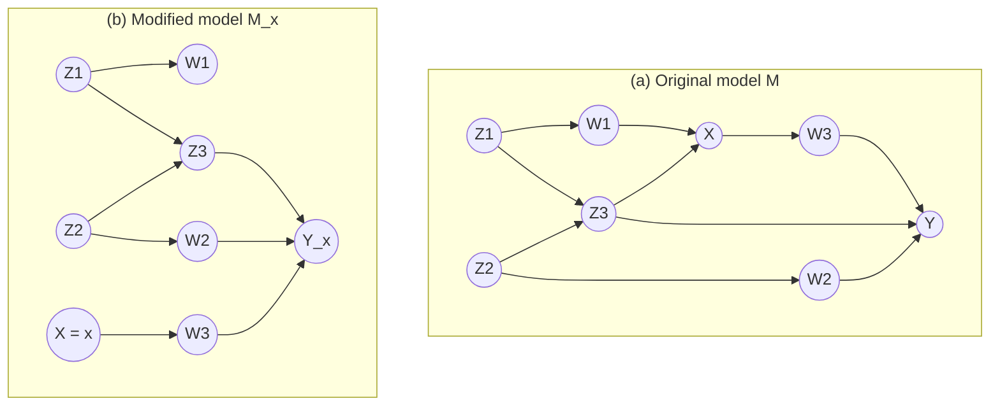

# Lesson 28: Cross-World Probabilities and Their Graphs

## Where We Left Off

Lesson 27 computed counterfactuals for single units and showed that a probability distribution over the background factors $U$ gives probabilities for counterfactuals too. This lesson works those probabilities out, including probabilities that combine events from different worlds. It then shows why the do-operator cannot express such quantities, and how counterfactuals can be read off a causal graph.

## Probabilities of Counterfactuals

Return to the model of Lesson 27, $X := U$ and $Y := X + U$, and give it a population. The background factor $U$ now stands for three types of individual, with probabilities

$$P(U = 1) = \tfrac{1}{2}, \qquad P(U = 2) = \tfrac{1}{3}, \qquad P(U = 3) = \tfrac{1}{6}.$$

Every individual of a given type has the same row of counterfactual values, from Lesson 27's table:

| $u$ | $P(U = u)$ | $Y(u)$ | $Y_{X=1}(u)$ | $Y_{X=2}(u)$ | $Y_{X=3}(u)$ |
| :---: | :---: | :---: | :---: | :---: | :---: |
| 1 | 1/2 | 2 | 2 | 3 | 4 |
| 2 | 1/3 | 4 | 3 | 4 | 5 |
| 3 | 1/6 | 6 | 4 | 5 | 6 |

**The counting rule.** To find the probability of any statement about counterfactuals, find the rows where it is true and add their probabilities.

**Single counterfactuals.**

- $P(Y_2 = 3)$: true only for $u = 1$, so the probability is $\tfrac{1}{2}$.
- $P(Y_1 = 4)$: true only for $u = 3$, so $\tfrac{1}{6}$.
- $P(Y_2 > 3)$: true for $u = 2$ and $u = 3$, so $\tfrac{1}{3} + \tfrac{1}{6} = \tfrac{1}{2}$.

**Joint counterfactuals.**

- $P(Y_2 > 3,\ Y_1 < 4)$. Row $u = 1$ fails the first condition ($Y_2 = 3$). Row $u = 2$ satisfies both ($Y_2 = 4$, $Y_1 = 3$). Row $u = 3$ fails the second ($Y_1 = 4$). So the probability is $\tfrac{1}{3}$.
- $P(Y_1 < Y_2)$: true in every row, so the probability is 1.

The first of these combines events from **two different worlds**: $Y_2 > 3$ in a world where $X = 2$, and $Y_1 < 4$ in a world where $X = 1$. No unit can be observed in both worlds, yet the model gives every unit a value in each, so the probability is as easy to compute as any other. The clash between worlds is no obstacle to calculation.

**Conditional counterfactuals.** The counting rule also gives conditional probabilities. Among individuals with $Y > 2$, how likely is it that $Y$ would have been larger had $X$ been 3?

$$P(Y_3 > Y \mid Y > 2) = \frac{P(Y_3 > Y,\ Y > 2)}{P(Y > 2)}.$$

The condition $Y > 2$ holds for $u = 2$ ($Y = 4$) and $u = 3$ ($Y = 6$), so $P(Y > 2) = \tfrac{1}{3} + \tfrac{1}{6} = \tfrac{1}{2}$. Of those, $Y_3 > Y$ holds only for $u = 2$ ($Y_3 = 5 > 4$), since for $u = 3$, $Y_3 = 6$ is not greater than $Y = 6$. So

$$P(Y_3 > Y \mid Y > 2) = \frac{1/3}{1/2} = \frac{2}{3}.$$

One more property can be checked row by row: $Y_{x+1} - Y_x = 1$ for every unit. The effect of $X$ on $Y$ is the same for every type of individual, a property shared by all linear models.

## Why the Do-Operator Cannot Express Cross-World Questions

A joint counterfactual such as $P(Y_1 = y_1, Y_2 = y_2)$ is easy to write with subscripts. It cannot be written with the do-operator, which gives one distribution for each intervention and has no way to combine two conflicting interventions in a single statement.

The consequences show up clearly once a mediator is added. Consider the Primer's model (4.7):

$$
\begin{aligned}
X &:= U_1 \\
Z &:= aX + U_2 \\
Y &:= bZ
\end{aligned}
$$

Here $X = 1$ means having a college education, $U_2 = 1$ means having professional experience, $Z$ is the skill level a job requires, and $Y$ is salary.

*Primer Figure 4.3. Salary depends only on skill; education affects salary only through skill.*

**The question.** What is the expected salary of people whose current skill level is $Z = 1$, *had they received a college education*? In subscripts: $\mathbb{E}[Y_{X=1} \mid Z = 1]$. The condition $Z = 1$ describes people's skills in the actual world. The antecedent $X = 1$ describes a hypothetical past. The two refer to different worlds.

**The tempting do-expression answers something else.** $\mathbb{E}[Y \mid do(X = 1), Z = 1]$ is the expected salary of people who were *all* sent to college and then ended up with skill level 1. In that world salary depends only on skill, so everyone in the group earns $b$, whatever route brought them to skill 1. Conditioning on $Z = 1$ after the intervention cuts off exactly the effect we care about. Some people who have skill 1 *today* never went to college, and a degree would have raised their skill and their salary. The do-expression leaves them out. So

$$\mathbb{E}[Y \mid do(X = 1), Z = 1] \neq \mathbb{E}[Y_{X=1} \mid Z = 1]. \tag{4.8}$$

**The numbers.** Take $U_1$ and $U_2$ to be 0 or 1, with $a \neq 1$ and $a \neq 0$. The model's counterfactuals are obtained by setting $X$ to 0 or 1 and solving for $Z$ and $Y$:

| $u_1$ | $u_2$ | $X$ | $Z$ | $Y$ | $Y_{X=0}$ | $Y_{X=1}$ |
| :---: | :---: | :---: | :---: | :---: | :---: | :---: |
| 0 | 0 | 0 | 0 | 0 | 0 | $ab$ |
| 0 | 1 | 0 | 1 | $b$ | $b$ | $(a+1)b$ |
| 1 | 0 | 1 | $a$ | $ab$ | 0 | $ab$ |
| 1 | 1 | 1 | $a+1$ | $(a+1)b$ | $b$ | $(a+1)b$ |

*Primer Table 4.2, restricted to the columns used here.*

The only row with $Z = 1$ is $u_1 = 0, u_2 = 1$: people with experience but no degree. For them:

$$\mathbb{E}[Y_{X=1} \mid Z = 1] = (a + 1)b, \qquad \mathbb{E}[Y_{X=0} \mid Z = 1] = b. \tag{4.9, 4.10}$$

In the do-world, by contrast, everyone who ends up with $Z = 1$ earns $b$, whichever intervention was applied:

$$\mathbb{E}[Y \mid do(X = 1), Z = 1] = \mathbb{E}[Y \mid do(X = 0), Z = 1] = b. \tag{4.11, 4.12}$$

So among people currently at skill level 1, the counterfactual effect of education is $\mathbb{E}[Y_1 - Y_0 \mid Z = 1] = (a+1)b - b = ab$, which is not zero, even though salary depends on skill alone. The do-expressions show no effect, because they condition on a stratum defined *after* the intervention, which contains different people under each intervention. The counterfactual conditions on one fixed group of people in the actual world and asks how their past could have gone differently.

When $a = 1$, skill level 1 can be reached in two ways, $(u_1, u_2) = (0, 1)$ or $(1, 0)$, and the answer becomes a weighted mix of the two rows, with weights set by $P(u_1)\,P(u_2)$ (Primer Eqs. 4.13–4.14). The conclusion is the same: the skill-specific effect of education is not zero.

**Subscripts can express the do-world too.** The do-expression $\mathbb{E}[Y \mid do(X = 1), Z = 1]$ translates into subscripts as $\mathbb{E}[Y_{X=1} \mid Z_{X=1} = 1]$. The subscript on $Z$ marks the condition as referring to the world after the intervention. So subscript notation is the more expressive language, and do-notation covers its single-world part. When $Z$ is a variable fixed before the treatment, such as age (Primer §3.5), $Z_{X=1} = Z$, the two expressions coincide, and the inequality (4.8) becomes an equality. That is why Part 3 never needed subscripts.

## Reading Counterfactuals off the Graph

Since counterfactuals come from the structural model, they can be represented in its graph. By the Fundamental Law (4.5), $Y_x$ is simply $Y$ in the modified model $M_x$. So in the graph of $M_x$, which has every arrow into $X$ removed, **the node $Y$ stands for the counterfactual $Y_x$**.

*Primer Figure 4.4. (a) The original model. (b) The modified model $M_x$: the arrows into $X$ are removed, and the node $Y$ now stands for $Y_x$. The edges are reconstructed from the Primer's text, which names $Z_3$, $W_2$ and the error term of $W_3$ as the variables that drive $Y_x$; this is the structure consistent with that description.*

**What makes $Y_x$ vary?** With $X$ held fixed, variation can reach $Y_x$ only through the other causes of $Y$, and through the other causes of any variable on a path from $X$ to $Y$. In Figure 4.4(b) these are $Z_3$ and $W_2$ (the other parents of $Y$), $U_3$ (the error term of $W_3$, which lies on the path $X \to W_3 \to Y$), and $U_Y$ (the error term of $Y$). Any set of variables that blocks every path from $X$ to these sources also makes $X$ independent of $Y_x$.

A set $\mathbf{Z}$ that satisfies the backdoor criterion does exactly this. It blocks every path between $X$ and those sources, so within each stratum of $\mathbf{Z}$, $X$ carries no information about $Y_x$:

> **Theorem 4.3.1 (Counterfactual interpretation of the backdoor criterion).** If $\mathbf{Z}$ satisfies the backdoor criterion relative to $(X, Y)$, then for all $x$, the counterfactual $Y_x$ is independent of $X$ given $\mathbf{Z}$:
> $$P(Y_x \mid X, \mathbf{Z}) = P(Y_x \mid \mathbf{Z}). \tag{4.15}$$

This independence is **conditional ignorability**, the conditional exchangeability of Lesson 12. The theorem derives it from the graph instead of assuming it, and it immediately gives the adjustment formula:

$$
\begin{aligned}
P(Y_x = y) &= \sum_{\mathbf{z}} P(Y_x = y \mid \mathbf{Z} = \mathbf{z})\, P(\mathbf{z}) && \text{law of total probability} \\
&= \sum_{\mathbf{z}} P(Y_x = y \mid \mathbf{Z} = \mathbf{z}, X = x)\, P(\mathbf{z}) && \text{Theorem 4.3.1} \\
&= \sum_{\mathbf{z}} P(Y = y \mid \mathbf{Z} = \mathbf{z}, X = x)\, P(\mathbf{z}) && \text{consistency (4.6)}
\end{aligned}
\tag{4.16}
$$

This is the adjustment formula of Lesson 19, reached this time through counterfactuals.

> [!TIP]
> **Connecting the two vocabularies.** Lessons 11–12 stated exchangeability as an assumption about potential outcomes. Theorem 4.3.1 shows where it comes from: if $\mathbf{Z}$ blocks every backdoor path, conditional ignorability follows. The theorem runs in one direction: the backdoor criterion implies ignorability. Randomization is the special case in which $X$ has no parents except the randomizing device, so the empty set satisfies the criterion and ignorability holds with no conditioning at all (Lesson 21).

**The graph can also show when ignorability fails.** Return to the education model. There, $Y_x = b(ax + U_2)$, so $Y_x$ varies with $U_2$, the other cause of skill. In the graph, skill $Z$ is a collider between $X$ and $U_2$: $X \to Z \leftarrow U_2$. Conditioning on $Z$ opens that collider, which makes $X$ and $U_2$ dependent, and therefore makes $X$ and $Y_x$ dependent. So

$$\mathbb{E}[Y_x \mid X, Z] \neq \mathbb{E}[Y_x \mid Z], \qquad \text{even though} \qquad \mathbb{E}[Y \mid X, Z] = \mathbb{E}[Y \mid Z].$$

The second equality holds because $Z$ separates $X$ from $Y$ in the graph. The first inequality is the collider bias of Lesson 03, now acting on a counterfactual. It explains the puzzle of the previous section: among people with a given skill level, those without a degree must have more experience, and a degree would have raised their skill further.

A related tool, the **twin network** (Pearl, 2000), draws the actual model and the counterfactual model side by side, sharing the same background factors $U$. It lets d-separation be read directly between variables of the two worlds, such as $Y$ and $Y_x$.

## Summary and Key Takeaways

1. **Counting rule:** the probability of any statement about counterfactuals is the total probability of the rows of the counterfactual table in which it holds. Cross-world and conditional probabilities are computed the same way.
2. **The do-operator cannot express cross-world questions.** $\mathbb{E}[Y \mid do(X{=}1), Z{=}1]$ conditions on a group formed after the intervention; $\mathbb{E}[Y_{X=1} \mid Z{=}1]$ conditions on one fixed group in the actual world. In the education example they differ: the first shows no effect of education among the skilled, the second an effect of $ab$.
3. **Subscripts are more expressive:** the do-expression translates as $\mathbb{E}[Y_{X=1} \mid Z_{X=1} = 1]$. For variables fixed before treatment the two coincide.
4. In the modified graph $M_x$, the node $Y$ stands for $Y_x$. What drives $Y_x$ is the other causes of $Y$ and of the variables on paths from $X$ to $Y$.
5. **Theorem 4.3.1:** a backdoor set makes $Y_x$ independent of $X$ (conditional ignorability), which re-derives the adjustment formula.
6. Conditioning on a variable affected by $X$ can make $X$ and $Y_x$ dependent through a collider, even when it separates $X$ from $Y$.

**Next step:** Lesson 29 asks what can be learned about counterfactuals when the full model is not known: what experiments and observational studies reveal, and the shortcut available in linear models (Theorem 4.3.2).

### Check Your Understanding

1. Using the counting rule, compute $P(Y_1 = 3 \mid Y = 4)$ and $P(Y_3 < Y)$ in the three-type population. Which of these involves two different worlds?
2. Explain in your own words why $P(Y_x = y \mid X = x')$ with $x \neq x'$ is a cross-world quantity, even though each of the two worlds on its own is an ordinary one.
3. In the education model: (a) with $a \neq 1$, why can $\mathbb{E}[Y_{X=1} \mid X = 0, Z = 1]$ and $\mathbb{E}[Y_{X=1} \mid X = 1, Z = 1]$ not both be computed? (b) With $a = 1$, compute both from Table 4.2, and use the collider $X \to Z \leftarrow U_2$ to explain why they differ.

---

## Further Reading

*Ref*: *Causal Inference in Statistics: A Primer (2016)*, Chapter 4, Sections 4.3.1–4.3.2 (Tables 4.1–4.2, Figures 4.3–4.4, Theorem 4.3.1, Eqs. 4.7–4.16); Pearl, *Causality* (2000), on twin networks.
