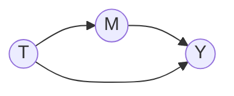
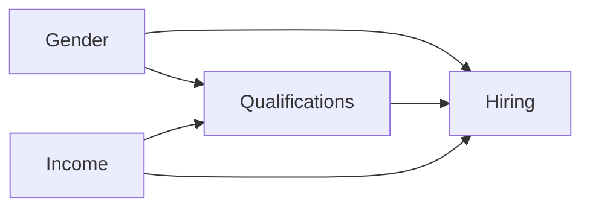
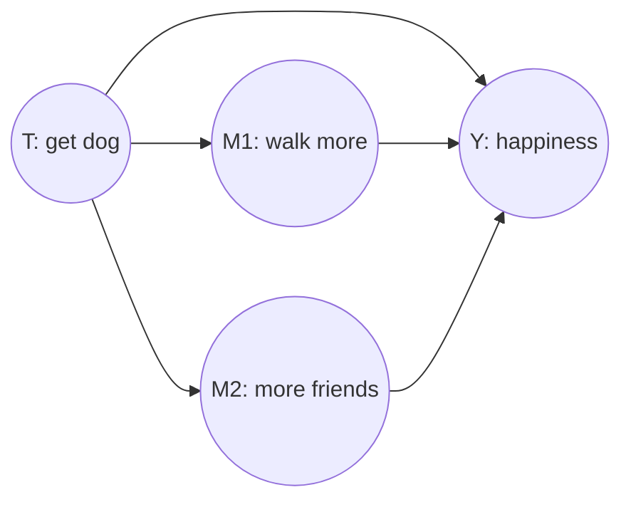

# Lesson 32: Mediation — Natural Direct and Indirect Effects

## Where We Left Off

Part 4 closes with **mediation**: splitting the effect of a treatment into the part that acts **directly** and the part that acts **through** an intermediate variable, the **mediator**. Lesson 25 did this for linear models, where the indirect effect is simply the total effect minus the direct effect. This lesson handles the general case. It needs a new kind of counterfactual, in which the mediator takes the value it *would have had* under a different treatment.

*Notation.* Following the Primer, $T$ is the treatment, $M$ the mediator and $Y$ the outcome:

$$T := f_T(U_T), \qquad M := f_M(T, U_M), \qquad Y := f_Y(T, M, U_Y). \tag{4.43}$$

*The basic mediation model (Primer Figure 4.6(a)): a direct path $T \to Y$ and an indirect path $T \to M \to Y$.*

## Why Conditioning on the Mediator Fails

The traditional way to measure a direct effect is to hold the mediator fixed by *conditioning* on it. Primer §3.7 gives an example. Does a company discriminate by gender in hiring? Gender may affect hiring directly, which is discrimination, and also through qualifications, since men and women may differ in the fields and degrees they pursue. The traditional approach compares men and women *with the same qualifications*: if $P(\text{hired} \mid \text{female}, \text{highly qualified}) \neq P(\text{hired} \mid \text{male}, \text{highly qualified})$, there is a direct effect.

That works only if nothing else links qualifications to hiring. Suppose family income affects both: wealthier applicants are more likely to have gone to college and more likely to have useful connections.

*Primer Figure 3.11 with income added. Qualifications is a collider on the path Gender → Qualifications ← Income.*

Conditioning on qualifications now conditions on a **collider**, which opens the path Gender → Qualifications ← Income → Hiring (Lesson 03). Intuitively, to compare a man and a woman with the same qualifications, the analysis ends up comparing people from different income backgrounds, and income affects hiring. The "direct effect" is contaminated either way.

## The Controlled Direct Effect

The fix is to *intervene* on the mediator instead of conditioning on it. Setting qualifications to a value removes the arrows into it, from gender and from income, so no spurious path can pass through it. (No one literally changes applicants' qualifications; as in Part 3, the intervention is computed by a suitable adjustment.) This defines the **controlled direct effect**:

$$CDE(m) = \mathbb{E}[Y \mid do(T = 1), do(M = m)] - \mathbb{E}[Y \mid do(T = 0), do(M = m)]. \tag{3.18}$$

It is the effect of changing the treatment when *everyone's* mediator is fixed at the same level $m$. Being a do-expression, it can be estimated with the tools of Part 3.

## The Policy Question and the Natural Effects

**Example 4.4.5.** A policy maker wants to know how much of the gender gap in hiring could be closed by making hiring decisions gender-blind, compared with eliminating gender inequality in education and training. The first targets the direct effect of gender on hiring; the second targets the indirect effect through qualifications. The answer decides where the money should go.

Notice what these policies do. Neither sets a variable to a value. Gender-blind hiring *disables* the channel from gender to the hiring decision, while leaving each applicant's qualifications as they naturally are. Educational reform *disables* the channel from gender to qualifications. A do-expression on a variable cannot express "switch off this channel but let everything else behave naturally". Counterfactuals can.

For a change of treatment from $T = 0$ to $T = 1$, there are four effects to distinguish.

**(a) Total effect.** The mediator responds to the treatment as it naturally would:

$$TE = \mathbb{E}[Y_1 - Y_0] = \mathbb{E}[Y \mid do(T = 1)] - \mathbb{E}[Y \mid do(T = 0)]. \tag{4.44}$$

**(b) Controlled direct effect.** The mediator is fixed at the same level $m$ for everyone:

$$CDE(m) = \mathbb{E}[Y_{1,m} - Y_{0,m}]. \tag{4.45}$$

**(c) Natural direct effect.** The treatment changes from 0 to 1, while each individual's mediator stays at the value *it would have had without treatment*:

$$NDE = \mathbb{E}[Y_{1, M_0} - Y_{0, M_0}]. \tag{4.46}$$

**(d) Natural indirect effect.** The treatment is held at 0, while each individual's mediator moves to the value *it would have had with treatment*:

$$NIE = \mathbb{E}[Y_{0, M_1} - Y_{0, M_0}]. \tag{4.47}$$

**Reading the nested subscripts.** They are the new idea of this lesson. In $Y_{1, M_0}$, the outcome sees treatment $T = 1$, but the mediator takes the value $M_0$, itself a counterfactual: what this individual's mediator would have been had $T$ been 0. In $Y_{0, M_1}$, the outcome's direct response to treatment is switched off (the treatment it sees is 0), while the mediator moves to its treated value $M_1$. So the NIE measures how much of the effect the mediator *could* carry on its own, with the outcome blind to the treatment itself. That is the gender-blind-hiring scenario: applicants' qualifications are as gender shaped them, but the decision ignores gender. So the NIE is the hiring gap that would *remain* after gender-blind hiring. Likewise, the NDE is the gap that would remain after educational reform, which removes the channel through qualifications.

Natural effects are cross-world by construction. In $Y_{1, M_0}$, the mediator's value comes from the world where $T = 0$, while the outcome responds in the world where $T = 1$. No single experiment observes both worlds.

**Decomposition.** In general,

$$TE = NDE - NIE_r, \tag{4.48}$$

where $NIE_r$ is the natural indirect effect of the *reverse* change, from $T = 1$ to $T = 0$. So the reverse indirect effect can be computed as $NIE_r = NDE - TE$ whenever the NDE and the TE are identified. In linear models, reversing the change simply flips signs, and the familiar formula $TE = NDE + NIE$ returns. Outside linear models it need not hold.

The TE and the CDE are do-expressions, estimable with Part 3's tools. The NDE and NIE are not, and need further conditions.

## Identifying the Natural Effects

The natural effects can be identified if there is a set $W$ of measured covariates such that:

- **A-1** No member of $W$ is a descendant of $T$.
- **A-2** $W$ blocks all backdoor paths from $M$ to $Y$, after the arrows $T \to M$ and $T \to Y$ are removed.
- **A-3** The $W$-specific effect of $T$ on $M$ is identifiable, by experiment or adjustment.
- **A-4** The $W$-specific joint effect of $\{T, M\}$ on $Y$ is identifiable, by experiment or adjustment.

> **Theorem 4.5.2 (Identification of the NDE).** Under A-1 and A-2, the natural direct effect is experimentally identifiable:
> $$NDE = \sum_{m, w} \Big[ \mathbb{E}[Y \mid do(T{=}1, M{=}m), W{=}w] - \mathbb{E}[Y \mid do(T{=}0, M{=}m), W{=}w] \Big]\, P(M{=}m \mid do(T{=}0), W{=}w)\, P(W{=}w). \tag{4.49}$$

Conditions A-3 and A-4 make the do-expressions in (4.49) computable, by the backdoor or front-door criteria. If the same set $W$ also removes the confounding in A-3 and A-4, every do-expression becomes an ordinary conditional expectation (Corollary 4.5.1).

**The mediation formulas.** When there is no confounding at all (Figure 4.6(a)), the conditions hold with $W$ empty, and the natural effects reduce to:

$$NDE = \sum_m \Big[ \mathbb{E}[Y \mid T{=}1, M{=}m] - \mathbb{E}[Y \mid T{=}0, M{=}m] \Big]\, P(M = m \mid T = 0), \tag{4.51}$$

$$NIE = \sum_m \mathbb{E}[Y \mid T{=}0, M{=}m]\, \Big[ P(M = m \mid T = 1) - P(M = m \mid T = 0) \Big]. \tag{4.52}$$

- **The NDE formula** goes through the mediator levels. For each level $m$ it takes the effect of the treatment at that level, which is a controlled direct effect, and weights it by the share of people who would naturally have that level *without* treatment. So the NDE is a weighted average of CDEs.
- **The NIE formula** keeps the outcome's response fixed at the untreated values, $\mathbb{E}[Y \mid T{=}0, M{=}m]$, and asks how much the outcome changes because the mediator's distribution shifts from its untreated to its treated form. There is no reading of it as an average of CDEs; it is a new kind of quantity.

**Response fractions.** The definitions give meaningful proportions:

- $NDE/TE$: the fraction of the effect transmitted directly, with the mediator frozen at its natural untreated value;
- $NIE/TE$: the fraction the mediator *could* transmit on its own, with the outcome blind to the treatment;
- $(TE - NDE)/TE$: the fraction for which the mediator is *necessary*.

## A Worked Example

Return to the encouragement design of Lesson 27, now with binary variables: $T = 1$ is taking part in an enhanced training program, $M = 1$ is doing more than three hours of homework a week, and $Y = 1$ is passing the exam. The data come from a randomized trial with no confounding between homework and passing, so Figure 4.6(a) applies.

The question: does the program succeed because of its curriculum, or merely because it gets students to do more homework, something cheaper means might also achieve?

| $T$ | $M$ | $\mathbb{E}[Y \mid T, M]$ |
| :---: | :---: | :---: |
| 1 | 1 | 0.80 |
| 1 | 0 | 0.40 |
| 0 | 1 | 0.30 |
| 0 | 0 | 0.20 |

*Primer Table 4.6: pass rates by program and homework.*

| $T$ | $\mathbb{E}[M \mid T]$ |
| :---: | :---: |
| 0 | 0.40 |
| 1 | 0.75 |

*Primer Table 4.7: the share of students doing more homework. So $P(M{=}1 \mid T{=}0) = 0.40$ and $P(M{=}0 \mid T{=}0) = 0.60$; $P(M{=}1 \mid T{=}1) = 0.75$ and $P(M{=}0 \mid T{=}1) = 0.25$.*

**Natural direct effect**, by (4.51):

$$
\begin{aligned}
NDE &= \underbrace{(0.40 - 0.20)}_{m = 0} \times 0.60 + \underbrace{(0.80 - 0.30)}_{m = 1} \times 0.40 \\
&= 0.20 \times 0.60 + 0.50 \times 0.40 = 0.12 + 0.20 = 0.32
\end{aligned}
$$

**Natural indirect effect**, by (4.52):

$$
\begin{aligned}
NIE &= \underbrace{0.30 \times (0.75 - 0.40)}_{m = 1} + \underbrace{0.20 \times (0.25 - 0.60)}_{m = 0} \\
&= 0.105 - 0.070 = 0.035
\end{aligned}
$$

**Total effect.** In a randomized trial, $TE = \mathbb{E}[Y \mid T{=}1] - \mathbb{E}[Y \mid T{=}0]$:

$$
\begin{aligned}
\mathbb{E}[Y \mid T = 1] &= 0.80 \times 0.75 + 0.40 \times 0.25 = 0.60 + 0.10 = 0.70 \\
\mathbb{E}[Y \mid T = 0] &= 0.30 \times 0.40 + 0.20 \times 0.60 = 0.12 + 0.12 = 0.24 \\
TE &= 0.70 - 0.24 = 0.46
\end{aligned}
$$

(The Primer prints the last term of $\mathbb{E}[Y \mid T{=}0]$ as $0.20 \times 0.10$, a misprint: the share of untreated students with little homework is 0.60, and only $0.20 \times 0.60$ gives the stated total of 0.46.)

**Response fractions.**

$$\frac{NDE}{TE} = \frac{0.32}{0.46} = 0.696, \qquad \frac{NIE}{TE} = \frac{0.035}{0.46} = 0.076, \qquad 1 - \frac{NDE}{TE} = 0.304.$$

**Interpretation.** The program raised the pass rate by 46 percentage points. For 30.4% of that increase, the extra homework the program stimulated was necessary. But only about 7% of the increase could be produced by the extra homework alone, without the program itself. The program's success is mostly substantive, not just a matter of encouraging homework.

Notice that the fractions do not add up: $0.696 + 0.076 \neq 1$. The decomposition is $TE = NDE - NIE_r$, not $NDE + NIE$, and in a nonlinear model the indirect effect of the reverse change is not simply the negative of the forward one. Here the program and homework work together (the pass rate with both, 0.80, exceeds what either adds alone), and that interaction belongs to neither fraction exclusively. Computing an indirect effect as "total minus direct" outside a linear model gives $(TE - NDE)$, which answers the "necessary" question, not the "sufficient" one.

## Which Effect Answers Which Question?

- **"What if everyone's mediator were set to the same level $m$?"** Use the **controlled direct effect** $CDE(m)$. It describes an intervention that fixes the mediator's value, and it is identified by ordinary adjustment.
- **"How much of the effect would remain if the mediator stayed as it naturally is without treatment?"** Use the **natural direct effect**. It is the effect left after a policy that disables the channel through the mediator, such as educational reform in the hiring example.
- **"How much of the effect could the mediator carry on its own?"** Use the **natural indirect effect**. It is the effect left after a policy that disables the direct channel, such as gender-blind hiring.

The CDE can be estimated wherever adjustment works. The natural effects need conditions A-1 to A-4 and can fail where the CDE succeeds. A useful check: does the question name a *value* of the mediator (CDE) or its *natural behaviour* (NDE, NIE)?

The Primer's closing remark for this chapter: conditions A-1 to A-4 are hard to judge by inspection, but with a causal graph they can be checked mechanically, by tracing paths. The graph turns a hard judgement about counterfactuals into judgements about ordinary causal relationships. Natural direct and indirect effects were developed by Robins and Greenland (1992) and Pearl (2001), in the potential-outcomes and structural traditions respectively.

## More Than One Mediator: Path-Specific Effects

Neal's lecture on mediation extends his dog example. Getting a dog ($T$) may raise happiness ($Y$) directly, but also through two mediators: the owner walks more ($M_1$), and the owner makes more friends ($M_2$), for instance by meeting other dog owners.

*Neal's two-mediator example.*

With one mediator, the effect splits into two parts, direct and indirect. With two, there are three routes, and a question may be about any one of them or any combination: "how much of the effect comes from walking?", "how much from friendship?". The effect transmitted along a chosen set of paths is called a **path-specific effect**. It is defined with nested counterfactuals like those above. For the effect along $T \to M_1 \to Y$ alone, the treatment is switched on only for $M_1$, while the direct path and $M_2$ stay at their untreated values:

$$\mathbb{E}\big[Y_{0,\ M_{1,1},\ M_{2,0}} - Y_{0,\ M_{1,0},\ M_{2,0}}\big],$$

where $M_{1,t}$ and $M_{2,t}$ are the values the mediators would take under treatment $t$. The natural direct and indirect effects of this lesson are the special cases with one mediator.

Identifying path-specific effects needs conditions like A-1 to A-4 and can fail in cases where the natural effects are identified. Avin, Shpitser and Pearl (2005) give the graphical conditions.

## Summary and Key Takeaways

1. Conditioning on a mediator does not give a direct effect when something else affects both the mediator and the outcome: the mediator becomes a collider.
2. The **controlled direct effect** intervenes on the mediator instead, fixing it at a level $m$ for everyone.
3. Mediation policies usually **disable a channel** rather than set a value. Natural effects express this with nested counterfactuals: $NDE = \mathbb{E}[Y_{1,M_0} - Y_{0,M_0}]$ and $NIE = \mathbb{E}[Y_{0,M_1} - Y_{0,M_0}]$.
4. In general $TE = NDE - NIE_r$; only in linear models does $TE = NDE + NIE$ hold.
5. Under conditions A-1 to A-4 the natural effects are identifiable. Without confounding they are given by the **mediation formulas** (4.51)–(4.52). The NDE is a weighted average of CDEs; the NIE is not.
6. In the Primer's example: $TE = 0.46$, $NDE = 0.32$, $NIE = 0.035$. The mediator is necessary for 30.4% of the effect but sufficient for only about 7%.
7. With several mediators, **path-specific effects** measure the effect along any chosen set of paths; natural direct and indirect effects are the one-mediator case.

**Part 4 is complete. Next step:** Lesson 33 opens **Part 5, Estimation**: turning identified formulas into estimates from finite data, starting with models of the outcome.

### Check Your Understanding

1. Write $NDE$ and $NIE$ in subscript notation and identify, in each, the counterfactual that comes from a different world from the outcome's.
2. Using Tables 4.6–4.7, compute $CDE(0)$ and $CDE(1)$. Show that the NDE is their weighted average, with weights $P(M = m \mid T = 0)$.
3. Explain why comparing hiring rates of men and women *with the same qualifications* estimates neither the CDE nor the NDE when income affects both qualifications and hiring.
4. The program and homework interact in Table 4.6. Explain in words why that makes $NDE/TE + NIE/TE \neq 1$.

---

## Further Reading

*Ref*: *Causal Inference in Statistics: A Primer (2016)*, Chapter 3, Section 3.7 (Figure 3.11, Eq. 3.18) and Chapter 4, Sections 4.4.5 and 4.5.2 (Eqs. 4.43–4.52, Tables 4.6–4.7, Theorem 4.5.2, Corollary 4.5.1); Robins & Greenland (1992); Pearl (2001); Brady Neal, *Introduction to Causal Inference* course, week 14 lecture slides, "Counterfactuals and Mediation" (the two-mediator dog example); Avin, Shpitser & Pearl (2005), *Identifiability of path-specific effects*.
