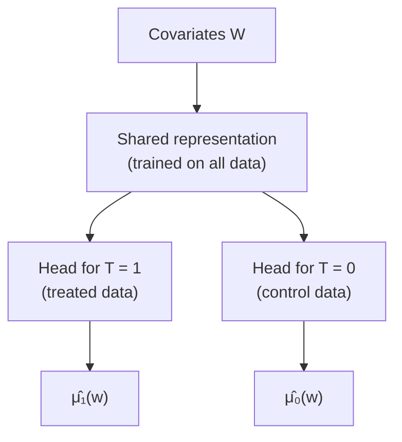

# Lesson 33: Estimation I — Outcome Models and Meta-Learners

## Where We Left Off

Parts 3 and 4 were about **identification**: turning a causal question into a formula over the observed distribution. Lesson 18 called that formula a *statistical estimand*. Part 5 is about the next step, **estimation**: computing that formula from a finite data set. The Primer says little about estimation, since its focus is identification. Neal's Chapter 7, "Estimation", written from a machine-learning perspective, is the main source for this part.

Throughout Part 5, identification is taken as settled. When estimating an average effect, we assume the adjustment set satisfies the backdoor criterion (Lesson 20), which guarantees conditional exchangeability (Lessons 12 and 28). What remains is a statistical problem.

*Notation.* This part follows Neal's notation, which differs from Lessons 18–25: $T$ is the treatment, $Y$ the outcome, $W$ a sufficient adjustment set, and $X$ covariates whose effect-specific values we may care about.

## More Individual Targets: CATE and IATE

Lessons 08–09 introduced the individual treatment effect, $Y_i(1) - Y_i(0)$, and the average treatment effect, $\mathbb{E}[Y(1) - Y(0)]$. Individual effects are the most specific, but they cannot be estimated without strong assumptions. Often the target lies in between: the effect for *people like this one*, described by observed covariates $x$.

> **Conditional average treatment effect (CATE).**
> $$\tau(x) := \mathbb{E}[Y(1) - Y(0) \mid X = x].$$

When $x$ is the full vector of observed covariates, Neal calls $\tau(x)$ an **individualized average treatment effect (IATE)**.

> [!CAUTION]
> **An IATE is not an individual treatment effect.** Two people can share every observed covariate yet have different potential outcomes, because of differences nobody measured. IATEs and ITEs coincide only if $x$ contains *everything* relevant to a person's potential outcomes; in a causal graph, that means every background factor with causal association flowing to $Y$. Since those are never all observed, an IATE is still an average over a group. It is common to report IATE estimates as if they were individual effects, but Neal warns that this is likely unreliable, because of severe positivity violations: with all covariates specified, there is usually at most one unit with exactly those values, so one of the two treatment arms has no data there (Lesson 13).

## Conditional Outcome Modelling (COM)

Start from the adjustment formula of Lesson 19, written in expectation form:

$$\mathbb{E}[Y(1) - Y(0)] = \mathbb{E}_W\big[\, \mathbb{E}[Y \mid T = 1, W] - \mathbb{E}[Y \mid T = 0, W] \,\big].$$

The left side is the causal estimand; the right side is the statistical estimand that identification produced. To estimate it, name the inner conditional expectation:

$$\mu(t, w) := \mathbb{E}[Y \mid T = t, W = w].$$

Then fit a statistical model $\widehat{\mu}$ to it. Any method that minimizes the mean squared error of predicting $Y$ from $(T, W)$ targets this conditional expectation, so linear regression, random forests or neural networks all qualify. Plugging the fitted model in gives the **conditional outcome model (COM) estimator**:

$$\widehat{ATE} = \frac{1}{n} \sum_{i=1}^{n} \big[ \widehat{\mu}(1, w_i) - \widehat{\mu}(0, w_i) \big].$$

For each unit, predict its outcome under treatment and under control, using its own covariates, take the difference, and average over all units.

**Two approximations** are hidden in this estimator:

1. $\widehat{\mu}$ approximates $\mu$. This is the error of the statistical model, which shrinks with more data and a suitable model.
2. The average over the sample, $\frac{1}{n}\sum_i$, approximates the expectation over $W$. This is ordinary sampling error.

**For a CATE**, the covariates $X$ must be added to the model's input, because they are now part of what the effect is conditional on. Define $\mu(t, w, x) := \mathbb{E}[Y \mid T = t, W = w, X = x]$, fit it, and average over the $n_x$ units with $X = x$:

$$\widehat{\tau}(x) = \frac{1}{n_x} \sum_{i:\, x_i = x} \big[ \widehat{\mu}(1, w_i, x) - \widehat{\mu}(0, w_i, x) \big].$$

For an IATE, where $x$ is all the observed covariates, there is usually a single unit with $X = x$, and the estimator becomes a simple difference of two predictions, $\widehat{\mu}(1, w, x) - \widehat{\mu}(0, w, x)$.

> [!NOTE]
> **One estimator, many names.** In epidemiology and biostatistics, COM estimators are called *G-computation*, the *parametric G-formula*, or *standardization*. Because a single model is fitted for $\mu$, the machine-learning literature also calls this the **S-learner**, "S" for single.

### A Small Check on Familiar Data

Take the drug data of Lesson 19 (Primer Table 1.1), with gender $W$ as the adjustment set. With only two binary inputs, the most flexible possible model simply uses the recovery rate in each cell:

| | Treated ($T = 1$) | Untreated ($T = 0$) |
| --- | --- | --- |
| Men (357 of 700) | $81/87 = 0.931$ | $234/270 = 0.867$ |
| Women (343 of 700) | $192/263 = 0.730$ | $55/80 = 0.688$ |

For each man, $\widehat{\mu}(1, w) - \widehat{\mu}(0, w) = 0.931 - 0.867 = 0.064$; for each woman, $0.730 - 0.688 = 0.043$. Averaging over all 700 people:

$$\widehat{ATE} = \frac{357}{700} \times 0.064 + \frac{343}{700} \times 0.043 = 0.51 \times 0.064 + 0.49 \times 0.043 = 0.033 + 0.021 = 0.054.$$

This is exactly the adjustment formula. (Lesson 19 reports 0.050, having rounded each rate to two decimal places first; with unrounded rates it is 0.054.) With such a flexible model, the COM estimator *is* the adjustment formula computed from the data.

## Grouped Conditional Outcome Modelling (GCOM)

COM has a weakness. The model's input is $(t, w)$, where $t$ is a single number and $w$ may have many dimensions. Yet $t$ is the only input that changes between the two predictions being subtracted. A flexible model, a neural network for example, can simply learn to ignore $t$ and concentrate on $w$, and then every predicted difference is zero. Neal notes some evidence that COM estimators are biased toward zero for this reason.

The fix is to make it impossible to ignore the treatment, by fitting **two separate models**, one for each treatment group:

$$\mu_1(w) := \mathbb{E}[Y \mid T = 1, W = w], \qquad \mu_0(w) := \mathbb{E}[Y \mid T = 0, W = w].$$

Fit $\widehat{\mu}_1$ on the treated units only, and $\widehat{\mu}_0$ on the untreated units only. Then, **for every unit**, predict both potential outcomes and average the difference:

$$\widehat{ATE} = \frac{1}{n} \sum_{i=1}^{n} \big[ \widehat{\mu}_1(w_i) - \widehat{\mu}_0(w_i) \big].$$

This is the **grouped conditional outcome model (GCOM)** estimator. Künzel and colleagues call it the **T-learner**, "T" for two.

**The average must run over all units.** It is tempting to average $\widehat{\mu}_1$ over the treated and $\widehat{\mu}_0$ over the untreated instead. On the drug data, that gives $0.780 - 0.826 = -0.046$: the fitted models just reproduce each group's own recovery rate, so the result is the unadjusted comparison, and the drug appears harmful, which is Simpson's reversal again. Averaging both models over the *same* population, everyone, is what makes the two groups comparable.

The price of GCOM is efficiency: each model learns from only part of the data.

## TARNet: A Shared Representation with Two Heads

TARNet (Shalit and colleagues) is a neural-network design between COM and GCOM. A single network takes only $w$ as input and learns a **treatment-agnostic representation** of it from *all* the data. It then branches into **two heads**, one for $T = 1$ and one for $T = 0$, each trained on its own group. Treatment's special role is built into the architecture, so it cannot be ignored, while the representation still learns from every unit. The heads, however, still learn only from their own group's data.

*TARNet's structure. COM would feed $(t, w)$ into one network; GCOM would train two separate networks.*

## The X-Learner: Using All the Data for Both Models

The **X-learner** (Künzel and colleagues) starts from GCOM and adds two steps, so that each of its final models is trained with data from *both* groups. It is neither a COM nor a GCOM estimator. Neal presents it for IATEs, with $x$ the full covariate vector satisfying the backdoor criterion.

**Step 1.** As in GCOM, fit $\widehat{\mu}_1$ on the treated units and $\widehat{\mu}_0$ on the untreated units.

**Step 2: impute effects across the groups.** For each unit, one potential outcome is observed and the other can be predicted by the *other* group's model:

$$
\begin{aligned}
\widetilde{\tau}_{1,i} &= Y_i - \widehat{\mu}_0(x_i) && \text{for treated units: observed } Y(1) \text{ minus predicted } Y(0) \\
\widetilde{\tau}_{0,i} &= \widehat{\mu}_1(x_i) - Y_i && \text{for untreated units: predicted } Y(1) \text{ minus observed } Y(0)
\end{aligned}
$$

Each imputed effect combines a unit's own outcome with the model fitted on the other group; this crossing is where the "X" in the name comes from. Then fit a model $\widehat{\tau}_1$ that predicts $\widetilde{\tau}_{1,i}$ from $x_i$ among the treated, and a model $\widehat{\tau}_0$ that predicts $\widetilde{\tau}_{0,i}$ from $x_i$ among the untreated. Each of these has now used data from both groups.

**Step 3: combine.** Choose a weighting function $g(x)$ between 0 and 1, and set

$$\widehat{\tau}(x) = g(x)\, \widehat{\tau}_0(x) + \big(1 - g(x)\big)\, \widehat{\tau}_1(x).$$

The propensity score of Lesson 34 is a good choice for $g$. Where treatment is likely, the treated group is large, so $\widehat{\mu}_1$, and hence $\widehat{\tau}_0$ which relies on it, is well estimated, and $\widehat{\tau}_0$ receives more weight. When the two groups are very different in size, the constant choices $g \equiv 0$ or $g \equiv 1$ also make sense, relying entirely on one of the two models. And $g$ can be chosen to minimize the estimator's variance.

The X-learner is especially useful when one group is much larger than the other. The effects imputed for the small group then rest on a model fitted to the large group, which pools information that neither COM nor GCOM uses.

## How the Estimators Fail Differently

Outcome models, weighting and matching can look like separate traditions, but they are one family with different weak points. Outcome models, the subject of this lesson, predict the outcome surface and average it over the covariates. Weighting methods (Lessons 34–35) model how treatment was assigned and reweight the data. Each breaks in its own way: an outcome model extrapolates silently into covariate regions where one treatment group has no data (Lesson 13), while weights explode where treatment is nearly certain or nearly impossible. Doubly robust methods (Lesson 35) combine the two because their failures are different.

Keep identification and estimation apart. An identification error, such as adjusting for the wrong set, does not shrink with more data: the estimator converges to the wrong quantity. An estimation error, such as a poorly fitting model or too few data, shrinks as the data grow and the model improves. No choice of estimator can repair a wrong adjustment set, and no causal graph can repair an estimator with high variance. The Primer (§3.6) makes a related point about precision, noting that inverse probability weighting can be very imprecise when some covariate values are rare.

## Summary and Key Takeaways

1. Between the ATE and individual effects lie the **CATE** $\tau(x)$ and the **IATE** (the CATE over all observed covariates). An IATE is not an individual effect unless $x$ captures everything relevant.
2. **COM (S-learner):** fit one model $\widehat{\mu}(t, w)$, then average $\widehat{\mu}(1, w_i) - \widehat{\mu}(0, w_i)$ over all units. With a fully flexible model it reproduces the adjustment formula (0.054 on Lesson 19's drug data).
3. **GCOM (T-learner):** fit a separate model for each treatment group, then average $\widehat{\mu}_1(w_i) - \widehat{\mu}_0(w_i)$ over *all* units. Averaging each model over its own group instead gives back the unadjusted comparison.
4. **TARNet:** one shared representation trained on all data, with two treatment-specific heads.
5. **X-learner:** impute each group's effects using the other group's model, fit models to those imputed effects, and combine them with weights $g(x)$. It helps most when group sizes are unequal.
6. Identification errors do not shrink with more data; estimation errors do.

**Next step:** Lesson 34 compresses the adjustment set into a single number, the **propensity score**, and Lesson 35 builds estimators on it.

### Check Your Understanding

1. Write the COM estimator for the ATE and name the two approximations it makes. Which one shrinks with more data regardless of the model, and which depends on the model?
2. Show that when $\widehat{\mu}_1$ and $\widehat{\mu}_0$ are the cell means of a discrete $W$, the GCOM estimator equals the adjustment formula $\sum_w \big(\mathbb{E}[Y \mid T{=}1, w] - \mathbb{E}[Y \mid T{=}0, w]\big) P(w)$.
3. TARNet shares a representation between its two heads. Give one way this sharing helps and one way it could hurt, for instance when the two outcome surfaces depend on different features.
4. In the X-learner, why does it make sense to give $\widehat{\tau}_0$ more weight where the propensity score is high?

---

## Further Reading

*Ref*: Brady Neal, *Introduction to Causal Inference* (Dec 2020 draft), Chapter 7 (Estimation: COM, GCOM, TARNet, X-learner); Künzel et al. (2019), *Metalearners for estimating heterogeneous treatment effects using machine learning*; Shalit et al. (2017), *Estimating individual treatment effect: generalization bounds and algorithms*; *Causal Inference in Statistics: A Primer (2016)*, §3.6 (the remark on precision).
