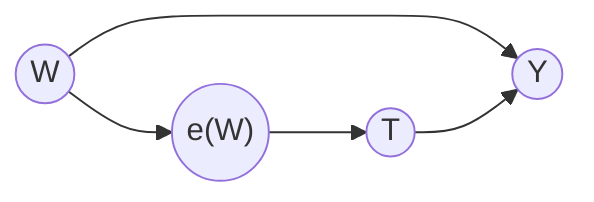

# Lesson 34: The Propensity Score

## Where We Left Off

The estimators of Lesson 33 adjust for the whole adjustment set $W$. When $W$ contains many variables, that is hard. Lesson 19 described the tension: adjusting for more variables removes more confounding, but it also splits the data into more and thinner strata, so positivity becomes harder to satisfy. Neal calls this the **positivity–unconfoundedness tradeoff**. This lesson presents a surprising result: under the assumptions already made, the whole vector $W$ can be replaced by a **single number** for each unit.

*Notation.* As in Lesson 33: $T$ is a binary treatment, $Y$ the outcome, and $W$ a sufficient adjustment set.

## The Propensity Score and the Theorem

> **Propensity score.**
> $$e(w) := P(T = 1 \mid W = w),$$
> the probability of receiving treatment for a unit with covariates $w$.

The central result about it:

> **Propensity score theorem** (Rosenbaum and Rubin, 1983). Given positivity, unconfoundedness given $W$ implies unconfoundedness given the propensity score:
> $$\big(Y(1), Y(0)\big) \perp\!\!\!\perp T \mid W \quad \Longrightarrow \quad \big(Y(1), Y(0)\big) \perp\!\!\!\perp T \mid e(W).$$

In words: conditioning on the single number $e(W)$ removes exactly as much confounding as conditioning on the whole vector $W$. So $e(W)$ can be used in place of $W$ wherever an estimator adjusts for $W$: in the COM, GCOM and X-learner estimators of Lesson 33, and in the adjustment formula itself.

**A small example of what this means.** Suppose $W$ takes four values, with propensities $e(a) = e(b) = 0.2$ and $e(c) = e(d) = 0.6$. Units with $W = a$ and units with $W = b$ differ in their covariates, but they had the same chance of being treated. The theorem says they can be pooled into one stratum, "propensity 0.2", and treated and untreated units compared within it, without reintroducing confounding. Four strata become two. With many covariates, the saving is far larger.

## The Graphical Proof

Neal proves the theorem with a graph, using only the backdoor criterion.

Start from a graph in which $W$ satisfies the backdoor criterion for the effect of $T$ on $Y$: $W$ affects both $T$ and $Y$. The arrow $W \to T$ stands for the mechanism $P(T \mid W)$, the way treatment is assigned. Because $T$ is binary, that mechanism is completely described by one number, $P(T = 1 \mid W) = e(W)$. So all of $W$'s influence on $T$ passes through $e(W)$, and the graph can be redrawn with $e(W)$ between $W$ and $T$:

*The redrawn graph. The propensity score is now the only parent of $T$.*

In the redrawn graph, $e(W)$ is the only parent of $T$. Every backdoor path from $T$ to $Y$ must begin $T \leftarrow e(W) \leftarrow \cdots$, so it passes through $e(W)$, where the path does not collide. Conditioning on $e(W)$ therefore blocks every backdoor path, which is to say that $e(W)$ satisfies the backdoor criterion whenever $W$ does. The backdoor adjustment of Lesson 20 then gives the theorem. Neal also gives a conventional algebraic proof in an appendix.

## What the Theorem Does Not Solve

The theorem seems to dissolve the tradeoff. However many variables $W$ contains, $e(W)$ is one number per unit: one variable to stratify on, one axis on which to check positivity.

The catch, which Neal states plainly: **the true propensity score $e(W)$ is not known.** It is a population quantity and has to be estimated, by fitting a model $\widehat{e}(w)$ that predicts $T$ from $W$. Logistic regression is the most common choice. And because that model is fitted to the full, high-dimensional $W$, the difficulty has not disappeared. In Neal's words, "we have just shifted the positivity problem to our model for $e(W)$". The theorem guarantees that the *true* propensity score suffices. It says nothing about how hard it is to estimate well.

Two things can then go wrong, and later lessons respond to both.

- **A misspecified propensity model** gives a wrong $\widehat{e}(w)$, and every estimator that uses it in place of $W$ inherits the error.
- **Propensities close to 0 or 1**, near-violations of positivity, make the inverse-probability weights of Lesson 35 very large and the estimates unstable.

Doubly robust methods (Lesson 35) combine an outcome model with a propensity model so that the estimate is still correct if either one of the two models is right.

## Checking the Propensity Model: Balance

The propensity score also has a **balancing property**: within any group of units with the same propensity, the distribution of $W$ is the same for treated and untreated units,

$$T \perp\!\!\!\perp W \mid e(W).$$

This holds by the definition of $e(W)$, whether or not unconfoundedness is true. It gives a practical check. After fitting $\widehat{e}(w)$, group the units into bins of similar estimated propensity and compare the covariates of treated and untreated units within each bin. If the *observed* covariates are not balanced, the propensity model is wrong, and estimators built on it cannot be trusted.

The check has a clear limit. It tests the propensity *model*, against the covariates that were measured. It does not test unconfoundedness. If an important confounder was never measured, the balance check cannot see it, and the covariates can look perfectly balanced while the estimate is still biased. That limit is what motivates the sensitivity analysis of Lesson 37.

## Summary and Key Takeaways

1. The **propensity score** $e(w) = P(T = 1 \mid W = w)$ is the probability of treatment given the covariates.
2. **Rosenbaum and Rubin's theorem:** given positivity, if $W$ is a sufficient adjustment set then so is $e(W)$. A single number can replace the whole vector.
3. **Graphical proof:** $e(W)$ is the only parent of $T$ in the redrawn graph, so it blocks every backdoor path that $W$ blocks.
4. The true propensity score is unknown. Estimating it moves the high-dimensional problem into the propensity model rather than removing it.
5. A misspecified propensity model biases the estimators that use it; propensities near 0 or 1 destabilize weighting. Both motivate doubly robust methods.
6. **Balance checks** test the propensity model against observed covariates, but cannot detect an unmeasured confounder.

**Next step:** Lesson 35 uses the propensity score to **reweight the data** into a pseudo-population in which treatment no longer depends on the covariates: inverse probability weighting, and then doubly robust estimation.

### Check Your Understanding

1. In the four-stratum example, suppose $e(a) = 0.2$ but $e(b) = 0.3$. Can strata $a$ and $b$ still be pooled? What would pooling do to the comparison between treated and untreated units?
2. Give an adjustment set $W$ with two binary covariates for which unconfoundedness holds but positivity fails, because $e(w)$ is 0 or 1 for some value $w$. What goes wrong for an estimator that adjusts for $e(W)$?
3. Explain why a perfect balance table does not show that the effect estimate is unbiased.
4. In the graphical proof, why does it matter that $T$ is binary? What would $e(W)$ have to be replaced by if $T$ took three values?

---

## Further Reading

*Ref*: Brady Neal, *Introduction to Causal Inference* (Dec 2020 draft), Chapter 7 (Propensity Scores, and the appendix proof of the propensity score theorem); Rosenbaum & Rubin (1983), *The central role of the propensity score in observational studies for causal effects*.
