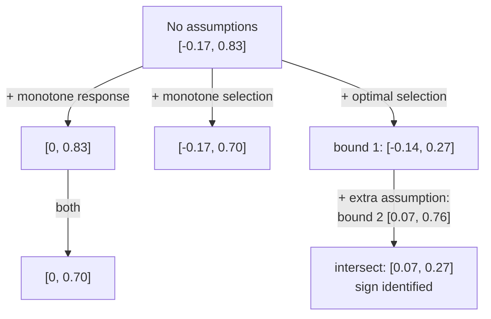

# Lesson 36: Bounds on Causal Effects

## Where We Left Off

Every method in Parts 3–5 assumed that there is no unmeasured confounding. That assumption cannot be tested: an observational study can always hide a confounder nobody measured. Lesson 20 ended with the options that remain when identification fails, and Part 6 takes them up. Neal's Chapter 8 offers two. This lesson finds an **interval** the causal effect must lie in, using only assumptions that are easy to defend. This approach comes from Charles Manski's work on **partial identification**. Lesson 37 asks how strong an unmeasured confounder would have to be to change a conclusion.

*Notation.* As in Part 5, following Neal: $T$ is a binary treatment, $Y$ the outcome, and $p := P(T = 1)$.

## The Law of Decreasing Credibility

> [!IMPORTANT]
> Manski's principle: *the credibility of inference decreases with the strength of the assumptions maintained.*

Since Lesson 12, the course has bought point identification, a single number for the effect, by making strong assumptions such as unconfoundedness. Bounds make the opposite trade. Weaker assumptions give a wider interval, but one that can be defended. With full unconfoundedness the interval shrinks to a point; each assumption dropped widens it.

The strategy throughout this lesson: split the average treatment effect into a part that can be estimated from data and a part that cannot, then bound the second part using whatever assumption is defensible.

## Splitting the Effect into Observed and Unobserved Parts

Assume the outcome is bounded: $\ell \leq Y(t) \leq u$ for both treatments. For a binary outcome, $\ell = 0$ and $u = 1$.

Split each potential-outcome mean by the law of total expectation, according to which treatment each unit actually received:

$$
\begin{aligned}
\mathbb{E}[Y(1)] &= p\, \mathbb{E}[Y(1) \mid T = 1] + (1 - p)\, \mathbb{E}[Y(1) \mid T = 0] \\
\mathbb{E}[Y(0)] &= p\, \mathbb{E}[Y(0) \mid T = 1] + (1 - p)\, \mathbb{E}[Y(0) \mid T = 0]
\end{aligned}
$$

By consistency, $\mathbb{E}[Y(1) \mid T = 1] = \mathbb{E}[Y \mid T = 1]$ and $\mathbb{E}[Y(0) \mid T = 0] = \mathbb{E}[Y \mid T = 0]$. Subtracting:

> **Observational–counterfactual decomposition.**
> $$\mathbb{E}[Y(1) - Y(0)] = p\, \underbrace{\mathbb{E}[Y \mid T = 1]}_{\text{observed}} + (1 - p)\, \underbrace{\mathbb{E}[Y(1) \mid T = 0]}_{\text{unobserved}} - p\, \underbrace{\mathbb{E}[Y(0) \mid T = 1]}_{\text{unobserved}} - (1 - p)\, \underbrace{\mathbb{E}[Y \mid T = 0]}_{\text{observed}}$$

Two terms can be estimated from data. The other two are counterfactual: what the untreated would have had under treatment, and what the treated would have had without it. Every bound below is a different way of limiting those two terms.

## The No-Assumptions Bound

With only bounded outcomes, each unobserved term lies between $\ell$ and $u$. For the largest possible effect, set the added unobserved term to $u$ and the subtracted one to $\ell$; for the smallest, do the reverse.

> **No-assumptions bound.**
> $$p\, \mathbb{E}[Y \mid T{=}1] + (1{-}p)\,\ell - p\,u - (1{-}p)\, \mathbb{E}[Y \mid T{=}0] \;\leq\; \mathbb{E}[Y(1) - Y(0)] \;\leq\; p\, \mathbb{E}[Y \mid T{=}1] + (1{-}p)\,u - p\,\ell - (1{-}p)\, \mathbb{E}[Y \mid T{=}0]$$

Subtracting the lower limit from the upper gives a width of exactly $(1 - p)(u - \ell) + p(u - \ell) = u - \ell$. Without data, the effect could lie anywhere in $[-(u - \ell),\ u - \ell]$, which has width $2(u - \ell)$. The data alone halve that.

**Running example** (Neal's, used throughout). A binary outcome, so $\ell = 0$ and $u = 1$, with $p = 0.3$, $\mathbb{E}[Y \mid T{=}1] = 0.9$ and $\mathbb{E}[Y \mid T{=}0] = 0.2$.

$$
\begin{aligned}
\text{upper} &= 0.3 \times 0.9 + 0.7 \times 1 - 0.3 \times 0 - 0.7 \times 0.2 = 0.27 + 0.70 - 0 - 0.14 = 0.83 \\
\text{lower} &= 0.3 \times 0.9 + 0.7 \times 0 - 0.3 \times 1 - 0.7 \times 0.2 = 0.27 + 0 - 0.30 - 0.14 = -0.17
\end{aligned}
$$

So $-0.17 \leq \mathbb{E}[Y(1) - Y(0)] \leq 0.83$: width 1, against the naive width of 2.

**This interval always contains zero.** The upper limit is smallest when the observed means are as unfavourable as possible, $\mathbb{E}[Y \mid T{=}1] = \ell$ and $\mathbb{E}[Y \mid T{=}0] = u$. Then it equals $p\ell + (1-p)u - p\ell - (1-p)u = 0$. So the upper limit is never below zero, and by the same argument the lower limit is never above zero. Without further assumptions, no pattern in the data can show whether the treatment helps or harms. Any escape from zero has to come from an assumption about how treatment works or how it was assigned.

## Monotone Treatment Response

**Assumption (nonnegative monotone treatment response).** Treatment never hurts anyone: $Y_i(1) \geq Y_i(0)$ for every unit $i$.

Then each individual effect is at least zero, so the average is too:

$$\mathbb{E}[Y(1) - Y(0)] \geq 0.$$

The assumption replaces the no-assumptions lower limit with 0. In the running example the interval becomes $[0, 0.83]$. (The nonpositive version, treatment never helps, gives an upper limit of 0 instead.) The sign of the effect is now *assumed*, not learned from data; that is the price of the assumption.

## Monotone Treatment Selection

**Assumption (monotone treatment selection).** Those who take the treatment would do at least as well as those who do not, *under either treatment*:

$$\mathbb{E}[Y(1) \mid T = 1] \geq \mathbb{E}[Y(1) \mid T = 0] \qquad \text{and} \qquad \mathbb{E}[Y(0) \mid T = 1] \geq \mathbb{E}[Y(0) \mid T = 0].$$

This is positive self-selection: the treated would have had better outcomes regardless. It bounds each unobserved term by an observed one: $\mathbb{E}[Y(1) \mid T = 0] \leq \mathbb{E}[Y \mid T = 1]$ and $\mathbb{E}[Y(0) \mid T = 1] \geq \mathbb{E}[Y \mid T = 0]$. Substituting into the decomposition:

$$
\begin{aligned}
\mathbb{E}[Y(1) - Y(0)] &\leq p\, \mathbb{E}[Y \mid T{=}1] + (1{-}p)\, \mathbb{E}[Y \mid T{=}1] - p\, \mathbb{E}[Y \mid T{=}0] - (1{-}p)\, \mathbb{E}[Y \mid T{=}0] \\
&= \mathbb{E}[Y \mid T = 1] - \mathbb{E}[Y \mid T = 0].
\end{aligned}
$$

The observed difference in means becomes an **upper** limit. In the running example it is $0.9 - 0.2 = 0.7$, so the interval is $[-0.17, 0.7]$. Combined with monotone treatment response it becomes $[0, 0.7]$, which still contains zero.

> [!WARNING]
> Monotone treatment selection assumes *positive* self-selection. In many health studies the opposite holds: sicker people seek treatment, so the treated would have done *worse* without it. Reverse the assumption and the inequalities flip: the observed difference becomes a *lower* limit instead. Which direction applies is a judgement about the world, not a statistical choice, and getting it wrong moves the bound the wrong way with no warning from the data.

## Optimal Treatment Selection

**Assumption (optimal treatment selection).** Everyone receives the treatment that is better for them, as if an expert doctor assigned treatments:

$$T_i = 1 \;\Longrightarrow\; Y_i(1) \geq Y_i(0), \qquad T_i = 0 \;\Longrightarrow\; Y_i(0) > Y_i(1).$$

Neal derives two different bounds under this assumption, to show that bounds can be better in different ways. As explained below, the second one quietly needs an extra assumption.

### Bound 1: Narrower, but Always Contains Zero

The untreated chose correctly, so their outcome under treatment would have been no better: $\mathbb{E}[Y(1) \mid T = 0] \leq \mathbb{E}[Y(0) \mid T = 0] = \mathbb{E}[Y \mid T = 0]$. Likewise the treated chose correctly: $\mathbb{E}[Y(0) \mid T = 1] \leq \mathbb{E}[Y \mid T = 1]$.

- **Upper limit.** Replace $\mathbb{E}[Y(1) \mid T{=}0]$ by its upper bound $\mathbb{E}[Y \mid T{=}0]$, and $\mathbb{E}[Y(0) \mid T{=}1]$ by its lower bound $\ell$:
  $$\mathbb{E}[Y(1) - Y(0)] \leq p\, \mathbb{E}[Y \mid T{=}1] + (1{-}p)\,\mathbb{E}[Y \mid T{=}0] - p\,\ell - (1{-}p)\,\mathbb{E}[Y \mid T{=}0] = p\, \mathbb{E}[Y \mid T{=}1] - p\,\ell.$$
- **Lower limit.** Replace $\mathbb{E}[Y(1) \mid T{=}0]$ by $\ell$, and $\mathbb{E}[Y(0) \mid T{=}1]$ by its upper bound $\mathbb{E}[Y \mid T{=}1]$:
  $$\mathbb{E}[Y(1) - Y(0)] \geq p\, \mathbb{E}[Y \mid T{=}1] + (1{-}p)\,\ell - p\, \mathbb{E}[Y \mid T{=}1] - (1{-}p)\,\mathbb{E}[Y \mid T{=}0] = (1{-}p)\,\ell - (1{-}p)\,\mathbb{E}[Y \mid T{=}0].$$

Width: $p\, \mathbb{E}[Y \mid T{=}1] + (1{-}p)\, \mathbb{E}[Y \mid T{=}0] - \ell$. Running example: upper $0.3 \times 0.9 - 0 = 0.27$, lower $0 - 0.7 \times 0.2 = -0.14$, so $[-0.14, 0.27]$, width 0.41. Narrower than before, but this interval also always contains zero.

### Bound 2: Can Exclude Zero, but Needs an Extra Assumption

Neal attributes a second bound to Manski. It replaces each unobserved term with the *other* group's observed mean:

$$\mathbb{E}[Y(1) \mid T = 0] \leq \mathbb{E}[Y \mid T = 1], \qquad \mathbb{E}[Y(0) \mid T = 1] \leq \mathbb{E}[Y \mid T = 0].$$

Neal's argument for the first inequality has three steps:

1. Under optimal selection, the untreated are exactly the units with $Y(0) > Y(1)$, so $\mathbb{E}[Y(1) \mid T = 0] = \mathbb{E}[Y(1) \mid Y(0) > Y(1)]$.
2. Flipping the condition to $Y(0) \leq Y(1)$ is taken to give an upper bound: $\mathbb{E}[Y(1) \mid Y(0) > Y(1)] \leq \mathbb{E}[Y(1) \mid Y(0) \leq Y(1)]$.
3. The units with $Y(0) \leq Y(1)$ are the treated, so the right side is $\mathbb{E}[Y(1) \mid T = 1] = \mathbb{E}[Y \mid T = 1]$ by consistency.

The second inequality is argued the same way.

> [!WARNING]
> **Step 2 does not follow from optimal selection alone.** Take a population with two equally common types, each choosing its better treatment:
>
> | Type | $Y(1)$ | $Y(0)$ | Chooses | Individual effect |
> | --- | :---: | :---: | :---: | :---: |
> | A | 0.9 | 1.0 | $T = 0$ | $-0.1$ |
> | B | 0.1 | 0.0 | $T = 1$ | $+0.1$ |
>
> Here $\mathbb{E}[Y(1) \mid T = 0] = 0.9$, far above $\mathbb{E}[Y \mid T = 1] = 0.1$, so Step 2 fails. The true effect is $\tfrac{1}{2}(-0.1) + \tfrac{1}{2}(0.1) = 0$. Bound 2 below, with $p = 0.5$, $\mathbb{E}[Y \mid T{=}1] = 0.1$, $\mathbb{E}[Y \mid T{=}0] = 1.0$ and $\ell = 0$, gives $[0.05 - 1.0,\ 0.1 - 0.5] = [-0.95, -0.40]$, which excludes the true value. Bound 1 gives $[-0.5, 0.05]$, which contains it.
>
> So bound 2 needs an extra assumption on top of optimal selection: that the people who chose a treatment do at least as well on it, on average, as the people who did not. The first half of that assumption, $\mathbb{E}[Y(1) \mid T{=}0] \leq \mathbb{E}[Y(1) \mid T{=}1]$, is part of monotone treatment selection. Bound 2 is sound when that extra assumption is credible. It is not implied by optimal selection by itself.

Substituting the two inequalities into the decomposition, together with $\ell$ for the remaining unobserved term, gives:

> **Optimal treatment selection bound 2** (optimal selection plus the extra assumption above).
> $$p\, \mathbb{E}[Y \mid T{=}1] + (1{-}p)\,\ell - \mathbb{E}[Y \mid T{=}0] \;\leq\; \mathbb{E}[Y(1) - Y(0)] \;\leq\; \mathbb{E}[Y \mid T{=}1] - p\,\ell - (1{-}p)\,\mathbb{E}[Y \mid T{=}0]$$

Width: $(1{-}p)\, \mathbb{E}[Y \mid T{=}1] + p\, \mathbb{E}[Y \mid T{=}0] - \ell$.

Running example:

$$
\begin{aligned}
\text{upper} &= 0.9 - 0.3 \times 0 - 0.7 \times 0.2 = 0.9 - 0.14 = 0.76 \\
\text{lower} &= 0.3 \times 0.9 + 0.7 \times 0 - 0.2 = 0.27 - 0.2 = 0.07
\end{aligned}
$$

So $0.07 \leq \mathbb{E}[Y(1) - Y(0)] \leq 0.76$, width 0.69. The interval excludes zero: **the sign of the effect is identified**, provided the extra assumption holds. It is, however, wider than bound 1 (0.69 against 0.41).

### Mixing the Two

If both bounds hold, the effect must lie in their intersection. (Neal treats both as consequences of optimal selection; as the warning above shows, bound 2 also needs the extra assumption.) Taking the lower limit of bound 2 and the upper limit of bound 1 gives

$$0.07 \leq \mathbb{E}[Y(1) - Y(0)] \leq 0.27,$$

width 0.20: the sign is identified *and* the interval is the narrowest yet. Neal draws two lessons. Different bounds are better in different cases, and they can be better in different ways, for instance by identifying the sign or by being narrow.

*The running example's interval under each assumption.*

## Bounds Elsewhere in the Course

The same logic appeared in Lesson 31. The bounds on the probability of necessity combined an observational part, an experimental part, and the constraints forced by the counterfactual structure. When a quantity cannot be pinned to a single number, the structure of the counterfactual expression often still limits it to an interval. The optimal-selection assumption is itself a statement about how treatment was assigned in relation to the potential outcomes, the same kind of statement that identification assumptions make.

## Summary and Key Takeaways

1. **Unconfoundedness cannot be tested.** Manski's law of decreasing credibility trades the strength of assumptions for the width of the interval.
2. The **observational–counterfactual decomposition** isolates two unobservable terms; every bound limits them in a different way.
3. **No-assumptions bound:** width $u - \ell$, half the naive width, and it always contains zero.
4. **Monotone treatment response** fixes the sign by assumption. **Monotone treatment selection** makes the observed difference an upper limit.
5. **Optimal treatment selection** gives bound 1, which is narrower but always contains zero. Neal's bound 2 can exclude zero, but it needs an extra assumption: those who chose a treatment do at least as well on it as those who did not. Intersecting the two keeps the best of each.
6. Running example: $[-0.17, 0.83]$ with no assumptions, $[-0.14, 0.27]$ under optimal selection, and $[0.07, 0.27]$ with the extra assumption.

**Next step:** Lesson 37 asks a complementary question. Instead of "what interval must the effect lie in?", it asks "how strong would an unmeasured confounder have to be to change the conclusion?"

### Check Your Understanding

1. Recompute the no-assumptions bound for the running example with $p = 0.5$. Which limits move, and why does the width stay 1?
2. Suppose $Y(1)$ lies in $[0, 1]$ but $Y(0)$ lies in $[-1, 0]$. Derive the no-assumptions bound in this asymmetric case.
3. Explain, in terms of which unobserved term each bound limits and how, why optimal-selection bound 1 always contains zero while bound 2 need not.
4. Under what condition on $p$ is bound 1 narrower than bound 2? (Compare the two width formulas.)

---

## Further Reading

*Ref*: Brady Neal, *Introduction to Causal Inference* (Dec 2020 draft), Chapter 8 (Bounds); Manski (1990), *Nonparametric bounds on treatment effects*; Manski (1997), *Monotone treatment response*; Manski & Pepper (2000); *Causal Inference in Statistics: A Primer (2016)*, §4.5.1 (bounds on the probability of necessity).
