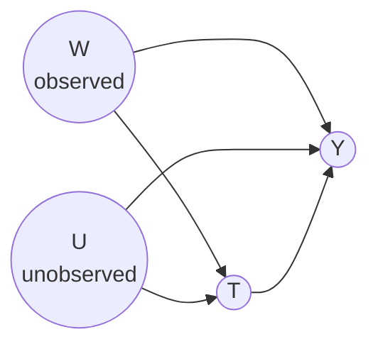

# Lesson 37: Sensitivity Analysis to Unobserved Confounding

## Where We Left Off

Lesson 36 asked what interval the effect must lie in when unconfoundedness is given up. This lesson asks the question that follows every observational estimate: **how robust is the conclusion to a confounder nobody measured?** Instead of bounding the effect with qualitative assumptions, it describes the unmeasured confounder by a few numbers, works out the bias that confounder would cause, and checks whether a plausible confounder could overturn the finding.

*Notation.* Following Neal's Chapter 8: $T$ is the treatment, $Y$ the outcome, $W$ the observed confounders, and $U$ a single **unobserved** confounder.

## The Setup

*$W$ and $U$ both confound the effect of $T$ on $Y$. Only $W$ can be adjusted for.*

Adjusting for $W$ and $U$ would identify the effect. Since $U$ is unobserved, the best available is to adjust for $W$ alone, which leaves some confounding bias. How much?

To keep the answer simple, Neal starts with a **noiseless linear** model:

$$
\begin{aligned}
T &:= aW + \gamma U \\
Y &:= \delta T + bW + \theta U
\end{aligned}
$$

The coefficient $\delta$ is the true effect of $T$ on $Y$. The coefficient $\gamma$ measures how strongly the unobserved confounder affects treatment, and $\theta$ how strongly it affects the outcome. As in Lesson 36, the analysis concerns identification, as if there were unlimited data, not estimation.

## The Bias Formula

Adjusting for $W$ alone gives the effect estimate $\mathbb{E}_W\big[\mathbb{E}[Y \mid T{=}1, W] - \mathbb{E}[Y \mid T{=}0, W]\big]$. To find what it equals, compute $\mathbb{E}[Y \mid T = t, W = w]$.

**Step 1: use the outcome equation.**

$$\mathbb{E}[Y \mid T = t, W = w] = \delta t + b w + \theta\, \mathbb{E}[U \mid T = t, W = w].$$

**Step 2: find $U$ from the treatment equation.** With no noise, the treatment equation determines $U$ exactly once $T$ and $W$ are known: $U = (T - aW)/\gamma$. So $\mathbb{E}[U \mid T = t, W = w] = (t - aw)/\gamma$, and

$$\mathbb{E}[Y \mid T = t, W = w] = \delta t + bw + \frac{\theta}{\gamma}\,(t - aw).$$

**Step 3: take the difference between $t = 1$ and $t = 0$.** The terms without $t$ cancel:

$$\mathbb{E}[Y \mid T = 1, W = w] - \mathbb{E}[Y \mid T = 0, W = w] = \delta + \frac{\theta}{\gamma}.$$

The same holds for every $w$, so averaging over $W$ changes nothing. The effect estimated by adjusting for $W$ alone exceeds the true effect by

> **Confounding bias (noiseless linear model).**
> $$\text{bias} = \frac{\theta}{\gamma}: \quad \text{the confounder's effect on the outcome, divided by its effect on treatment.}$$

Rearranging gives what sensitivity analysis needs:

$$\delta = \underbrace{\mathbb{E}_W\big[\mathbb{E}[Y \mid T{=}1, W] - \mathbb{E}[Y \mid T{=}0, W]\big]}_{\text{the estimate adjusting for } W} - \frac{\theta}{\gamma}.$$

For any assumed strength of the unobserved confounder, $(\gamma, \theta)$, the observed estimate converts into what the true effect would be.

**A caution about the noiseless model.** A small $\gamma$, a confounder that barely affects treatment, produces a *large* bias here. That seems backwards, and the reason is the missing noise. Without noise, knowing $T$ and $W$ reveals $U$ exactly, however weakly $U$ affects $T$, so $T$ acts as a perfect stand-in for $U$. The same fact means that within each value of $(W, U)$ the treatment is fixed, so positivity fails (Lesson 13). Neal leaves this as an exercise: the noiseless model is a convenient first step, not a realistic one.

## Adding Noise: Where the Product Comes From

Give the treatment equation some noise, $T := aW + \gamma U + \varepsilon_T$. Take $U$ and $\varepsilon_T$ to be independent of each other and of $W$, and normally distributed with mean zero, $\mathrm{Var}(U) = 1$ and $\mathrm{Var}(\varepsilon_T) = \sigma^2$. Now $T$ and $W$ no longer determine $U$; they only predict it. Since $T - aW = \gamma U + \varepsilon_T$, the best prediction of $U$ is a regression on $T - aW$:

$$\mathbb{E}[U \mid T, W] = \frac{\mathrm{Cov}(U,\ \gamma U + \varepsilon_T)}{\mathrm{Var}(\gamma U + \varepsilon_T)}\,(T - aW) = \frac{\gamma}{\gamma^2 + \sigma^2}\,(T - aW).$$

Repeating Steps 1 and 3 with this in place of $(T - aW)/\gamma$:

$$\text{bias} = \frac{\gamma\,\theta}{\gamma^2 + \sigma^2}.$$

- **Without noise**, $\sigma^2 = 0$, and this becomes $\gamma\theta/\gamma^2 = \theta/\gamma$, the formula above.
- **If the treatment is standardized**, so that its variance given $W$ is $\gamma^2 + \sigma^2 = 1$, the bias is simply the product $\gamma\theta$. This is Lesson 22's worked example, where the non-causal part of the slope was $ac$, and Lesson 25's rule of multiplying the coefficients along a path.

With noise, the bias behaves as intuition expects: it is small whenever *either* $\gamma$ or $\theta$ is small. A confounder must affect both treatment and outcome to cause much bias. Its sign is the sign of $\gamma\theta$: if the confounder pushes treatment and outcome in the same direction, the estimate is too high; in opposite directions, too low.

## Sensitivity Contour Plots

Because the bias has a closed form in the confounder's two strengths, it can be drawn. Neal's figure follows Imbens (2003), who introduced such plots. For the noiseless model, it puts $1/\gamma$ on one axis and $\theta$ on the other.

- **Panel (a)** draws contour lines of equal bias, $\theta/\gamma$.
- **Panel (b)** fixes the observed estimate, 25 in Neal's example, and draws contour lines of the implied true effect $\delta = 25 - \theta/\gamma$.

The key curve in panel (b) is the one where $\delta = 0$. Confounders on or beyond it would be strong enough to explain away the observed association entirely, or even reverse its sign. If every plausible confounder lies well inside that curve, the conclusion is robust. If plausible confounders reach it, the finding is fragile.

What counts as "plausible" is a judgement the analyst must defend. It helps to name a specific variable that might be missing, such as motivation or health-consciousness, and to ask how strongly it could plausibly relate to treatment and outcome, perhaps by comparison with measured covariates of similar kind.

For arbitrary linear causal graphs and other target quantities, Neal points to Cinelli et al. (2019).

## More General Methods

The linear model teaches the idea; applications need more. Neal surveys several extensions:

- **Binary treatment.** Rosenbaum and Rubin (1983) and Imbens (2003) wrap the treatment equation in a logistic function, so that it gives $P(T = 1 \mid W, U)$ rather than $T$ itself.
- **No assumed form for the outcome equation.** Cinelli and Hazlett (2020), "Making sense of sensitivity: extending omitted variable bias", develop a method that does not assume a functional form, allows a non-binary treatment, and allows several unobserved confounders at once.
- **Machine-learning models.** Veitch and Zaveri (2020) let the analyst use the same flexible models for the outcome and the propensity score as in Lessons 33–35, and derive a closed-form bias when those models are well specified. Sensitivity analysis then becomes an extra step at the end of an estimation pipeline.
- **Further approaches.** Rosenbaum developed several approaches of his own; Liu and colleagues review earlier methods; Neal also lists Franks et al., Yadlowsky et al., VanderWeele and Arah, and Ding and VanderWeele. There is no agreement on which is best, and the area remains active.

## Summary and Key Takeaways

1. Sensitivity analysis complements bounds. Instead of an interval, it asks **how strong** an unmeasured confounder would have to be to overturn a conclusion.
2. In a **noiseless** linear model, the bias from omitting $U$ is $\theta/\gamma$: its effect on the outcome divided by its effect on treatment. The true effect is the estimate minus that bias.
3. The noiseless model violates positivity and makes weak confounders look dangerous. With noise, the bias is $\gamma\theta/(\gamma^2 + \sigma^2)$, which becomes the **product** $\gamma\theta$ when the treatment is standardized: the path-product rule of Lessons 22 and 25.
4. **Contour plots** show which confounder strengths would reduce the true effect to zero. The conclusion is robust if plausible confounders fall short of that curve.
5. Modern methods handle binary treatments, unknown functional forms, several confounders, and machine-learning models.

**Next step:** Lesson 38 attacks unobserved confounding constructively, with a variable that shifts treatment for reasons unrelated to the outcome: the **instrumental variable**.

### Check Your Understanding

1. In the noiseless model with an observed estimate of 25, list three pairs $(\gamma, \theta)$ that would make the true effect exactly zero.
2. Explain in words why, in the noiseless model, a confounder that barely affects treatment can cause a large bias, and why adding noise to the treatment equation removes this oddity.
3. With noise, take $\sigma^2 = 0.75$ and $\gamma = 0.5$, so that $\gamma^2 + \sigma^2 = 1$. How large must $\theta$ be to erase an observed estimate of 0.5?
4. What does reporting a contour plot give a reader that reporting a single assumed confounder strength does not?

---

## Further Reading

*Ref*: Brady Neal, *Introduction to Causal Inference* (Dec 2020 draft), Chapter 8 (Sensitivity Analysis); Imbens (2003), *Sensitivity to exogeneity assumptions in program evaluation*; Rosenbaum & Rubin (1983), *Assessing sensitivity to an unobserved binary covariate in an observational study with binary outcome*; Cinelli & Hazlett (2020); Cinelli et al. (2019), *Sensitivity analysis of linear structural causal models*; Veitch & Zaveri (2020), *Sense and sensitivity analysis*.
