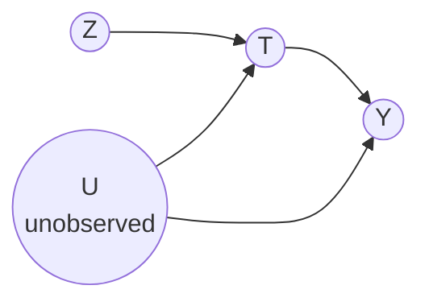

# Lesson 38: Instrumental Variables I — The Wald Estimand

## Where We Left Off

Lessons 36–37 accepted unobserved confounding and asked how far it could distort a conclusion. This lesson and the next tackle it head-on. The idea is to find a variable that moves the treatment for reasons that have *nothing to do with the outcome*, and to use only that movement to measure the effect. Such a variable is an **instrument**. Lesson 25 already met one, in the Primer's linear setting (§3.8.3). Neal's Chapter 9 develops instruments fully, and this lesson follows it.

*Notation.* Following Neal: $T$ is the treatment, $Y$ the outcome, $Z$ the instrument, and $U$ an unobserved confounder of $T$ and $Y$.

## What Is an Instrument?

A variable $Z$ is an instrument for the effect of $T$ on $Y$ if it satisfies three assumptions.

> **Relevance.** $Z$ has a causal effect on $T$.
>
> **Exclusion restriction.** $Z$ affects $Y$ only through $T$: every causal path from $Z$ to $Y$ passes through $T$.
>
> **Instrumental unconfoundedness.** There is no backdoor path from $Z$ to $Y$: nothing that affects $Z$ also affects $Y$ except through $T$.

The last assumption has a conditional version: if the backdoor paths from $Z$ to $Y$ can be blocked by measured covariates, $Z$ is a *conditional instrument*, and everything below holds within strata of those covariates.

*The standard instrumental-variable graph. $U$ confounds $T$ and $Y$; $Z$ affects $T$ and has no other route to $Y$.*

**The intuition.** $T$ changes for two kinds of reason: because $U$ changes, and because $Z$ changes. Changes driven by $U$ are confounded, since $U$ also moves $Y$. Changes driven by $Z$ are not, since nothing else links $Z$ to $Y$. So if the analysis uses only the variation in $T$ that comes from $Z$, what it sees is the causal effect of $T$ on $Y$.

In graphical terms, this matches the definition in Lesson 25: $Z$ is connected to $T$, but once the arrow $T \to Y$ is removed, $Z$ is d-separated from $Y$.

**A typical example.** An **encouragement design**: a program sends randomly chosen people a letter inviting them to a training course ($Z$). Nobody can be forced to attend, so attendance ($T$) is each person's own choice, and it may depend on motivation ($U$), which also affects whether the person is later employed ($Y$). The letter was randomized, so it has no backdoor paths to employment. It plausibly affects employment only by changing attendance. And it does change attendance. The experiment therefore identifies the effect of the *letter*, which is called the **intention-to-treat** effect. The instrument turns that into an effect of *attending*, at the cost of the assumptions above.

> [!WARNING]
> **The exclusion restriction cannot be tested from data.** No observed distribution can tell an instrument that satisfies it from one with a small direct path $Z \to Y$. And a violation is magnified. In the Wald ratio below, a direct effect of $Z$ on $Y$ adds to the numerator in full, and is then divided by the effect of $Z$ on $T$. If that effect is small, the bias becomes large.

## Why Instruments Do Not Identify the ATE on Their Own

Instruments did not appear with the identification results of Lessons 19–24 because they do not identify the effect **nonparametrically**, that is, without assumptions about the form of the relationships. Neal points to a necessary condition for nonparametric identification, from Pearl's *Causality*:

> For each backdoor path from $T$ to any child of $T$ that is an ancestor of $Y$, it must be possible to block that path.

In the instrument graph, $Y$ is a child of $T$ (and trivially an ancestor of itself), and the backdoor path $T \leftarrow U \to Y$ can only be blocked at $U$, which is unobserved. The condition fails, so the effect of $T$ on $Y$ cannot be identified from the graph alone, instrument or no instrument.

What the instrument needs is an additional assumption about functional form. This lesson assumes **linearity**; Lesson 39 replaces it with **monotonicity**. The two routes lead to the same formula, with different interpretations.

## Warm-Up: The Binary Linear Setting

Let the instrument $Z$ and the treatment $T$ both be binary, and assume the outcome is linear in the treatment and the confounder:

> **Assumption (linear outcome).**
> $$Y := \delta T + \alpha_u U.$$

The coefficient $\delta$ is the causal effect. $Z$ does not appear in the equation; that is the exclusion restriction.

Start from the association between the instrument and the outcome, and substitute the outcome equation:

$$
\begin{aligned}
\mathbb{E}[Y \mid Z{=}1] - \mathbb{E}[Y \mid Z{=}0]
&= \mathbb{E}[\delta T + \alpha_u U \mid Z{=}1] - \mathbb{E}[\delta T + \alpha_u U \mid Z{=}0] && \text{linear outcome} \\
&= \delta\big(\mathbb{E}[T \mid Z{=}1] - \mathbb{E}[T \mid Z{=}0]\big) + \alpha_u\big(\mathbb{E}[U \mid Z{=}1] - \mathbb{E}[U \mid Z{=}0]\big) && \text{linearity of expectation} \\
&= \delta\big(\mathbb{E}[T \mid Z{=}1] - \mathbb{E}[T \mid Z{=}0]\big) + \alpha_u\big(\mathbb{E}[U] - \mathbb{E}[U]\big) && \text{instrumental unconfoundedness: } Z \perp\!\!\!\perp U \\
&= \delta\big(\mathbb{E}[T \mid Z{=}1] - \mathbb{E}[T \mid Z{=}0]\big)
\end{aligned}
$$

Dividing both sides by the effect of $Z$ on $T$ gives:

> **Wald estimand.**
> $$\delta = \frac{\mathbb{E}[Y \mid Z{=}1] - \mathbb{E}[Y \mid Z{=}0]}{\mathbb{E}[T \mid Z{=}1] - \mathbb{E}[T \mid Z{=}0]}.$$

The numerator is the effect of the instrument on the outcome, often called the **reduced form**. The denominator is the effect of the instrument on the treatment, the **first stage**. Relevance guarantees the denominator is not zero. Replacing each expectation by a sample mean gives the **Wald estimator**.

Each assumption did one job: the exclusion restriction kept $Z$ out of the outcome equation, instrumental unconfoundedness removed the confounder's term, and relevance made the division possible.

**A worked example (hypothetical numbers).** In the encouragement design, suppose 60% of people who got the letter attended, against 20% of those who did not, and the share later employed was 50% against 42%.

$$
\begin{aligned}
\text{reduced form} &= 0.50 - 0.42 = 0.08 \\
\text{first stage} &= 0.60 - 0.20 = 0.40 \\
\delta &= 0.08 / 0.40 = 0.20
\end{aligned}
$$

The letter raised employment by 8 points, but it raised the attendance rate by only 40 points. Under the linear model, each point of attendance brings $\delta$ points of employment, so attendance itself raises employment by $0.08 / 0.40 = 0.20$, that is, 20 points. (Lesson 39 reads the same 0.40 as the share of people whose attendance the letter changes.) The naive comparison of attendees with non-attendees would have mixed in the effect of motivation.

**Why the ratio works.** The reduced form is the instrument's total effect on the outcome. Its only path is $Z \to T \to Y$, so by the path-product rule of Lesson 25 it equals $(\text{effect of } Z \text{ on } T) \times \delta$. Dividing by the first stage cancels the instrument's effect on treatment and leaves $\delta$. This is the same argument as the Primer's $r_1 / r_2$ for Figure 3.17 in Lesson 25.

> [!IMPORTANT]
> **Weak instruments.** If the first stage is small, the instrument barely moves the treatment, and the Wald ratio divides by a number close to zero. In a finite sample, small random errors in the numerator are then magnified into large errors in the estimate, and so is any bias from a slight violation of the exclusion restriction. Always check the first stage before trusting the ratio. A common rule of thumb in econometrics treats a first-stage F-statistic below 10 as a sign of a weak instrument.

## The Continuous Linear Setting

With a continuous instrument and treatment, and the same linear outcome, the ratio of mean differences becomes a ratio of covariances.

> **Proposition.**
> $$\delta = \frac{\mathrm{Cov}(Y, Z)}{\mathrm{Cov}(T, Z)}.$$

**Derivation.**

$$
\begin{aligned}
\mathrm{Cov}(Y, Z) &= \mathrm{Cov}(\delta T + \alpha_u U,\ Z) && \text{linear outcome} \\
&= \delta\, \mathrm{Cov}(T, Z) + \alpha_u\, \mathrm{Cov}(U, Z) && \text{covariance is linear} \\
&= \delta\, \mathrm{Cov}(T, Z) && \text{instrumental unconfoundedness: } \mathrm{Cov}(U, Z) = 0
\end{aligned}
$$

Relevance ensures $\mathrm{Cov}(T, Z) \neq 0$, so dividing gives the result. The estimator replaces both covariances with sample covariances.

## Two-Stage Least Squares

The standard way to compute the estimate is **two-stage least squares (2SLS)**:

1. **Stage one.** Regress $T$ on $Z$ and keep the fitted values, $\widehat{T} = \widehat{a} + \widehat{\pi} Z$. This is the part of the treatment that the instrument explains.
2. **Stage two.** Regress $Y$ on $\widehat{T}$. The coefficient on $\widehat{T}$ is the estimate of $\delta$.

**Why it gives the same answer.** The stage-one slope is $\widehat{\pi} = \mathrm{Cov}(T, Z) / \mathrm{Var}(Z)$. The stage-two slope is

$$
\frac{\mathrm{Cov}(Y, \widehat{T})}{\mathrm{Var}(\widehat{T})} = \frac{\widehat{\pi}\, \mathrm{Cov}(Y, Z)}{\widehat{\pi}^2\, \mathrm{Var}(Z)} = \frac{\mathrm{Cov}(Y, Z)}{\widehat{\pi}\, \mathrm{Var}(Z)} = \frac{\mathrm{Cov}(Y, Z)}{\mathrm{Cov}(T, Z)},
$$

the covariance ratio above. (Adding the constant $\widehat{a}$ changes neither covariance nor variance.)

**Why it works, graphically.** $\widehat{T}$ is a function of $Z$ alone. In the graph, it has no arrow from $U$, so it has no backdoor path to $Y$, and in stage two association is causation. The same procedure works in the binary setting, where stage one is just a difference in means. One practical caution: the standard errors reported by a naive second-stage regression are not correct, because $\widehat{T}$ is itself estimated; software for 2SLS corrects them.

## Summary and Key Takeaways

1. An instrument needs **relevance** (it moves the treatment), the **exclusion restriction** (it affects the outcome only through the treatment) and **instrumental unconfoundedness** (no backdoor path to the outcome).
2. The exclusion restriction cannot be tested, and a violation is magnified when the first stage is small.
3. Instruments do **not** identify the effect nonparametrically: the backdoor path $T \leftarrow U \to Y$ cannot be blocked. An assumption about functional form is needed: linearity here, monotonicity in Lesson 39.
4. Under a linear outcome, the **Wald estimand** is the reduced form divided by the first stage. In the worked example, $0.08 / 0.40 = 0.20$.
5. With continuous variables the estimand is $\mathrm{Cov}(Y, Z) / \mathrm{Cov}(T, Z)$, which **two-stage least squares** computes exactly.
6. Weak instruments make estimates unstable; check the first stage first.

**Next step:** Lesson 39 drops the linearity assumption and finds what the Wald ratio then identifies: not the average effect in the whole population, but the effect among the people whose treatment the instrument actually changes.

### Check Your Understanding

1. In the Wald derivation, name the assumption that removes each of these: a direct effect of $Z$ on $Y$, the confounder's contribution, and a zero denominator.
2. In the worked example, suppose the letter also raised employment directly by 2 points, violating the exclusion restriction. What would the Wald estimator report, and by how much would it be wrong?
3. Repeat question 2 with a weaker letter that raised attendance from 20% to only 25%. What happens to the error, and why?
4. Explain why the backdoor path $T \leftarrow U \to Y$ makes the effect non-identifiable without further assumptions, even though $Z$ has no backdoor path to $Y$.

---

## Further Reading

*Ref*: Brady Neal, *Introduction to Causal Inference* (Dec 2020 draft), Chapter 9 (Instrumental Variables: assumptions, non-identification, the binary and continuous linear settings); *Causal Inference in Statistics: A Primer (2016)*, Chapter 3, Section 3.8.3 (Figure 3.17); Pearl, *Causality* (2009), on the necessary condition for identification.
