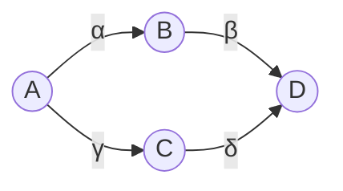
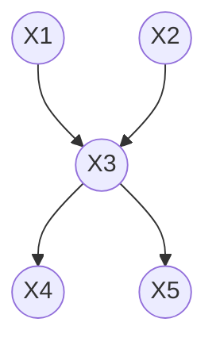
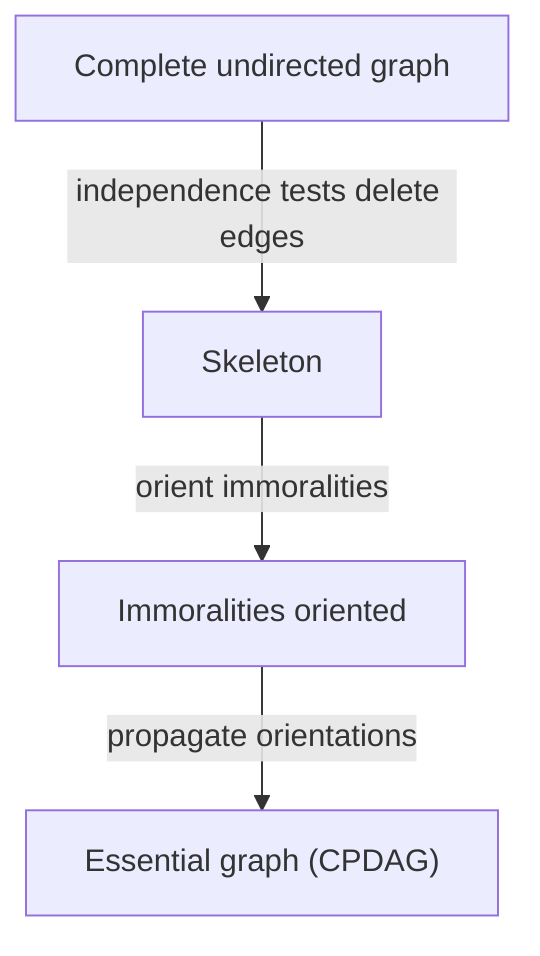

# Lesson 41: Causal Discovery from Observational Data

## Where We Left Off

One assumption has run underneath the whole course: **the causal graph is known**. The backdoor and front-door criteria, the do-calculus and the adjustment formula all take the graph as given. Neal calls the reverse problem **structure identification**: can the graph itself be learned from data? It is a different question from identifying a causal effect once the graph is known. As everywhere in this course, the answer depends on the assumptions made. This lesson follows Neal's Chapter 11.

## Learning from Independences: Markov and Faithfulness

Lesson 22 introduced two assumptions linking a graph $G$ to a distribution $P$. Writing $A \perp_G B \mid C$ for d-separation in the graph and $A \perp\!\!\!\perp_P B \mid C$ for independence in the distribution:

- The **Markov property** runs from the graph to the data: $A \perp_G B \mid C \Rightarrow A \perp\!\!\!\perp_P B \mid C$.
- **Faithfulness** runs from the data to the graph: $A \perp\!\!\!\perp_P B \mid C \Rightarrow A \perp_G B \mid C$.

To learn a graph from the independences found in data, faithfulness is needed: only it allows an independence in the data to be read as a missing connection in the graph. Faithfulness together with the Markov property implies minimality (Lesson 22), so it is the stronger assumption.

It is also a less comfortable one, because counterexamples are easy to build. Neal's example has two paths from $A$ to $D$:

With the linear equations $B := \alpha A$, $C := \gamma A$ and $D := \beta B + \delta C$, substituting gives

$$D = \beta(\alpha A) + \delta(\gamma A) = (\alpha\beta + \gamma\delta)\, A.$$

If $\alpha\beta = -\gamma\delta$, the two paths cancel and $A$ and $D$ are independent, even though both paths are open in the graph. A method relying on faithfulness would wrongly conclude that $A$ and $D$ are not connected. Lesson 22 built the same kind of cancellation in its shoes example, with $b + ac = 0$.

> [!WARNING]
> Exact cancellation requires the coefficients to balance perfectly, which is why it is often dismissed. But with finite data, an *approximate* cancellation can pass a statistical test as an independence. A missing edge in a discovered graph may therefore reflect paths that nearly cancel rather than no connection. Discovered graphs are best treated as hypotheses.

Two more assumptions are standard. **Causal sufficiency**: there are no unobserved confounders of any of the variables. **Acyclicity**: the graph has no directed cycles.

> **Partial identification of the graph.** Under the Markov property, faithfulness, causal sufficiency and acyclicity, the causal graph can be identified **up to its Markov equivalence class**, but in general not completely.

## Markov Equivalence: Skeletons and Immoralities

Two graphs are **Markov equivalent** if they imply exactly the same conditional independences. Then no amount of observational data can tell them apart.

Among three-node graphs:

- The chains $X_1 \to X_2 \to X_3$ and $X_1 \leftarrow X_2 \leftarrow X_3$ and the fork $X_1 \leftarrow X_2 \to X_3$ are all equivalent. Each implies $X_1 \perp\!\!\!\perp X_3 \mid X_2$ and nothing else.
- The collider $X_1 \to X_2 \leftarrow X_3$, also called an **immorality**, is different. It implies that $X_1$ and $X_3$ are independent *unconditionally* but dependent given $X_2$: the opposite pattern.
- Adding the edge $X_1 - X_3$ to any of these changes the **skeleton**, the graph with arrowheads removed, and $X_1$ and $X_3$ are then no longer independent given $X_2$.

These two features turn out to be all that matters:

> **Markov equivalence** (Verma and Pearl; Frydenberg). Two graphs are Markov equivalent if and only if they have the same skeleton and the same immoralities.

So from conditional independences one can hope to learn the skeleton and the immoralities. The result is called the **essential graph**, or CPDAG (completed partially directed acyclic graph). Edges that belong to an immorality, or whose direction is forced by one, are oriented; the rest are left undirected. Even the two-node graphs $X \to Y$ and $X \leftarrow Y$ are equivalent, since neither implies any independence.

## The PC Algorithm

The **PC algorithm** (Spirtes, Glymour and Scheines) learns the essential graph in three steps. Neal illustrates it on a five-node example. From his description, the true graph is:

*The example graph. The edges are reconstructed from Neal's description: two variables independent until the collider is conditioned on, one central variable that separates every other pair, and two final edges oriented by propagation.*

**Step 1: find the skeleton.** Start from the complete undirected graph, with every pair connected. Test conditional independences, starting with an empty conditioning set and moving to larger ones, and delete the edge between any pair found to be independent given some set.

- With the empty conditioning set, $X_1 \perp\!\!\!\perp X_2$: their only path, $X_1 \to X_3 \leftarrow X_2$, is blocked by the collider $X_3$. Delete $X_1 - X_2$.
- With conditioning sets of size one, $X_3$ separates every other pair: $X_1 \perp\!\!\!\perp X_4 \mid X_3$, $X_1 \perp\!\!\!\perp X_5 \mid X_3$, $X_2 \perp\!\!\!\perp X_4 \mid X_3$, $X_2 \perp\!\!\!\perp X_5 \mid X_3$ and $X_4 \perp\!\!\!\perp X_5 \mid X_3$. Delete all of those edges.

What remains, the four edges touching $X_3$, is the true skeleton. In general PC continues to larger conditioning sets; here size one is enough.

**Step 2: orient the immoralities.** Look at every triple $X_i - X_k - X_j$ in which $X_i$ and $X_j$ are not adjacent. If $X_k$ was *not* in the set that made $X_i$ and $X_j$ independent, the triple is an immorality: orient it $X_i \to X_k \leftarrow X_j$. Here, $X_1$ and $X_2$ were separated by the empty set, which does not contain $X_3$, so orient $X_1 \to X_3 \leftarrow X_2$. The other triples, such as $X_1 - X_3 - X_4$, were separated *by* $X_3$, so they are not immoralities.

**Step 3: orient edges by propagation.** If $X_i \to X_k$ and $X_k - X_j$ is undirected, with $X_i$ and $X_j$ not adjacent, orient $X_k \to X_j$. The reason: if the edge pointed the other way, $X_i \to X_k \leftarrow X_j$ would be an immorality, and Step 2 would already have found it. Here, $X_1 \to X_3 - X_4$ with $X_1$ and $X_4$ non-adjacent gives $X_3 \to X_4$, and likewise $X_3 \to X_5$.

In this example every edge ends up oriented, so the whole graph is recovered. That is lucky. For a simple chain or fork, for example, no edge could be oriented.

**Dropping assumptions.** Other algorithms relax PC's assumptions: **FCI** works without causal sufficiency; **CCD** works without acyclicity; SAT-based methods drop both.

**A practical difficulty.** Every method built on conditional independence tests shares a weakness: such tests are hard, and accurate results can require very large samples (Shah and Peters). With infinite data this would not matter; with real data it does.

## Can the Equivalence Class Be Beaten?

**Not in the two standard settings.**

> **Markov completeness** (Geiger and Pearl; Meek). With multinomial distributions, or with linear structural equations and Gaussian noise, the graph can be identified only up to its Markov equivalence class.

**And without any assumption about functional form, not even for two variables.** Conditional independences cannot orient $X - Y$, as noted above. Neither can structural models:

> **Non-identifiability of two-node graphs.** For every joint distribution $P(x, y)$ of two real-valued variables, there is a structural model in *each* direction that generates it: some $f$ and independent noise $N_Y$ with $Y = f(X, N_Y)$, and some $g$ and independent noise $N_X$ with $X = g(Y, N_X)$ (Peters, Janzing and Schölkopf).

So the direction of causation cannot, in general, be read from observational data. Something more is needed: interventions (Lesson 42) or assumptions about the form of the mechanisms.

> [!IMPORTANT]
> Compare this with identifying *effects*. Once the graph is known, the do-calculus is complete (Lesson 24): every identifiable effect can be computed. For the graph itself there is no such guarantee. What discovery produces always rests on assumptions that the data cannot confirm, which is why, in applied work, the graph is usually supplied from domain knowledge and discovery is used to explore.

## Semi-Parametric Escapes

If the structural equations are assumed to have a particular form *other than* linear with Gaussian noise, the direction can become identifiable, and faithfulness is no longer needed.

### Linear Models with Non-Gaussian Noise

Assume every structural equation is linear with **non-Gaussian** noise: $X_j := f_j(pa_j) + N_j$ with $f_j$ linear and $N_j$ non-Gaussian and independent of the parents. This is the setting of LiNGAM (Shimizu and colleagues).

> **Identifiability in the linear non-Gaussian setting.** If the true model is $Y := aX + N_Y$ with $N_Y$ non-Gaussian and independent of $X$, there is no model in the reverse direction, $X := \tilde{a}Y + \tilde{N}_X$ with $\tilde{N}_X$ independent of $Y$, that produces the same distribution of $(X, Y)$.

**Why.** The proof uses the **Darmois–Skitovich theorem**: if two linear combinations of independent random variables are independent, then every variable that appears in *both* with a nonzero coefficient must be Gaussian.

Suppose a reverse model existed. Its noise would be $\tilde{N}_X = X - \tilde{a}Y = X - \tilde{a}(aX + N_Y) = (1 - \tilde{a}a)\,X - \tilde{a}\,N_Y$. Both $\tilde{N}_X$ and $Y = aX + N_Y$ are then linear combinations of the independent variables $X$ and $N_Y$, and the reverse model requires them to be independent. $N_Y$ appears in both, with coefficients $-\tilde{a}$ and $1$. So by Darmois–Skitovich it would have to be Gaussian, which contradicts the assumption. (If $\tilde{a} = 0$, the reverse model would make $X$ and $Y$ independent, which they are not.)

**In practice.** Regress $Y$ on $X$ and the residuals are independent of $X$, since they are the true noise. Regress $X$ on $Y$ and the residuals are visibly dependent on $Y$. The direction in which the residuals come out independent is the causal direction.

### Nonlinear Additive Noise

Assume instead $X_j := f_j(pa_j) + N_j$ with **nonlinear** $f_j$ and independent noise. Under mild technical conditions this also makes the direction identifiable (Hoyer and colleagues; Peters and colleagues). Fitting a nonlinear model in the wrong direction leaves residuals whose spread or shape depends on the input. A further extension, the post-nonlinear model $X_j := g_j\big(f_j(pa_j) + N_j\big)$, is studied by Zhang and Hyvärinen.

The common idea: in the true direction, the noise enters the way the model assumes and the residuals are independent of the inputs. In the wrong direction, the noise is forced to mix with the input in a way that shows up as dependence. It is assumptions about the *noise*, not about conditional independences, that orient the edge.

## Summary and Key Takeaways

1. **Structure identification** means learning the graph from data. It needs **faithfulness**, the converse of the Markov property, usually with causal sufficiency and acyclicity.
2. Faithfulness fails when paths cancel, as in Neal's $\alpha\beta = -\gamma\delta$ example, and near-cancellations can look like independences in finite data.
3. Under these assumptions the graph is identified up to its **Markov equivalence class**: graphs with the same skeleton and the same immoralities cannot be told apart.
4. The **PC algorithm** finds the essential graph in three steps: skeleton, immoralities, orientation propagation.
5. With multinomial or linear-Gaussian models, nothing better is possible; with no assumptions on functional form, even $X \to Y$ and $X \leftarrow Y$ cannot be distinguished.
6. **Linear non-Gaussian** and **nonlinear additive-noise** models make the direction identifiable, without faithfulness, because the noise behaves differently in the two directions.
7. Conditional independence testing is statistically hard, so discovery is best used to explore rather than to certify.

**Next step:** Lesson 42 turns to what interventional data can add, and to transportability.

### Check Your Understanding

1. In Neal's example, take $\alpha = 2$, $\beta = 1$ and $\gamma = 1$. What value of $\delta$ makes $A$ and $D$ independent? With that $\delta$, the PC algorithm finds $A \perp\!\!\!\perp D$ with the empty conditioning set. What would its Step 2 then conclude about the triples $A - B - D$ and $A - C - D$, and why is that wrong?
2. Why is the immorality $X_1 \to X_2 \leftarrow X_3$ identifiable from conditional independences while the chain $X_1 \to X_2 \to X_3$ is not? State the pattern of independences that distinguishes them.
3. Run the three PC steps on the true graph $X_1 \to X_2 \to X_3$. Which edges end up oriented, and why?
4. A colleague runs PC on 500 observations and reports the result as "the causal graph". Name two assumptions the result depends on, and the statistical step most likely to be unreliable.

---

## Further Reading

*Ref*: Brady Neal, *Introduction to Causal Inference* (Dec 2020 draft), Chapter 11 (independence-based discovery, the PC example, Markov completeness, non-identifiability of two-node graphs, linear non-Gaussian and nonlinear models); Spirtes, Glymour & Scheines, *Causation, Prediction, and Search*; Peters, Janzing & Schölkopf, *Elements of Causal Inference*; Shimizu et al. (2006); Shah & Peters (2020); Zhang & Hyvärinen (2009).
