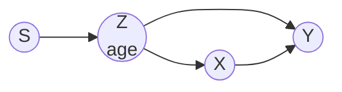

# Lesson 42: The Frontier — Interventional Data and Transportability

## Where This Lesson Stands

Neal's December 2020 draft ends with three chapters that exist only as outlines, each section marked "Coming Soon":

- **Causal Discovery from Interventional Data** (Chapter 12): structural interventions on one or several variables, parametric interventions, interventional Markov equivalence, and other settings.
- **Transfer Learning and Transportability** (Chapter 13): causal insights for transfer learning, and transporting causal effects across populations.
- **Counterfactuals and Mediation** (Chapter 14): counterfactual basics, and mediation.

The third is already covered: Lessons 26–32 built counterfactuals and mediation from Chapter 4 of Pearl's Primer. This lesson covers the first two. The book's chapters are empty, but Neal did lecture on both topics, and this lesson follows his lecture slides: week 11, "Causal Discovery from Interventions", and week 12, "Transfer Learning and Transportability". The slides summarize results from the research literature (Eberhardt and colleagues on discovery; Pearl and Bareinboim on transportability), and the lesson cites those papers where the slides do. It is a survey, not a complete treatment.

## Discovery from Interventional Data

Lesson 41 ended at a limit. Observational data can identify the graph only up to its Markov equivalence class: the set of graphs that imply the same conditional independences. Chains and forks cannot be told apart. Edges that are not part of an immorality (a collider whose two parents are not adjacent) often stay unoriented. **Interventions can break these ties.** The idea is to change some variables experimentally and watch how the others respond; the responses reveal directions that passive observation cannot.

**Single-variable interventions.** A structural intervention on a variable replaces its mechanism, the surgery of Lesson 18 carried out for real. If intervening on $X$ changes the distribution of $Y$, there is a directed path from $X$ to $Y$. If it does not, then, assuming no paths cancel (faithfulness, Lesson 41), there is none. So interventions reveal **ancestry**: which variables are causes, direct or indirect, of which others. Conditional independences alone often cannot.

**An example.** Three graphs imply the same single independence, $X_1 \perp\!\!\!\perp X_3 \mid X_2$, so observational data cannot choose among them:

- the chain $X_1 \to X_2 \to X_3$;
- the reverse chain $X_1 \leftarrow X_2 \leftarrow X_3$;
- the fork $X_1 \leftarrow X_2 \to X_3$.

Now intervene on the middle variable $X_2$, and check which of the other two variables change their distribution:

| Graph | $X_1$ changes? | $X_3$ changes? |
| --- | :---: | :---: |
| Chain $X_1 \to X_2 \to X_3$ | no | yes |
| Reverse chain $X_1 \leftarrow X_2 \leftarrow X_3$ | yes | no |
| Fork $X_1 \leftarrow X_2 \to X_3$ | yes | yes |

Each graph gives a different pattern, so this one intervention identifies the graph.

### How Many Experiments Are Needed?

Neal's week-11 lecture ("Causal Discovery from Interventions") collects the main counting results. All of them assume no unmeasured confounders.

**The worst case is a complete graph.** In a complete graph every pair of variables is joined by an arrow, so there are no immoralities (Lesson 41). Observational data then reveal only the skeleton, with no edge oriented, and every orientation must come from experiments.

**Single-variable interventions** (Eberhardt and colleagues, 2006). For $n > 2$ variables:

- $n - 1$ single-variable interventions are always **sufficient** to identify the graph;
- $n - 1$ are **necessary** in the worst case, the complete graph;
- if the purely observational data set is counted as one of the experiments, $n$ are needed in the worst case;
- choosing each experiment after seeing the previous results (adaptivity) does not reduce the worst-case count.

Why $n - 1$ suffice, in outline: intervening on $X_1$ separates it from its parents, and comparing distributions reveals which of the remaining variables are adjacent and how the edges at $X_1$ point. Each further intervention on $X_i$ orients the edges touching $X_i$. After $n - 1$ interventions, every edge touching the last variable $X_n$ has already been oriented from its other end, so $X_n$ needs no experiment of its own.

**Interventions on several variables at once.** If an experiment may set any number of variables simultaneously, far fewer experiments are needed: in the worst case about $\log_2 n$, specifically $\lfloor \log_2 n \rfloor + 1$ (Eberhardt, Glymour and Scheines, 2005). If the equivalence class is already known from observational data, $\lceil \log_2 c \rceil$ experiments suffice in the worst case, where $c$ is the size of the largest clique (group of mutually adjacent variables) in the essential graph. This was conjectured by Eberhardt (2008) and proved by Hauser and Bühlmann (2014). The truncated factorization of Lesson 19 describes each such experiment: drop one factor for every variable that was set.

**Soft interventions.** A **parametric** (or soft) intervention changes a variable's mechanism without cutting its dependence on its parents, for example by shifting a dose rather than fixing it. Many real experiments are of this kind, because the variable cannot simply be set. Other names for the two kinds are hard versus soft, or perfect versus imperfect. For single-variable soft interventions the counts are the same as for structural ones: $n - 1$ are sufficient, and necessary in the worst case (Eberhardt and Scheines, 2007).

**Randomized strategies.** Allowing the choice of experiments to be random reduces the number needed further: $O(\log \log n)$ interventions suffice with high probability (Hu and colleagues, 2014).

### Interventional Markov Equivalence

What if only a few experiments are affordable? Then the question becomes how much of the graph a *given* set of experiments reveals.

**Interventions create immoralities.** Represent an intervention on $B$ by an extra node $I_B$ with an arrow into $B$. Suppose the true graph has $A \to B$. In the augmented graph, $I_B \to B \leftarrow A$ is a collider whose two parents are not adjacent: an immorality. By Lesson 41, immoralities are exactly what the data can orient. So the intervention orients the edge between $A$ and $B$, which observational data alone might have left undirected.

> **Interventional Markov equivalence.** Two graphs, each augmented with intervention nodes for the same single-variable interventions, are interventionally Markov equivalent if and only if they have the same skeleton and the same immoralities (Tian and Pearl, 2001). The analogous result for interventions on several variables at once, given the observational data too, was proved by Yang and colleagues (2018); Hauser and Bühlmann (2012) gave the version for structural interventions.

This is Lesson 41's characterization of equivalence, applied to the augmented graph. The resulting class can be drawn as an **interventional essential graph**: the edges oriented by either the observational immoralities or the intervention-created ones are directed, and the rest stay undirected. More experiments create more immoralities and shrink the class. Choosing which experiments to run is then a design question: how much of the graph a given experimental budget can buy.

Together with Lesson 41, this gives two ways to get past the equivalence class. One is to assume something about the form of the mechanisms, such as linearity with non-Gaussian noise. The other is to collect interventional data.

## Transportability

The last step in using a causal conclusion is often to *move* it. A study in population A estimated $P(y \mid do(x))$. Can that result be used in population B, whose distribution differs? A naive answer is no, since the estimate reflects A's distribution. **Transportability** gives a more precise answer: sometimes, and the causal graph says when.

### Causal Insights for Transfer Learning

Neal's week-12 lecture starts with a related machine-learning problem. A predictive model is trained on data from one distribution, $P_{\text{train}}(x, y)$, and then used on data from another, $P_{\text{test}}(x, y)$. This is **domain generalization**, part of the broader field of **transfer learning**. When the two distributions differ, a model that predicted well in training can fail.

**Covariate shift.** The simplest assumption about how the distributions differ is **covariate shift**: the inputs are distributed differently, $P_{\text{train}}(x) \neq P_{\text{test}}(x)$, but the relationship between inputs and outcome is the same, $P_{\text{train}}(y \mid x) = P_{\text{test}}(y \mid x)$. It also requires that the test inputs fall where training inputs were seen (common support); otherwise the model must extrapolate.

**Which inputs to use?** Suppose the inputs are variables $X_1, X_2, \ldots$ in a causal graph together with $Y$.

- **Same distribution for training and test.** The best predictor uses the **Markov blanket** of $Y$: its parents, its children, and its children's other parents. Given these, every other variable is independent of $Y$, so nothing else helps.
- **Test distributions produced by interventions** on variables other than $Y$. By modularity (Lesson 18), such interventions change other variables' mechanisms but leave $Y$'s mechanism, $P(y \mid \text{pa}(Y))$, untouched. A predictor built on the Markov blanket may rely on non-causal relationships, such as a child of $Y$, that an intervention can break. A predictor built on the **parents** of $Y$ keeps working in every such test distribution. Neal cites Rojas-Carulla and colleagues (2018) for the result that $\mathbb{E}[Y \mid \text{pa}(Y)]$ minimizes the worst-case prediction error over these distributions. Common support is still needed, now for the parents.

This relaxes covariate shift. Covariate shift assumes $P(y \mid x)$ is invariant for *all* the inputs. The causal view says only $P(y \mid \text{pa}(Y))$ need be invariant. The rest of this section deals with the causal version of the problem: carrying a *causal effect* across populations.

### Selection Diagrams

The key tool (Pearl and Bareinboim) is the **selection diagram**: the causal graph of the source population, with extra **selection nodes** $S$ pointing at every variable whose *mechanism* differs between the two populations. An arrow $S \to V$ means "the way $V$ is generated may differ between A and B". Every mechanism without such an arrow is assumed to be the same in both.

Four basic cases:

1. **No selection nodes.** Every mechanism is shared, so the effect carries over unchanged: $P_B(y \mid do(x)) = P_A(y \mid do(x))$.
2. **A selection node on the treatment, $S \to X$.** The populations differ in *who gets treated*. That does not matter for $P(y \mid do(x))$, because the intervention replaces the treatment mechanism in both populations anyway. The effect carries over unchanged.
3. **A selection node on a pre-treatment covariate, $S \to Z$,** where $Z$ also affects the outcome. For example, the two populations have different age distributions. No selection node points at $Y$, so the effect *within each age group* is the same in both populations; only the mix of age groups differs. Re-weight the age-specific effects by the target population's age mix:
   $$P_B(y \mid do(x)) = \sum_z P_A(y \mid do(x), z)\, P_B(z).$$
   The age-specific effects come from the source study. The age distribution comes from the target, where only observational data are needed. This is the re-weighting idea of the adjustment formula (Lesson 19), now applied across populations instead of across treatment groups. The derivation and a worked example follow the list.
4. **A selection node on the outcome, $S \to Y$.** The outcome mechanism itself differs; for example, a drug interacts with a diet common only in the target population. The source study then says nothing about how the target's outcome responds, and the effect cannot be transported from the source study alone.

### Case 3 Step by Step

*Selection diagram for Case 3. The node $S$ marks that the age distribution differs between A and B. Every other mechanism is shared.*

Write $Z$ for age. The derivation has three steps.

**Step 1: split by age in the target population.** By the law of total probability,
$$P_B(y \mid do(x)) = \sum_z P_B(y \mid do(x), z)\, P_B(z \mid do(x)).$$

**Step 2: treatment does not change age.** $Z$ is measured before treatment, so setting $X$ leaves its distribution alone: $P_B(z \mid do(x)) = P_B(z)$.

**Step 3: within an age group, the populations agree.** The only difference between the populations enters through $S \to Z$. Once $Z$ is fixed, $S$ carries no further information about $Y$, so $P_B(y \mid do(x), z) = P_A(y \mid do(x), z)$.

Substituting Steps 2 and 3 into Step 1 gives the transport formula.

**A worked example.** A trial in population A finds that a drug raises the recovery rate by 0.10 among young patients and by 0.30 among old patients. Population A is 70% young; population B is 30% young.

- Effect in A: $0.7 \times 0.10 + 0.3 \times 0.30 = 0.07 + 0.09 = 0.16$.
- Effect in B: $0.3 \times 0.10 + 0.7 \times 0.30 = 0.03 + 0.21 = 0.24$.

The trial's headline number, 0.16, would understate the effect in B. The age-specific effects carry over unchanged; only the weights change.

### Neal's Names for the Cases

Neal's week-12 lecture (following Pearl and Bareinboim, 2014) names three situations. Write $P$ for the source population and $P^*$ for the target, and $G_{\overline{X}}$ for the selection diagram with the arrows into the treatment removed (Lesson 24).

- **Direct transportability.** The effect carries over unchanged: $P^*(y \mid do(x), z) = P(y \mid do(x), z)$. This holds when $Y$ is d-separated from $S$ given $X$ and $Z$ in $G_{\overline{X}}$, so the selection nodes carry no information about the outcome once treatment and covariates are fixed. Cases 1 and 2 above are of this kind; in Case 2, removing the arrows into $X$ removes $S \to X$ as well.
- **Trivial transportability.** The effect in the target can be identified from the target's own observational data alone, for example because a backdoor set is measured there. The source study is then not needed at all.
- **S-admissibility**, which combines the two. A set $\mathbf{W}$ is **S-admissible** if $Y$ is d-separated from $S$ given $X$ and $\mathbf{W}$ in $G_{\overline{X}}$. Then
  $$P^*(y \mid do(x)) = \sum_{\mathbf{w}} P(y \mid do(x), \mathbf{w})\, P^*(\mathbf{w}):$$
  the $\mathbf{w}$-specific effects come from the source, and the distribution of $\mathbf{W}$ from the target. Case 3 is exactly this, with $\mathbf{W} = \{\text{age}\}$.

Neal notes the parallel with Lesson 20: an adjustment set that satisfies the backdoor criterion is also called an *admissible* set, and S-admissibility is the same idea applied to selection nodes.

### What Transportability Adds

Whether trial results generalize is usually argued informally. With a selection diagram, it becomes a question with an answer: mark which mechanisms differ, then check whether a transport formula exists.

The link to Lesson 30 is direct. A dose-response relation carries over when its mechanism is shared. The effect of a policy that *adds* to current doses is different: it depends on the population's distribution of current doses, $P(X = x)$, so it changes from one population to another.

Transport formulas are derived with the three rules of the do-calculus (Lesson 24), applied to graphs that contain selection nodes. Bareinboim and Pearl showed that this procedure is complete: if an effect can be transported, the rules will find the formula.

The trade-off of Lesson 36 appears again. Leaving out a selection node is a claim that the mechanism is the same in both populations. The fewer selection nodes, the more of the source study carries over, but each omission is an assumption that a critic can challenge.

## A Glimpse Further: Causal Representation Learning

Neal's course included a guest lecture by Yoshua Bengio, "Towards Causal Representation Learning". Its question is one this course has not asked. Every lesson so far assumed that the variables are given: treatment, outcome, age, blood pressure. In many machine-learning problems the raw data are pixels, sounds or text, and the meaningful variables, such as the objects in an image and their positions, are not given. **Causal representation learning** tries to learn such high-level variables from raw data in a way that also captures how they cause one another.

The motivation links to transfer learning above. If a learned representation separates the world into independent mechanisms, as modularity (Lesson 18) says the true causal variables do, then a change in the environment should affect only a few mechanisms. A model built on those variables should then adapt to new environments quickly, just as a predictor built on the causes of $Y$ keeps working after interventions on other variables. This is an active research area rather than settled method; Schölkopf and colleagues (2021) give an overview.

## Counterfactuals and Mediation, in Retrospect

Neal's third outline chapter corresponds to Lessons 26–32. One comparison between the course's two traditions is worth making here. The potential-outcomes framework of Lessons 07–15 treats potential outcomes as basic quantities and states assumptions about them directly. The structural framework derives potential outcomes from mechanisms and states assumptions as a causal graph. The two are logically equivalent (Lesson 27): each can express the same questions, including cross-world ones. They differ in how easily assumptions can be stated and checked. For population effects under intervention, the assumptions are simple to state either way. For attribution and natural direct and indirect effects, the required assumptions are complicated to state as independences among counterfactuals, and a causal graph makes them much easier to judge (Lessons 31–32).

## Summary and Key Takeaways

1. Neal's chapters on interventional discovery, transportability, and counterfactuals and mediation are outlines in the 2020 draft; this course covers the third with Pearl's Primer and surveys the first two here.
2. **Interventions reveal ancestry**: intervening on a variable shows which others it affects. Intervening on the middle variable distinguishes the chain, the reverse chain and the fork.
3. **Counting experiments** (no unmeasured confounders): $n - 1$ single-variable interventions suffice and are needed for a complete graph; interventions on several variables at once need only about $\log_2 n$; soft interventions need the same $n - 1$.
4. **Interventions create immoralities** in the graph augmented with intervention nodes. Interventionally equivalent graphs share the skeleton and the immoralities of that augmented graph, and the class shrinks as experiments are added.
5. Learning the graph needs either assumptions about the form of mechanisms or interventional data.
6. **Transfer learning:** under covariate shift $P(y \mid x)$ is invariant. If test distributions come from interventions on variables other than $Y$, only $P(y \mid \text{pa}(Y))$ is guaranteed invariant, so a predictor built on the parents of $Y$ is the most robust.
7. **Transportability**: selection diagrams mark the mechanisms that differ between populations. Differences in treatment assignment do not block transport; differences in a pre-treatment covariate are handled by re-weighting the covariate-specific effects (an S-admissible set); differences in the outcome mechanism block transport.
8. **Causal representation learning** seeks the causal variables themselves from raw data; it is an open research direction.
9. The potential-outcomes and structural frameworks are equivalent in what they can express, and differ in how conveniently assumptions can be stated.

**Next step:** Lesson 43, the capstone, brings the whole course together in one map.

### Check Your Understanding

1. The true graph is either the chain $X_1 \to X_2 \to X_3$ or the chain $X_1 \leftarrow X_2 \leftarrow X_3$. Which single intervention distinguishes them, and what would you observe under each?
2. In the worked example, population C is 50% young. What is the drug's effect in C? Which step of the derivation would fail if a selection node also pointed at $Y$?
3. A trial in population A found that a drug lowers blood pressure, with an effect that depends on age. Population B is older. What data from B, and what assumption about the selection diagram, allow the trial's result to be transported to B? Write the transport formula.
4. Explain why a difference between populations in *who chooses the treatment* does not prevent $P(y \mid do(x))$ from being transported.
5. Which lessons of this course fill each of Neal's three outline chapters?
6. In a complete graph on three variables, why can observational data orient no edge? How many single-variable interventions are needed in the worst case?
7. The graph is $X_1 \to Y \to X_2$, and test distributions are produced by interventions on $X_1$ and $X_2$. Which input gives the best prediction of $Y$ in the training distribution, and which gives the most robust prediction across test distributions? Why do they differ?

---

## Further Reading

*Ref*: Brady Neal, *Introduction to Causal Inference* (Dec 2020 draft), Chapters 12–14 (outlines); Pearl & Bareinboim (2014), *External validity: From do-calculus to transportability across populations*; Bareinboim & Pearl (2016), *Causal inference and the data-fusion problem*; Brady Neal, course lecture slides for week 11 ("Causal Discovery from Interventions") and week 12 ("Transfer Learning and Transportability"), and Yoshua Bengio's guest lecture ("Towards Causal Representation Learning"); Eberhardt, Glymour & Scheines (2005) and Eberhardt et al. (2006), on the number of experiments needed to identify a causal graph; Eberhardt & Scheines (2007), on soft interventions; Hauser & Bühlmann (2012, 2014); Tian & Pearl (2001); Yang et al. (2018); Hu et al. (2014); Rojas-Carulla et al. (2018), *Invariant models for causal transfer learning*; Schölkopf et al. (2021), *Toward causal representation learning*; Eberhardt, *Introduction to the foundations of causal discovery* (listed in Neal's Chapter 11 further resources).
