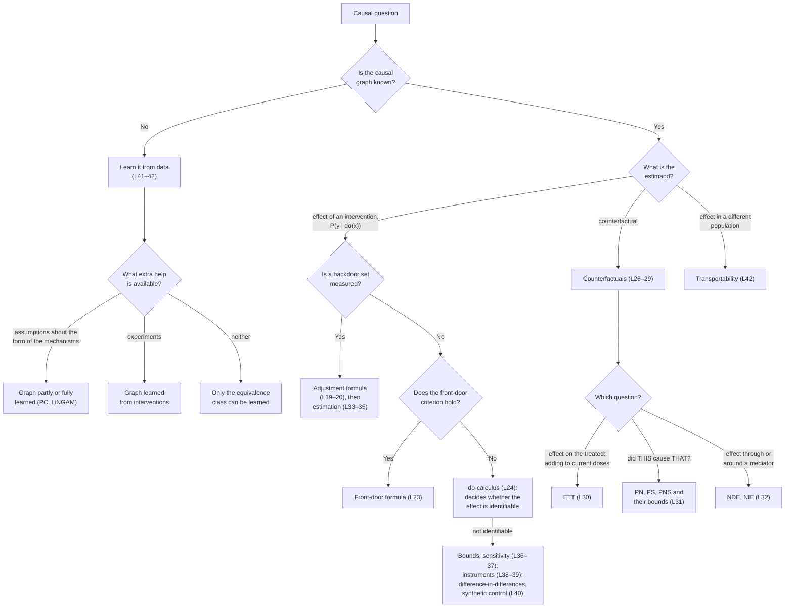

# Lesson 43: Capstone — The Complete Map of Causal Inference

## What the Course Covered

The course has drawn on two sources. Pearl's *Primer* describes causation with graphs and structural equations. Brady Neal's *Introduction to Causal Inference* describes it with potential outcomes, then builds the same graphical tools.

- **Part 1 (Lessons 01–06)** introduced the probability tools and causal graphs from the Primer: chains, forks and colliders, d-separation, Simpson's paradox, randomized versus observational data, and adjusting for confounders.
- **Part 2 (Lessons 07–17)** introduced potential outcomes from Neal, with the assumptions that make causal effects computable (exchangeability, positivity, no interference, consistency). It ended by connecting potential outcomes to graphs and structural causal models.
- **Part 3 (Lessons 18–25)** covered interventions and identification: the do-operator, the adjustment formula, the backdoor and front-door criteria, the do-calculus, and linear systems.
- **Part 4 (Lessons 26–32)** covered counterfactuals: computing them from a structural model, effects on the treated, probabilities of causation, and mediation.
- **Part 5 (Lessons 33–35)** covered estimation: outcome models, propensity scores, inverse probability weighting, doubly robust methods, matching, double machine learning, and confidence intervals.
- **Part 6 (Lessons 36–40)** covered what to do when confounders are unmeasured: bounds, sensitivity analysis, instrumental variables, difference-in-differences, and synthetic control.
- **Part 7 (Lessons 41–42)** covered learning the graph from observational and interventional data, transfer learning, and transporting results to another population.

This lesson puts the pieces side by side, so that a new causal question can be matched to the lessons that answer it.

## The Flowchart

A causal analysis answers three questions in order:

1. **Which graph?** Without a causal graph, there is no way to tell which associations are causal.
2. **Which quantity?** The quantity to be computed, the *estimand*, might be an average effect, an effect on the treated, the probability that one event caused another, or a direct effect.
3. **Can the quantity be computed from the available data?** This is *identification*. If the answer is yes, the next step is *estimation* from a finite sample. If no, the options are weaker answers (bounds, sensitivity analysis) or a different design (instruments, difference-in-differences).

*The path from a causal question to a method. "L" numbers are lesson numbers.*

Two notes on reading the chart.

- **Start from the answer you need.** Real projects often begin in the middle: someone has data and a loosely stated question. It helps to work backwards from the deliverable (a number, an interval, a verdict about a single case, a result for another population) and ask which assumptions that deliverable requires.
- **The do-calculus is complete** (Lesson 24). If its three rules cannot turn $P(y \mid do(x))$ into an expression without $do$, then no method can identify it from observational data on that graph without extra assumptions. The options are then those in the "Bounds, sensitivity …" box. Instruments and difference-in-differences are in that box because each brings an extra assumption (linearity or monotonicity, parallel trends) that the graph alone does not supply.

## Matching the Two Vocabularies

The two traditions often name the same idea differently. The table below pairs the names. Reading papers from either tradition is easier with it at hand.

*Notation.* The letters also differ. Neal writes the treatment as $T$ and covariates as $X$ or $W$. Pearl writes the treatment as $X$ and covariates as $Z$. Each column of the table uses its own source's letters.

| Idea | Neal / potential outcomes | Pearl / structural | Lessons |
|---|---|---|---|
| Average causal effect | ATE, $\mathbb{E}[Y(1) - Y(0)]$ | ACE, $\mathbb{E}[Y \mid do(X{=}1)] - \mathbb{E}[Y \mid do(X{=}0)]$ | 09, 19 |
| When adjusting for a set of covariates removes confounding | Conditional exchangeability given $W$ (also called ignorability or unconfoundedness) | $\mathbf{Z}$ satisfies the backdoor criterion. By Primer Theorem 4.3.1, this implies conditional ignorability | 11–12, 16, 20, 28 |
| Every stratum contains treated and untreated units | Positivity (overlap) | Positivity, needed for the adjustment formula | 13, 19, 34 |
| The treatment is well defined and units do not affect each other | SUTVA: no interference plus consistency | Consistency, $X = x \Rightarrow Y_x = Y$ (Primer Eq. 4.6). No interference is built into the model: each unit's outcome depends only on that unit's own variables | 14, 27 |
| Effect among those who were treated | ATT | ETT | 30 |
| Effect within a subgroup | CATE, $\tau(x)$ | $z$-specific effect, $P(y \mid do(x), z)$ | 20, 33 |
| Re-weighting the data to mimic an experiment | IPW pseudo-population | Truncated factorization written as a re-weighting (Primer Eq. 3.10) | 19, 35 |
| Using a variable that shifts only the treatment | Instrumental variable; LATE (effect among compliers) | Instrument in a linear model; the ratio of two regression slopes | 25, 38–39 |
| Direct and indirect effects | Nested potential outcomes, $Y(t, M(t'))$ | NDE and NIE, defined with $Y_{x, M_{x'}}$ | 32 |
| Randomized experiment | Randomization makes treatment independent of potential outcomes | Assignment has no parents except the randomizing device, so the observed distribution already equals the post-intervention one ($P_m = P$) | 18, 21 |
| Learning the graph | Neal Chapter 11: PC, LiNGAM, additive noise models | Structure learning (touched on only briefly in the Primer) | 41 |
| Carrying a result to another population | Neal Chapter 13 (outline only) | Transportability with selection diagrams | 42 |

The two frameworks can express the same questions (Lesson 27). Where they differ is in how easily the needed assumptions can be stated and checked. For direct and indirect effects and for probabilities of causation, a graph makes the assumptions much easier to judge.

## A Step-by-Step Guide for Practitioners

The order of these steps matters. The most costly mistakes come from doing them out of order: estimating before checking identification, or expecting a clever estimator to fix a problem in identification.

**Step 1. State the estimand before looking at the data.** Decide whether the question is about the ATE, the ATT, a subgroup effect, a probability of causation, or a direct effect. Each needs different assumptions. A question about an individual case ("did the drug cause this death?") needs much more than a question about a population average (Lessons 09, 15, 30–32).

**Step 2. Draw the graph.** The graph comes from knowledge of the subject, not from the data. It still has testable consequences: every d-separation in the graph implies an independence that the data should show (Lesson 22). If no graph can be justified, either ask experts or accept the limits of learning the graph from data (Lesson 41).

**Step 3. Try to identify the estimand, starting with the simplest method.** Try the backdoor criterion (Lesson 20), then the front-door criterion (Lesson 23), then the do-calculus (Lesson 24). In linear models, path coefficients give further options (Lesson 25).

**Step 4. Check positivity and the other assumptions one by one.** Exchangeability does not imply positivity (Lesson 13). SUTVA is two assumptions, not one (Lesson 14). Identification ends with a *statistical* estimand, an expression in observable probabilities (Lesson 15).

**Step 5. Estimate that statistical estimand.** Use outcome models and meta-learners (Lesson 33), propensity scores (Lesson 34), or IPW and doubly robust estimators (Lesson 35). No estimator can correct a failure in Step 3.

**Step 6. Test how much the conclusion depends on the assumptions that cannot be checked.** Report bounds (Lesson 36) or sensitivity analysis (Lesson 37) alongside the point estimate. If an unmeasured confounder is likely, look for a design that avoids it: an instrument (Lessons 38–39) or a before-and-after comparison with a control group (Lesson 40).

**Step 7. Respect the limits of what can be known.**

- No experiment reveals an individual's counterfactual outcome (Lessons 26, 29).
- A question that compares two worlds for the same unit needs a structural model, not just more data (Lesson 27).
- The graph cannot, in general, be learned from observational data without extra assumptions (Lesson 41).
- Carrying a result to another population must be justified by the graph, not assumed (Lesson 42).

## The Main Results, One Line Each

- **Adjustment formula** (Primer Eq. 3.5): average the effect within each stratum of a backdoor set, weighting each stratum by how common it is in the whole population. (Lesson 19)
- **Backdoor criterion** (Primer Definition 3.3.1): a set $\mathbf{Z}$ works if no member is a descendant of $X$ and it blocks every path from $X$ to $Y$ that starts with an arrow into $X$. (Lesson 20)
- **Front-door formula** (Primer Eq. 3.15): suppose a measured mediator $Z$ carries the whole effect of $X$ on $Y$, nothing confounds $X$ and $Z$, and every backdoor path from $Z$ to $Y$ is blocked by $X$. Then the effect is identified even with an unmeasured confounder between $X$ and $Y$. (Lesson 23)
- **Completeness of the do-calculus**: if an effect is identifiable from the graph and observational data, the three rules will find the formula. (Lesson 24)
- **Primer Theorem 4.3.1**: a backdoor set makes $Y_x$ independent of $X$ given the set. So conditional ignorability follows from the graph rather than being a separate assumption. (Lesson 28)
- **Fundamental law of counterfactuals** (Primer Eq. 4.5) and **consistency** (Primer Eq. 4.6): a counterfactual is the outcome in the modified model, for the same unit; among units that actually received $x$, $Y_x$ equals the observed $Y$. (Lesson 27)
- **Probability of necessity** (Primer Theorem 4.5.1 and Eq. 4.30): under monotonicity, PN is the excess risk ratio plus a correction for confounding; without monotonicity, it is bounded. (Lesson 31)
- **Mediation formulas** (Primer Eqs. 4.51–4.52): with no confounding of the mediator, the natural direct and indirect effects can be computed from ordinary conditional probabilities. (Lesson 32)
- **Propensity score** (Rosenbaum and Rubin): if adjusting for $W$ removes confounding, so does adjusting for the single number $e(W) = P(T = 1 \mid W)$. (Lesson 34)
- **Double robustness**: model both the outcome and the propensity score; the estimate is consistent if either model is right. (Lesson 35)
- **Manski bounds** and the **sensitivity bias formula**: for a bounded outcome and with no assumption about the confounding, the effect lies in an interval; with a linear model, the bias from an omitted confounder is $\theta/\gamma$ without noise, and $\gamma\theta$ when the treatment is standardized. (Lessons 36–37)
- **Wald ratio**: the same ratio of two differences is the average effect for everyone under linearity, and the effect among compliers under monotonicity. (Lessons 38–39)
- **Difference-in-differences**: under parallel trends, confounding that is constant over time cancels when the change in the control group is subtracted from the change in the treated group. (Lesson 40)
- **Markov equivalence**: observational data can identify the graph only up to its equivalence class; assumptions about the mechanisms or interventions are needed to go further. (Lessons 41–42)

## Where to Go From Here

**Rereading the course.** Three short routes through the lessons each tell a complete story.

- *Identification* (Lessons 03 → 18 → 19 → 20 → 23 → 24): from how association flows along chains, forks and colliders to the completeness of the do-calculus.
- *Estimation* (Lessons 09 → 11 → 12 → 33 → 34 → 35): from the fundamental problem of causal inference, through exchangeability, to modern estimators.
- *Limits* (Lessons 09 → 13 → 14 → 36 → 37): what cannot be known, what breaks when assumptions fail, and how to report it.

**Deeper theory.**

- Pearl, *Causality* (2nd ed., 2009): the full do-calculus, identification algorithms, and mediation.
- Peters, Janzing and Schölkopf, *Elements of Causal Inference* (2017): learning causal structure.
- Hernán and Robins, *Causal Inference: What If*: the potential-outcomes framework as used in epidemiology.

**Practice.**

- Compute the adjustment formula on the Simpson's-paradox drug data (Lesson 19).
- Compute the IPW estimate from Primer Tables 3.3–3.5 (Lesson 35).
- Compare a doubly robust estimate (Lesson 35) with an outcome-model estimate (Lesson 33) on simulated data where the true effect is known.
- Draw a sensitivity contour for an observational study of your own (Lesson 37).

**Current research.**

- Double/debiased machine learning (Chernozhukov and colleagues) builds on the doubly robust idea of Lesson 35.
- Causal forests (Athey, Wager and colleagues) estimate subgroup effects, the CATE of Lesson 33, at scale.
- Transportability and data fusion (Bareinboim and Pearl) extend Lesson 42 to combining many studies.
- Cinelli and Hazlett's sensitivity analysis is now a common standard (Lesson 37).

## A Last Exercise: The Course in One Sentence

Before reading the paragraph below, try to summarize the course in one sentence of your own. Then compare.

One summary: **a causal graph states which mechanisms exist, and that statement is what lets data answer causal questions.** The do-operator describes an intervention as a small change to the graph. The backdoor criterion, the front-door criterion, the do-calculus and counterfactual reasoning each work out which causal quantities the graph allows us to compute from data. Estimation turns those formulas into numbers. When the graph does not allow a quantity to be computed, bounds, sensitivity analysis, instruments and difference-in-differences give weaker but honest answers. Learning the graph from data and transporting results to new populations extend the approach to graphs we do not know and populations we did not study. Correlation alone is not causation. But with a graph, a clearly stated estimand and an honest account of the assumptions, correlations can be used to compute causal effects.

### Check Your Understanding

1. A colleague has observational data on a job-training programme and wants "the effect of training". List the questions Step 1 of the guide would ask before any analysis.
2. In the flowchart, why does the "not identifiable" box lead to instruments and difference-in-differences, rather than to a better estimator?
3. Pick three rows of the vocabulary table and explain in your own words why the two names describe the same idea.
4. Why does transportability sit on its own branch of the flowchart, separate from counterfactuals?

---

## Further Reading

*Ref*: This lesson draws together *Causal Inference in Statistics: A Primer* (2016), Chapters 1–4, and Brady Neal, *Introduction to Causal Inference* (Dec 2020 draft). The completed chapter notes in `lessons-completed/Causal Inference/` supplied derivations used in Lessons 18–32.
